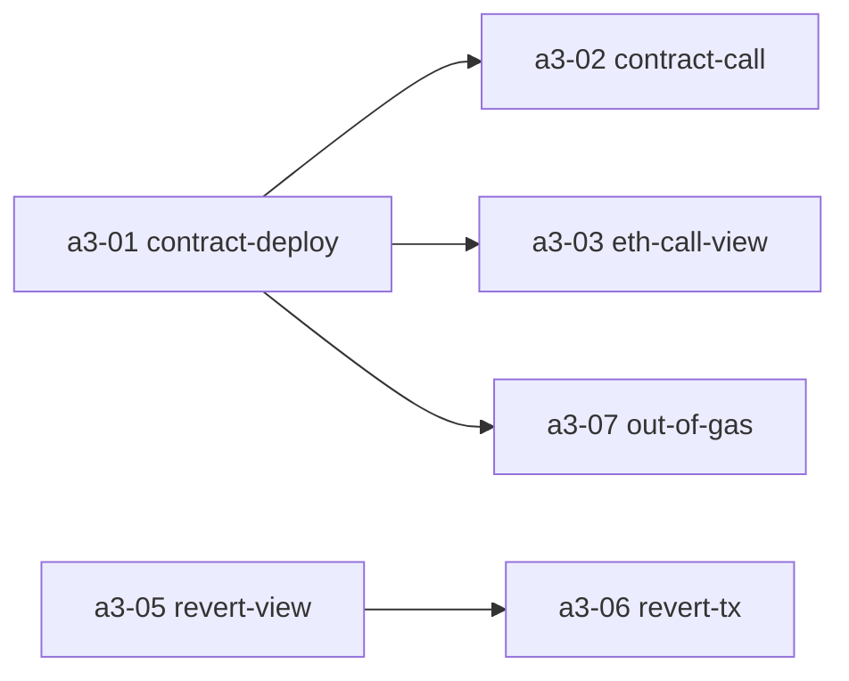

# chainbench × LLM 효율화 분석

> **목적**: chainbench를 LLM(Claude Code 등)과 함께 사용하는 테스트 자동화 환경으로 더 효율적으로 만들기 위한 현황 분석과 개선 로드맵.
>
> **작성일**: 2026-04-09
> **대상 독자**: chainbench 메인테이너, LLM 기반 테스트 자동화 설계자

---

## 1. 현황 요약

### 1.1 아키텍처 계층

| 계층 | 주요 파일 | 역할 |
|------|----------|------|
| **CLI 디스패처** | `chainbench.sh` → `lib/cmd_*.sh` | `init` / `start` / `stop` / `test` / `report` / `status` / `log` 등 명령 라우팅 |
| **테스트 엔진** | `tests/lib/assert.sh`, `tests/lib/report.sh` | `test_start` → `assert_*` → `test_result` 라이프사이클, per-test JSON 기록 |
| **RPC 유틸** | `tests/lib/rpc.sh`, `rpc_admin.sh`, `rpc_block.sh`, `rpc_tx.sh`, `rpc_txpool.sh`, `rpc_consensus.sh` | 도메인별 RPC 헬퍼 (`block_number`, `admin_add_peer`, `wait_receipt` 등). `rpc.sh`가 하위 모듈 자동 source |
| **MCP 어댑터** | `mcp-server/src/tools/*.ts` (8개 파일, 1414 라인) | CLI를 MCP tool로 래핑 — `chainbench_test_list/run`, `chainbench_report`, `chainbench_status`, `chainbench_node_rpc` 등 |
| **프로파일** | `profiles/*.yaml` | 노드 구성(validators/endpoints), chain params, 바이너리 경로 |
| **테스트 스위트** | `tests/{basic,fault,stress,upgrade,remote,regression}/` | 카테고리별 `.sh` 스크립트. 자동 discovery (`lib/` 제외) |

### 1.2 현재 테스트 실행 흐름

```
chainbench test run a-ethereum/a1-06
         │
         ▼
cmd_test.sh::_cb_test_run_single
         │
         ▼
a1-06-downloader-path.sh
  ├─ source tests/regression/lib/common.sh
  │    └─ source tests/lib/{rpc,assert,wait}.sh
  ├─ test_start "regression/a-ethereum/a1-06-downloader-path"
  ├─ [rpc calls / admin_removePeer / sleep / assert_*]
  └─ test_result
         │
         ▼
state/results/regression_a_ethereum_a1_06_downloader_path_<ts>.json
         │
         ▼
chainbench report --format {text|json|markdown}
```

### 1.3 테스트 메타데이터 (현재 수준)

각 `.sh` 파일 상단의 주석 두 줄:

```bash
# Test: regression/a-ethereum/a1-06-downloader-path
# Description: <한 줄 설명>
```

그 외 정보(전제조건, 예상 소요 시간, 관련 TC ID, 의존 스크립트, 참조 코드 경로)는 **본문 주석으로만 존재** — 파싱 불가.

### 1.4 결과 JSON 스키마

`state/results/<safe_name>_<ts>.json`:

```json
{
  "test": "regression/a-ethereum/a1-06-downloader-path",
  "status": "passed | failed",
  "pass": 5,
  "fail": 0,
  "total": 5,
  "duration": 42,
  "timestamp": "2026-04-09T12:30:00Z",
  "failures": ["assert_eq: expected foo got bar", ...]
}
```

**한계**: 실패 시 관찰값(BP/EN 블록 높이, tx hash, baseFee, peer count 등)이 전혀 기록되지 않음. `failures` 배열은 사람 가독용 문자열.

---

## 2. LLM 관점의 병목

실제로 이 프로젝트(go-stablenet regression TC 자동화)에서 LLM과 협업하며 관찰된 문제:

| # | 병목 | 구체적 증상 | 영향 |
|---|------|-----------|------|
| **B1** | **얕은 메타데이터** | RT-A-1-06이 어떤 전제 조건을 요구하는지, 몇 초 걸리는지, 어떤 spec 섹션을 검증하는지 알려면 `.sh` 파일 전체 + REGRESSION_TEST_CASES_REVIEW.md를 매번 다시 읽어야 함 | LLM context 낭비, 탐색 비용 증가 |
| **B2** | **결과에 관찰값 부재** | 실패 JSON은 `failures: ["..."]` 문자열만. 실패 시점 BP/EN 블록 높이, 마지막 tx hash, gasUsed 등 수치가 없음 | 진단을 위해 LLM이 `node_rpc`로 추가 질의 → 왕복 증가 |
| **B3** | **출력 노이즈** | 성공 테스트 한 건이 stderr에 수십~수백 `[PASS]` 라인을 찍음. ANSI 컬러 코드 포함 | 100 KB+ context 소모, 모델 주의 분산 |
| **B4** | **정적 필터 부재** | `test run basic` 또는 `basic/consensus` 단일 지정만 가능. "RT-A-1-* 만" 또는 "tag: sync" 같은 그룹 실행 불가 | LLM이 개별 호출 반복, 또는 전체 실행 후 결과에서 수동 필터링 |
| **B5** | **전제조건 검증 부재** | `a3-06-revert-tx.sh`는 `/tmp/chainbench-regression/reverter.addr` 존재에 의존(`a3-05` 선행 필요). LLM이 모르고 단독 실행 → runtime 에러 | 불필요한 실패 분석 라운드 |
| **B6** | **상태 스냅샷 비대** | `chainbench status`는 multi-line 사람 친화 출력. "지금 체인 running인가? 어떤 프로파일인가?"를 1줄로 받을 방법이 없음 | 매 턴 큰 응답을 context에 올림 |
| **B7** | **실패 컨텍스트 수동 수집** | fail 시 `gstable.log` 조각, 관련 블록 hash, 마지막 peer 상태 등을 LLM이 `log`, `node_rpc`로 각각 호출 | 1번 실패 분석에 4~6 tool call |
| **B8** | **스펙 연결 없음** | RT-A-1-06 실패 시 REGRESSION_TEST_CASES_REVIEW.md의 해당 섹션을 LLM이 `Grep`→`Read` 수동 조회 | 원격 MCP 환경에서 파일 시스템 접근 불가 시 아예 막힘 |
| **B9** | **Dry-run 모드 없음** | "이 카테고리 돌리면 뭐가 얼마나 실행되나"를 미리 알려면 각 스크립트를 읽어야 함 | 계획 수립 비용 큼, 사용자 사전 확인도 불가 |
| **B10** | **재실행 전략 부재** | 실패한 것만 재실행하려면 LLM이 실패 이름을 텍스트 파싱 후 개별 `test run` 호출 | 에러 가능성, 반복 루프 느려짐 |

---

## 3. 개선 제안 — 3단계 로드맵

### Tier 1 · Quick Win (호환 유지, 1~2주)

#### 3.1 (A) 스크립트 프론트매터 (YAML-in-comment)

각 `.sh` 상단에 파싱 가능한 YAML 블록을 추가.

**포맷 예시** (`a1-06-downloader-path.sh`):

```bash
#!/usr/bin/env bash
# ---chainbench-meta---
# id: RT-A-1-06
# name: Downloader path (gap >= 2 catch-up)
# category: regression/a-ethereum
# tags: [sync, downloader, rpc-admin, v2-new]
# spec: REGRESSION_TEST_CASES_REVIEW.md#rt-a-1-06
# estimated_seconds: 90
# preconditions:
#   chain_running: true
#   min_peers: 4
#   profile: regression
# depends_on: []
# code_refs:
#   - eth/sync.go:214
#   - eth/ethconfig/config.go:61-62
# ---end-meta---
set -euo pipefail
```

**구현 위치**:
- 파서: `lib/test_meta.sh` (신규) 또는 `cmd_test.sh` 내부 Python snippet
- 노출:
  - `chainbench test list --format json` 응답의 각 항목에 메타 포함
  - `chainbench test run` 실행 전 메타 로드 → 전제조건 체크

**MCP 반영**:
- 기존 `chainbench_test_list` 응답 스키마 확장
- 신규 `chainbench_test_meta(test)` tool (단일 테스트 메타만 반환)

**호환성**: 기존 `.sh`에 블록이 없어도 무시(기본값으로 동작).

---

#### 3.2 (B) 관찰값(observables) 캡처 API

`tests/lib/assert.sh`에 간단한 key/value 수집 레이어 추가.

**사용 예**:

```bash
observe "bp_head" "$bp_block"
observe "en_head" "$en_block"
observe "peer_count" "$pc"
observe "base_fee_wei" "$base_fee"
assert_eq "$bp_hash" "$en_hash" "middle block hash match"
```

**구현**:
- 전역 배열 `_OBSERVED_KEYS[]`, `_OBSERVED_VALUES[]`
- `test_result`에서 JSON 직렬화 후 결과 파일에 `"observed": {...}` 필드로 저장

**결과 JSON 확장 예시**:

```json
{
  "test": "regression/a-ethereum/a1-06-downloader-path",
  "status": "failed",
  "pass": 3,
  "fail": 1,
  "observed": {
    "bp_head_at_start": 1234,
    "en_head_at_start": 1234,
    "bp_head_after_gap": 1249,
    "en_head_after_gap": 1234,
    "gap": 15,
    "peer_count_after_remove": 0,
    "sync_timeout_seconds": 90
  },
  "failures": ["EN5 catchup via Downloader"]
}
```

---

#### 3.3 (C) 실패 시 자동 컨텍스트 캡처

`_assert_fail` 호출 시 (또는 `test_result`에서 `fail > 0`일 때) 1회 훅 실행:

**수집 항목**:
- 모든 running 노드의 `eth_blockNumber`, `net_peerCount`, `eth_syncing`
- 각 노드의 최근 5개 블록 hash / stateRoot
- `gstable.log` 최근 200줄 tail (노드별)

**저장 경로**:
```
state/failures/<test_name>_<ts>/
├── context.json        # 체인 상태 스냅샷
├── node1.log.tail      # 관련 로그 조각
├── node5.log.tail
└── chain_tail.json     # 최근 블록/peer 상태
```

**MCP 노출**:
- `chainbench_failure_context(test_name)` → context.json + 로그 요약 반환
- LLM은 실패 직후 1번 호출로 진단 정보 획득

---

#### 3.4 (D) JSON-first 출력 모드 (NDJSON 이벤트 스트림)

`chainbench test run <target> --format jsonl` 옵션.

**이벤트 스트림 예시**:

```jsonl
{"event":"test_start","name":"regression/a-ethereum/a1-06","ts":"2026-04-09T12:30:00Z","meta":{"id":"RT-A-1-06","tags":["sync"]}}
{"event":"observe","key":"bp_head_initial","value":1234}
{"event":"assert_pass","msg":"peer count decreased"}
{"event":"observe","key":"gap","value":15}
{"event":"assert_fail","msg":"EN5 catchup","details":"timeout after 90s"}
{"event":"test_end","status":"failed","duration":92,"pass":3,"fail":1}
```

**장점**:
- LLM은 관심 이벤트(`assert_fail`, `test_end`)만 필터링해 읽음
- ANSI 컬러 제거 → context 효율
- MCP tool이 이 포맷을 직접 parse해 structured response 반환

**구현 위치**:
- `tests/lib/assert.sh`: `_assert_pass`/`_assert_fail`에 `${CB_FORMAT:-text}` 분기
- `cmd_test.sh`: `--format jsonl` → `CB_FORMAT=jsonl` export
- MCP tool: stdout이 JSONL이면 parse 후 요약

---

### Tier 2 · 구조 개선 (1개월)

#### 3.5 (E) 스펙 연결 MCP 리소스

`mcp-server/src/tools/spec.ts` (신규)

**tool**: `chainbench_spec_lookup(id: "RT-A-1-06", doc?: "REGRESSION_TEST_CASES_REVIEW.md")`

**동작**:
1. 프로젝트 루트에서 지정 문서 탐색 (또는 `.mcp.json`의 `specDocs` 배열)
2. 정규식으로 `#### RT-A-1-06 ...` 섹션 추출
3. 다음 같은 레벨 헤더 전까지 본문 반환

**응답 스키마**:
```json
{
  "id": "RT-A-1-06",
  "source": "REGRESSION_TEST_CASES_REVIEW.md:253",
  "title": "Downloader 경로: peer 재연결 시 큰 gap 따라잡기",
  "excerpt": "...시나리오 본문...",
  "tags_from_doc": ["v2 신규"]
}
```

**활용**:
- 실패 응답에 `spec_excerpt` 자동 첨부 (Tier 1 C의 context.json에 포함)
- LLM이 `Read`로 문서를 뒤지지 않고도 "기대 동작"과 "실제 결과"를 나란히 비교

**설정**: `.mcp.json` 또는 `profiles/<name>.yaml`에
```yaml
spec_docs:
  - path: ../stable-net/go-stablenet/REGRESSION_TEST_CASES_REVIEW.md
    anchor_pattern: "^#### (RT-[A-Z]-\\d+-\\d+)"
```

---

#### 3.6 (F) 고수준 assertion helper

반복 패턴을 함수로 승격.

**추가 대상** (`tests/lib/assert_chain.sh` 신규):

```bash
# tx 성공 + gasUsed 검증
assert_tx_success "$tx_hash" [--gas-used-eq 21000] [--authorized]

# 두 노드의 특정 블록 hash 일치
assert_block_match "$block_num" 1 5

# 여러 노드 동기화 확인
assert_nodes_in_sync --max-diff 2 1 2 3 4 5

# receipt.effectiveGasPrice 공식 검증 (authorized/일반 계정 분기)
assert_effective_gas_price "$tx_hash" --authorized
assert_effective_gas_price "$tx_hash" --header-tip

# governance proposal 전체 라이프사이클
assert_gov_proposal_executed "$proposal_id" --target "$GOV_VALIDATOR"
```

**효과**:
- 스크립트 길이 30~50% 축소
- LLM이 "이 테스트가 뭘 검증하는지"를 함수명만 보고 파악
- 관찰값 자동 캡처 (helper 내부에서 `observe` 호출)

---

#### 3.7 (G) Dry-run / plan 모드

**명령**: `chainbench test run <target> --dry-run --format json`

**출력 예시**:

```json
{
  "target": "a-ethereum",
  "plan": [
    {
      "id": "RT-A-1-01",
      "script": "a1-01-genesis-init.sh",
      "est_seconds": 5,
      "deps": [],
      "preconditions_ok": true,
      "tags": ["genesis"]
    },
    {
      "id": "RT-A-1-06",
      "script": "a1-06-downloader-path.sh",
      "est_seconds": 90,
      "deps": [],
      "preconditions_ok": true,
      "tags": ["sync", "downloader"]
    },
    {
      "id": "RT-A-3-06",
      "script": "a3-06-revert-tx.sh",
      "est_seconds": 10,
      "deps": ["a3-05"],
      "preconditions_ok": false,
      "skip_reason": "requires reverter deployed by a3-05"
    }
  ],
  "total_est_seconds": 720,
  "will_skip": 1
}
```

**사용 시나리오**:
- LLM이 "A 카테고리 전체 돌리면 어떻게 돼?" → dry-run → 사용자에게 계획 확인 → 실제 실행
- CI 환경에서도 사전 검증

---

#### 3.8 (H) 압축 상태 MCP tool

**tool**: `chainbench_state_compact`

**응답 예시** (< 200 bytes):

```json
{"running":true,"profile":"regression","nodes":{"1":{"b":1234,"p":4,"role":"bp"},"5":{"b":1234,"p":4,"role":"en"}},"consensus":"ok","last_run":{"target":"a-ethereum/a1-06","status":"failed","ts":"2026-04-09T12:30:00Z"}}
```

**대비**:
- 현재 `chainbench_status`는 ANSI 컬러 포함 multi-line 출력 (1~2 KB+)
- `compact`는 context 효율 우선 — LLM이 매 턴 호출해도 부담 없음

---

### Tier 3 · 대화형 워크플로우 (선택적)

#### 3.9 (I) rerun-failed + snapshot/restore

**명령**:

```bash
chainbench test rerun-failed              # 직전 실행의 실패 건만 재실행
chainbench snapshot create before-a1-06   # 체인 상태 저장 (datadir 복사/tar)
chainbench snapshot list
chainbench snapshot restore before-a1-06  # 저장 상태로 롤백
chainbench snapshot delete before-a1-06
```

**활용**:
- 테스트 디버깅 시 체인 초기화 비용 제거 (init+start+블록 생산 대기 생략)
- LLM이 "이전 상태로 돌려놓고 다시 해봐" 시나리오 지원

**구현 포인트**:
- snapshot = `state/snapshots/<name>/` 하위에 datadir 복사 + profile 메타 저장
- restore = 모든 노드 stop → datadir 복원 → start

---

#### 3.10 (J) 스펙 기반 테스트 스캐폴딩

**명령**:
```bash
chainbench test scaffold \
  --spec REGRESSION_TEST_CASES_v2.md \
  --id RT-A-1-08 \
  --target tests/regression/a-ethereum/
```

**동작**:
1. spec 문서에서 RT-A-1-08 섹션 파싱
2. Setup / Action / Expected / Verify 블록 추출
3. 프론트매터 + 주석으로 변환
4. `assert_*` 호출 뼈대 생성 (TODO 마커 포함)
5. 새 `.sh` 파일 출력

**출력 예시**:

```bash
#!/usr/bin/env bash
# ---chainbench-meta---
# id: RT-A-1-08
# name: <spec title>
# spec: REGRESSION_TEST_CASES_v2.md#rt-a-1-08
# ---end-meta---
set -euo pipefail
source "$(dirname "$0")/../lib/common.sh"
test_start "regression/a-ethereum/a1-08-..."

# Setup (from spec)
# TODO: <spec setup step 1>
# TODO: <spec setup step 2>

# Action (from spec)
# TODO: <spec action>

# Expected (from spec)
# TODO: assert_* calls here

# Verify (from spec)
# TODO: hash/state verification

test_result
```

LLM은 TODO 마커만 채우면 되므로 작성 시간 대폭 단축.

---

#### 3.11 (K) 의존성 그래프

**명령**: `chainbench test graph --format {mermaid|dot|json}`

**Mermaid 출력 예시**:


- 프론트매터의 `depends_on` 필드를 읽어 그래프 빌드
- 실행 순서 자동 토폴로지 정렬 가능
- LLM이 "뭘 먼저 돌려야 하지?" 질문에 1번 호출로 답

---

#### 3.12 (L) MCP 대화형 세션 (daemon)

**문제**: 현재 MCP tool은 매번 `chainbench.sh`를 spawn → 0.5~1초 오버헤드 × 수십 번 호출

**제안**:
- `chainbench daemon start` → 백그라운드 프로세스 유지
- MCP 서버가 Unix socket 또는 HTTP로 daemon에 명령 전송
- 장점:
  - tool call 지연 감소
  - 진행 중 이벤트 스트리밍 (예: "테스트 돌리면서 10초마다 블록 높이 보고")
  - 테스트 중간 중단/재개 제어 가능

**구현 난이도**: 높음. 기존 CLI와 이중 진입점 유지 필요.

---

## 4. ROI 우선순위 요약

| 우선순위 | 항목 | 구현 비용 | 기대 효과 |
|---------|-----|----------|----------|
| **★★★** | Tier 1 A (프론트매터) | 낮음 | 메타 탐색 비용 제거, 필터링/의존성 기반 |
| **★★★** | Tier 1 B (observables) | 낮음 | 실패 분석 왕복 3~5턴 → 1턴 |
| **★★★** | Tier 1 C (실패 컨텍스트) | 중간 | 진단 완전성, 노드 로그 자동 수집 |
| **★★★** | Tier 1 D (JSONL 출력) | 낮음 | Context 사용량 50%+ 절감 |
| **★★☆** | Tier 2 E (스펙 연결) | 중간 | spec ↔ 테스트 bridging, 원격 환경 대응 |
| **★★☆** | Tier 2 F (고수준 assertion) | 중간 | 스크립트 가독성/유지보수 |
| **★★☆** | Tier 2 G (Dry-run) | 낮음 | 사용자 사전 확인, 계획 수립 |
| **★★☆** | Tier 2 H (compact state) | 낮음 | 매 턴 상태 체크 비용 절감 |
| **★☆☆** | Tier 3 I (rerun + snapshot) | 중간~높음 | 반복 디버깅 가속 |
| **★☆☆** | Tier 3 J (스캐폴딩) | 중간 | 신규 테스트 작성 속도 |
| **★☆☆** | Tier 3 K (의존성 그래프) | 낮음 | 시각화, 정렬 |
| **★☆☆** | Tier 3 L (daemon) | 높음 | 대화형 성능 |

---

## 5. 추천 실행 계획

### Phase 1 (1~2주)
Tier 1 A~D 전부 구현. 기존 테스트에 영향을 주지 않으면서 LLM 인터랙션의 핵심 병목(B1~B3, B7)을 즉시 해소.

**산출물**:
- `lib/test_meta.sh` (프론트매터 파서)
- `tests/lib/assert.sh` 확장 (`observe`, JSONL 모드, 실패 훅)
- `lib/cmd_test.sh` 확장 (`--format jsonl`, `--dry-run`, `--tag`, `--match`)
- 기존 A 카테고리 32개 스크립트에 프론트매터 추가
- `mcp-server/src/tools/test.ts` 응답 스키마 업데이트
- 신규 `chainbench_failure_context` tool

### Phase 2 (3~4주)
Tier 2 E~H 구현. LLM이 도구만으로 충분한 정보를 얻을 수 있도록 spec linkage + 고수준 assertion.

**산출물**:
- `mcp-server/src/tools/spec.ts` (신규)
- `tests/lib/assert_chain.sh` (신규) + 기존 스크립트 마이그레이션
- `chainbench_state_compact` MCP tool

### Phase 3 (선택적)
실사용 피드백을 보고 Tier 3 중 ROI 높은 것만 선별.

---

## 6. LLM 계약 문서 (신규 권장)

**파일**: `docs/LLM_INTEGRATION.md` 또는 chainbench 루트 `CLAUDE.md`

**내용**:
1. 프론트매터 YAML 스키마 정의 (필수/선택 필드, 타입)
2. JSONL 이벤트 스키마 정의
3. MCP tool 목록과 각각의 용도/호출 시점 가이드
4. "LLM이 할 일 vs chainbench에 맡길 일" 경계 설정
5. 테스트 작성 시 모범 사례 (스펙 앵커, 관찰값 캡처 권장)

이 한 문서가 유지되면 어떤 에이전트/모델이 들어오더라도 동일한 방식으로 chainbench를 다룰 수 있어 **재현성**이 보장됨.

---

## 7. 열린 질문

구현 착수 전에 정리가 필요한 사항들:

1. **프론트매터 포맷**
   - YAML-in-comment(`# key: value`) vs 별도 `.meta.yml` 파일?
   - 전자는 파일 1개로 관리 쉬움, 후자는 엄격한 YAML 파싱 가능

2. **관찰값 스키마의 자유도**
   - 완전 free-form key/value 허용? 아니면 권장 key 리스트 유지?
   - 후자라면 표준화된 키(예: `block_number`, `tx_hash`, `gas_used`) 정의 필요

3. **실패 컨텍스트의 수집 범위**
   - 모든 running 노드 대상? 테스트가 명시한 노드만?
   - 로그 tail 길이 default는 얼마로?

4. **JSONL vs 기존 text 출력 전환**
   - `--format jsonl`이 신규 default가 되어야 하는가, 아니면 opt-in?
   - 사람 가독성과 기계 가독성의 균형

5. **스펙 문서 경로**
   - chainbench 저장소와 spec 저장소가 분리되어 있음(현재 상태)
   - `.mcp.json`에 spec 경로를 등록하는 방식? 심볼릭 링크? 원격 URL 지원?

6. **호환성 정책**
   - 기존 테스트 스크립트(프론트매터 없음)는 언제까지 지원?
   - 점진적 마이그레이션 가이드 필요 여부

7. **daemon 모드 (Tier 3 L)의 실효성**
   - 현재 spawn 비용(~0.5~1초)이 실제로 LLM 인터랙션에서 병목인가?
   - 측정 후 결정 필요

---

## 8. 참고 자료

- **현재 chainbench 코드**:
  - `chainbench.sh` — CLI 진입점
  - `lib/cmd_test.sh` — 테스트 디스패처 (380 lines)
  - `tests/lib/assert.sh` — 어서션 라이브러리 (209 lines)
  - `tests/lib/report.sh` — 결과 리포팅 (222 lines)
  - `mcp-server/src/tools/test.ts` — MCP 테스트 tool (156 lines)

- **실제 사용 사례**:
  - `tests/regression/a-ethereum/` — go-stablenet v2 회귀 TC 32개
  - `REGRESSION_TEST_CASES_REVIEW.md` (go-stablenet 저장소) — 시나리오 정의

- **MCP 스펙**: https://modelcontextprotocol.io
