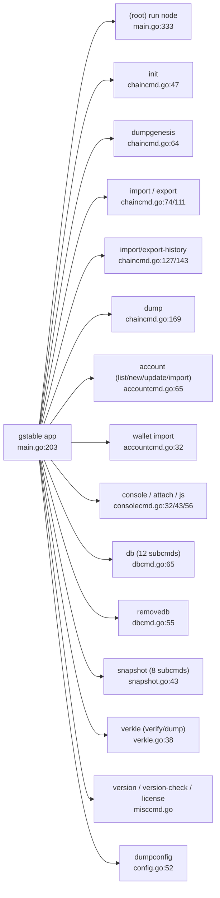
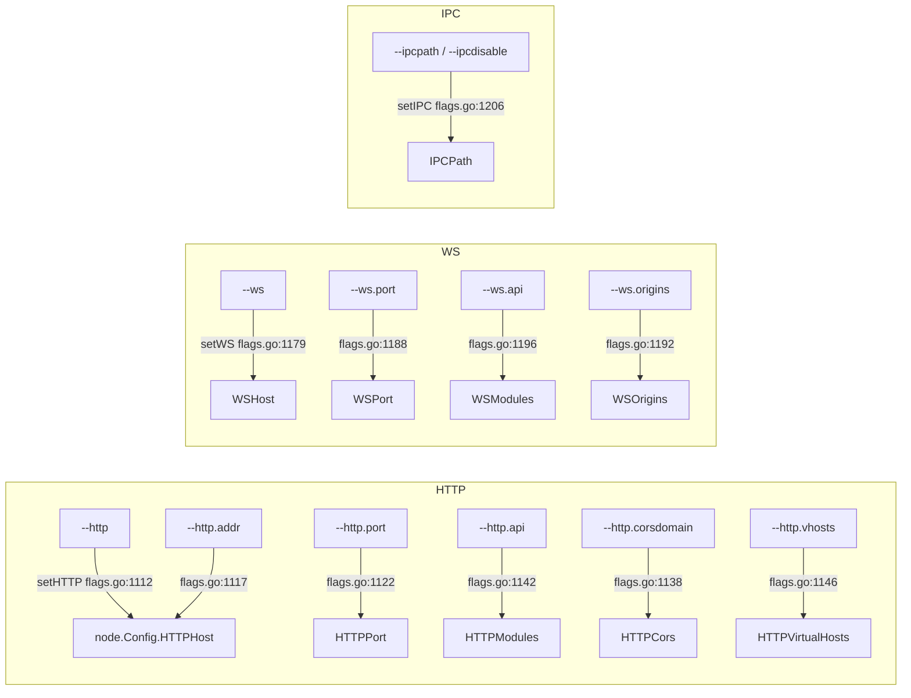
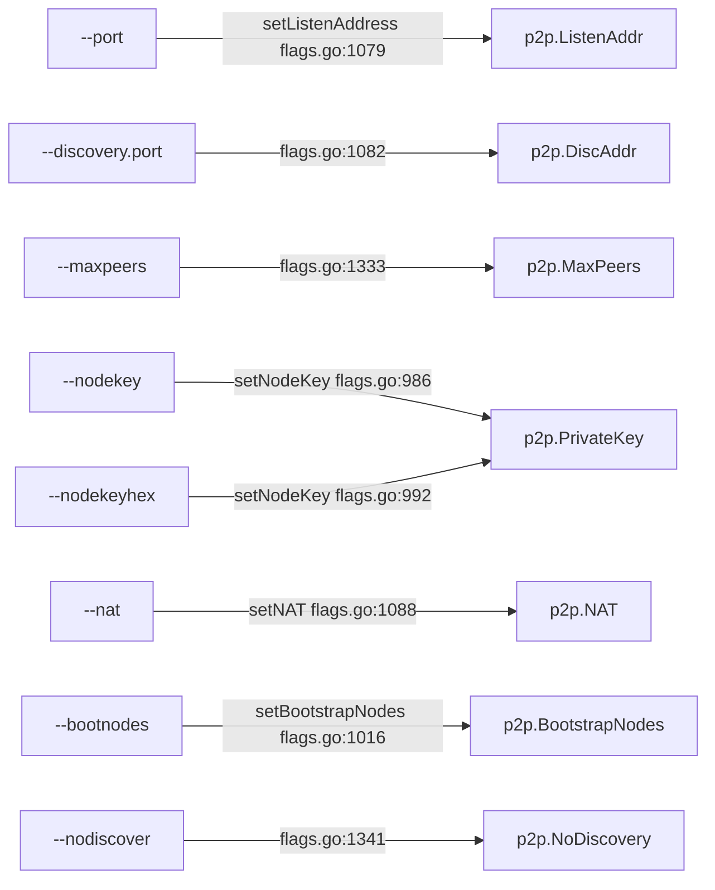
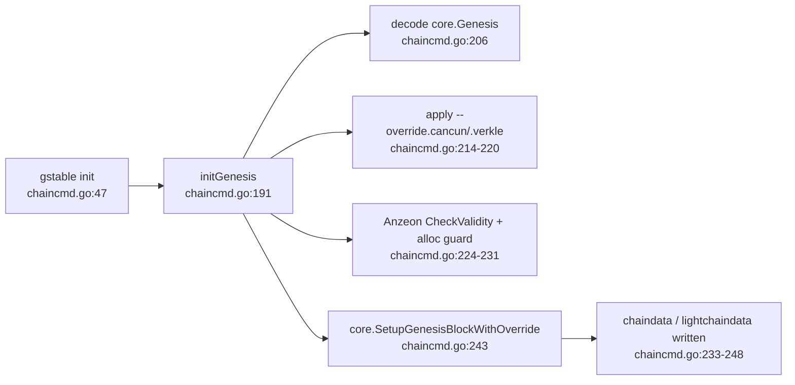

# gstable — CLI subcommand + flag graph

Code-level extraction of the `gstable` binary (a `github.com/ethereum/go-ethereum` fork, urfave/cli/v2). Binary built from `cmd/gstable`. All `path:line` references are relative to the repo root `chain/go-stablenet/`.

- App constructed: `cmd/gstable/main.go:203` (`flags.NewApp`), commands wired in `init()` at `cmd/gstable/main.go:205-269`.
- Default action (no subcommand) = run a node: `app.Action = gstable` (`cmd/gstable/main.go:207`), func `gstable` at `cmd/gstable/main.go:333`.
- Client identifier: `gstable` (`cmd/gstable/main.go:52`).
- Fork markers: consensus is **WBFT / Anzeon** (`genesis.Config.AnzeonEnabled()` gate at `cmd/gstable/chaincmd.go:224`, `cmd/gstable/main.go:433`); default network is **StableNet mainnet** (`cmd/gstable/main.go:314`, bootnodes `params.StableNetMainnetBootnodes` at `cmd/utils/flags.go:1015`).

---

## 1. Command / subcommand tree

Top-level commands are registered at `cmd/gstable/main.go:208-243` (then sorted by name at `:244`).

| Command | Purpose | Defined (file:line) | Action (file:line) |
|---|---|---|---|
| *(root)* `gstable` | Run a full node (default) | `main.go:207` | `gstable` `main.go:333` → `startNode` `main.go:350` |
| `init` | Bootstrap & initialize a new genesis block | `chaincmd.go:47` | `initGenesis` `chaincmd.go:191` |
| `dumpgenesis` | Dump genesis block JSON to stdout | `chaincmd.go:64` | `dumpGenesis` `chaincmd.go:273` |
| `import` | Import a blockchain file (RLP) | `chaincmd.go:74` | `importChain` `chaincmd.go:317` |
| `export` | Export blockchain into file | `chaincmd.go:111` | `exportChain` `chaincmd.go:395` |
| `import-history` | Import an Era archive | `chaincmd.go:127` | `importHistory` `chaincmd.go:433` |
| `export-history` | Export blockchain history to Era archives | `chaincmd.go:143` | `exportHistory` `chaincmd.go:491` |
| `import-preimages` | Import preimage DB from RLP stream (deprecated) | `chaincmd.go:154` | `importPreimages` `chaincmd.go:528` |
| `dump` | Dump a specific block's state | `chaincmd.go:169` | `dump` `chaincmd.go:604` |
| `account` | Manage accounts (subcommands below) | `accountcmd.go:65` | — |
| `wallet` | Manage presale wallets (subcommands below) | `accountcmd.go:32` | — |
| `console` | Start interactive JS console (runs a node) | `consolecmd.go:32` | `localConsole` `consolecmd.go:70` |
| `attach` | Attach JS console to a running node | `consolecmd.go:43` | `remoteConsole` `consolecmd.go:112` |
| `js` | Execute JS files in ephemeral console | `consolecmd.go:56` | `ephemeralConsole` `consolecmd.go:152` |
| `version` | Print version numbers | `misccmd.go:41` | `printVersion` (`misccmd.go:42`) |
| `version-check` | Check for known vulnerabilities | `misccmd.go:50` | `versionCheck` `misccmd.go:51` |
| `license` | Display license information | `misccmd.go:64` | `license` `misccmd.go:91` |
| `dumpconfig` | Export the current TOML configuration | `config.go:52` | `dumpConfig` `config.go:240` |
| `db` | Low-level database operations (subcommands) | `dbcmd.go:65` | — |
| `removedb` | Remove blockchain and state databases | `dbcmd.go:55` | `removeDB` (`dbcmd.go:56`) |
| `snapshot` | Snapshot-based state maintenance (subcommands) | `snapshot.go:43` (`snapshotCommand`) | — |
| `verkle` | Verkle trie tooling (subcommands) | `verkle.go:38` | — |
| `show-deprecated-flags` | List deprecated flags | `cmd/utils/flags_legacy.go` (`utils.ShowDeprecated`, wired `main.go:235`) | — |
| `logtest` | Log-testing command (only in active build) | `logtestcmd_active.go:34`; nil stub `logtestcmd_inactive.go:23` | — |

### `account` subcommands (`accountcmd.go:88-187`)
| Sub | Purpose | Name (line) | Action (line) |
|---|---|---|---|
| `account list` | Print summary of accounts | `:90` | `accountList` `:209` |
| `account new` | Create a new account | `:101` | `accountCreate` `:279` |
| `account update` | Update/re-encrypt an account | `:126` | `accountUpdate` `:314` |
| `account import` | Import a private key | `:155` | `accountImport` `:361` |

### `wallet` subcommands (`accountcmd.go:42-62`)
| Sub | Purpose | Action (line) |
|---|---|---|
| `wallet import` | Import an Ethereum presale wallet | `importWallet` (`:48`) |

### `db` subcommands (`dbcmd.go:69-82`)
| Sub | Name (line) | Action (line) |
|---|---|---|
| `db inspect` | `:86` | `inspect` `:293` |
| `db check-state-content` | `:96` | `checkStateContent` (`:95`) |
| `db stats` | `:106` | `dbStats` (`:105`) |
| `db compact` | `:114` | `dbCompact` (`:113`) |
| `db get` | `:127` | `dbGet` (`:126`) |
| `db delete` | `:137` | `dbDelete` (`:136`) |
| `db put` | `:148` | `dbPut` (`:147`) |
| `db dumptrie` | `:159` | `dbDumpTrie` (`:158`) |
| `db freezer-index` | `:169` | `freezerInspect` (`:168`) |
| `db import` | `:179` | `importLDBdata` (`:178`) |
| `db export` | `:189` | `exportChaindata` (`:188`) |
| `db metadata` | `:199` | `showMetaData` (`:198`) |

### `snapshot` subcommands (`snapshot.go`)
`prune-state` (`:49`/`pruneState :52`), `verify-state` (`:69`/`verifyState :72`), `check-dangling-storage` (`:82`/`checkDanglingStorage :85`), `inspect-account` (`:93`/`checkAccount :96`), `traverse-state` (`:104`/`traverseState :107`), `traverse-rawstate` (`:119`/`traverseRawState :122`), `dump` (`:135`/`dumpState :138`), `export-preimages` (`:155`/`snapshotExportPreimages :154`).

### `verkle` subcommands (`verkle.go`)
`verify` (`:44`/`verifyVerkle :47`), `dump` (`:55`/`expandVerkle :58`).



---

## 2. Launch-relevant flags → config

Flag sets assembled in `cmd/gstable/main.go`: `nodeFlags` (`:57-151`), `rpcFlags` (`:153-183`), `metricsFlags` (`:185-200`); merged into `app.Flags` at `:246-252` together with `debug.Flags`. The `node`-flow reads flags via `utils.SetNodeConfig` → `SetP2PConfig`/`setHTTP`/`setWS`/`setIPC`/`SetDataDir` and `utils.SetEthConfig`.

> Note: there is **no `--chainid` CLI flag**. Chain ID is taken from the genesis `config.chainId` (genesis JSON), not the CLI. `--networkid` sets only the P2P network id (`ethconfig.Config.NetworkId`).

### 2a. Data / genesis / identity
| Flag | CLI form | Def (flags.go) | Consumed (file:line) → field |
|---|---|---|---|
| DataDirFlag | `--datadir` | `:90` | `SetDataDir` `flags.go:1448` → `node.Config.DataDir` |
| AncientFlag | `--datadir.ancient` | `:107` | `SetEthConfig` `flags.go:1659` → `cfg.DatabaseFreezer`; used in `initGenesis` `chaincmd.go:234` |
| KeyStoreDirFlag | `--keystore` | `:117` | `SetNodeConfig` `flags.go:1392` → `node.Config.KeyStoreDir` |
| DBEngineFlag | `--db.engine` | `flags.go` (leveldb/pebble) | `SetNodeConfig` `flags.go:1409-1416` → `node.Config.DBEngine` |
| NetworkIdFlag | `--networkid` | `:133` | `SetEthConfig` `flags.go:1646` → `ethconfig.Config.NetworkId` |
| TestnetFlag | `--testnet` | `:144` | preset select (bootnodes `flags.go:1023`), `main.go:283` |
| DeveloperFlag | `--dev` | `:165` | `SetDataDir` `flags.go:1450`, dev banner `main.go:295` |
| DeveloperPeriodFlag | `--dev.period` | `:170` | dev mode block period |
| IdentityFlag | `--identity` | `flags.go` | `setNodeUserIdent` `flags.go:1001` → `node.Config.UserIdent` |

### 2b. HTTP / WS / IPC / auth RPC (`setHTTP` `flags.go:1111`, `setWS` `:1178`, `setIPC` `:1206`)
| Flag | CLI form | Def | Consumed → field |
|---|---|---|---|
| HTTPEnabledFlag | `--http` | `:581` | `flags.go:1112` → enables HTTP; default host `127.0.0.1` |
| HTTPListenAddrFlag | `--http.addr` | `:586` | `flags.go:1117` → `HTTPHost` |
| HTTPPortFlag | `--http.port` | `:592` | `flags.go:1122` → `HTTPPort` |
| HTTPApiFlag | `--http.api` | `:610` | `flags.go:1142` → `HTTPModules` |
| HTTPCORSDomainFlag | `--http.corsdomain` | `:598` | `flags.go:1138` → `HTTPCors` |
| HTTPVirtualHostsFlag | `--http.vhosts` | `:604` | `flags.go:1146` → `HTTPVirtualHosts` |
| HTTPPathPrefixFlag | `--http.rpcprefix` | `:616` | `flags.go:1150` → `HTTPPathPrefix` |
| WSEnabledFlag | `--ws` | `:639` | `flags.go:1179` → enables WS |
| WSListenAddrFlag | `--ws.addr` | `:644` | `flags.go:1184` → `WSHost` |
| WSPortFlag | `--ws.port` | `:650` | `flags.go:1188` → `WSPort` |
| WSApiFlag | `--ws.api` | `:656` | `flags.go:1196` → `WSModules` |
| WSAllowedOriginsFlag | `--ws.origins` | `:662` | `flags.go:1192` → `WSOrigins` |
| WSPathPrefixFlag | `--ws.rpcprefix` | `:668` | `flags.go:1200` → `WSPathPrefix` |
| IPCDisabledFlag | `--ipcdisable` | `:571` | `flags.go:1209` → clears `IPCPath` |
| IPCPathFlag | `--ipcpath` | `:576` | `flags.go:1212` → `IPCPath` |
| AuthListenFlag / AuthPortFlag / AuthVirtualHostsFlag | `--authrpc.addr/.port/.vhosts` | `flags.go` | `flags.go:1126/1130/1134` → engine-API auth server |
| JWTSecretFlag | `--authrpc.jwtsecret` | `flags.go` | `SetNodeConfig` `flags.go:1380` → `JWTSecret` |
| InsecureUnlockAllowedFlag | `--allow-insecure-unlock` | `:493` | `flags.go:1407` → `InsecureUnlockAllowed`; gate in `unlockAccounts` `main.go:463` |



### 2c. P2P / networking (`SetP2PConfig` `flags.go:1325`)
| Flag | CLI form | Def | Consumed → field |
|---|---|---|---|
| ListenPortFlag | `--port` | `:720` | `setListenAddress` `flags.go:1079` → `p2p.Config.ListenAddr` |
| DiscoveryPortFlag | `--discovery.port` | `:776` | `flags.go:1082` → `p2p.Config.DiscAddr` |
| MaxPeersFlag | `--maxpeers` | `:708` | `flags.go:1333` → `p2p.Config.MaxPeers` |
| MaxPendingPeersFlag | `--maxpendpeers` | `flags.go` | `flags.go:1339` → `MaxPendingPeers` |
| NodeKeyFileFlag | `--nodekey` | `:732` | `setNodeKey` `flags.go:986-990` → `p2p.Config.PrivateKey` (LoadECDSA) |
| NodeKeyHexFlag | `--nodekeyhex` | `:737` | `setNodeKey` `flags.go:991-995` → `PrivateKey` (HexToECDSA); mutually exclusive w/ `--nodekey` (`:984`) |
| NATFlag | `--nat` | `:742` | `setNAT` `flags.go:1088-1093` → `p2p.Config.NAT` |
| NoDiscoverFlag | `--nodiscover` | `:748` | `flags.go:1341-1342` → `NoDiscovery=true` |
| DiscoveryV4Flag / V5Flag | `--discovery.v4/.v5` | `flags.go` | `flags.go:1347-1348` → `DiscoveryV4/V5` |
| BootnodesFlag | `--bootnodes` | `:726` | `setBootstrapNodes` `flags.go:1016-1017` → `BootstrapNodes`; default = `params.StableNetMainnetBootnodes` (`:1015`), testnet = `params.StableNetTestnetBootnodes` (`:1024`) |
| NetrestrictFlag | `--netrestrict` | `:766` | `flags.go:1350` → netrestrict CIDR |



### 2d. Mining / miner (`setMiner` `flags.go:1519`, `setEtherbase` `flags.go:1291`)
| Flag | CLI form | Def | Consumed → field |
|---|---|---|---|
| MiningEnabledFlag | `--mine` | `:434` | `startNode` `main.go:423` → `StartMining()`; light-mode guard `main.go:425` |
| MinerEtherbaseFlag | `--miner.etherbase` | `:451` | `setEtherbase` `flags.go:1304` → `Miner.Etherbase` |
| MinerGasLimitFlag | `--miner.gaslimit` | `:439` | `flags.go:1524` → `Miner.GasCeil` |
| MinerGasPriceFlag | `--miner.gasprice` | `:445` | `flags.go:1527` → `Miner.GasPrice`; also used in `main.go:439` (non-Anzeon path) |
| MinerExtraDataFlag | `--miner.extradata` | `:456` | `flags.go:1521` → `Miner.ExtraData` |
| MinerRecommitIntervalFlag | `--miner.recommit` | `:461` | `flags.go:1530` → `Miner.Recommit` |

> WBFT/Anzeon note: when `ChainConfig().AnzeonEnabled()` the miner gas tip comes from the on-chain `GovValidator` contract, not `--miner.gasprice` (`main.go:433-436`).

### 2e. Accounts / unlock (`unlockAccounts` `main.go:449`)
| Flag | CLI form | Def | Consumed |
|---|---|---|---|
| UnlockedAccountFlag | `--unlock` | `:475` | `main.go:451` → accounts to unlock |
| PasswordFileFlag | `--password` | `:481` | `MakePasswordList` `flags.go:1308-1309`; `main.go:472` |

### 2f. Sync / GC / cache
| Flag | CLI form | Def | Consumed → field |
|---|---|---|---|
| SyncModeFlag | `--syncmode` | `:261` | `SetEthConfig` `flags.go:1643` → `cfg.SyncMode` |
| GCModeFlag | `--gcmode` (full/archive) | `:267` | `flags.go:1662-1666` → `cfg.NoPruning` |
| CacheFlag | `--cache` | `flags.go` | `flags.go:1655/1700/1703/1706`; mainnet bump `main.go:317-326` |
| SnapshotFlag | `--snapshot` | `flags.go` | `flags.go:1711` |

### 2g. Metrics (`metricsFlags` `main.go:185`; `SetupMetrics` `flags.go:1937`)
| Flag | CLI form | Def | Consumed |
|---|---|---|---|
| MetricsEnabledFlag | `--metrics` | `:836` | `SetupMetrics` gate `flags.go:1938`, `metrics.Enable()` `flags.go:1942` |
| MetricsEnabledExpensiveFlag | `--metrics.expensive` | `:841` | expensive-metric gating; `metrics/config.go:22` |
| MetricsHTTPFlag | `--metrics.addr` | `:851` | `SetupMetrics` → `exp.Setup(address)` `flags.go:1976` |
| MetricsPortFlag | `--metrics.port` | `:856` | combined with addr in `SetupMetrics` |

`SetupMetrics` is invoked from `cmd/gstable/config.go:184` (node path) and `cmd/gstable/chaincmd.go:326` (import path).

### 2h. Logging / debug (`internal/debug/flags.go`, `debug.Setup` at `main.go:258`)
| Flag | CLI form | Def |
|---|---|---|
| verbosityFlag | `--verbosity` (0-5, default 3) | `internal/debug/flags.go:42` |
| logVmoduleFlag / vmoduleFlag | `--log.vmodule` / `--vmodule` | `:48` / `:54` |
| logFormatFlag | `--log.format` (json\|logfmt\|terminal) | `:67` |
| logFileFlag / logRotateFlag | `--log.file` / `--log.rotate` | `:72` / `:77` |
| pprofFlag / pprofAddrFlag / pprofPortFlag | `--pprof` / `--pprof.addr` / `--pprof.port` | `:106` / `:117` / `:111` |

---

## 3. init / genesis handling

`gstable init <genesisPath>` — command `chaincmd.go:47`, action `initGenesis` `chaincmd.go:191`:

1. Requires exactly one arg = genesis path (`chaincmd.go:192-198`).
2. Opens & JSON-decodes into `core.Genesis` (`chaincmd.go:199-208`).
3. Builds a config node `makeConfigNode(ctx)` (`chaincmd.go:210`).
4. Applies overrides `--override.cancun` / `--override.verkle` into `core.ChainOverrides` (`chaincmd.go:213-221`).
5. **WBFT sanity checks** (fork-specific): if `genesis.Config.AnzeonEnabled()` → `genesis.Config.Anzeon.CheckValidity()` (`chaincmd.go:225`) and `checkAllocAddress(genesis)` (`chaincmd.go:228`). `checkAllocAddress` (`chaincmd.go:252`) forbids allocations to the system-contract addresses: `GovValidator`, `NativeCoinAdapter`, `GovMinter`, `GovMasterMinter`, `GovCouncil` (`chaincmd.go:255-259`).
6. For both `chaindata` and `lightchaindata`: open DB w/ freezer (`--datadir.ancient`) (`chaincmd.go:234`), build trie DB (`chaincmd.go:240`), and write genesis via `core.SetupGenesisBlockWithOverride(chaindb, triedb, genesis, &overrides)` (`chaincmd.go:243`), logging the resulting hash (`chaincmd.go:247`).

`gstable dumpgenesis` (`chaincmd.go:273`): prints the network-preset genesis (`utils.MakeGenesis` `chaincmd.go:277`) or, if none, reads the stored genesis from datadir via `core.ReadGenesis` (`chaincmd.go:299`).



---

## 4. Complete flag inventory (all flags)

**Total: 179 CLI flags** defined for the `gstable` binary, extracted from every `&cli.*Flag{}` / `&flags.*Flag{}` package-level definition reachable by the binary. This inventory is the authoritative superset; the launch-relevant subset in section 2 (~63 flags) stays as-is for the flag -> config-consumer mapping.

Source files (flag counts): `cmd/utils/flags.go` (142), `internal/debug/flags.go` (18), `cmd/utils/flags_legacy.go` (14), `cmd/gstable/dbcmd.go` (2), `cmd/gstable/misccmd.go` (2), `cmd/gstable/config.go` (1). Grouping uses each flag's urfave `Category:` field; flags with no category are grouped as command-local. `(hidden)` marks flags defined with `Hidden: true`; deprecated flags carry their upstream `(deprecated)` note verbatim.

### Ethereum (17)

| Flag | Usage (verbatim) | Def (file:line) |
|---|---|---|
| `--config` | TOML configuration file | `cmd/gstable/config.go:61` |
| `--datadir` | Data directory for the databases and keystore | `cmd/utils/flags.go:90` |
| `--db.engine` | Backing database implementation to use ('pebble' or 'leveldb') | `cmd/utils/flags.go:101` |
| `--datadir.ancient` | Root directory for ancient data (default = inside chaindata) | `cmd/utils/flags.go:107` |
| `--datadir.minfreedisk` | Minimum free disk space in MB, once reached triggers auto shut down (default = --cache.gc converted to MB, 0 = disabled) | `cmd/utils/flags.go:112` |
| `--networkid` | Explicitly set network id (integer)(For testnets: use --goerli, --sepolia, --holesky instead) | `cmd/utils/flags.go:133` |
| `--mainnet` | Stablenet mainnet | `cmd/utils/flags.go:139` |
| `--testnet` | Stablenet test network: pre-configured Stablenet test network | `cmd/utils/flags.go:144` |
| `--goerli` | Görli network: pre-configured proof-of-authority test network | `cmd/utils/flags.go:149` |
| `--sepolia` | Sepolia network: pre-configured proof-of-work test network | `cmd/utils/flags.go:154` |
| `--holesky` | Holesky network: pre-configured proof-of-stake test network | `cmd/utils/flags.go:159` |
| `--exitwhensynced` | Exits after block synchronisation completes | `cmd/utils/flags.go:193` |
| `--snapshot` | Enables snapshot-database mode (default = enable) | `cmd/utils/flags.go:229` |
| `--eth.requiredblocks` | Comma separated block number-to-hash mappings to require for peering (<number>=<hash>) | `cmd/utils/flags.go:240` |
| `--bloomfilter.size` | Megabytes of memory allocated to bloom-filter for pruning | `cmd/utils/flags.go:245` |
| `--override.cancun` | Manually specify the Cancun fork timestamp, overriding the bundled setting | `cmd/utils/flags.go:251` |
| `--override.verkle` | Manually specify the Verkle fork timestamp, overriding the bundled setting | `cmd/utils/flags.go:256` |

### State / Sync / GC (5)

| Flag | Usage (verbatim) | Def (file:line) |
|---|---|---|
| `--syncmode` | Blockchain sync mode ("snap" or "full") | `cmd/utils/flags.go:261` |
| `--gcmode` | Blockchain garbage collection mode, only relevant in state.scheme=hash ("full", "archive") | `cmd/utils/flags.go:267` |
| `--state.scheme` | Scheme to use for storing ethereum state ('hash' or 'path') | `cmd/utils/flags.go:273` |
| `--history.state` | Number of recent blocks to retain state history for (default = 90,000 blocks, 0 = entire chain) | `cmd/utils/flags.go:278` |
| `--history.transactions` | Number of recent blocks to maintain transactions index for (default = about one year, 0 = entire chain) | `cmd/utils/flags.go:284` |

### Node / Networking (P2P) (16)

| Flag | Usage (verbatim) | Def (file:line) |
|---|---|---|
| `--identity` | Custom node name | `cmd/utils/flags.go:182` |
| `--maxpeers` | Maximum number of network peers (network disabled if set to 0) | `cmd/utils/flags.go:708` |
| `--maxpendpeers` | Maximum number of pending connection attempts (defaults used if set to 0) | `cmd/utils/flags.go:714` |
| `--port` | Network listening port | `cmd/utils/flags.go:720` |
| `--bootnodes` | Comma separated enode URLs for P2P discovery bootstrap | `cmd/utils/flags.go:726` |
| `--nodekey` | P2P node key file | `cmd/utils/flags.go:732` |
| `--nodekeyhex` | P2P node key as hex (for testing) | `cmd/utils/flags.go:737` |
| `--nat` | NAT port mapping mechanism (any\|none\|upnp\|pmp\|pmp:<IP>\|extip:<IP>) | `cmd/utils/flags.go:742` |
| `--nodiscover` | Disables the peer discovery mechanism (manual peer addition) | `cmd/utils/flags.go:748` |
| `--discovery.v4` | Enables the V4 discovery mechanism | `cmd/utils/flags.go:753` |
| `--discovery.v5` | Enables the experimental RLPx V5 (Topic Discovery) mechanism | `cmd/utils/flags.go:760` |
| `--netrestrict` | Restricts network communication to the given IP networks (CIDR masks) | `cmd/utils/flags.go:766` |
| `--discovery.dns` | Sets DNS discovery entry points (use "" to disable DNS) | `cmd/utils/flags.go:771` |
| `--discovery.port` | Use a custom UDP port for P2P discovery | `cmd/utils/flags.go:776` |
| `--sync.forcecycle` | Time interval to force syncs, even if few peers are available | `cmd/utils/flags.go:782` |
| `--sync.tdinterval` | Time interval to verify TD changes and detect sync stalling | `cmd/utils/flags.go:788` |

### RPC / HTTP / WS / IPC / Auth / GraphQL / Console (34)

| Flag | Usage (verbatim) | Def (file:line) |
|---|---|---|
| `--docroot` | Document Root for HTTPClient file scheme | `cmd/utils/flags.go:187` |
| `--rpc.gascap` | Sets a cap on gas that can be used in eth_call/estimateGas (0=infinite) | `cmd/utils/flags.go:507` |
| `--rpc.evmtimeout` | Sets a timeout used for eth_call (0=infinite) | `cmd/utils/flags.go:513` |
| `--rpc.txfeecap` | Sets a cap on transaction fee (in ether) that can be sent via the RPC APIs (0 = no cap) | `cmd/utils/flags.go:519` |
| `--authrpc.addr` | Listening address for authenticated APIs | `cmd/utils/flags.go:526` |
| `--authrpc.port` | Listening port for authenticated APIs | `cmd/utils/flags.go:532` |
| `--authrpc.vhosts` | Comma separated list of virtual hostnames from which to accept requests (server enforced). Accepts '*' wildcard. | `cmd/utils/flags.go:538` |
| `--authrpc.jwtsecret` | Path to a JWT secret to use for authenticated RPC endpoints | `cmd/utils/flags.go:544` |
| `--ipcdisable` | Disable the IPC-RPC server | `cmd/utils/flags.go:571` |
| `--ipcpath` | Filename for IPC socket/pipe within the datadir (explicit paths escape it) | `cmd/utils/flags.go:576` |
| `--http` | Enable the HTTP-RPC server | `cmd/utils/flags.go:581` |
| `--http.addr` | HTTP-RPC server listening interface | `cmd/utils/flags.go:586` |
| `--http.port` | HTTP-RPC server listening port | `cmd/utils/flags.go:592` |
| `--http.corsdomain` | Comma separated list of domains from which to accept cross origin requests (browser enforced) | `cmd/utils/flags.go:598` |
| `--http.vhosts` | Comma separated list of virtual hostnames from which to accept requests (server enforced). Accepts '*' wildcard. | `cmd/utils/flags.go:604` |
| `--http.api` | API's offered over the HTTP-RPC interface | `cmd/utils/flags.go:610` |
| `--http.rpcprefix` | HTTP path path prefix on which JSON-RPC is served. Use '/' to serve on all paths. | `cmd/utils/flags.go:616` |
| `--graphql` | Enable GraphQL on the HTTP-RPC server. Note that GraphQL can only be started if an HTTP server is started as well. | `cmd/utils/flags.go:622` |
| `--graphql.corsdomain` | Comma separated list of domains from which to accept cross origin requests (browser enforced) | `cmd/utils/flags.go:627` |
| `--graphql.vhosts` | Comma separated list of virtual hostnames from which to accept requests (server enforced). Accepts '*' wildcard. | `cmd/utils/flags.go:633` |
| `--ws` | Enable the WS-RPC server | `cmd/utils/flags.go:639` |
| `--ws.addr` | WS-RPC server listening interface | `cmd/utils/flags.go:644` |
| `--ws.port` | WS-RPC server listening port | `cmd/utils/flags.go:650` |
| `--ws.api` | API's offered over the WS-RPC interface | `cmd/utils/flags.go:656` |
| `--ws.origins` | Origins from which to accept websockets requests | `cmd/utils/flags.go:662` |
| `--ws.rpcprefix` | HTTP path prefix on which JSON-RPC is served. Use '/' to serve on all paths. | `cmd/utils/flags.go:668` |
| `--exec` | Execute JavaScript statement | `cmd/utils/flags.go:674` |
| `--preload` | Comma separated list of JavaScript files to preload into the console | `cmd/utils/flags.go:679` |
| `--rpc.allow-unprotected-txs` | Allow for unprotected (non EIP155 signed) transactions to be submitted via RPC | `cmd/utils/flags.go:684` |
| `--rpc.batch-request-limit` | Maximum number of requests in a batch | `cmd/utils/flags.go:689` |
| `--rpc.batch-response-max-size` | Maximum number of bytes returned from a batched call | `cmd/utils/flags.go:695` |
| `--rpc.enabledeprecatedpersonal` | Enables the (deprecated) personal namespace | `cmd/utils/flags.go:701` |
| `--jspath` | JavaScript root path for `loadScript` | `cmd/utils/flags.go:796` |
| `--header` | Pass custom headers to the RPC server when using -- or the geth attach console. This flag can be given multiple times. | `cmd/utils/flags.go:802` |

### Account (8)

| Flag | Usage (verbatim) | Def (file:line) |
|---|---|---|
| `--keystore` | Directory for the keystore (default = inside the datadir) | `cmd/utils/flags.go:117` |
| `--usb` | Enable monitoring and management of USB hardware wallets | `cmd/utils/flags.go:122` |
| `--pcscdpath` | Path to the smartcard daemon (pcscd) socket file | `cmd/utils/flags.go:127` |
| `--lightkdf` | Reduce key-derivation RAM & CPU usage at some expense of KDF strength | `cmd/utils/flags.go:235` |
| `--unlock` | Comma separated list of accounts to unlock | `cmd/utils/flags.go:475` |
| `--password` | Password file to use for non-interactive password input | `cmd/utils/flags.go:481` |
| `--signer` | External signer (url or path to ipc file) | `cmd/utils/flags.go:487` |
| `--allow-insecure-unlock` | Allow insecure account unlocking when account-related RPCs are exposed by http | `cmd/utils/flags.go:493` |

### TxPool (11)

| Flag | Usage (verbatim) | Def (file:line) |
|---|---|---|
| `--txpool.locals` | Comma separated accounts to treat as locals (no flush, priority inclusion) | `cmd/utils/flags.go:291` |
| `--txpool.nolocals` | Disables price exemptions for locally submitted transactions | `cmd/utils/flags.go:296` |
| `--txpool.journal` | Disk journal for local transaction to survive node restarts | `cmd/utils/flags.go:301` |
| `--txpool.rejournal` | Time interval to regenerate the local transaction journal | `cmd/utils/flags.go:307` |
| `--txpool.pricelimit` | Minimum gas price tip to enforce for acceptance into the pool | `cmd/utils/flags.go:313` |
| `--txpool.pricebump` | Price bump percentage to replace an already existing transaction | `cmd/utils/flags.go:319` |
| `--txpool.accountslots` | Minimum number of executable transaction slots guaranteed per account | `cmd/utils/flags.go:325` |
| `--txpool.globalslots` | Maximum number of executable transaction slots for all accounts | `cmd/utils/flags.go:331` |
| `--txpool.accountqueue` | Maximum number of non-executable transaction slots permitted per account | `cmd/utils/flags.go:337` |
| `--txpool.globalqueue` | Maximum number of non-executable transaction slots for all accounts | `cmd/utils/flags.go:343` |
| `--txpool.lifetime` | Maximum amount of time non-executable transaction are queued | `cmd/utils/flags.go:349` |

### BlobPool (3)

| Flag | Usage (verbatim) | Def (file:line) |
|---|---|---|
| `--blobpool.datadir` | Data directory to store blob transactions in | `cmd/utils/flags.go:356` |
| `--blobpool.datacap` | Disk space to allocate for pending blob transactions (soft limit) | `cmd/utils/flags.go:362` |
| `--blobpool.pricebump` | Price bump percentage to replace an already existing blob transaction | `cmd/utils/flags.go:368` |

### Performance / Cache (10)

| Flag | Usage (verbatim) | Def (file:line) |
|---|---|---|
| `--cache` | Megabytes of memory allocated to internal caching (default = 4096 mainnet full node, 128 light mode) | `cmd/utils/flags.go:375` |
| `--cache.database` | Percentage of cache memory allowance to use for database io | `cmd/utils/flags.go:381` |
| `--cache.trie` | Percentage of cache memory allowance to use for trie caching (default = 15% full mode, 30% archive mode) | `cmd/utils/flags.go:387` |
| `--cache.gc` | Percentage of cache memory allowance to use for trie pruning (default = 25% full mode, 0% archive mode) | `cmd/utils/flags.go:393` |
| `--cache.snapshot` | Percentage of cache memory allowance to use for snapshot caching (default = 10% full mode, 20% archive mode) | `cmd/utils/flags.go:399` |
| `--cache.noprefetch` | Disable heuristic state prefetch during block import (less CPU and disk IO, more time waiting for data) | `cmd/utils/flags.go:405` |
| `--cache.preimages` | Enable recording the SHA3/keccak preimages of trie keys | `cmd/utils/flags.go:410` |
| `--cache.blocklogs` | Size (in number of blocks) of the log cache for filtering | `cmd/utils/flags.go:415` |
| `--fdlimit` | Raise the open file descriptor resource limit (default = system fd limit) | `cmd/utils/flags.go:421` |
| `--crypto.kzg` | KZG library implementation to use; gokzg (recommended) or ckzg | `cmd/utils/flags.go:426` |

### Gas Price Oracle (4)

| Flag | Usage (verbatim) | Def (file:line) |
|---|---|---|
| `--gpo.blocks` | Number of recent blocks to check for gas prices | `cmd/utils/flags.go:810` |
| `--gpo.percentile` | Suggested gas price is the given percentile of a set of recent transaction gas prices | `cmd/utils/flags.go:816` |
| `--gpo.maxprice` | Maximum transaction priority fee (or gasprice before London fork) to be recommended by gpo | `cmd/utils/flags.go:822` |
| `--gpo.ignoreprice` | Gas price below which gpo will ignore transactions | `cmd/utils/flags.go:828` |

### VM / EVM (1)

| Flag | Usage (verbatim) | Def (file:line) |
|---|---|---|
| `--vmdebug` | Record information useful for VM and contract debugging | `cmd/utils/flags.go:500` |

### Miner (7)

| Flag | Usage (verbatim) | Def (file:line) |
|---|---|---|
| `--mine` | Enable mining | `cmd/utils/flags.go:434` |
| `--miner.gaslimit` | Target gas ceiling for mined blocks | `cmd/utils/flags.go:439` |
| `--miner.gasprice` | Minimum gas price for mining a transaction | `cmd/utils/flags.go:445` |
| `--miner.etherbase` | 0x prefixed public address for block mining rewards | `cmd/utils/flags.go:451` |
| `--miner.extradata` | Block extra data set by the miner (default = client version) | `cmd/utils/flags.go:456` |
| `--miner.recommit` | Time interval to recreate the block being mined | `cmd/utils/flags.go:461` |
| `--miner.newpayload-timeout` | Specify the maximum time allowance for creating a new payload | `cmd/utils/flags.go:467` |

### Metrics (15)

| Flag | Usage (verbatim) | Def (file:line) |
|---|---|---|
| `--ethstats` | Reporting URL of a ethstats service (nodename:secret@host:port) | `cmd/utils/flags.go:551` |
| `--metrics` | Enable metrics collection and reporting | `cmd/utils/flags.go:836` |
| `--metrics.expensive` | Enable expensive metrics collection and reporting (deprecated) | `cmd/utils/flags.go:841` |
| `--metrics.addr` | Enable stand-alone metrics HTTP server listening interface. | `cmd/utils/flags.go:851` |
| `--metrics.port` | Metrics HTTP server listening port. Please note that -- must be set to start the server. | `cmd/utils/flags.go:856` |
| `--metrics.influxdb` | Enable metrics export/push to an external InfluxDB database | `cmd/utils/flags.go:863` |
| `--metrics.influxdb.endpoint` | InfluxDB API endpoint to report metrics to | `cmd/utils/flags.go:868` |
| `--metrics.influxdb.database` | InfluxDB database name to push reported metrics to | `cmd/utils/flags.go:874` |
| `--metrics.influxdb.username` | Username to authorize access to the database | `cmd/utils/flags.go:880` |
| `--metrics.influxdb.password` | Password to authorize access to the database | `cmd/utils/flags.go:886` |
| `--metrics.influxdb.tags` | Comma-separated InfluxDB tags (key/values) attached to all measurements | `cmd/utils/flags.go:896` |
| `--metrics.influxdbv2` | Enable metrics export/push to an external InfluxDB v2 database | `cmd/utils/flags.go:903` |
| `--metrics.influxdb.token` | Token to authorize access to the database (v2 only) | `cmd/utils/flags.go:909` |
| `--metrics.influxdb.bucket` | InfluxDB bucket name to push reported metrics to (v2 only) | `cmd/utils/flags.go:916` |
| `--metrics.influxdb.organization` | InfluxDB organization name (v2 only) | `cmd/utils/flags.go:923` |

### Logging / Debug (20)

| Flag | Usage (verbatim) | Def (file:line) |
|---|---|---|
| `--remotedb` | URL for remote database | `cmd/utils/flags.go:96` |
| `--nocompaction` | Disables db compaction after import | `cmd/utils/flags.go:556` |
| `--verbosity` | Logging verbosity: 0=silent, 1=error, 2=warn, 3=info, 4=debug, 5=detail | `internal/debug/flags.go:42` |
| `--log.vmodule` | Per-module verbosity: comma-separated list of <pattern>=<level> (e.g. eth/*=5,p2p=4) | `internal/debug/flags.go:48` |
| `--vmodule` *(hidden)* | Per-module verbosity: comma-separated list of <pattern>=<level> (e.g. eth/*=5,p2p=4) | `internal/debug/flags.go:54` |
| `--log.json` *(hidden)* | Format logs with JSON | `internal/debug/flags.go:61` |
| `--log.format` | Log format to use (json\|logfmt\|terminal) | `internal/debug/flags.go:67` |
| `--log.file` | Write logs to a file | `internal/debug/flags.go:72` |
| `--log.rotate` | Enables log file rotation | `internal/debug/flags.go:77` |
| `--log.maxsize` | Maximum size in MBs of a single log file | `internal/debug/flags.go:82` |
| `--log.maxbackups` | Maximum number of log files to retain | `internal/debug/flags.go:88` |
| `--log.maxage` | Maximum number of days to retain a log file | `internal/debug/flags.go:94` |
| `--log.compress` | Compress the log files | `internal/debug/flags.go:100` |
| `--pprof` | Enable the pprof HTTP server | `internal/debug/flags.go:106` |
| `--pprof.port` | pprof HTTP server listening port | `internal/debug/flags.go:111` |
| `--pprof.addr` | pprof HTTP server listening interface | `internal/debug/flags.go:117` |
| `--pprof.memprofilerate` | Turn on memory profiling with the given rate | `internal/debug/flags.go:123` |
| `--pprof.blockprofilerate` | Turn on block profiling with the given rate | `internal/debug/flags.go:129` |
| `--pprof.cpuprofile` | Write CPU profile to the given file | `internal/debug/flags.go:134` |
| `--trace` | Write execution trace to the given file | `internal/debug/flags.go:139` |

### Developer (3)

| Flag | Usage (verbatim) | Def (file:line) |
|---|---|---|
| `--dev` | Ephemeral proof-of-authority network with a pre-funded developer account, mining enabled | `cmd/utils/flags.go:165` |
| `--dev.period` | Block period to use in developer mode (0 = mine only if transaction pending) | `cmd/utils/flags.go:170` |
| `--dev.gaslimit` | Initial block gas limit | `cmd/utils/flags.go:175` |

### Misc (1)

| Flag | Usage (verbatim) | Def (file:line) |
|---|---|---|
| `--synctarget` | Hash of the block to full sync to (dev testing feature) | `cmd/utils/flags.go:563` |

### Light client (deprecated) (6)

| Flag | Usage (verbatim) | Def (file:line) |
|---|---|---|
| `--light.serve` | Maximum percentage of time allowed for serving LES requests (deprecated) | `cmd/utils/flags_legacy.go:89` |
| `--light.ingress` | Incoming bandwidth limit for serving light clients (deprecated) | `cmd/utils/flags_legacy.go:95` |
| `--light.egress` | Outgoing bandwidth limit for serving light clients (deprecated) | `cmd/utils/flags_legacy.go:101` |
| `--light.maxpeers` | Maximum number of light clients to serve, or light servers to attach to (deprecated) | `cmd/utils/flags_legacy.go:107` |
| `--light.nopruning` | Disable ancient light chain data pruning (deprecated) | `cmd/utils/flags_legacy.go:113` |
| `--light.nosyncserve` | Enables serving light clients before syncing (deprecated) | `cmd/utils/flags_legacy.go:118` |

### Deprecated (8)

| Flag | Usage (verbatim) | Def (file:line) |
|---|---|---|
| `--nousb` | Disables monitoring for and managing USB hardware wallets (deprecated) | `cmd/utils/flags_legacy.go:54` |
| `--whitelist` | Comma separated block number-to-hash mappings to enforce (<number>=<hash>) (deprecated in favor of --eth.requiredblocks) | `cmd/utils/flags_legacy.go:60` |
| `--cache.trie.journal` | Disk journal directory for trie cache to survive node restarts | `cmd/utils/flags_legacy.go:66` |
| `--cache.trie.rejournal` | Time interval to regenerate the trie cache journal | `cmd/utils/flags_legacy.go:71` |
| `--v5disc` | Enables the experimental RLPx V5 (Topic Discovery) mechanism (deprecated, use --discv5 instead) | `cmd/utils/flags_legacy.go:76` |
| `--txlookuplimit` | Number of recent blocks to maintain transactions index for (default = about one year, 0 = entire chain) (deprecated, use history.transactions instead) | `cmd/utils/flags_legacy.go:82` |
| `--log.backtrace` | Request a stack trace at a specific logging statement (deprecated) | `cmd/utils/flags_legacy.go:124` |
| `--log.debug` | Prepends log messages with call-site location (deprecated) | `cmd/utils/flags_legacy.go:130` |

### Command-local / uncategorized (10)

| Flag | Usage (verbatim) | Def (file:line) |
|---|---|---|
| `--remove.state` | If set, selects the state data for removal | `cmd/gstable/dbcmd.go:46` |
| `--remove.chain` | If set, selects the state data for removal | `cmd/gstable/dbcmd.go:50` |
| `--check.url` | URL to use when checking vulnerabilities | `cmd/gstable/misccmd.go:31` |
| `--check.version` | Version to check | `cmd/gstable/misccmd.go:36` |
| `--iterative` | Print streaming JSON iteratively, delimited by newlines | `cmd/utils/flags.go:200` |
| `--nostorage` | Exclude storage entries (save db lookups) | `cmd/utils/flags.go:205` |
| `--incompletes` | Include accounts for which we don't have the address (missing preimage) | `cmd/utils/flags.go:209` |
| `--nocode` | Exclude contract code (save db lookups) | `cmd/utils/flags.go:213` |
| `--start` | Start position. Either a hash or address | `cmd/utils/flags.go:217` |
| `--limit` | Max number of elements (0 = no limit) | `cmd/utils/flags.go:222` |

<!-- documented rows: 179 -->

## Flags this binary does NOT accept

Machine-readable, and checked: `scripts/chain-analysis/verify-docs.sh` reads
this list and fails if the binary actually accepts one of them. A flag can be
defined in the source and still be unusable — defined, even read, but never
added to any command's flag list — and source-only analysis lists it as if it
worked.

```not-accepted
--chainid  # chain id comes from the genesis `config.chainId`; `--networkid` sets only the p2p network id
--docroot  # defined at `cmd/utils/flags.go:187` and read at `:1726`, but registered on no command — the binary rejects it
```
