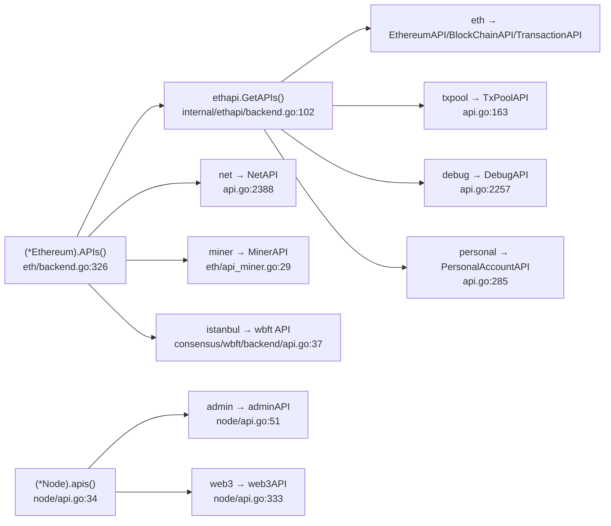
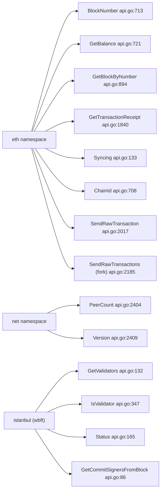
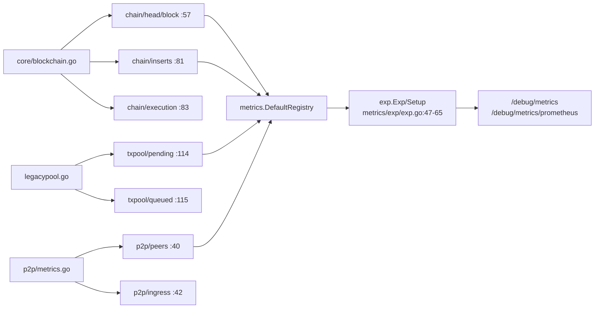

# gstable — RPC API + metrics graph

Code-level extraction of the JSON-RPC namespaces/methods and the metrics surface for the `gstable` node (go-ethereum fork, WBFT/Anzeon consensus). All `path:line` references are relative to the repo root `chain/go-stablenet/`.

---

## Part 1 — RPC API surface

### Registration entry points
| Where | What it assembles | file:line |
|---|---|---|
| `ethapi.GetAPIs(backend)` | eth, txpool, debug, personal, account (shared "ethapi" services) | `internal/ethapi/backend.go:102` |
| `(*Node).apis()` | admin, debug (runtime), web3 (node-level) | `node/api.go:34` |
| `(*Ethereum).APIs()` | aggregates `ethapi.GetAPIs`, `engine.APIs(...)`, then eth-package APIs (eth/miner/admin/debug/net) | `eth/backend.go:326` |
| `CreateConsensusEngine` | selects wbft (Anzeon) / clique / ethash; engine's `APIs()` supplies the consensus namespace | `eth/ethconfig/config.go:182`; wbft chosen at `:192` |

> Fork note: the BFT engine package is `consensus/wbft`, gated by `config.AnzeonEnabled()`, but it registers its RPC under the namespace string **`istanbul`** (`consensus/wbft/backend/engine.go:233`). No `wbft`-named namespace exists.

### Namespace → backing service → verification-critical methods

#### `eth`
Backed by three `internal/ethapi` types plus eth-package types. Registered at `internal/ethapi/backend.go:106` (`EthereumAPI`), `:109` (`BlockChainAPI`), `:112` (`TransactionAPI`), `:121` (`EthereumAccountAPI`); eth-package `EthereumAPI` at `eth/backend.go:335`; sync API `downloader.DownloaderAPI` at `eth/backend.go:341`.

| Method | Purpose (verification) | file:line |
|---|---|---|
| `ChainId` | chain id | `internal/ethapi/api.go:708` |
| `BlockNumber` | head block height | `internal/ethapi/api.go:713` |
| `GetBalance` | account balance | `internal/ethapi/api.go:721` |
| `GetBlockByNumber` | block by number | `internal/ethapi/api.go:894` |
| `GetBlockByHash` | block by hash | `internal/ethapi/api.go:911` |
| `GetCode` | contract code | `internal/ethapi/api.go:968` |
| `Call` | eth_call | `internal/ethapi/api.go:1233` |
| `GasPrice` | suggested gas price | `internal/ethapi/api.go:71` |
| `Syncing` | sync status | `internal/ethapi/api.go:133` |
| `GetTransactionCount` | account nonce | `internal/ethapi/api.go:1784` |
| `GetTransactionReceipt` | tx receipt | `internal/ethapi/api.go:1840` |
| `SendRawTransaction` | submit signed tx | `internal/ethapi/api.go:2017` |
| **`SendRawTransactions`** (fork-specific, batch) | submit array of signed txs → `[]hash` | `internal/ethapi/api.go:2185` |

Type defs: `EthereumAPI` `internal/ethapi/api.go:61`; `BlockChainAPI` `:693`; `TransactionAPI` `:1719`; eth-package `EthereumAPI` `eth/api.go:25`; `DownloaderAPI` `eth/downloader/api.go:33`.

#### `net` (registered `eth/backend.go:350` → `s.netRPCService = *ethapi.NetAPI`, built `eth/backend.go:294`; type `internal/ethapi/api.go:2388`)
| Method | file:line |
|---|---|
| `Listening` | `internal/ethapi/api.go:2399` |
| `PeerCount` | `internal/ethapi/api.go:2404` |
| `Version` | `internal/ethapi/api.go:2409` |

#### `web3` (registered `node/api.go:43` → `web3API` type `node/api.go:333`)
| Method | file:line |
|---|---|
| `ClientVersion` | `node/api.go:338` |
| `Sha3` | `node/api.go:344` |

#### `txpool` (registered `internal/ethapi/backend.go:115` → `TxPoolAPI` type `internal/ethapi/api.go:163`)
| Method | file:line |
|---|---|
| `Content` | `internal/ethapi/api.go:173` |
| `ContentFrom` | `internal/ethapi/api.go:200` |
| `Status` | `internal/ethapi/api.go:223` |
| `Inspect` | `internal/ethapi/api.go:233` |

#### `admin` (two backing types)
- eth-package `AdminAPI`: registered `eth/backend.go:344`, type `eth/api_admin.go:34`.
- node `adminAPI`: registered `node/api.go:37`, type `node/api.go:51`. Methods: `AddPeer` `node/api.go:57`, `Peers` `node/api.go:300`, `NodeInfo` `node/api.go:310`, `Datadir` `node/api.go:328`.

#### `debug`
- ethapi `DebugAPI`: registered `internal/ethapi/backend.go:118`, type `internal/ethapi/api.go:2257`.
- eth-package `DebugAPI`: registered `eth/backend.go:347`, type `eth/api_debug.go:40`.
- runtime `debug.Handler`: `node/api.go:40`. Tracer debug API: `eth/tracers/api.go:1020`.

#### `personal` (registered `internal/ethapi/backend.go:124` → `PersonalAccountAPI` type `internal/ethapi/api.go:285`)
Gated by `--personal` (`node.Config.EnablePersonal`).

#### `miner` (registered `eth/backend.go:338` → `MinerAPI` type `eth/api_miner.go:29`)

#### `istanbul` — WBFT/Anzeon consensus (fork-specific, verification-critical for validators)
Registered `consensus/wbft/backend/engine.go:233` (inside `(*Backend).APIs` `:232`, `Public: true`). Backing type `API` at `consensus/wbft/backend/api.go:37`. Active only when `config.AnzeonEnabled()` (`eth/ethconfig/config.go:192`).

| Method | Purpose | file:line |
|---|---|---|
| `NodeAddress` | this node's validator address | `consensus/wbft/backend/api.go:80` |
| `GetCommitSignersFromBlock` | commit signers for a block number | `consensus/wbft/backend/api.go:86` |
| `GetCommitSignersFromBlockByHash` | commit signers by hash | `consensus/wbft/backend/api.go:103` |
| `GetValidators` | validator set at block number | `consensus/wbft/backend/api.go:132` |
| `GetValidatorsAtHash` | validator set at block hash | `consensus/wbft/backend/api.go:152` |
| `Status` | sealer activity over a block range | `consensus/wbft/backend/api.go:165` |
| `IsValidator` | is this node a validator at block | `consensus/wbft/backend/api.go:347` |
| `GetWbftExtraInfo` | decoded WBFT header extra data | `consensus/wbft/backend/api.go:416` |

> Not present on the wbft/istanbul API: `GetSnapshot`, `Proposals`, `Propose`, `Discard` (those exist only on the `clique` engine below).

#### `clique` (alternate PoA engine, only if `config.Clique != nil`)
Registered `consensus/clique/clique.go:725`; type `API` in `consensus/clique/api.go`. Methods: `GetSnapshot` `:39`, `GetSnapshotAtHash` `:55`, `GetSigners` `:64`, `GetSignersAtHash` `:84`, `Proposals` `:97`, `Propose` `:110`, `Discard` `:119`, `Status` `:136`, `GetSigner` `:210`.

#### Other namespaces present (context)
`engine` (Engine/beacon API) `eth/catalyst/api.go:48`; `dev` (simulated beacon) `eth/catalyst/simulated_beacon.go:298`.

---

## Part 2 — Metrics surface

### Chain head / node-health gauges — `core/blockchain.go`
| Metric | Meaning | file:line |
|---|---|---|
| `chain/head/block` | head (fully processed) block number | `core/blockchain.go:57` |
| `chain/head/header` | current head header number | `core/blockchain.go:58` |
| `chain/head/receipt` | head fast/receipt block number | `core/blockchain.go:59` |
| `chain/head/finalized` | finalized block number | `core/blockchain.go:60` |
| `chain/head/safe` | safe block number | `core/blockchain.go:61` |
| `chain/info` | chain info (GaugeInfo) | `core/blockchain.go:63` |

Head gauge updated on head advance: `core/blockchain.go:516, 722, 843, 884, 955`.

### Block insert / production timers & meters — `core/blockchain.go`
| Metric | Meaning | file:line |
|---|---|---|
| `chain/inserts` | block insert time (key block-production timer; updated `core/blockchain.go:1832`) | `core/blockchain.go:81` |
| `chain/validation` | block validation time | `core/blockchain.go:82` |
| `chain/execution` | EVM execution time | `core/blockchain.go:83` |
| `chain/write` | block write-to-db time | `core/blockchain.go:84` |
| `chain/reorg/executes` | reorg events | `core/blockchain.go:86` |
| `chain/reorg/add` | blocks added by reorgs | `core/blockchain.go:87` |
| `chain/reorg/drop` | blocks dropped by reorgs | `core/blockchain.go:88` |
| `chain/prefetch/executes` / `interrupts` | prefetch exec/interrupt | `core/blockchain.go:90-91` |

(State/trie timers `chain/account/*`, `chain/storage/*`, `chain/snapshot/*`, `chain/triedb/commits` at `core/blockchain.go:65-79`.) `core/blockchain_insert.go` contains no registration calls.

### Txpool metrics — `core/txpool/legacypool/legacypool.go`
| Metric | Meaning | file:line |
|---|---|---|
| `txpool/pending` | pending (executable) tx count | `:114` |
| `txpool/queued` | queued (non-executable) tx count | `:115` |
| `txpool/local` | local tx count | `:116` |
| `txpool/slots` | total pool slots used | `:117` |
| `txpool/known` / `valid` / `invalid` / `underpriced` / `overflowed` | intake classification meters | `:99-103` |
| `txpool/pending/{discard,replace,ratelimit,nofunds}` | pending drops by reason | `:86-89` |
| `txpool/queued/{discard,replace,ratelimit,nofunds,eviction}` | queued drops by reason | `:92-96` |
| `txpool/reorgtime` / `reheap` (timers), `txpool/throttle`, `txpool/dropbetweenreorg` | pool maintenance | `:107-119` |

### P2P peer / traffic metrics — `p2p/metrics.go`
| Metric | Meaning | file:line |
|---|---|---|
| `p2p/peers` | currently connected peers (key connectivity gauge) | `p2p/metrics.go:40` |
| `p2p/ingress` | total inbound bytes (marked `:109`) | `p2p/metrics.go:42` |
| `p2p/egress` | total outbound bytes (marked `:117`) | `p2p/metrics.go:43` |
| `p2p/serves` / `serves/success` | inbound conn attempts/successes | `:46-47` |
| `p2p/dials` / `dials/success` | outbound dial attempts/successes | `:48-49` |
| `p2p/dials/error/*` | dial errors by cause | `:50-59` |

(`p2p/server.go` has no registration calls; all p2p metrics in `p2p/metrics.go`.)

### Exposure over HTTP
| Endpoint / action | file:line |
|---|---|
| `/debug/metrics` (default mux) | `metrics/exp/exp.go:47` |
| `/debug/metrics/prometheus` (default mux) | `metrics/exp/exp.go:48` |
| Stand-alone metrics server `Setup(address)` registers `/debug/metrics` `:61`, `/debug/metrics/prometheus` `:62`, `http.ListenAndServe` `:65` (func `:59`) | `metrics/exp/exp.go` |
| `SetupMetrics` (calls `exp.Setup` when `cfg.HTTP!=""`) | `cmd/utils/flags.go:1937`; `exp.Setup` at `:1976`; gate `:1973` |
| Piggy-backed on pprof mux via `exp.Exp(...)` when no dedicated metrics addr | `internal/debug/flags.go:312` (inside `StartPProf` `:308`); `withMetrics` gate `:300` |
| `SetupMetrics` invoked from node path / import path | `cmd/gstable/config.go:184` / `cmd/gstable/chaincmd.go:326` |

### Enabled / expensive gating
| Item | file:line |
|---|---|
| master toggle `metricsEnabled` | `metrics/metrics.go:16` |
| `Enabled()` accessor (fork: a **function**, not a bare var) | `metrics/metrics.go:21` |
| `Enable()` setter | `metrics/metrics.go:31-34` |
| `SetupMetrics` short-circuit if `!cfg.Enabled`; else `metrics.Enable()` | `cmd/utils/flags.go:1938-1942` |
| `EnabledExpensive` config field (default false) | `metrics/config.go:22`, `:41` |
| CLI: `--metrics` / `--metrics.expensive` / `--metrics.addr` / `--metrics.port` | `cmd/utils/flags.go:836/841/851/856` |

