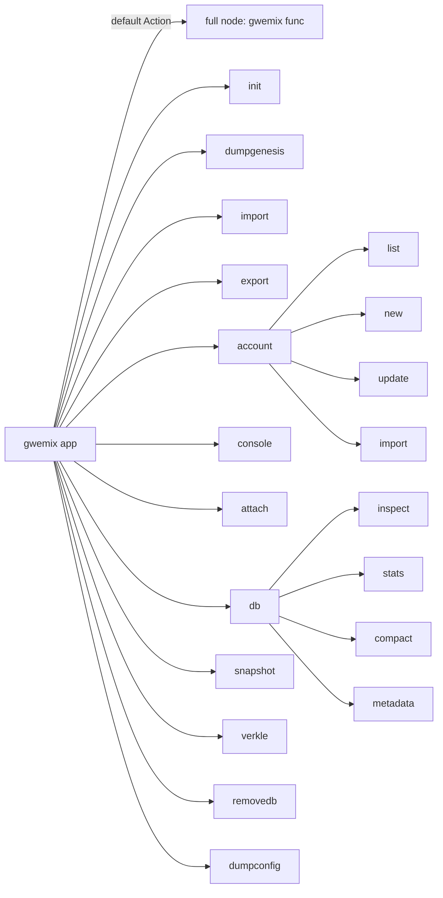
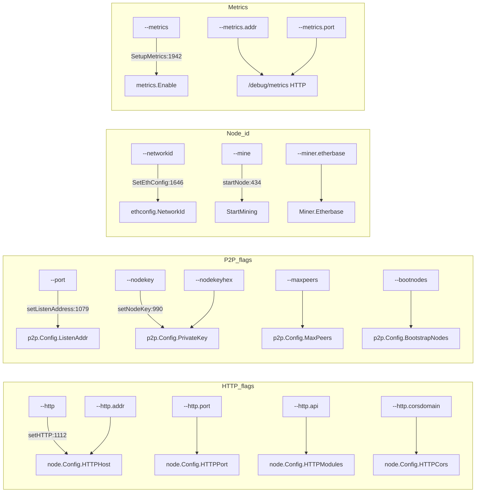
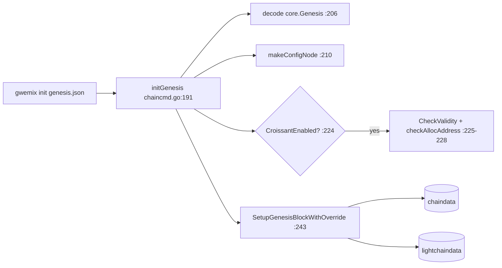

# gwemix CLI — Command + Flag Graph

Source-level extraction of the `gwemix` binary (a go-ethereum fork, urfave/cli/v2) for the chainbench test harness.

- Repo root (read-only): `chain/go-wbft` (module `github.com/ethereum/go-ethereum`)
- Binary entry: `cmd/gwemix/main.go`
- All `path:line` references are relative to the go-wbft repo root.
- Client identifier: `gwemix` (`cmd/gwemix/main.go:52`); default network = **Wemix mainnet** (`cmd/gwemix/main.go:312-313`).

---

## 1. Command / Subcommand Tree

The default action (no subcommand) runs a full node: `app.Action = gwemix` (`cmd/gwemix/main.go:207`), `func gwemix` (`cmd/gwemix/main.go:332`).
Commands are registered in `init()` at `cmd/gwemix/main.go:208-243`, then sorted by name.

| Command | Purpose | Defined (var) | Action (func) |
|---|---|---|---|
| `init` | Bootstrap/initialize a new genesis block | `cmd/gwemix/chaincmd.go:47` | `initGenesis` `cmd/gwemix/chaincmd.go:191` |
| `dumpgenesis` | Dump genesis JSON to stdout | `cmd/gwemix/chaincmd.go:64` | `dumpGenesis` `cmd/gwemix/chaincmd.go:274` |
| `import` | Import an RLP blockchain file | `cmd/gwemix/chaincmd.go:74` | `importChain` `cmd/gwemix/chaincmd.go:318` |
| `export` | Export blockchain into a file | `cmd/gwemix/chaincmd.go:111` | `exportChain` `cmd/gwemix/chaincmd.go:396` |
| `import-history` | Import an Era archive | `cmd/gwemix/chaincmd.go:127` | `importHistory` `cmd/gwemix/chaincmd.go:434` |
| `export-history` | Export history to Era archives | `cmd/gwemix/chaincmd.go:143` | `exportHistory` `cmd/gwemix/chaincmd.go:492` |
| `import-preimages` | Import preimage DB from RLP (deprecated) | `cmd/gwemix/chaincmd.go:154` | `importPreimages` `cmd/gwemix/chaincmd.go:529` |
| `dump` | Dump state for a block | `cmd/gwemix/chaincmd.go:169` | `dump` `cmd/gwemix/chaincmd.go:605` |
| `removedb` | Remove blockchain + state databases | `cmd/gwemix/dbcmd.go:55` | `removeDB` `cmd/gwemix/dbcmd.go:208` |
| `account` | Manage accounts (subcommands) | `cmd/gwemix/accountcmd.go:65` | — (parent) |
| `wallet` | Manage presale wallets (subcommands) | `cmd/gwemix/accountcmd.go:32` | — (parent) |
| `console` | Interactive JS environment (starts node) | `cmd/gwemix/consolecmd.go:32` | `localConsole` `cmd/gwemix/consolecmd.go:70` |
| `attach` | Interactive JS environment (connect to node) | `cmd/gwemix/consolecmd.go:43` | `remoteConsole` `cmd/gwemix/consolecmd.go:112` |
| `js` | Execute JS files (deprecated) | `cmd/gwemix/consolecmd.go:56` | `ephemeralConsole` |
| `version` | Print version numbers | `cmd/gwemix/misccmd.go:30` | `printVersion` `cmd/gwemix/misccmd.go:47` |
| `license` | Display license info | `cmd/gwemix/misccmd.go:39` | `license` |
| `dumpconfig` | Export config as TOML | `cmd/gwemix/config.go:52` | `dumpConfig` `cmd/gwemix/config.go:240` |
| `db` | Low-level DB operations (subcommands) | `cmd/gwemix/dbcmd.go:65` | — (parent) |
| `show-deprecated-flags` | List deprecated flags | `cmd/utils/flags_legacy.go` (`utils.ShowDeprecated`) | — |
| `snapshot` | Snapshot-based commands (subcommands) | `cmd/gwemix/snapshot.go:43` | — (parent) |
| `verkle` | Experimental verkle tree tools (subcommands) | `cmd/gwemix/verkle.go:38` | — (parent) |
| `logtest` | Print sample log messages (build-tag gated) | `cmd/gwemix/logtestcmd_active.go:34` | `logTest` |

### Subcommands

**`account`** (`cmd/gwemix/accountcmd.go:88`)
| Sub | Action |
|---|---|
| `list` | `accountList` `cmd/gwemix/accountcmd.go:209` |
| `new` | `accountCreate` `cmd/gwemix/accountcmd.go:279` |
| `update` | `accountUpdate` `cmd/gwemix/accountcmd.go:314` |
| `import` | `accountImport` `cmd/gwemix/accountcmd.go:361` |

**`wallet`** (`cmd/gwemix/accountcmd.go:42`): `import` -> `importWallet` `cmd/gwemix/accountcmd.go:335`

**`db`** (`cmd/gwemix/dbcmd.go:69`): `inspect` (`:84`), `check-state-content` (`:94`), `stats` (`:104`), `compact` (`:112`), `get` (`:125`), `delete` (`:135`), `put` (`:146`), `dumptrie` (`:157`), `freezer-index` (`:167`), `import` (`:177`), `export` (`:187`), `metadata` (`:197`).

**`snapshot`** (`cmd/gwemix/snapshot.go:47`): `prune-state` (`:49`), `verify-state` (`:69`), `check-dangling-storage` (`:82`), `inspect-account` (`:93`), `traverse-state` (`:104`), `traverse-rawstate` (`:119`), `dump` (`:135`), `export-preimages` (`:154`).

**`verkle`** (`cmd/gwemix/verkle.go:42`): `verify` (`:44`), `dump` (`:55`).



---

## 2. Launch-Relevant Flags → Config Fields

Flag sets are assembled in `cmd/gwemix/main.go`: `nodeFlags` (`:57`), `rpcFlags` (`:153`), `metricsFlags` (`:185`), merged into `app.Flags` (`:245-251`).
Node assembly: `makeConfigNode` (`cmd/gwemix/config.go:151`) calls `utils.SetNodeConfig` (`config.go:146`) and `utils.SetEthConfig` (`config.go:162`); `makeFullNode` (`config.go:172`) then calls `utils.SetupMetrics` (`config.go:184`) and `utils.RegisterEthService` (`config.go:186`).
`SetNodeConfig` (`cmd/utils/flags.go:1369`) → `SetP2PConfig` (`:1325`), `setIPC` (`:1206`), `setHTTP` (`:1111`), `setWS` (`:1178`), `SetDataDir` (`:1446`). `SetEthConfig` (`:1607`).

### 2a. Data / genesis / identity
| Flag (CLI) | Def | Consumed → config field |
|---|---|---|
| `--datadir` | `cmd/utils/flags.go:90` | `SetDataDir` → `node.Config.DataDir` `cmd/utils/flags.go:1448-1449` |
| `--datadir.ancient` | `:107` | `SetEthConfig` → `cfg.DatabaseFreezer` `:1658-1660`; also `init` freezer `chaincmd.go:234` |
| `--keystore` | `:117` | `SetNodeConfig` → `node.Config.KeyStoreDir` `:1391-1393` |
| `--identity` | `:182` | `setNodeUserIdent` → `node.Config.UserIdent` `:1001-1002` |
| `--db.engine` | `:96` (`DBEngineFlag`) | `SetNodeConfig` → `node.Config.DBEngine` `:1409-1415` |

### 2b. Network selection / chain id
| Flag (CLI) | Def | Consumed |
|---|---|---|
| `--networkid` | `:133` | `SetEthConfig` → `ethconfig.Config.NetworkId` `:1645-1647`. Default = `ethconfig.Defaults.NetworkId` |
| `--mainnet` | `:139` | `CheckExclusive` `:1609`; "Wemix mainnet" |
| `--testnet` (`WemixTestnetFlag`) | `:144` | preset log `main.go:282`; bootnodes `:1023-1024` |
| `--goerli` | `:149` | datadir/bootnodes presets `:1029`,`:1452` |
| `--sepolia` | `:154` | `:1027`,`:1454` |
| `--holesky` | `:159` | `:1025`,`:1456` |
| `--dev` (`DeveloperFlag`) | `:165` | ephemeral mode; disables p2p `:1358-1365`, in-mem datadir `:1450` |

> **Chain ID note:** there is no dedicated `--chainid` flag. Chain ID comes from the genesis `config.chainId` loaded by `init` (see §4) and surfaced via `eth_chainId`. `--networkid` sets only the P2P/devp2p network id.

### 2c. HTTP JSON-RPC (`setHTTP` `cmd/utils/flags.go:1111`)
| Flag (CLI) | Def | → field |
|---|---|---|
| `--http` | `:581` | enables; `node.Config.HTTPHost` default `127.0.0.1` `:1112-1114` |
| `--http.addr` | `:586` | `HTTPHost` `:1116-1118` |
| `--http.port` | `:592` | `HTTPPort` `:1121-1123` |
| `--http.corsdomain` | `:598` | `HTTPCors` `:1137-1139` |
| `--http.vhosts` | `:604` | `HTTPVirtualHosts` `:1145-1147` |
| `--http.api` | `:610` | `HTTPModules` `:1141-1143` |
| `--http.rpcprefix` | `:616` | `HTTPPathPrefix` `:1149-1151` |

### 2d. WebSocket JSON-RPC (`setWS` `cmd/utils/flags.go:1178`)
| Flag (CLI) | Def | → field |
|---|---|---|
| `--ws` | `:639` | enables; `WSHost` default `127.0.0.1` `:1179-1182` |
| `--ws.addr` | `:644` | `WSHost` `:1183-1185` |
| `--ws.port` | `:650` | `WSPort` `:1187-1189` |
| `--ws.api` | `:656` | `WSModules` `:1195-1197` |
| `--ws.origins` | `:662` | `WSOrigins` `:1191-1193` |
| `--ws.rpcprefix` | `:668` | `WSPathPrefix` `:1199-1201` |

### 2e. IPC + Auth RPC
| Flag (CLI) | Def | → field |
|---|---|---|
| `--ipcdisable` | `:571` | `setIPC` clears `IPCPath` `:1209-1210` |
| `--ipcpath` | `:576` | `setIPC` → `IPCPath` `:1211-1212` |
| `--authrpc.addr` | `:526` | `setHTTP` → `AuthAddr` `:1125-1126` |
| `--authrpc.port` | `:532` | `AuthPort` `:1129-1130` |
| `--authrpc.vhosts` | `:538` | `AuthVirtualHosts` `:1133-1134` |
| `--authrpc.jwtsecret` | `:544` | `SetNodeConfig` → `JWTSecret` `:1379-1381` |

### 2f. P2P networking (`SetP2PConfig` `cmd/utils/flags.go:1325`)
| Flag (CLI) | Def | → field |
|---|---|---|
| `--port` | `:720` (`ListenPortFlag`) | `setListenAddress` → `p2p.Config.ListenAddr` `:1078-1080` |
| `--discovery.port` | `:776` (`DiscoveryPortFlag`) | `setListenAddress` → `p2p.Config.DiscAddr` `:1081-1083` |
| `--maxpeers` | `:708` | `p2p.Config.MaxPeers` `:1332-1334` |
| `--nodekey` | `:732` | `setNodeKey` → `p2p.Config.PrivateKey` (from file) `:986-990` |
| `--nodekeyhex` | `:737` | `setNodeKey` → `p2p.Config.PrivateKey` (from hex) `:991-995` |
| `--nat` | `:742` | `setNAT` → `p2p.Config.NAT` `:1088-1093` |
| `--nodiscover` | `:748` | `p2p.Config.NoDiscovery=true` `:1341-1343` |
| `--bootnodes` | `:726` | `setBootstrapNodes` → `p2p.Config.BootstrapNodes` `:1016-1033` (default `params.WemixMainnetBootnodes` `:1015`) |
| `--netrestrict` | `:766` | `p2p.Config.NetRestrict` `:1350-1355` |

### 2g. Mining / miner (`setEtherbase` + `setMiner`)
| Flag (CLI) | Def | → field |
|---|---|---|
| `--mine` (`MiningEnabledFlag`) | `:434` | read in `startNode` → `ethBackend.StartMining()` `cmd/gwemix/main.go:422-436` |
| `--miner.etherbase` | `:451` | `setEtherbase` → `ethconfig.Config.Miner.Etherbase` `:1291-1304` |
| `--miner.gaslimit` | `:439` | `setMiner` → `Miner.GasCeil` |
| `--miner.gasprice` | `:445` | `startNode` `SetGasTip` `main.go:432-433`; `setMiner` → `Miner.GasPrice` |
| `--miner.extradata` | `:456` | `setMiner` → `Miner.ExtraData` |

### 2h. Accounts / unlock
| Flag (CLI) | Def | → consumption |
|---|---|---|
| `--unlock` | `:475` | `unlockAccounts` `cmd/gwemix/main.go:441-468` |
| `--password` | `:481` | `utils.MakePasswordList` `cmd/utils/flags.go:1308` |
| `--allow-insecure-unlock` | `:493` | `node.Config.InsecureUnlockAllowed` `:1406-1408`; guard `main.go:455-457` |
| `--lightkdf` | `:235` | `node.Config.UseLightweightKDF` `:1397-1399` |

### 2i. Metrics (`SetupMetrics` `cmd/utils/flags.go:1937`)
| Flag (CLI) | Def | → effect |
|---|---|---|
| `--metrics` | `:836` (`MetricsEnabledFlag`) | `cfg.Metrics.Enabled`; `metrics.Enable()` `:1938-1942` |
| `--metrics.expensive` | `:841` (deprecated) | expensive collection |
| `--metrics.addr` | `:851` (`MetricsHTTPFlag`) | HTTP host → `exp.Setup(addr)` `:1973-1976` |
| `--metrics.port` | `:856` (`MetricsPortFlag`) | HTTP port `:1974` (no-op without `--metrics.addr` `:1977-1978`) |
| `--metrics.influxdb*` | `:860+` | InfluxDB v1/v2 export `:1963-1969` |

### 2j. Verbosity / logging (`internal/debug/flags.go`, applied in `debug.Setup` `main.go:257`)
| Flag (CLI) | Def | Note |
|---|---|---|
| `--verbosity` | `internal/debug/flags.go:43` | 0=silent..5=detail, default 3 |
| `--log.vmodule` / `--vmodule` | `:49` / `:55` | per-module verbosity |
| `--log.json` / `--log.format` | `:62` / `:68` | output format |
| `--log.file` | `:73` | log file path |
| `--pprof` / `--pprof.addr` / `--pprof.port` | `:107` / `:118` / `:112` | pprof + `/debug/metrics` hook `StartPProf` `:308-319` |



---

## 3. init / genesis handling

Chainbench builds a `genesis.json` and inits datadirs, so this path matters.

- `gwemix init <genesisPath>` → `initGenesis` (`cmd/gwemix/chaincmd.go:191`).
  1. Requires exactly one arg (the genesis path) `:192-198`.
  2. Opens + JSON-decodes the file into `core.Genesis` `:199-208`.
  3. Builds the node from CLI (`makeConfigNode`) `:210`.
  4. Fork overrides from `--override.cancun` / `--override.verkle` `:213-221`.
  5. **WBFT sanity (Wemix-specific):** if `genesis.Config.CroissantEnabled()`, validates `Croissant.CheckValidity()` and `checkAllocAddress` (`:224-231`, `checkAllocAddress` at `:252-272`). The alloc check **forbids** allocations to the Croissant governance contract addresses (`GovConfig`, `GovStaking`, `GovRewardeeImp`, and `GovNCP` if present) — `log.Crit` if violated (`:254-268`).
  6. For each of `chaindata` and `lightchaindata`: open DB with freezer (uses `--datadir.ancient` `:234`), build trie DB (`--cache.preimages` `:240`), then `core.SetupGenesisBlockWithOverride(...)` writes the genesis block `:233-248`.
- `init` flags: `--cache.preimages`, `--override.cancun`, `--override.verkle`, plus `utils.DatabaseFlags` (`cmd/gwemix/chaincmd.go:52-56`).
- `dumpgenesis` (`dumpGenesis` `:274`): prints the preset genesis if a network preset is set (`utils.MakeGenesis` `:278`), else reads stored genesis from the datadir DB (`core.ReadGenesis` `:300`).
- Genesis for a running node is set up inside `utils.RegisterEthService` (`cmd/gwemix/config.go:186`), which calls into `eth.New`; consensus engine chosen by `CreateConsensusEngine` (`eth/ethconfig/config.go:185`) — for `CroissantEnabled` genesis this yields the WBFT/Croissant engine (`:195-206`).



---

## 4. Complete flag inventory (all flags)

**Total: 177 flag definitions** extracted from source. This supersedes the launch-relevant subset in §2 (which stays as-is — it maps ~63 flags to config fields); this section is the exhaustive list of every CLI flag the `gwemix` binary defines.

Sources: `cmd/utils/flags.go` (142), `cmd/utils/flags_legacy.go` (14, deprecated), `internal/debug/flags.go` (18, logging/debug), and command-local flags in `cmd/gwemix/config.go` + `cmd/gwemix/dbcmd.go` (3). Registered set = `nodeFlags` + `rpcFlags` + `consoleFlags` + `debug.Flags` + `metricsFlags` (`cmd/gwemix/main.go:245-251`); `remove.state`/`remove.chain` are local to the `removedb` command, `config` is local to node/console commands.

Grouping uses each flag's urfave `Category:` field. Usage strings are verbatim (trimmed). `path` is relative to the go-wbft repo root. Aliases noted inline.

### Category breakdown
| Category | Count |
|---|---|
| Ethereum (`EthCategory`) | 17 |
| Networking (`NetworkingCategory`) | 16 |
| API/Console (`APICategory`) | 34 |
| State (`StateCategory`) | 5 |
| TxPool (`TxPoolCategory`) | 11 |
| BlobPool (`BlobPoolCategory`) | 3 |
| Performance/Cache (`PerfCategory`) | 10 |
| Miner (`MinerCategory`) | 7 |
| Account (`AccountCategory`) | 8 |
| VM/EVM (`VMCategory`) | 1 |
| GasPriceOracle (`GasPriceCategory`) | 4 |
| Metrics (`MetricsCategory`, incl. `--ethstats`) | 15 |
| Dev mode (`DevCategory`) | 3 |
| Misc (`MiscCategory`) | 1 |
| Logging (`LoggingCategory`, flags.go) | 2 |
| Logging/Debug (`LoggingCategory`, internal/debug) | 18 |
| Dump command (uncategorized) | 6 |
| Deprecated (`DeprecatedCategory`) | 8 |
| Light — deprecated (`LightCategory`) | 6 |
| Command-local (uncategorized) | 2 |

### 4a. Ethereum (`flags.EthCategory`)
| --flag | Usage (verbatim) | file:line |
|---|---|---|
| `--datadir` | Data directory for the databases and keystore | cmd/utils/flags.go:91 |
| `--db.engine` | Backing database implementation to use ('pebble' or 'leveldb') | cmd/utils/flags.go:102 |
| `--datadir.ancient` | Root directory for ancient data (default = inside chaindata) | cmd/utils/flags.go:108 |
| `--datadir.minfreedisk` | Minimum free disk space in MB, once reached triggers auto shut down (default = --cache.gc converted to MB, 0 = disabled) | cmd/utils/flags.go:113 |
| `--networkid` | Explicitly set network id (integer)(For testnets: use --goerli, --sepolia, --holesky instead) | cmd/utils/flags.go:134 |
| `--mainnet` | Wemix mainnet | cmd/utils/flags.go:140 |
| `--testnet` | Wemix test network: pre-configured Wemix test network | cmd/utils/flags.go:145 |
| `--goerli` | Görli network: pre-configured proof-of-authority test network | cmd/utils/flags.go:150 |
| `--sepolia` | Sepolia network: pre-configured proof-of-work test network | cmd/utils/flags.go:155 |
| `--holesky` | Holesky network: pre-configured proof-of-stake test network | cmd/utils/flags.go:160 |
| `--exitwhensynced` | Exits after block synchronisation completes | cmd/utils/flags.go:194 |
| `--snapshot` | Enables snapshot-database mode (default = enable) | cmd/utils/flags.go:230 |
| `--eth.requiredblocks` | Comma separated block number-to-hash mappings to require for peering (<number>=<hash>) | cmd/utils/flags.go:241 |
| `--bloomfilter.size` | Megabytes of memory allocated to bloom-filter for pruning | cmd/utils/flags.go:246 |
| `--override.cancun` | Manually specify the Cancun fork timestamp, overriding the bundled setting | cmd/utils/flags.go:252 |
| `--override.verkle` | Manually specify the Verkle fork timestamp, overriding the bundled setting | cmd/utils/flags.go:257 |
| `--config` | TOML configuration file | cmd/gwemix/config.go:62 |

### 4b. Networking (`flags.NetworkingCategory`)
| --flag | Usage (verbatim) | file:line |
|---|---|---|
| `--identity` | Custom node name | cmd/utils/flags.go:183 |
| `--maxpeers` | Maximum number of network peers (network disabled if set to 0) | cmd/utils/flags.go:709 |
| `--maxpendpeers` | Maximum number of pending connection attempts (defaults used if set to 0) | cmd/utils/flags.go:715 |
| `--port` | Network listening port | cmd/utils/flags.go:721 |
| `--bootnodes` | Comma separated enode URLs for P2P discovery bootstrap | cmd/utils/flags.go:727 |
| `--nodekey` | P2P node key file | cmd/utils/flags.go:733 |
| `--nodekeyhex` | P2P node key as hex (for testing) | cmd/utils/flags.go:738 |
| `--nat` | NAT port mapping mechanism (any\|none\|upnp\|pmp\|pmp:<IP>\|extip:<IP>) | cmd/utils/flags.go:743 |
| `--nodiscover` | Disables the peer discovery mechanism (manual peer addition) | cmd/utils/flags.go:749 |
| `--discovery.v4` (alias `--discv4`) | Enables the V4 discovery mechanism | cmd/utils/flags.go:754 |
| `--discovery.v5` (alias `--discv5`) | Enables the experimental RLPx V5 (Topic Discovery) mechanism | cmd/utils/flags.go:761 |
| `--netrestrict` | Restricts network communication to the given IP networks (CIDR masks) | cmd/utils/flags.go:767 |
| `--discovery.dns` | Sets DNS discovery entry points (use "" to disable DNS) | cmd/utils/flags.go:772 |
| `--discovery.port` | Use a custom UDP port for P2P discovery | cmd/utils/flags.go:777 |
| `--sync.forcecycle` | Time interval to force syncs, even if few peers are available | cmd/utils/flags.go:783 |
| `--sync.tdinterval` | Time interval to verify TD changes and detect sync stalling | cmd/utils/flags.go:789 |

### 4c. API / RPC / Console (`flags.APICategory`)
| --flag | Usage (verbatim) | file:line |
|---|---|---|
| `--docroot` | Document Root for HTTPClient file scheme | cmd/utils/flags.go:189 |
| `--rpc.gascap` | Sets a cap on gas that can be used in eth_call/estimateGas (0=infinite) | cmd/utils/flags.go:509 |
| `--rpc.evmtimeout` | Sets a timeout used for eth_call (0=infinite) | cmd/utils/flags.go:515 |
| `--rpc.txfeecap` | Sets a cap on transaction fee (in ether) that can be sent via the RPC APIs (0 = no cap) | cmd/utils/flags.go:521 |
| `--authrpc.addr` | Listening address for authenticated APIs | cmd/utils/flags.go:528 |
| `--authrpc.port` | Listening port for authenticated APIs | cmd/utils/flags.go:534 |
| `--authrpc.vhosts` | Comma separated list of virtual hostnames from which to accept requests (server enforced). Accepts '*' wildcard. | cmd/utils/flags.go:540 |
| `--authrpc.jwtsecret` | Path to a JWT secret to use for authenticated RPC endpoints | cmd/utils/flags.go:546 |
| `--ipcdisable` | Disable the IPC-RPC server | cmd/utils/flags.go:573 |
| `--ipcpath` | Filename for IPC socket/pipe within the datadir (explicit paths escape it) | cmd/utils/flags.go:578 |
| `--http` | Enable the HTTP-RPC server | cmd/utils/flags.go:583 |
| `--http.addr` | HTTP-RPC server listening interface | cmd/utils/flags.go:588 |
| `--http.port` | HTTP-RPC server listening port | cmd/utils/flags.go:594 |
| `--http.corsdomain` | Comma separated list of domains from which to accept cross origin requests (browser enforced) | cmd/utils/flags.go:600 |
| `--http.vhosts` | Comma separated list of virtual hostnames from which to accept requests (server enforced). Accepts '*' wildcard. | cmd/utils/flags.go:606 |
| `--http.api` | API's offered over the HTTP-RPC interface | cmd/utils/flags.go:612 |
| `--http.rpcprefix` | HTTP path path prefix on which JSON-RPC is served. Use '/' to serve on all paths. | cmd/utils/flags.go:618 |
| `--graphql` | Enable GraphQL on the HTTP-RPC server. Note that GraphQL can only be started if an HTTP server is started as well. | cmd/utils/flags.go:624 |
| `--graphql.corsdomain` | Comma separated list of domains from which to accept cross origin requests (browser enforced) | cmd/utils/flags.go:629 |
| `--graphql.vhosts` | Comma separated list of virtual hostnames from which to accept requests (server enforced). Accepts '*' wildcard. | cmd/utils/flags.go:635 |
| `--ws` | Enable the WS-RPC server | cmd/utils/flags.go:641 |
| `--ws.addr` | WS-RPC server listening interface | cmd/utils/flags.go:646 |
| `--ws.port` | WS-RPC server listening port | cmd/utils/flags.go:652 |
| `--ws.api` | API's offered over the WS-RPC interface | cmd/utils/flags.go:658 |
| `--ws.origins` | Origins from which to accept websockets requests | cmd/utils/flags.go:664 |
| `--ws.rpcprefix` | HTTP path prefix on which JSON-RPC is served. Use '/' to serve on all paths. | cmd/utils/flags.go:670 |
| `--exec` | Execute JavaScript statement | cmd/utils/flags.go:676 |
| `--preload` | Comma separated list of JavaScript files to preload into the console | cmd/utils/flags.go:681 |
| `--rpc.allow-unprotected-txs` | Allow for unprotected (non EIP155 signed) transactions to be submitted via RPC | cmd/utils/flags.go:686 |
| `--rpc.batch-request-limit` | Maximum number of requests in a batch | cmd/utils/flags.go:691 |
| `--rpc.batch-response-max-size` | Maximum number of bytes returned from a batched call | cmd/utils/flags.go:697 |
| `--rpc.enabledeprecatedpersonal` | Enables the (deprecated) personal namespace | cmd/utils/flags.go:703 |
| `--jspath` | JavaScript root path for `loadScript` | cmd/utils/flags.go:798 |
| `--header` (alias `-H`) | Pass custom headers to the RPC server when using --remotedb or the gwemix attach console. This flag can be given multiple times. | cmd/utils/flags.go:805 |

### 4d. State (`flags.StateCategory`)
| --flag | Usage (verbatim) | file:line |
|---|---|---|
| `--syncmode` | Blockchain sync mode ("snap" or "full") | cmd/utils/flags.go:263 |
| `--gcmode` | Blockchain garbage collection mode, only relevant in state.scheme=hash ("full", "archive") | cmd/utils/flags.go:269 |
| `--state.scheme` | Scheme to use for storing ethereum state ('hash' or 'path') | cmd/utils/flags.go:275 |
| `--history.state` | Number of recent blocks to retain state history for (default = 90,000 blocks, 0 = entire chain) | cmd/utils/flags.go:280 |
| `--history.transactions` | Number of recent blocks to maintain transactions index for (default = about one year, 0 = entire chain) | cmd/utils/flags.go:286 |

### 4e. TxPool (`flags.TxPoolCategory`)
| --flag | Usage (verbatim) | file:line |
|---|---|---|
| `--txpool.locals` | Comma separated accounts to treat as locals (no flush, priority inclusion) | cmd/utils/flags.go:293 |
| `--txpool.nolocals` | Disables price exemptions for locally submitted transactions | cmd/utils/flags.go:298 |
| `--txpool.journal` | Disk journal for local transaction to survive node restarts | cmd/utils/flags.go:303 |
| `--txpool.rejournal` | Time interval to regenerate the local transaction journal | cmd/utils/flags.go:309 |
| `--txpool.pricelimit` | Minimum gas price tip to enforce for acceptance into the pool | cmd/utils/flags.go:315 |
| `--txpool.pricebump` | Price bump percentage to replace an already existing transaction | cmd/utils/flags.go:321 |
| `--txpool.accountslots` | Minimum number of executable transaction slots guaranteed per account | cmd/utils/flags.go:327 |
| `--txpool.globalslots` | Maximum number of executable transaction slots for all accounts | cmd/utils/flags.go:333 |
| `--txpool.accountqueue` | Maximum number of non-executable transaction slots permitted per account | cmd/utils/flags.go:339 |
| `--txpool.globalqueue` | Maximum number of non-executable transaction slots for all accounts | cmd/utils/flags.go:345 |
| `--txpool.lifetime` | Maximum amount of time non-executable transaction are queued | cmd/utils/flags.go:351 |

### 4f. BlobPool (`flags.BlobPoolCategory`)
| --flag | Usage (verbatim) | file:line |
|---|---|---|
| `--blobpool.datadir` | Data directory to store blob transactions in | cmd/utils/flags.go:357 |
| `--blobpool.datacap` | Disk space to allocate for pending blob transactions (soft limit) | cmd/utils/flags.go:363 |
| `--blobpool.pricebump` | Price bump percentage to replace an already existing blob transaction | cmd/utils/flags.go:369 |

### 4g. Performance / Cache (`flags.PerfCategory`)
| --flag | Usage (verbatim) | file:line |
|---|---|---|
| `--cache` | Megabytes of memory allocated to internal caching (default = 4096 mainnet full node, 128 light mode) | cmd/utils/flags.go:377 |
| `--cache.database` | Percentage of cache memory allowance to use for database io | cmd/utils/flags.go:383 |
| `--cache.trie` | Percentage of cache memory allowance to use for trie caching (default = 15% full mode, 30% archive mode) | cmd/utils/flags.go:389 |
| `--cache.gc` | Percentage of cache memory allowance to use for trie pruning (default = 25% full mode, 0% archive mode) | cmd/utils/flags.go:395 |
| `--cache.snapshot` | Percentage of cache memory allowance to use for snapshot caching (default = 10% full mode, 20% archive mode) | cmd/utils/flags.go:401 |
| `--cache.noprefetch` | Disable heuristic state prefetch during block import (less CPU and disk IO, more time waiting for data) | cmd/utils/flags.go:407 |
| `--cache.preimages` | Enable recording the SHA3/keccak preimages of trie keys | cmd/utils/flags.go:412 |
| `--cache.blocklogs` | Size (in number of blocks) of the log cache for filtering | cmd/utils/flags.go:417 |
| `--fdlimit` | Raise the open file descriptor resource limit (default = system fd limit) | cmd/utils/flags.go:423 |
| `--crypto.kzg` | KZG library implementation to use; gokzg (recommended) or ckzg | cmd/utils/flags.go:428 |

### 4h. Miner (`flags.MinerCategory`)
| --flag | Usage (verbatim) | file:line |
|---|---|---|
| `--mine` | Enable mining | cmd/utils/flags.go:436 |
| `--miner.gaslimit` | Target gas ceiling for mined blocks | cmd/utils/flags.go:441 |
| `--miner.gasprice` | Minimum gas price for mining a transaction | cmd/utils/flags.go:447 |
| `--miner.etherbase` | 0x prefixed public address for block mining rewards | cmd/utils/flags.go:453 |
| `--miner.extradata` | Block extra data set by the miner (default = client version) | cmd/utils/flags.go:458 |
| `--miner.recommit` | Time interval to recreate the block being mined | cmd/utils/flags.go:463 |
| `--miner.newpayload-timeout` | Specify the maximum time allowance for creating a new payload | cmd/utils/flags.go:469 |

### 4i. Account (`flags.AccountCategory`)
| --flag | Usage (verbatim) | file:line |
|---|---|---|
| `--keystore` | Directory for the keystore (default = inside the datadir) | cmd/utils/flags.go:118 |
| `--usb` | Enable monitoring and management of USB hardware wallets | cmd/utils/flags.go:123 |
| `--pcscdpath` | Path to the smartcard daemon (pcscd) socket file | cmd/utils/flags.go:128 |
| `--lightkdf` | Reduce key-derivation RAM & CPU usage at some expense of KDF strength | cmd/utils/flags.go:236 |
| `--unlock` | Comma separated list of accounts to unlock | cmd/utils/flags.go:476 |
| `--password` | Password file to use for non-interactive password input | cmd/utils/flags.go:482 |
| `--signer` | External signer (url or path to ipc file) | cmd/utils/flags.go:488 |
| `--allow-insecure-unlock` | Allow insecure account unlocking when account-related RPCs are exposed by http | cmd/utils/flags.go:494 |

### 4j. VM/EVM (`flags.VMCategory`)
| --flag | Usage (verbatim) | file:line |
|---|---|---|
| `--vmdebug` | Record information useful for VM and contract debugging | cmd/utils/flags.go:501 |

### 4k. GasPriceOracle (`flags.GasPriceCategory`)
| --flag | Usage (verbatim) | file:line |
|---|---|---|
| `--gpo.blocks` | Number of recent blocks to check for gas prices | cmd/utils/flags.go:811 |
| `--gpo.percentile` | Suggested gas price is the given percentile of a set of recent transaction gas prices | cmd/utils/flags.go:817 |
| `--gpo.maxprice` | Maximum transaction priority fee (or gasprice before London fork) to be recommended by gpo | cmd/utils/flags.go:823 |
| `--gpo.ignoreprice` | Gas price below which gpo will ignore transactions | cmd/utils/flags.go:829 |

### 4l. Metrics (`flags.MetricsCategory`)
| --flag | Usage (verbatim) | file:line |
|---|---|---|
| `--ethstats` | Reporting URL of a ethstats service (nodename:secret@host:port) | cmd/utils/flags.go:553 |
| `--metrics` | Enable metrics collection and reporting | cmd/utils/flags.go:837 |
| `--metrics.expensive` | Enable expensive metrics collection and reporting (deprecated) | cmd/utils/flags.go:842 |
| `--metrics.addr` | Enable stand-alone metrics HTTP server listening interface. | cmd/utils/flags.go:852 |
| `--metrics.port` | Metrics HTTP server listening port. Please note that --metrics.addr must be set to start the server. | cmd/utils/flags.go:857 |
| `--metrics.influxdb` | Enable metrics export/push to an external InfluxDB database | cmd/utils/flags.go:864 |
| `--metrics.influxdb.endpoint` | InfluxDB API endpoint to report metrics to | cmd/utils/flags.go:869 |
| `--metrics.influxdb.database` | InfluxDB database name to push reported metrics to | cmd/utils/flags.go:875 |
| `--metrics.influxdb.username` | Username to authorize access to the database | cmd/utils/flags.go:881 |
| `--metrics.influxdb.password` | Password to authorize access to the database | cmd/utils/flags.go:887 |
| `--metrics.influxdb.tags` | Comma-separated InfluxDB tags (key/values) attached to all measurements | cmd/utils/flags.go:897 |
| `--metrics.influxdbv2` | Enable metrics export/push to an external InfluxDB v2 database | cmd/utils/flags.go:904 |
| `--metrics.influxdb.token` | Token to authorize access to the database (v2 only) | cmd/utils/flags.go:910 |
| `--metrics.influxdb.bucket` | InfluxDB bucket name to push reported metrics to (v2 only) | cmd/utils/flags.go:917 |
| `--metrics.influxdb.organization` | InfluxDB organization name (v2 only) | cmd/utils/flags.go:924 |

### 4m. Dev mode (`flags.DevCategory`)
| --flag | Usage (verbatim) | file:line |
|---|---|---|
| `--dev` | Ephemeral proof-of-authority network with a pre-funded developer account, mining enabled | cmd/utils/flags.go:166 |
| `--dev.period` | Block period to use in developer mode (0 = mine only if transaction pending) | cmd/utils/flags.go:171 |
| `--dev.gaslimit` | Initial block gas limit | cmd/utils/flags.go:176 |

### 4n. Misc (`flags.MiscCategory`)
| --flag | Usage (verbatim) | file:line |
|---|---|---|
| `--synctarget` | Hash of the block to full sync to (dev testing feature) | cmd/utils/flags.go:564 |

### 4o. Logging (`flags.LoggingCategory`, flags.go)
| --flag | Usage (verbatim) | file:line |
|---|---|---|
| `--remotedb` | URL for remote database | cmd/utils/flags.go:97 |
| `--nocompaction` | Disables db compaction after import | cmd/utils/flags.go:557 |

### 4p. Logging / Debug (`flags.LoggingCategory`, internal/debug/flags.go)
| --flag | Usage (verbatim) | file:line |
|---|---|---|
| `--verbosity` | Logging verbosity: 0=silent, 1=error, 2=warn, 3=info, 4=debug, 5=detail | internal/debug/flags.go:43 |
| `--log.vmodule` | Per-module verbosity: comma-separated list of <pattern>=<level> (e.g. eth/*=5,p2p=4) | internal/debug/flags.go:49 |
| `--vmodule` | Per-module verbosity: comma-separated list of <pattern>=<level> (e.g. eth/*=5,p2p=4) | internal/debug/flags.go:55 |
| `--log.json` | Format logs with JSON | internal/debug/flags.go:62 |
| `--log.format` | Log format to use (json\|logfmt\|terminal) | internal/debug/flags.go:68 |
| `--log.file` | Write logs to a file | internal/debug/flags.go:73 |
| `--log.rotate` | Enables log file rotation | internal/debug/flags.go:78 |
| `--log.maxsize` | Maximum size in MBs of a single log file | internal/debug/flags.go:83 |
| `--log.maxbackups` | Maximum number of log files to retain | internal/debug/flags.go:89 |
| `--log.maxage` | Maximum number of days to retain a log file | internal/debug/flags.go:95 |
| `--log.compress` | Compress the log files | internal/debug/flags.go:101 |
| `--pprof` | Enable the pprof HTTP server | internal/debug/flags.go:107 |
| `--pprof.port` | pprof HTTP server listening port | internal/debug/flags.go:112 |
| `--pprof.addr` | pprof HTTP server listening interface | internal/debug/flags.go:118 |
| `--pprof.memprofilerate` | Turn on memory profiling with the given rate | internal/debug/flags.go:124 |
| `--pprof.blockprofilerate` | Turn on block profiling with the given rate | internal/debug/flags.go:130 |
| `--pprof.cpuprofile` | Write CPU profile to the given file | internal/debug/flags.go:135 |
| `--trace` | Write execution trace to the given file | internal/debug/flags.go:140 |

### 4q. Dump command options (uncategorized)
| --flag | Usage (verbatim) | file:line |
|---|---|---|
| `--iterative` | Print streaming JSON iteratively, delimited by newlines | cmd/utils/flags.go:201 |
| `--nostorage` | Exclude storage entries (save db lookups) | cmd/utils/flags.go:206 |
| `--incompletes` | Include accounts for which we don't have the address (missing preimage) | cmd/utils/flags.go:210 |
| `--nocode` | Exclude contract code (save db lookups) | cmd/utils/flags.go:214 |
| `--start` | Start position. Either a hash or address | cmd/utils/flags.go:218 |
| `--limit` | Max number of elements (0 = no limit) | cmd/utils/flags.go:223 |

### 4r. Deprecated (`flags.DeprecatedCategory`)
| --flag | Usage (verbatim) | file:line |
|---|---|---|
| `--nousb` | Disables monitoring for and managing USB hardware wallets (deprecated) | cmd/utils/flags_legacy.go:55 |
| `--whitelist` | Comma separated block number-to-hash mappings to enforce (<number>=<hash>) (deprecated in favor of --eth.requiredblocks) | cmd/utils/flags_legacy.go:61 |
| `--cache.trie.journal` | Disk journal directory for trie cache to survive node restarts | cmd/utils/flags_legacy.go:67 |
| `--cache.trie.rejournal` | Time interval to regenerate the trie cache journal | cmd/utils/flags_legacy.go:72 |
| `--v5disc` | Enables the experimental RLPx V5 (Topic Discovery) mechanism (deprecated, use --discv5 instead) | cmd/utils/flags_legacy.go:77 |
| `--txlookuplimit` | Number of recent blocks to maintain transactions index for (default = about one year, 0 = entire chain) (deprecated, use history.transactions instead) | cmd/utils/flags_legacy.go:83 |
| `--log.backtrace` | Request a stack trace at a specific logging statement (deprecated) | cmd/utils/flags_legacy.go:125 |
| `--log.debug` | Prepends log messages with call-site location (deprecated) | cmd/utils/flags_legacy.go:131 |

### 4s. Light — deprecated (`flags.LightCategory`)
| --flag | Usage (verbatim) | file:line |
|---|---|---|
| `--light.serve` | Maximum percentage of time allowed for serving LES requests (deprecated) | cmd/utils/flags_legacy.go:90 |
| `--light.ingress` | Incoming bandwidth limit for serving light clients (deprecated) | cmd/utils/flags_legacy.go:96 |
| `--light.egress` | Outgoing bandwidth limit for serving light clients (deprecated) | cmd/utils/flags_legacy.go:102 |
| `--light.maxpeers` | Maximum number of light clients to serve, or light servers to attach to (deprecated) | cmd/utils/flags_legacy.go:108 |
| `--light.nopruning` | Disable ancient light chain data pruning (deprecated) | cmd/utils/flags_legacy.go:114 |
| `--light.nosyncserve` | Enables serving light clients before syncing (deprecated) | cmd/utils/flags_legacy.go:120 |

### 4t. Command-local flags (uncategorized)
| --flag | Usage (verbatim) | file:line | Scope |
|---|---|---|---|
| `--remove.state` | If set, selects the state data for removal | cmd/gwemix/dbcmd.go:47 | `removedb` |
| `--remove.chain` | If set, selects the state data for removal | cmd/gwemix/dbcmd.go:51 | `removedb` |

> Notes: (1) There is **no dedicated WBFT/Croissant CLI flag group** — Wemix-specific behavior is keyed off `--mainnet` (usage "Wemix mainnet") and `--testnet` (`WemixTestnetFlag`) plus genesis config, not standalone consensus flags. (2) `--config` (§4a) is command-local to node/console/dumpconfig but carries `EthCategory`. (3) All flags in `flags.Merge(...)` gain auto env-vars prefixed `GWEMIX_` (`cmd/gwemix/main.go:252`).

## Flags this binary does NOT accept

Machine-readable, and checked: `scripts/chain-analysis/verify-docs.sh` reads
this list and fails if the binary actually accepts one of them. A flag can be
defined in the source and still be unusable — defined, even read, but never
added to any command's flag list — and source-only analysis lists it as if it
worked.

```not-accepted
--chainid  # chain id comes from the genesis `config.chainId`; `--networkid` sets only the p2p network id
--docroot  # defined in `cmd/utils/flags.go` and read when set, but registered on no command — the binary rejects it
```
