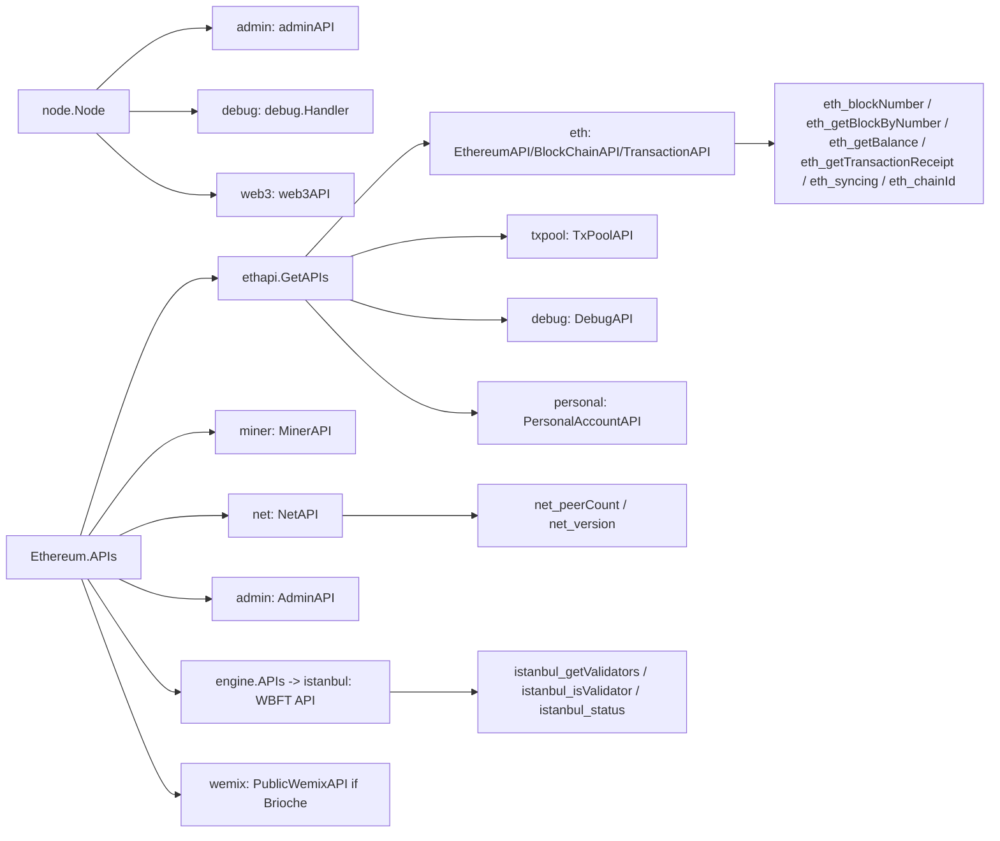
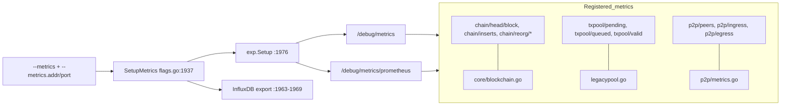

# gwemix RPC API + Metrics Graph

Source-level extraction for verifying chain behavior from the `gwemix` node (go-ethereum fork). All `path:line` refs are relative to the `chain/go-wbft` repo root.

---

## 1. RPC API Surface

### Registration sites
- **Node built-ins** (`admin`, `debug`, `web3`): `node.apis()` `node/api.go:34-48`.
- **Ethereum service APIs**: `(*Ethereum).APIs()` `eth/backend.go:328-365` — appends `ethapi.GetAPIs`, the consensus engine's APIs, an optional `wemix` namespace, and local `eth/miner/admin/debug/net` services.
- **Shared ethapi APIs** (`eth`, `txpool`, `debug`, `personal`): `ethapi.GetAPIs` `internal/ethapi/backend.go:102-128`.
- **Consensus engine API** (`istanbul`): `(*Backend).APIs` `consensus/wbft/backend/engine.go:251-259`. The active Croissant engine delegates to WBFT: `CroissantConsensus.APIs` → `we.wbft.APIs(chain)` `consensus/wemix/consensus.go:187-190`. (`WemixPoA.APIs` returns empty `consensus/wpoa/consensus.go:390-392`.)
- **Wemix namespace** (Wemix-specific): gated on `blockchain.Config().Brioche != nil`, `eth/backend.go:334-341`, service `NewPublicWemixAPI` `eth/api_wemix.go:49`.
- Engine selection: `CreateConsensusEngine` `eth/ethconfig/config.go:185-217` (Croissant/WBFT when `config.CroissantEnabled()`).
- Other namespaces present but not on the standard node path: `engine` (`eth/catalyst/api.go:48`), `dev` (`eth/catalyst/simulated_beacon.go:298`), `clique` (`consensus/clique/clique.go:725`, only if a Clique chain).

### Namespaces → backing service
| Namespace | Service (type) | Defined | Registered |
|---|---|---|---|
| `eth` | `EthereumAPI` (gas/sync) | `internal/ethapi/api.go` | `internal/ethapi/backend.go:106` |
| `eth` | `BlockChainAPI` (blocks/state) | `internal/ethapi/api.go:713+` | `internal/ethapi/backend.go:109` |
| `eth` | `TransactionAPI` (tx) | `internal/ethapi/api.go` | `internal/ethapi/backend.go:112` |
| `eth` | `EthereumAccountAPI` | `internal/ethapi/api.go` | `internal/ethapi/backend.go:121` |
| `eth` | `EthereumAPI` (mining) | `eth/api.go:35+` | `eth/backend.go:346` |
| `eth` | `DownloaderAPI` (sync sub) | `eth/downloader` | `eth/backend.go:352` |
| `txpool` | `TxPoolAPI` | `internal/ethapi/api.go:178+` | `internal/ethapi/backend.go:115` |
| `debug` | `DebugAPI` (ethapi) | `internal/ethapi/api.go` | `internal/ethapi/backend.go:118` |
| `debug` | `DebugAPI` (eth) | `eth/api_debug.go` | `eth/backend.go:358` |
| `debug` | tracer `API` | `eth/tracers/api.go` | `eth/tracers/api.go:992` |
| `debug` | `debug.Handler` (pprof) | `internal/debug` | `node/api.go:40` |
| `personal` | `PersonalAccountAPI` | `internal/ethapi/api.go:482+` | `internal/ethapi/backend.go:124` (gated by `--rpc.enabledeprecatedpersonal`) |
| `net` | `NetAPI` | `internal/ethapi/api.go:2375+` | `eth/backend.go:361` (built `eth/backend.go:296`) |
| `miner` | `MinerAPI` | `eth/api_miner.go:42+` | `eth/backend.go:349` |
| `admin` | `adminAPI` | `node/api.go:56+` | `node/api.go:37` |
| `admin` | `AdminAPI` (eth) | `eth/api_admin.go` | `eth/backend.go:355` |
| `web3` | `web3API` | `node/api.go:333+` | `node/api.go:43` |
| `istanbul` | `API` (WBFT) | `consensus/wbft/backend/api.go:37+` | `consensus/wbft/backend/engine.go:253` |
| `wemix` | `PublicWemixAPI` | `eth/api_wemix.go:29+` | `eth/backend.go:336` (if Brioche configured) |

### Verification-relevant methods (chainbench targets)
| RPC method | Service.Method | Location |
|---|---|---|
| `eth_chainId` | `BlockChainAPI.ChainId` | `internal/ethapi/api.go:713` |
| `eth_blockNumber` | `BlockChainAPI.BlockNumber` | `internal/ethapi/api.go:718` |
| `eth_getBalance` | `BlockChainAPI.GetBalance` | `internal/ethapi/api.go:726` |
| `eth_getBlockByNumber` | `BlockChainAPI.GetBlockByNumber` | `internal/ethapi/api.go:897` |
| `eth_getBlockByHash` | `BlockChainAPI.GetBlockByHash` | `internal/ethapi/api.go:914` |
| `eth_getHeaderByNumber` | `BlockChainAPI.GetHeaderByNumber` | `internal/ethapi/api.go:866` |
| `eth_getCode` | `BlockChainAPI.GetCode` | `internal/ethapi/api.go:971` |
| `eth_getStorageAt` | `BlockChainAPI.GetStorageAt` | `internal/ethapi/api.go:983` |
| `eth_getBlockReceipts` | `BlockChainAPI.GetBlockReceipts` | `internal/ethapi/api.go:997` |
| `eth_call` | `BlockChainAPI.Call` | `internal/ethapi/api.go:1228` |
| `eth_estimateGas` | `BlockChainAPI.EstimateGas` | `internal/ethapi/api.go:1286` |
| `eth_getTransactionByHash` | `TransactionAPI.GetTransactionByHash` | `internal/ethapi/api.go:1784` |
| `eth_getTransactionReceipt` | `TransactionAPI.GetTransactionReceipt` | `internal/ethapi/api.go:1821` |
| `eth_getTransactionCount` | `TransactionAPI.GetTransactionCount` | `internal/ethapi/api.go:1765` |
| `eth_sendTransaction` | `TransactionAPI.SendTransaction` | `internal/ethapi/api.go:1935` |
| `eth_gasPrice` | `EthereumAPI.GasPrice` | `internal/ethapi/api.go:72` |
| `eth_maxPriorityFeePerGas` | `EthereumAPI.MaxPriorityFeePerGas` | `internal/ethapi/api.go:84` |
| `eth_feeHistory` | `EthereumAPI.FeeHistory` | `internal/ethapi/api.go:100` |
| `eth_syncing` | `EthereumAPI.Syncing` | `internal/ethapi/api.go:134` |
| `eth_wemixInfo` (Wemix-specific) | `EthereumAPI.WemixInfo` | `internal/ethapi/api.go:163` |
| `eth_coinbase` | `EthereumAPI.Coinbase` (eth svc) | `eth/api.go:40` |
| `eth_mining` | `EthereumAPI.Mining` | `eth/api.go:50` |
| `eth_hashrate` | `EthereumAPI.Hashrate` | `eth/api.go:45` |
| `net_version` | `NetAPI.Version` | `internal/ethapi/api.go:2390` |
| `net_peerCount` | `NetAPI.PeerCount` | `internal/ethapi/api.go:2385` |
| `net_listening` | `NetAPI.Listening` | `internal/ethapi/api.go:2380` |
| `web3_clientVersion` | `web3API.ClientVersion` | `node/api.go:338` |
| `web3_sha3` | `web3API.Sha3` | `node/api.go:344` |
| `txpool_content` | `TxPoolAPI.Content` | `internal/ethapi/api.go:178` |
| `txpool_status` | `TxPoolAPI.Status` | `internal/ethapi/api.go:228` |
| `txpool_inspect` | `TxPoolAPI.Inspect` | `internal/ethapi/api.go:238` |
| `admin_peers` | `adminAPI.Peers` | `node/api.go:300` |
| `admin_nodeInfo` | `adminAPI.NodeInfo` | `node/api.go:310` |
| `admin_addPeer` | `adminAPI.AddPeer` | `node/api.go:57` |
| `miner_start` / `miner_stop` | `MinerAPI.Start` / `.Stop` | `eth/api_miner.go:42` / `:48` |
| `miner_setEtherbase` / `miner_setGasPrice` | `MinerAPI.SetEtherbase` / `.SetGasPrice` | `eth/api_miner.go:78` / `:61` |

### Consensus / validator query methods (Wemix / WBFT)
| RPC method | Method | Location |
|---|---|---|
| `istanbul_getValidators` | `API.GetValidators(number)` | `consensus/wbft/backend/api.go:132` |
| `istanbul_getValidatorsAtHash` | `API.GetValidatorsAtHash(hash)` | `consensus/wbft/backend/api.go:152` |
| `istanbul_isValidator` | `API.IsValidator(blockNum)` | `consensus/wbft/backend/api.go:347` |
| `istanbul_nodeAddress` | `API.NodeAddress()` | `consensus/wbft/backend/api.go:80` |
| `istanbul_getCommitSignersFromBlock` | `API.GetCommitSignersFromBlock(number)` | `consensus/wbft/backend/api.go:86` |
| `istanbul_getCommitSignersFromBlockByHash` | `API.GetCommitSignersFromBlockByHash(hash)` | `consensus/wbft/backend/api.go:103` |
| `istanbul_status` | `API.Status(start,end)` | `consensus/wbft/backend/api.go:165` |
| `istanbul_getWbftExtraInfo` | `API.GetWbftExtraInfo(number)` | `consensus/wbft/backend/api.go:417` |
| `wemix_briocheConfig` | `PublicWemixAPI.BriocheConfig()` | `eth/api_wemix.go:53` |
| `wemix_halvingSchedule` | `PublicWemixAPI.HalvingSchedule()` | `eth/api_wemix.go:65` |
| `wemix_getBriocheBlockReward` | `PublicWemixAPI.GetBriocheBlockReward(blockNumber)` | `eth/api_wemix.go:95` |

> Note: two distinct `EthereumAPI` types both register under the `eth` namespace — `internal/ethapi` (gas/sync/blocks/tx) and `eth/api.go` (mining/coinbase). JSON-RPC merges their exported methods under `eth_*`.

---

## 2. Metrics Surface

### Exposure
- Stand-alone metrics HTTP server: `SetupMetrics` `cmd/utils/flags.go:1937` → `exp.Setup(address)` `:1976` when `--metrics.addr` is set (host+`--metrics.port`).
- Handlers mounted: `/debug/metrics` (expvar-style) and `/debug/metrics/prometheus` (Prometheus) — `metrics/exp/exp.go:47-48` and `:61-62`.
- Also hooked onto the pprof server on `/debug/metrics` when pprof is enabled: `StartPProf` → `exp.Exp` `internal/debug/flags.go:308-313`.
- InfluxDB push export (v1/v2): `SetupMetrics` `cmd/utils/flags.go:1963-1969`.
- Master switch: `metrics.Enable()` only if `--metrics` set (`cfg.Metrics.Enabled`) `cmd/utils/flags.go:1938-1942`.

### Key metric names (verification-relevant)
| Metric | Meaning | Location |
|---|---|---|
| `chain/head/block` | Current head block number (gauge) | `core/blockchain.go:57` |
| `chain/head/header` | Current head header number | `core/blockchain.go:58` |
| `chain/head/receipt` | Head fast/snap block | `core/blockchain.go:59` |
| `chain/head/finalized` | Finalized block | `core/blockchain.go:60` |
| `chain/head/safe` | Safe block | `core/blockchain.go:61` |
| `chain/info` | Chain info (gauge-info) | `core/blockchain.go:63` |
| `chain/inserts` | Block insert time (timer) | `core/blockchain.go:81` |
| `chain/validation` | Block validation time | `core/blockchain.go:82` |
| `chain/execution` | Block execution time | `core/blockchain.go:83` |
| `chain/write` | Block write time | `core/blockchain.go:84` |
| `chain/reorg/executes` | Reorg count (meter) | `core/blockchain.go:86` |
| `chain/reorg/add` / `chain/reorg/drop` | Reorg blocks added/dropped | `core/blockchain.go:87-88` |
| `txpool/pending` | Pending tx count (gauge) | `core/txpool/legacypool/legacypool.go:115` |
| `txpool/queued` | Queued tx count (gauge) | `core/txpool/legacypool/legacypool.go:116` |
| `txpool/local` | Local tx count | `core/txpool/legacypool/legacypool.go:117` |
| `txpool/valid` / `txpool/invalid` | Valid/invalid tx (meter) | `core/txpool/legacypool/legacypool.go:101-102` |
| `txpool/known` | Known (dedup) tx | `core/txpool/legacypool/legacypool.go:100` |
| `txpool/underpriced` / `txpool/overflowed` | Rejected tx | `core/txpool/legacypool/legacypool.go:103-104` |
| `txpool/reorgtime` | Pool reorg time (timer) | `core/txpool/legacypool/legacypool.go:110` |
| `p2p/peers` | Active peer count (gauge) | `p2p/metrics.go:40` |
| `p2p/ingress` / `p2p/egress` | Traffic meters | `p2p/metrics.go:42-43` |
| `p2p/dials` / `p2p/dials/success` | Dial attempts/success | `p2p/metrics.go:48-49` |
| `p2p/serves` / `p2p/serves/success` | Inbound serves | `p2p/metrics.go:46-47` |

---

## Gaps / Notes
- No dedicated `--chainid` flag; chain id is genesis-driven (`eth_chainId`). `--networkid` sets devp2p network id only.
- `personal` namespace is deprecated and only enabled via `--rpc.enabledeprecatedpersonal` (`node.Config.EnablePersonal`, `cmd/utils/flags.go:1383-1385`).
- Wemix-specific surfaces: `wemix_*` (Brioche halving/reward) and `istanbul_*` (WBFT validators/commit signers/status) — the primary consensus/validator verification hooks. `clique_*` and `engine_*` exist in the fork but are not registered on the standard Croissant/WBFT node path.
