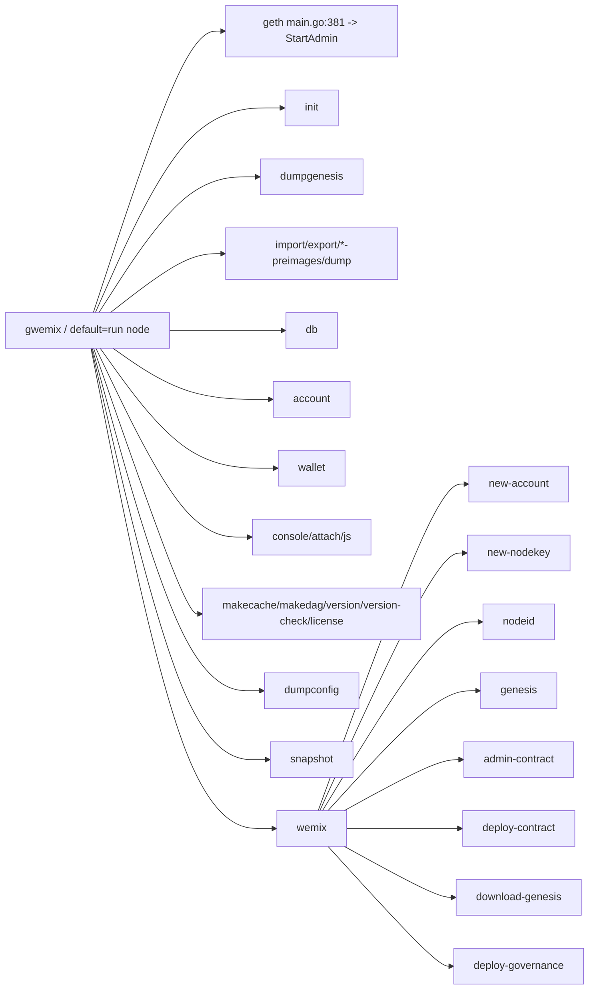
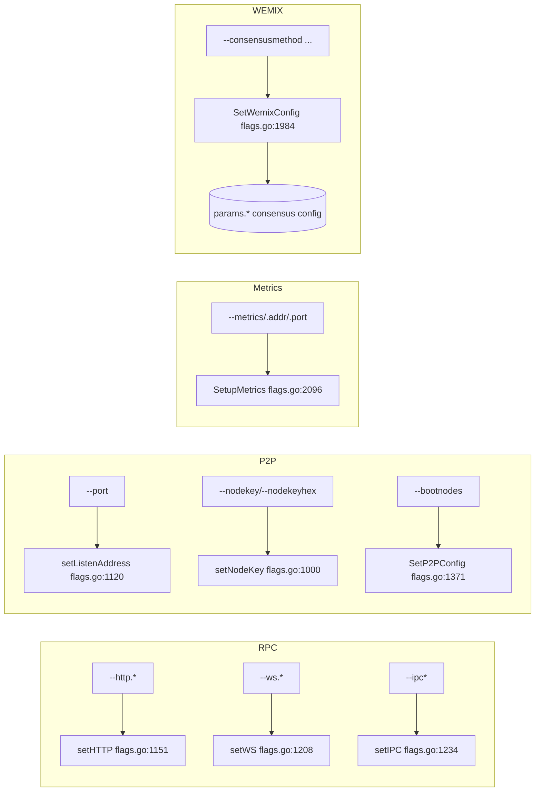
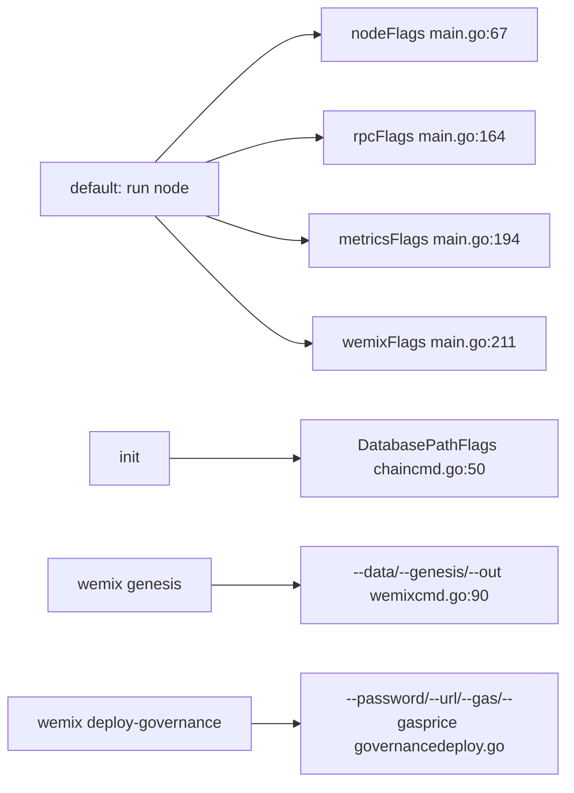

# gwemix — CLI Subcommand + Flag Graph

Source: `github.com/ethereum/go-ethereum` WEMIX fork. Binary built from `cmd/gwemix`.
All `path:line` references are **relative to the repo root** `chain/go-wemix/`.

- CLI library: `gopkg.in/urfave/cli.v1` v1.20.0 (OLD urfave). Commands are `cli.Command`, flags `cli.StringFlag/IntFlag/...`, accessors `ctx.GlobalString/GlobalIsSet` (global) and `ctx.String` (command-local).
- App bootstrap: `cmd/gwemix/main.go:65` (`app`), `init()` `cmd/gwemix/main.go:234`, `app.Commands` `cmd/gwemix/main.go:239`, default action `app.Action = geth` `cmd/gwemix/main.go:236` → `geth()` `cmd/gwemix/main.go:381`.
- `app.Before` sets up logging + debug `cmd/gwemix/main.go:281`; `logrota` `cmd/gwemix/wemixcmd.go:710`.

---

## 1. Command / Subcommand Tree

Default action (no subcommand) = **run a node**: `geth` `cmd/gwemix/main.go:381` → `makeFullNode` `cmd/gwemix/config.go:158` → `startNode` `cmd/gwemix/main.go:398` → `wemix.StartAdmin` `cmd/gwemix/main.go:403`.

### Top-level commands (registered `cmd/gwemix/main.go:239-271`)

| Command | Purpose | Defined | Action fn |
|---|---|---|---|
| `init` | Bootstrap+init a genesis block | `cmd/gwemix/chaincmd.go:45` | `initGenesis` `cmd/gwemix/chaincmd.go:175` |
| `dumpgenesis` | Dump genesis JSON to stdout | `cmd/gwemix/chaincmd.go:59` | `dumpGenesis` `cmd/gwemix/chaincmd.go:209` |
| `import` | Import a blockchain file | `cmd/gwemix/chaincmd.go:69` | `importChain` `cmd/gwemix/chaincmd.go:227` |
| `export` | Export blockchain into file | `cmd/gwemix/chaincmd.go:105` | `exportChain` |
| `import-preimages` | Import preimage DB (deprecated) | `cmd/gwemix/chaincmd.go:122` | `importPreimages` |
| `export-preimages` | Export preimage DB (deprecated) | `cmd/gwemix/chaincmd.go:137` | `exportPreimages` |
| `dump` | Dump state for a block | `cmd/gwemix/chaincmd.go:152` | `dump` |
| `removedb` | Remove blockchain + state DBs | `cmd/gwemix/dbcmd.go:47` | `removeDB` `cmd/gwemix/dbcmd.go:48` |
| `db` | Low-level DB ops (parent) | `cmd/gwemix/dbcmd.go:57` | — (subcommands) |
| `account` | Manage accounts (parent) | `cmd/gwemix/accountcmd.go:67` | — (subcommands) |
| `wallet` | Import Ethereum presale wallets (parent) | `cmd/gwemix/accountcmd.go:32` | — (subcommands) |
| `console` | Interactive JS console (starts node) | `cmd/gwemix/consolecmd.go:35` | `localConsole` `cmd/gwemix/consolecmd.go:36` |
| `attach` | JS console to running node | `cmd/gwemix/consolecmd.go:47` | `remoteConsole` `cmd/gwemix/consolecmd.go:48` |
| `js` | Execute JS files (ephemeral) | `cmd/gwemix/consolecmd.go:61` | `ephemeralConsole` `cmd/gwemix/consolecmd.go:62` |
| `makecache` | Generate ethash verification cache | `cmd/gwemix/misccmd.go:45` | `makecache` `cmd/gwemix/misccmd.go:46` |
| `makedag` | Generate ethash mining DAG | `cmd/gwemix/misccmd.go:58` | `makedag` `cmd/gwemix/misccmd.go:59` |
| `version` | Print version | `cmd/gwemix/misccmd.go:71` | `version` `cmd/gwemix/misccmd.go:72` |
| `version-check` | Check for known vulns | `cmd/gwemix/misccmd.go:81` | `versionCheck` `cmd/gwemix/misccmd.go:82` |
| `license` | Show license | `cmd/gwemix/misccmd.go:96` | `license` `cmd/gwemix/misccmd.go:97` |
| `dumpconfig` | Dump TOML config | `cmd/gwemix/config.go:46` | `dumpConfig` `cmd/gwemix/config.go:47` |
| `show-deprecated-flags` | List deprecated flags | `cmd/utils/flags_legacy.go` (`utils.ShowDeprecated`) | — |
| `snapshot` | State-snapshot ops (parent) | `cmd/gwemix/snapshot.go:49` | — (subcommands) |
| **`wemix`** | **WEMIX helper commands (parent)** | **`cmd/gwemix/wemixcmd.go:38`** | — (subcommands) |

Commands are sorted by name at `cmd/gwemix/main.go:272`.

### `wemix` subcommands (WEMIX-specific) — `cmd/gwemix/wemixcmd.go:46-169`

| Subcommand | Purpose | Action fn | Flags |
|---|---|---|---|
| `wemix new-account` | Create keystore account | `newAccount` `cmd/gwemix/wemixcmd.go:202` | `--password`, `--out` |
| `wemix new-nodekey` | Create a node key | `newNodeKey` `cmd/gwemix/wemixcmd.go:236` | `--out` |
| `wemix nodeid` | Print node id from node key (idv4/idv5) | `nodeKey2Id` `cmd/gwemix/wemixcmd.go:247` | — |
| `wemix genesis` | **Generate genesis file from template** | `genGenesis` `cmd/gwemix/wemixcmd.go:409` | `--data`, `--genesis`, `--out` |
| `wemix admin-contract` | Generate admin contract from template | `genAdminContract` `cmd/gwemix/wemixcmd.go:474` | `--data`, `--admin`, `--out` |
| `wemix deploy-contract` | Deploy a contract (.js/.json) | `deployContract` `cmd/gwemix/wemixcmd.go:581` | `--password`, `--url`, `--gas`, `--gasprice` |
| `wemix download-genesis` | Fetch genesis from a peer via `eth_genesis` | `downloadGenesis` `cmd/gwemix/wemixcmd.go:643` | `--url`, `--out` |
| `wemix deploy-governance` | **Deploy governance contracts** | `deployGovernanceContracts` `cmd/gwemix/governancedeploy.go:66` | `--password`, `--url`, `--gas`, `--gasprice` |

`wemix`-local flag definitions: `data/genesis/admin/out/gas/gasprice/url` `cmd/gwemix/wemixcmd.go:172-199`.

### `account` / `wallet` subcommands — `cmd/gwemix/accountcmd.go`

| Subcommand | Action fn |
|---|---|
| `account list` | `accountList` `cmd/gwemix/accountcmd.go:95` |
| `account new` | `accountCreate` `cmd/gwemix/accountcmd.go:106` |
| `account update` | `accountUpdate` `cmd/gwemix/accountcmd.go:131` |
| `account import` | `accountImport` `cmd/gwemix/accountcmd.go:160` |
| `wallet import` | `importWallet` `cmd/gwemix/accountcmd.go:49` |

### `db` subcommands — `cmd/gwemix/dbcmd.go:62-217`
`inspect` (`:80`), `check-state-content` (`:90`), `stats` (`:100`), `compact` (`:108`), `get` (`:121`), `delete` (`:131`), `put` (`:142`), `dumptrie` (`:153`), `freezer-index` (`:163`), `import` (`:173`), `export` (`:183`), `metadata` (`:193`), `freezer-migrate` (`:202`).

### `snapshot` subcommands — `cmd/gwemix/snapshot.go:54-140`
`prune-state` (`:56`), `verify-state` (`:81`), `check-dangling-storage` (`:95`), `traverse-state` (`:107`), `traverse-rawstate` (`:123`), `dump` (`:140`).

### Command tree (Mermaid)

---

## 2. Launch-relevant Flags → Feature/Config

Flag groups assembled in `cmd/gwemix/main.go`: `nodeFlags` (`:67`), `rpcFlags` (`:164`), `metricsFlags` (`:194`), `wemixFlags` (`:211`). Definitions live in `cmd/utils/flags.go`.

### Data / identity / network

| Flag (CLI) | Defined | Consumed | Drives |
|---|---|---|---|
| `--datadir` | `cmd/utils/flags.go:113` | `SetNodeConfig`/`SetP2PConfig`; also `main.go:288`, `main.go:403` (StartAdmin datadir) | node data dir |
| `--keystore` | `cmd/utils/flags.go:130` | `SetNodeConfig` `cmd/utils/flags.go:1445` | keystore dir |
| `--networkid` | `cmd/utils/flags.go:143` | `SetEthConfig` `cmd/utils/flags.go:1717`; presets `main.go:348` | eth network id |
| `--wemix-testnet` | `cmd/utils/flags.go:152` | `prepare` `cmd/gwemix/main.go:312`; `SetEthConfig` | WEMIX testnet preset |
| `--identity` | `cmd/utils/flags.go:189` | `SetNodeConfig` | node name |
| `--bootnodes` | `cmd/utils/flags.go:694` | `SetP2PConfig` `cmd/utils/flags.go:1371` | static bootnodes |

Chain id is not a distinct CLI flag; it derives from the genesis `config.chainId` (see §4). `--networkid` is the p2p/network id.

### HTTP / WS / IPC RPC

| Flag (CLI) | Defined | Consumed | Drives |
|---|---|---|---|
| `--http` | `cmd/utils/flags.go:588` | `setHTTP` `cmd/utils/flags.go:1151` | enable HTTP-RPC |
| `--http.addr` | `cmd/utils/flags.go:592` | `setHTTP` | HTTP listen addr |
| `--http.port` | `cmd/utils/flags.go:597` | `setHTTP` | HTTP port |
| `--http.corsdomain` | `cmd/utils/flags.go:602` | `setHTTP` | CORS allowlist |
| `--http.vhosts` | `cmd/utils/flags.go:607` | `setHTTP` | virtual hosts |
| `--http.api` | `cmd/utils/flags.go:612` | `setHTTP` | exposed namespaces |
| `--http.rpcprefix` | `cmd/utils/flags.go` (name `http.rpcprefix`) | `setHTTP` | HTTP path prefix |
| `--ws` | `cmd/utils/flags.go:636` | `setWS` `cmd/utils/flags.go:1208` | enable WS-RPC |
| `--ws.addr` | `cmd/utils/flags.go:640` | `setWS` | WS listen addr |
| `--ws.port` | `cmd/utils/flags.go:645` | `setWS` | WS port |
| `--ws.api` | `cmd/utils/flags.go:650` | `setWS` | WS namespaces |
| `--ws.origins` | `cmd/utils/flags.go:655` | `setWS` | WS allowed origins |
| `--ipcdisable` | `cmd/utils/flags.go:580` | `setIPC` `cmd/utils/flags.go:1234` | disable IPC |
| `--ipcpath` | `cmd/utils/flags.go:584` | `setIPC` | IPC socket path |

### P2P / node key

| Flag (CLI) | Defined | Consumed | Drives |
|---|---|---|---|
| `--port` | `cmd/utils/flags.go:689` | `setListenAddress` `cmd/utils/flags.go:1120` | p2p listen port |
| `--nodekey` | `cmd/utils/flags.go:699` | `setNodeKey` `cmd/utils/flags.go:1000` | node private key file |
| `--nodekeyhex` | `cmd/utils/flags.go:703` | `setNodeKey` `cmd/utils/flags.go:1000` | node key (hex) |

### Accounts / mining

| Flag (CLI) | Defined | Consumed | Drives |
|---|---|---|---|
| `--unlock` | `cmd/utils/flags.go:508` | account unlock in `startNode` (`cmd/gwemix/main.go`) | unlock accounts |
| `--password` | `cmd/utils/flags.go:513` | `utils.MakePasswordList` / unlock | password file |
| `--mine` | `cmd/utils/flags.go:462` | `SetEthConfig` `cmd/utils/flags.go:1717` | enable mining/sealing |
| `--miner.threads` | `cmd/utils/flags.go` (name `miner.threads`) | `SetEthConfig` | miner threads |
| `--miner.etherbase` | `cmd/utils/flags.go:489` | `setEtherbase` `cmd/utils/flags.go:1333` | coinbase/etherbase |
| `--miner.extradata` | `cmd/utils/flags.go` (name `miner.extradata`) | `SetEthConfig` | block extradata |

### Metrics

| Flag (CLI) | Defined | Consumed | Drives |
|---|---|---|---|
| `--metrics` | `cmd/utils/flags.go:759` | `SetupMetrics` `cmd/utils/flags.go:2096`; global `metrics.Enabled` | enable metrics collection |
| `--metrics.expensive` | `cmd/utils/flags.go:763` | metrics init | expensive metrics |
| `--metrics.addr` | `cmd/utils/flags.go:772` | `SetupMetrics` `cmd/utils/flags.go:2147` | standalone metrics HTTP addr |
| `--metrics.port` | `cmd/utils/flags.go:777` | `SetupMetrics` `cmd/utils/flags.go:2148` | standalone metrics HTTP port |
| InfluxDB v1/v2 export flags | `cmd/utils/flags.go` | `SetupMetrics` `cmd/utils/flags.go:2101-2144` | push metrics to InfluxDB |

### WEMIX consensus flags → `params.*` (all consumed in `SetWemixConfig` `cmd/utils/flags.go:1984`)

| Flag (CLI) | Defined | Consumed | Drives |
|---|---|---|---|
| `--consensusmethod` (1=PoW,2=PoA,3=ETCD,4=PBFT; default 2) | `cmd/utils/flags.go:840` | `cmd/utils/flags.go:1985` | `params.ConsensusMethod` |
| `--fixeddifficulty` | `cmd/utils/flags.go:845` | `cmd/utils/flags.go:1990` | `params.FixedDifficulty` |
| `--fixedgaslimit` | `cmd/utils/flags.go:850` | `cmd/utils/flags.go:1993` | `params.FixedGasLimit` |
| `--maxidleblockinterval` | `cmd/utils/flags.go:855` | `cmd/utils/flags.go:1996` | `params.MaxIdleBlockInterval` |
| `--blocksperturn` | `cmd/utils/flags.go:860` | `cmd/utils/flags.go:1999` | `params.BlocksPerTurn` (PoA) |
| `--noncelimit` | `cmd/utils/flags.go:865` | `cmd/utils/flags.go:2002` | `params.NonceLimit` |
| `--userocksdb` (0=LevelDB,1=RocksDB) | `cmd/utils/flags.go:870` | `cmd/utils/flags.go:2005` | `params.UseRocksDb` |
| `--prefetchcount` | `cmd/utils/flags.go:875` | (see params default) | `params.PrefetchCount` |
| `--log` (`<file>,<count>,<size>`) | `cmd/utils/flags.go:880` | `logrota` `cmd/gwemix/wemixcmd.go:710` | rotating log file |
| `--maxtxsperblock` | `cmd/utils/flags.go:885` | `cmd/utils/flags.go:2008` | `params.MaxTxsPerBlock` |
| `--hub` | `cmd/utils/flags.go:890` | `cmd/utils/flags.go:2011` | `params.Hub` (message hub id) |
| `--wemix.block.interval` | `cmd/utils/flags.go:895` | `cmd/utils/flags.go:2014` | `params.BlockInterval` |
| `--wemix.block.timeadjblocks` | `cmd/utils/flags.go:900` | `cmd/utils/flags.go:2017` | `params.BlockTimeAdjBlocks` |
| `--wemix.block.minbuildtime` | `cmd/utils/flags.go:905` | `cmd/utils/flags.go:2020` | `params.BlockMinBuildTime` |
| `--wemix.block.minbuildtxs` | `cmd/utils/flags.go:910` | `cmd/utils/flags.go:2023` | `params.BlockMinBuildTxs` |
| `--wemix.block.trailtime` | `cmd/utils/flags.go:915` | `cmd/utils/flags.go:2026` | `params.BlockTrailTime` |
| `--wemix.publicrequests.cache` | `cmd/utils/flags.go:920` | `cmd/utils/flags.go:2029` | `params.PublicRequestsCacheLocation` |
| `--wemix.publicrequests.max` | `cmd/utils/flags.go:925` | `cmd/utils/flags.go:2032` | `params.MaxPublicRequests` |
| `--wemix.bootnodecount` | `cmd/utils/flags.go:930` | `cmd/utils/flags.go:1039` | `params.BootnodeCount` |

Consensus fallback: invalid → PoW; validity check at `cmd/utils/flags.go:2036-2039`.

### Flag-group → feature (Mermaid)

---

## 3. Command → Flag wiring (Mermaid)

---

## 4. init / genesis handling (WEMIX-specific)

WEMIX **generates** its genesis from a template via the binary, then a node **decodes bootnode info from `extraData`** at startup. Two distinct paths:

### (a) `gwemix wemix genesis` — template → genesis JSON
`genGenesis` `cmd/gwemix/wemixcmd.go:409`:
1. Loads genesis **template** from `--genesis` (`cmd/gwemix/wemixcmd.go:413`).
2. Loads `--data` (or stdin) into `genesisConfig` via `loadGenesisConfig` `cmd/gwemix/wemixcmd.go:284`. Config validates ≥1 account and ≥1 member, node ids are 64-byte hex, and **exactly one member has `bootnode: true`** (`cmd/gwemix/wemixcmd.go:296-312`).
3. Chooses the bootnode member; sets `coinbase = bootnode account` (`:455`).
4. **Encodes `extraData`** as `hexutil.Encode([]byte(fmt.Sprintf("%s\n%s", config.ExtraData, bootnode)))` — i.e. `<extra text>\n<bootnode node-id>` (`cmd/gwemix/wemixcmd.go:456`).
5. Builds `alloc` from accounts (`:458-464`), marshals genesis JSON to `--out`/stdout.

Genesis env/governance parameters modeled by `genesisEnvConfig` `cmd/gwemix/wemixcmd.go:317` → `ToInitData()` → `gov.InitEnvStorage` `cmd/gwemix/wemixcmd.go:334` (BLOCKS_PER, BLOCK_CREATION_TIME, BLOCK_REWARD_AMOUNT, reward distribution split [producer/staking/ecosystem/maintenance], MAX_BASE_FEE, BLOCK_GASLIMIT, etc.). Members: `genesisMemberConfig` `cmd/gwemix/wemixcmd.go:365` → `gov.InitMember` (staker/voter/reward/enode/ip/port/deposit).

### (b) `gwemix wemix admin-contract` — template → Solidity admin contract
`genAdminContract` `cmd/gwemix/wemixcmd.go:474`: substitutes `tokens`, `address[N] _members`, `int[N] _stakes`, `Node[N] _nodes` arrays into a `.sol` template using the same `genesisConfig`.

### (c) `gwemix init <genesisPath>` — write genesis to DB
`initGenesis` `cmd/gwemix/chaincmd.go:175`: decodes JSON into `core.Genesis`, opens `chaindata` + `lightchaindata` databases and calls `core.SetupGenesisBlock` (`cmd/gwemix/chaincmd.go:200`). Destructive; expects genesis path as arg.

### (d) `gwemix dumpgenesis`
`dumpGenesis` `cmd/gwemix/chaincmd.go:209`: calls `utils.SetWemixConfig(ctx)` then `utils.MakeGenesis(ctx)` (falls back to `core.DefaultGenesisBlock`).

### (e) `gwemix wemix download-genesis`
`downloadGenesis` `cmd/gwemix/wemixcmd.go:643`: POSTs `{"method":"eth_genesis"}` to `--url` and writes `result` to `--out`. (`eth_genesis` = `PublicAccountAPI.Genesis()` `internal/ethapi/api.go:301`, eth namespace — see rpc doc.)

### (f) Runtime bootnode decode
At node start, `wemix.StartAdmin` `wemix/admin.go:527` (called from `cmd/gwemix/main.go:403`); `getGenesisInfo` `wemix/admin.go:184` parses the bootnode id out of the genesis block `extraData` (errors "invalid bootnode id in the genesis block" `wemix/admin.go:194,198`). This is the runtime counterpart of the `extraData` encoding in (a).

---

## 5. Governance / etcd tooling summary

- **Genesis-time governance**: `wemix genesis` / `wemix admin-contract` bake governance env + member/staking data into genesis and the admin contract (§4).
- **Runtime governance deploy**: `wemix deploy-governance` (`deployGovernanceContracts` `cmd/gwemix/governancedeploy.go:66`) deploys governance contracts to a live node (`config.js`, account file, lockAmount).
- **etcd (ConsensusETCD)**: selected via `--consensusmethod 3`; runtime etcd cluster mgmt is exposed over the **`admin` RPC namespace** (`admin_etcdInit`, `admin_etcdAddMember`, ...) — see `rpc-metrics-graph.md`. etcd implementation: `wemix/etcdutil.go`.

---

## 6. Complete flag inventory (all flags)

**Total: 195 CLI flags** defined across `cmd/utils/flags.go` (171), `internal/debug/flags.go` (12), `cmd/gwemix/wemixcmd.go` (7), `cmd/utils/flags_legacy.go` (2), `cmd/gwemix/misccmd.go` (2), `cmd/gwemix/config.go` (1).

This section is the **exhaustive** set and **supersedes** the launch-relevant subset in §2 (which is kept as-is for the run-node quick reference). Groups are inferred from the flag-slice membership in `cmd/gwemix/main.go` (`nodeFlags` `:67`, `rpcFlags` `:164`, `metricsFlags` `:194`, `wemixFlags` `:211`, `consoleFlags` `cmd/gwemix/consolecmd.go:33`, `debug.Flags` = `internal/debug/flags.go`) plus semantic domain. Usage strings are copied verbatim from source; `path:line` points at the flag var-definition line. Deprecated flags are marked.

Category counts: Ethereum/chain 23 · Data/identity 8 · Account/security 8 · P2P/Networking 12 · Light/LES 9 · Ethash/PoW 8 · TxPool 11 · Performance/Cache 11 · Miner 11 · VM-EVM/RPC-caps 5 · HTTP-RPC 7 · Auth-RPC (engine) 4 · GraphQL 3 · WS-RPC 6 · IPC 2 · GasPriceOracle 4 · Metrics 14 · Logging/Debug 12 · Console 3 · **WEMIX-consensus 19** · Version-check 2 · `wemix` subcommand-local 7 · State-dump 6.

### 6.1 Ethereum / chain selection & sync (23)

| Flag | Usage (verbatim) | file:line |
|---|---|---|
| `--networkid` | Explicitly set network id (integer, 1111=WemixMainnet , 1112=WemixTestnet)(For testnets: use --wemix-testnet --ropsten, --rinkeby, --goerli instead) | cmd/utils/flags.go:143 |
| `--mainnet` | Ethereum mainnet | cmd/utils/flags.go:148 |
| `--wemix-testnet` | Wemix test network: pre-configured wemix test network | cmd/utils/flags.go:152 |
| `--ropsten` | Ropsten network: pre-configured proof-of-work test network | cmd/utils/flags.go:156 |
| `--rinkeby` | Rinkeby network: pre-configured proof-of-authority test network | cmd/utils/flags.go:160 |
| `--goerli` | Görli network: pre-configured proof-of-authority test network | cmd/utils/flags.go:164 |
| `--sepolia` | Sepolia network: pre-configured proof-of-work test network | cmd/utils/flags.go:168 |
| `--kiln` | Kiln network: pre-configured proof-of-work to proof-of-stake test network | cmd/utils/flags.go:172 |
| `--dev` | Ephemeral proof-of-authority network with a pre-funded developer account, mining enabled | cmd/utils/flags.go:176 |
| `--dev.period` | Block period to use in developer mode (0 = mine only if transaction pending) | cmd/utils/flags.go:180 |
| `--dev.gaslimit` | Initial block gas limit | cmd/utils/flags.go:184 |
| `--exitwhensynced` | Exits after block synchronisation completes | cmd/utils/flags.go:198 |
| `--syncmode` | Blockchain sync mode ("snap", "full" or "light") | cmd/utils/flags.go:229 |
| `--gcmode` | Blockchain garbage collection mode ("full", "archive") | cmd/utils/flags.go:234 |
| `--snapshot` | Enables snapshot-database mode (default = enable) | cmd/utils/flags.go:239 |
| `--txlookuplimit` | Number of recent blocks to maintain transactions index for (default = about one year, 0 = entire chain) | cmd/utils/flags.go:243 |
| `--eth.requiredblocks` | Comma separated block number-to-hash mappings to require for peering (<number>=<hash>) | cmd/utils/flags.go:252 |
| `--whitelist` | Comma separated block number-to-hash mappings to enforce (<number>=<hash>) (deprecated in favor of --eth.requiredblocks) | cmd/utils/flags.go:256 |
| `--bloomfilter.size` | Megabytes of memory allocated to bloom-filter for pruning | cmd/utils/flags.go:260 |
| `--override.arrowglacier` | Manually specify Arrow Glacier fork-block, overriding the bundled setting | cmd/utils/flags.go:265 |
| `--override.terminaltotaldifficulty` | Manually specify TerminalTotalDifficulty, overriding the bundled setting | cmd/utils/flags.go:269 |
| `--fakepow` | Disables proof-of-work verification | cmd/utils/flags.go:571 |
| `--nocompaction` | Disables db compaction after import | cmd/utils/flags.go:575 |

### 6.2 Data directory / node identity (8)

| Flag | Usage (verbatim) | file:line |
|---|---|---|
| `--datadir` | Data directory for the databases and keystore | cmd/utils/flags.go:113 |
| `--remotedb` | URL for remote database | cmd/utils/flags.go:118 |
| `--datadir.ancient` | Data directory for ancient chain segments (default = inside chaindata) | cmd/utils/flags.go:122 |
| `--datadir.minfreedisk` | Minimum free disk space in MB, once reached triggers auto shut down (default = --cache.gc converted to MB, 0 = disabled) | cmd/utils/flags.go:126 |
| `--keystore` | Directory for the keystore (default = inside the datadir) | cmd/utils/flags.go:130 |
| `--identity` | Custom node name | cmd/utils/flags.go:189 |
| `--docroot` | Document Root for HTTPClient file scheme | cmd/utils/flags.go:193 |
| `--config` | TOML configuration file | cmd/gwemix/config.go:56 |

### 6.3 Account / key / security (8)

| Flag | Usage (verbatim) | file:line |
|---|---|---|
| `--usb` | Enable monitoring and management of USB hardware wallets | cmd/utils/flags.go:134 |
| `--nousb` | Disables monitoring for and managing USB hardware wallets (deprecated) | cmd/utils/flags_legacy.go:42 |
| `--pcscdpath` | Path to the smartcard daemon (pcscd) socket file | cmd/utils/flags.go:138 |
| `--unlock` | Comma separated list of accounts to unlock | cmd/utils/flags.go:508 |
| `--password` | Password file to use for non-interactive password input | cmd/utils/flags.go:513 |
| `--signer` | External signer (url or path to ipc file) | cmd/utils/flags.go:518 |
| `--lightkdf` | Reduce key-derivation RAM & CPU usage at some expense of KDF strength | cmd/utils/flags.go:248 |
| `--allow-insecure-unlock` | Allow insecure account unlocking when account-related RPCs are exposed by http | cmd/utils/flags.go:527 |

### 6.4 P2P / networking (12)

| Flag | Usage (verbatim) | file:line |
|---|---|---|
| `--bootnodes` | Comma separated enode URLs for P2P discovery bootstrap | cmd/utils/flags.go:694 |
| `--port` | Network listening port | cmd/utils/flags.go:689 |
| `--nodekey` | P2P node key file | cmd/utils/flags.go:699 |
| `--nodekeyhex` | P2P node key as hex (for testing) | cmd/utils/flags.go:703 |
| `--nat` | NAT port mapping mechanism (any\|none\|upnp\|pmp\|extip:<IP>) | cmd/utils/flags.go:707 |
| `--nodiscover` | Disables the peer discovery mechanism (manual peer addition) | cmd/utils/flags.go:712 |
| `--v5disc` | Enables the experimental RLPx V5 (Topic Discovery) mechanism | cmd/utils/flags.go:716 |
| `--netrestrict` | Restricts network communication to the given IP networks (CIDR masks) | cmd/utils/flags.go:720 |
| `--discovery.dns` | Sets DNS discovery entry points (use "" to disable DNS) | cmd/utils/flags.go:724 |
| `--maxpeers` | Maximum number of network peers (network disabled if set to 0) | cmd/utils/flags.go:679 |
| `--maxpendpeers` | Maximum number of pending connection attempts (defaults used if set to 0) | cmd/utils/flags.go:684 |
| `--ethstats` | Reporting URL of a ethstats service (nodename:secret@host:port) | cmd/utils/flags.go:567 |

### 6.5 Light client / LES (9)

| Flag | Usage (verbatim) | file:line |
|---|---|---|
| `--light.serve` | Maximum percentage of time allowed for serving LES requests (multi-threaded processing allows values over 100) | cmd/utils/flags.go:274 |
| `--light.ingress` | Incoming bandwidth limit for serving light clients (kilobytes/sec, 0 = unlimited) | cmd/utils/flags.go:279 |
| `--light.egress` | Outgoing bandwidth limit for serving light clients (kilobytes/sec, 0 = unlimited) | cmd/utils/flags.go:284 |
| `--light.maxpeers` | Maximum number of light clients to serve, or light servers to attach to | cmd/utils/flags.go:289 |
| `--ulc.servers` | List of trusted ultra-light servers | cmd/utils/flags.go:294 |
| `--ulc.fraction` | Minimum % of trusted ultra-light servers required to announce a new head | cmd/utils/flags.go:299 |
| `--ulc.onlyannounce` | Ultra light server sends announcements only | cmd/utils/flags.go:304 |
| `--light.nopruning` | Disable ancient light chain data pruning | cmd/utils/flags.go:308 |
| `--light.nosyncserve` | Enables serving light clients before syncing | cmd/utils/flags.go:312 |

### 6.6 Ethash / PoW (8)

| Flag | Usage (verbatim) | file:line |
|---|---|---|
| `--ethash.cachedir` | Directory to store the ethash verification caches (default = inside the datadir) | cmd/utils/flags.go:317 |
| `--ethash.cachesinmem` | Number of recent ethash caches to keep in memory (16MB each) | cmd/utils/flags.go:321 |
| `--ethash.cachesondisk` | Number of recent ethash caches to keep on disk (16MB each) | cmd/utils/flags.go:326 |
| `--ethash.cacheslockmmap` | Lock memory maps of recent ethash caches | cmd/utils/flags.go:331 |
| `--ethash.dagdir` | Directory to store the ethash mining DAGs | cmd/utils/flags.go:335 |
| `--ethash.dagsinmem` | Number of recent ethash mining DAGs to keep in memory (1+GB each) | cmd/utils/flags.go:340 |
| `--ethash.dagsondisk` | Number of recent ethash mining DAGs to keep on disk (1+GB each) | cmd/utils/flags.go:345 |
| `--ethash.dagslockmmap` | Lock memory maps for recent ethash mining DAGs | cmd/utils/flags.go:350 |

### 6.7 Transaction pool (11)

| Flag | Usage (verbatim) | file:line |
|---|---|---|
| `--txpool.locals` | Comma separated accounts to treat as locals (no flush, priority inclusion) | cmd/utils/flags.go:355 |
| `--txpool.nolocals` | Disables price exemptions for locally submitted transactions | cmd/utils/flags.go:359 |
| `--txpool.journal` | Disk journal for local transaction to survive node restarts | cmd/utils/flags.go:363 |
| `--txpool.rejournal` | Time interval to regenerate the local transaction journal | cmd/utils/flags.go:368 |
| `--txpool.pricelimit` | Minimum gas price limit to enforce for acceptance into the pool | cmd/utils/flags.go:373 |
| `--txpool.pricebump` | Price bump percentage to replace an already existing transaction | cmd/utils/flags.go:378 |
| `--txpool.accountslots` | Minimum number of executable transaction slots guaranteed per account | cmd/utils/flags.go:383 |
| `--txpool.globalslots` | Maximum number of executable transaction slots for all accounts | cmd/utils/flags.go:388 |
| `--txpool.accountqueue` | Maximum number of non-executable transaction slots permitted per account | cmd/utils/flags.go:393 |
| `--txpool.globalqueue` | Maximum number of non-executable transaction slots for all accounts | cmd/utils/flags.go:398 |
| `--txpool.lifetime` | Maximum amount of time non-executable transaction are queued | cmd/utils/flags.go:403 |

### 6.8 Performance / cache (11)

| Flag | Usage (verbatim) | file:line |
|---|---|---|
| `--cache` | Megabytes of memory allocated to internal caching (default = 4096 mainnet full node, 128 light mode) | cmd/utils/flags.go:409 |
| `--cache.database` | Percentage of cache memory allowance to use for database io | cmd/utils/flags.go:414 |
| `--cache.trie` | Percentage of cache memory allowance to use for trie caching (default = 15% full mode, 30% archive mode) | cmd/utils/flags.go:419 |
| `--cache.trie.journal` | Disk journal directory for trie cache to survive node restarts | cmd/utils/flags.go:424 |
| `--cache.trie.rejournal` | Time interval to regenerate the trie cache journal | cmd/utils/flags.go:429 |
| `--cache.gc` | Percentage of cache memory allowance to use for trie pruning (default = 25% full mode, 0% archive mode) | cmd/utils/flags.go:434 |
| `--cache.snapshot` | Percentage of cache memory allowance to use for snapshot caching (default = 10% full mode, 20% archive mode) | cmd/utils/flags.go:439 |
| `--cache.noprefetch` | Disable heuristic state prefetch during block import (less CPU and disk IO, more time waiting for data) | cmd/utils/flags.go:444 |
| `--cache.preimages` | Enable recording the SHA3/keccak preimages of trie keys | cmd/utils/flags.go:448 |
| `--cache.triesinmemory` | Number of block states (tries) to keep in memory (default = 128) | cmd/utils/flags.go:452 |
| `--fdlimit` | Raise the open file descriptor resource limit (default = system fd limit) | cmd/utils/flags.go:457 |

### 6.9 Miner (11)

| Flag | Usage (verbatim) | file:line |
|---|---|---|
| `--mine` | Enable mining | cmd/utils/flags.go:462 |
| `--miner.threads` | Number of CPU threads to use for mining | cmd/utils/flags.go:466 |
| `--miner.notify` | Comma separated HTTP URL list to notify of new work packages | cmd/utils/flags.go:471 |
| `--miner.notify.full` | Notify with pending block headers instead of work packages | cmd/utils/flags.go:475 |
| `--miner.gaslimit` | Target gas ceiling for mined blocks | cmd/utils/flags.go:479 |
| `--miner.gasprice` | Minimum gas price for mining a transaction | cmd/utils/flags.go:484 |
| `--miner.etherbase` | Public address for block mining rewards (default = first account) | cmd/utils/flags.go:489 |
| `--miner.extradata` | Block extra data set by the miner (default = client version) | cmd/utils/flags.go:494 |
| `--miner.recommit` | Time interval to recreate the block being mined | cmd/utils/flags.go:498 |
| `--miner.noverify` | Disable remote sealing verification | cmd/utils/flags.go:503 |
| `--miner.gastarget` | Target gas floor for mined blocks (deprecated) | cmd/utils/flags_legacy.go:47 |

### 6.10 VM / EVM & RPC caps (5)

| Flag | Usage (verbatim) | file:line |
|---|---|---|
| `--vmdebug` | Record information useful for VM and contract debugging | cmd/utils/flags.go:523 |
| `--rpc.gascap` | Sets a cap on gas that can be used in eth_call/estimateGas (0=infinite) | cmd/utils/flags.go:531 |
| `--rpc.evmtimeout` | Sets a timeout used for eth_call (0=infinite) | cmd/utils/flags.go:536 |
| `--rpc.txfeecap` | Sets a cap on transaction fee (in ether) that can be sent via the RPC APIs (0 = no cap) | cmd/utils/flags.go:541 |
| `--rpc.allow-unprotected-txs` | Allow for unprotected (non EIP155 signed) transactions to be submitted via RPC | cmd/utils/flags.go:673 |

### 6.11 HTTP-RPC (7)

| Flag | Usage (verbatim) | file:line |
|---|---|---|
| `--http` | Enable the HTTP-RPC server | cmd/utils/flags.go:588 |
| `--http.addr` | HTTP-RPC server listening interface | cmd/utils/flags.go:592 |
| `--http.port` | HTTP-RPC server listening port | cmd/utils/flags.go:597 |
| `--http.corsdomain` | Comma separated list of domains from which to accept cross origin requests (browser enforced) | cmd/utils/flags.go:602 |
| `--http.vhosts` | Comma separated list of virtual hostnames from which to accept requests (server enforced). Accepts '*' wildcard. | cmd/utils/flags.go:607 |
| `--http.api` | API's offered over the HTTP-RPC interface | cmd/utils/flags.go:612 |
| `--http.rpcprefix` | HTTP path path prefix on which JSON-RPC is served. Use '/' to serve on all paths. | cmd/utils/flags.go:617 |

### 6.12 Auth-RPC / engine API (4)

| Flag | Usage (verbatim) | file:line |
|---|---|---|
| `--authrpc.addr` | Listening address for authenticated APIs | cmd/utils/flags.go:547 |
| `--authrpc.port` | Listening port for authenticated APIs | cmd/utils/flags.go:552 |
| `--authrpc.vhosts` | Comma separated list of virtual hostnames from which to accept requests (server enforced). Accepts '*' wildcard. | cmd/utils/flags.go:557 |
| `--authrpc.jwtsecret` | Path to a JWT secret to use for authenticated RPC endpoints | cmd/utils/flags.go:562 |

### 6.13 GraphQL (3)

| Flag | Usage (verbatim) | file:line |
|---|---|---|
| `--graphql` | Enable GraphQL on the HTTP-RPC server. Note that GraphQL can only be started if an HTTP server is started as well. | cmd/utils/flags.go:622 |
| `--graphql.corsdomain` | Comma separated list of domains from which to accept cross origin requests (browser enforced) | cmd/utils/flags.go:626 |
| `--graphql.vhosts` | Comma separated list of virtual hostnames from which to accept requests (server enforced). Accepts '*' wildcard. | cmd/utils/flags.go:631 |

### 6.14 WS-RPC (6)

| Flag | Usage (verbatim) | file:line |
|---|---|---|
| `--ws` | Enable the WS-RPC server | cmd/utils/flags.go:636 |
| `--ws.addr` | WS-RPC server listening interface | cmd/utils/flags.go:640 |
| `--ws.port` | WS-RPC server listening port | cmd/utils/flags.go:645 |
| `--ws.api` | API's offered over the WS-RPC interface | cmd/utils/flags.go:650 |
| `--ws.origins` | Origins from which to accept websockets requests | cmd/utils/flags.go:655 |
| `--ws.rpcprefix` | HTTP path prefix on which JSON-RPC is served. Use '/' to serve on all paths. | cmd/utils/flags.go:660 |

### 6.15 IPC (2)

| Flag | Usage (verbatim) | file:line |
|---|---|---|
| `--ipcdisable` | Disable the IPC-RPC server | cmd/utils/flags.go:580 |
| `--ipcpath` | Filename for IPC socket/pipe within the datadir (explicit paths escape it) | cmd/utils/flags.go:584 |

### 6.16 Gas price oracle (4)

| Flag | Usage (verbatim) | file:line |
|---|---|---|
| `--gpo.blocks` | Number of recent blocks to check for gas prices | cmd/utils/flags.go:737 |
| `--gpo.percentile` | Suggested gas price is the given percentile of a set of recent transaction gas prices | cmd/utils/flags.go:742 |
| `--gpo.maxprice` | Maximum transaction priority fee (or gasprice before London fork) to be recommended by gpo | cmd/utils/flags.go:747 |
| `--gpo.ignoreprice` | Gas price below which gpo will ignore transactions | cmd/utils/flags.go:752 |

### 6.17 Metrics (14)

| Flag | Usage (verbatim) | file:line |
|---|---|---|
| `--metrics` | Enable metrics collection and reporting | cmd/utils/flags.go:759 |
| `--metrics.expensive` | Enable expensive metrics collection and reporting | cmd/utils/flags.go:763 |
| `--metrics.addr` | Enable stand-alone metrics HTTP server listening interface | cmd/utils/flags.go:772 |
| `--metrics.port` | Metrics HTTP server listening port | cmd/utils/flags.go:777 |
| `--metrics.influxdb` | Enable metrics export/push to an external InfluxDB database | cmd/utils/flags.go:782 |
| `--metrics.influxdb.endpoint` | InfluxDB API endpoint to report metrics to | cmd/utils/flags.go:786 |
| `--metrics.influxdb.database` | InfluxDB database name to push reported metrics to | cmd/utils/flags.go:791 |
| `--metrics.influxdb.username` | Username to authorize access to the database | cmd/utils/flags.go:796 |
| `--metrics.influxdb.password` | Password to authorize access to the database | cmd/utils/flags.go:801 |
| `--metrics.influxdb.tags` | Comma-separated InfluxDB tags (key/values) attached to all measurements | cmd/utils/flags.go:810 |
| `--metrics.influxdbv2` | Enable metrics export/push to an external InfluxDB v2 database | cmd/utils/flags.go:816 |
| `--metrics.influxdb.token` | Token to authorize access to the database (v2 only) | cmd/utils/flags.go:821 |
| `--metrics.influxdb.bucket` | InfluxDB bucket name to push reported metrics to (v2 only) | cmd/utils/flags.go:827 |
| `--metrics.influxdb.organization` | InfluxDB organization name (v2 only) | cmd/utils/flags.go:833 |

### 6.18 Logging / debug / pprof (12) — `internal/debug/flags.go`

| Flag | Usage (verbatim) | file:line |
|---|---|---|
| `--verbosity` | Logging verbosity: 0=silent, 1=error, 2=warn, 3=info, 4=debug, 5=detail | internal/debug/flags.go:36 |
| `--vmodule` | Per-module verbosity: comma-separated list of <pattern>=<level> (e.g. eth/*=5,p2p=4) | internal/debug/flags.go:41 |
| `--log.json` | Format logs with JSON | internal/debug/flags.go:46 |
| `--log.backtrace` | Request a stack trace at a specific logging statement (e.g. "block.go:271") | internal/debug/flags.go:50 |
| `--log.debug` | Prepends log messages with call-site location (file and line number) | internal/debug/flags.go:55 |
| `--pprof` | Enable the pprof HTTP server | internal/debug/flags.go:59 |
| `--pprof.port` | pprof HTTP server listening port | internal/debug/flags.go:63 |
| `--pprof.addr` | pprof HTTP server listening interface | internal/debug/flags.go:68 |
| `--pprof.memprofilerate` | Turn on memory profiling with the given rate | internal/debug/flags.go:73 |
| `--pprof.blockprofilerate` | Turn on block profiling with the given rate | internal/debug/flags.go:78 |
| `--pprof.cpuprofile` | Write CPU profile to the given file | internal/debug/flags.go:82 |
| `--trace` | Write execution trace to the given file | internal/debug/flags.go:86 |

### 6.19 Console / JS (3) — `consoleFlags` `cmd/gwemix/consolecmd.go:33`

| Flag | Usage (verbatim) | file:line |
|---|---|---|
| `--jspath` | JavaScript root path for `loadScript` | cmd/utils/flags.go:730 |
| `--exec` | Execute JavaScript statement | cmd/utils/flags.go:665 |
| `--preload` | Comma separated list of JavaScript files to preload into the console | cmd/utils/flags.go:669 |

### 6.20 WEMIX consensus (19) — `wemixFlags` `cmd/gwemix/main.go:211`; consumed in `SetWemixConfig` `cmd/utils/flags.go:1984`

| Flag | Usage (verbatim) | file:line |
|---|---|---|
| `--consensusmethod` | Wemix consensus method (integer, 1=PoW, 2=PoA, 3=ETCD, 4=PBFT) | cmd/utils/flags.go:840 |
| `--fixeddifficulty` | Fixed difficulty to disable PoW | cmd/utils/flags.go:845 |
| `--fixedgaslimit` | Fixed gas limit to control block size better | cmd/utils/flags.go:850 |
| `--maxidleblockinterval` | Interval to generate empty block | cmd/utils/flags.go:855 |
| `--blocksperturn` | Number of blocks per turn for PoA | cmd/utils/flags.go:860 |
| `--noncelimit` | Nonce limit for non-governing accounts | cmd/utils/flags.go:865 |
| `--userocksdb` | LevelDB (0) or RocksDB (1) | cmd/utils/flags.go:870 |
| `--prefetchcount` | Transaction prefetch count for faster db read | cmd/utils/flags.go:875 |
| `--log` | Rotating log file: <file-name>,<count>,<size> | cmd/utils/flags.go:880 |
| `--maxtxsperblock` | Max # of transactions in a block | cmd/utils/flags.go:885 |
| `--hub` | Id of message hub | cmd/utils/flags.go:890 |
| `--wemix.block.interval` | Block generation interval in seconds | cmd/utils/flags.go:895 |
| `--wemix.block.timeadjblocks` | Block interval to ajdust timestamp | cmd/utils/flags.go:900 |
| `--wemix.block.minbuildtime` | Minimum block generation time in ms | cmd/utils/flags.go:905 |
| `--wemix.block.minbuildtxs` | Minimum txs in a block with pending txs | cmd/utils/flags.go:910 |
| `--wemix.block.trailtime` | Time to leave for block data transfer in ms | cmd/utils/flags.go:915 |
| `--wemix.publicrequests.cache` | Public requests cache location | cmd/utils/flags.go:920 |
| `--wemix.publicrequests.max` | Max # of concurrent public requests | cmd/utils/flags.go:925 |
| `--wemix.bootnodecount` | Default bootnode peer count | cmd/utils/flags.go:930 |

### 6.21 Version-check command (2) — `cmd/gwemix/misccmd.go`

| Flag | Usage (verbatim) | file:line |
|---|---|---|
| `--check.url` | URL to use when checking vulnerabilities | cmd/gwemix/misccmd.go:33 |
| `--check.version` | Version to check | cmd/gwemix/misccmd.go:38 |

### 6.22 `wemix` subcommand-local (7) — `cmd/gwemix/wemixcmd.go`

Only bound to `wemix` subcommands (genesis/admin-contract/deploy-contract/deploy-governance/download-genesis/new-account/new-nodekey), not global.

| Flag | Usage (verbatim) | file:line |
|---|---|---|
| `--data` | data file | cmd/gwemix/wemixcmd.go:172 |
| `--genesis` | genesis template file | cmd/gwemix/wemixcmd.go:176 |
| `--admin` | admin contract template file | cmd/gwemix/wemixcmd.go:180 |
| `--out` | out file | cmd/gwemix/wemixcmd.go:184 |
| `--gas` | gas amount | cmd/gwemix/wemixcmd.go:188 |
| `--gasprice` | gas price | cmd/gwemix/wemixcmd.go:192 |
| `--url` | url of gwemix node | cmd/gwemix/wemixcmd.go:196 |

### 6.23 State-dump command flags (6) — bound to `dump` / `export-preimages`

| Flag | Usage (verbatim) | file:line |
|---|---|---|
| `--iterative` | Print streaming JSON iteratively, delimited by newlines | cmd/utils/flags.go:202 |
| `--nostorage` | Exclude storage entries (save db lookups) | cmd/utils/flags.go:206 |
| `--incompletes` | Include accounts for which we don't have the address (missing preimage) | cmd/utils/flags.go:210 |
| `--nocode` | Exclude contract code (save db lookups) | cmd/utils/flags.go:214 |
| `--start` | Start position. Either a hash or address | cmd/utils/flags.go:218 |
| `--limit` | Max number of elements (0 = no limit) | cmd/utils/flags.go:223 |
