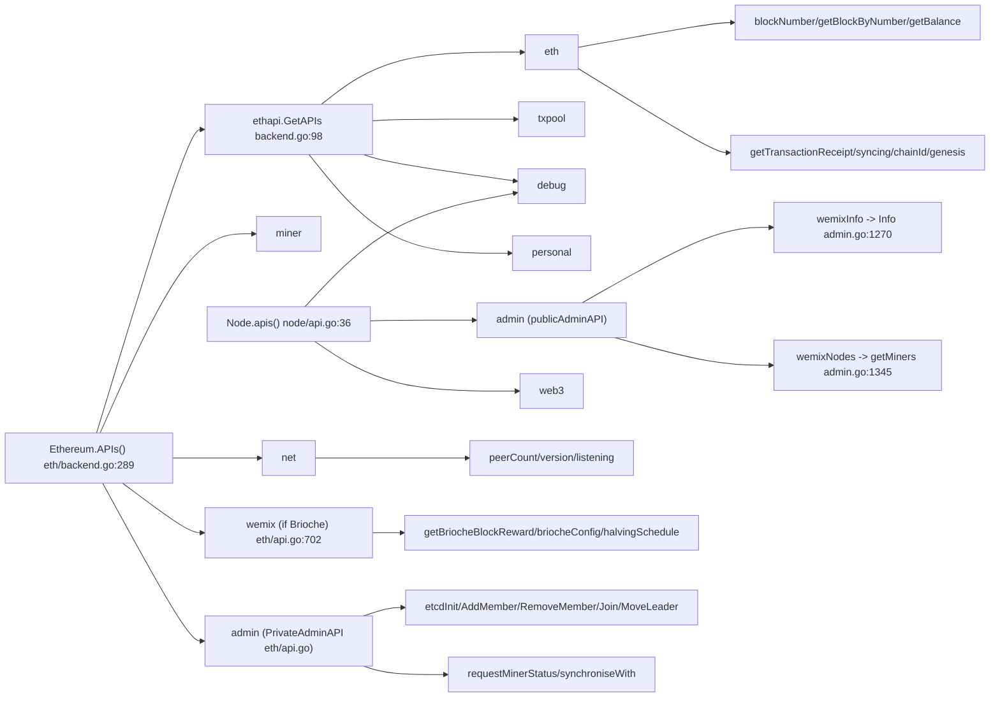
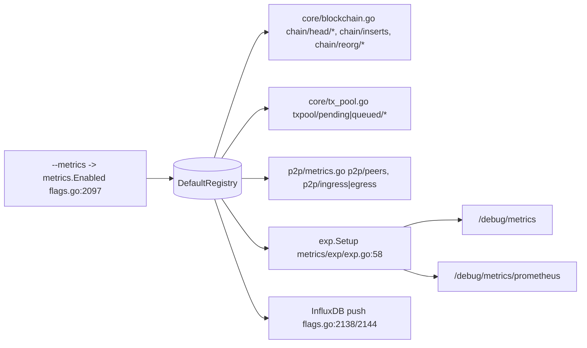

# gwemix — RPC API + Metrics Graph

For test-result verification (logs / RPC / metrics). All `path:line` references are **relative to the repo root** `chain/go-wemix/`.

---

## 1. RPC API surface

### Registration sites

| Registrar | File | Namespaces produced |
|---|---|---|
| `ethapi.GetAPIs(backend)` | `internal/ethapi/backend.go:98` | `eth`, `txpool`, `debug`, `personal` |
| `(*Ethereum).APIs()` | `eth/backend.go:289` | `wemix` (conditional), `eth`, `miner`, `admin`, `debug`, `net`, + engine APIs |
| `(*Node).apis()` | `node/api.go:36` | `admin`, `debug`, `web3` |
| Consensus engine `.APIs(chain)` | e.g. `consensus/clique/clique.go:692`, `consensus/ethash/ethash.go:675` | engine-dependent (`clique`/`ethash`) |

`Ethereum.APIs()` composition: `ethapi.GetAPIs` (`eth/backend.go:290`) + engine APIs (`:293`) + conditional `wemix` (`:295-302`, only when `blockchain.Config().Brioche != nil`) + local list (`:305-350`).

Node/RPC namespaces (`node/api.go`): `admin` publicAdminAPI `:38`, `admin` privateAdminAPI `:42`, `debug` `:47`, `web3` `:51`.

### Namespace → service → key methods

#### `eth` — block/tx/state queries (verification-critical)
Services registered `internal/ethapi/backend.go:100-135` + `eth/backend.go:307-329`.

| Method (RPC) | Go method | File |
|---|---|---|
| `eth_blockNumber` | `PublicBlockChainAPI.BlockNumber` | `internal/ethapi/api.go:738` |
| `eth_getBlockByNumber` | `PublicBlockChainAPI.GetBlockByNumber` | `internal/ethapi/api.go:950` |
| `eth_getBalance` | `PublicBlockChainAPI.GetBalance` | `internal/ethapi/api.go:843` |
| `eth_getTransactionReceipt` | `PublicTransactionPoolAPI.GetTransactionReceipt` | `internal/ethapi/api.go:1838` |
| `eth_getTransactionCount` | `PublicTransactionPoolAPI.GetTransactionCount` | `internal/ethapi/api.go:1779` |
| `eth_syncing` | `PublicEthereumAPI.Syncing` | `internal/ethapi/api.go:153` |
| `eth_gasPrice` | `PublicEthereumAPI.GasPrice` | `internal/ethapi/api.go:92` |
| `eth_chainId` | `PublicBlockChainAPI.ChainId` | `internal/ethapi/api.go` (PublicBlockChainAPI) |
| `eth_genesis` | `PublicAccountAPI.Genesis` | `internal/ethapi/api.go:301` (used by `wemix download-genesis`) |
| `eth_etherbase` / `eth_coinbase` | `PublicEthereumAPI.Etherbase` / `.Coinbase` | `eth/api.go:59` / `:64` |

#### `net`
Service `s.netRPCService` `eth/backend.go:345`.

| Method | Go method | File |
|---|---|---|
| `net_peerCount` | `PublicNetAPI.PeerCount` | `internal/ethapi/api.go:2304` |
| `net_listening` | `PublicNetAPI.Listening` | `internal/ethapi/api.go:2299` |
| `net_version` | `PublicNetAPI.Version` | `internal/ethapi/api.go:2309` |

#### `web3`
`node/api.go:51` → `publicWeb3API`: `web3_clientVersion` `node/api.go:357`, `web3_sha3` `node/api.go:363`.

#### `txpool`
`internal/ethapi/backend.go:117` → `PublicTxPoolAPI` (`content`/`status`/`inspect`).

#### `miner` / mining
`miner` namespace `eth/backend.go:322` → `NewPrivateMinerAPI(s)`. Public miner methods (hashrate/mining) via `NewPublicMinerAPI` in `eth` namespace `eth/backend.go:314`.

#### `debug`
`internal/ethapi/backend.go:122,127` + `eth/backend.go:336,341` + `node/api.go:47` (public + private debug APIs).

#### `personal`
`internal/ethapi/backend.go:136` → `NewPrivateAccountAPI` (account mgmt, `Public:false`).

#### `wemix` — Brioche reward query (WEMIX-specific, conditional)
Registered only if `Brioche` fork configured `eth/backend.go:295-302` → `NewPublicWemixAPI(s)` `eth/api.go:702`. JS bindings: `internal/web3ext/web3ext.go:1008` (`WemixJs`, property `wemix`).

| Method (RPC) | Go method | File |
|---|---|---|
| `wemix_getBriocheBlockReward` | `PublicWemixAPI.GetBriocheBlockReward` | `eth/api.go:748` |
| `wemix_briocheConfig` | `PublicWemixAPI.BriocheConfig` | `eth/api.go:706` |
| `wemix_halvingSchedule` | `PublicWemixAPI.HalvingSchedule` | `eth/api.go:718` |

> Note: the `wemix` namespace only exposes Brioche reward/halving info. **Validator/governance/miner status queries live in the `admin` namespace** (below) — this is the key finding for WEMIX verification.

#### `admin` — WEMIX validator/governance/etcd/miner-status (verification-critical)
Two services: `publicAdminAPI` (`node/api.go` — public) and `PrivateAdminAPI` (`eth/api.go` — private, registered `eth/backend.go:332`). JS bindings in `AdminJs` `internal/web3ext/web3ext.go:195-275`.

Public (`node/api.go`), backed by `wemix/api` + `wemix/admin.go`:

| Method (RPC) | Go method | File | Returns |
|---|---|---|---|
| `admin_wemixInfo` | `publicAdminAPI.WemixInfo` | `node/api.go:341` → `wemixapi.Info` = `Info()` `wemix/admin.go:1270` | consensus method, registry/gov/staking contract addrs, blocksPer, blockInterval, blockReward, gas params, self, **nodes**, **miners**, etcd info, maxIdle |
| `admin_wemixNodes` | `publicAdminAPI.WemixNodes(node,timeout)` | `node/api.go:347` → `wemixapi.GetMiners` = `getMiners()` `wemix/admin.go:1345` | array of `WemixMinerStatus` (miner up/down + latest block) |
| `admin_peers` / `admin_nodeInfo` / `admin_datadir` | `publicAdminAPI.Peers`/`NodeInfo`/`Datadir` | `node/api.go:308`/`:318`/`:336` | peer + node info |

`WemixMinerStatus` fields (`wemix/api/api.go:13`): `name, enode, id, addr, status(up/down), miner(bool), miningPeers, latestBlockHeight, latestBlockHash, latestBlockTd, rttMs` — directly usable for block-production/liveness verification. Built by `getMinerStatus` `wemix/admin.go:1309`.

Private (`eth/api.go`, `admin` namespace), WEMIX consensus/etcd control:

| Method (RPC) | Go method | File |
|---|---|---|
| `admin_requestMinerStatus` | `PrivateAdminAPI.RequestMinerStatus` | `eth/api.go:275` |
| `admin_synchroniseWith` | `PrivateAdminAPI.SynchroniseWith` | `eth/api.go:323` |
| `admin_requestEtcdAddMember` | `PrivateAdminAPI.RequestEtcdAddMember` | `eth/api.go:280` |
| `admin_etcdInit` | `PrivateAdminAPI.EtcdInit` | `eth/api.go:285` |
| `admin_etcdAddMember` | `PrivateAdminAPI.EtcdAddMember` | `eth/api.go:291` |
| `admin_etcdRemoveMember` | `PrivateAdminAPI.EtcdRemoveMember` | `eth/api.go:297` |
| `admin_etcdJoin` | `PrivateAdminAPI.EtcdJoin` | `eth/api.go:303` |
| `admin_etcdMoveLeader` | `PrivateAdminAPI.EtcdMoveLeader` | `eth/api.go:308` |
| `admin_etcdGetWork` | `PrivateAdminAPI.EtcdGetWork` | `eth/api.go:313` |
| `admin_etcdDeleteWork` | `PrivateAdminAPI.EtcdDeleteWork` | `eth/api.go:318` |
| `admin_importChain` / `admin_exportChain` | `PrivateAdminAPI.ImportChain`/`ExportChain` | `eth/api.go:226` / `:178` |
| `admin_startHTTP`/`stopHTTP`/`startWS`/`stopWS` | `privateAdminAPI.*` | `node/api.go:168`/`:229`/`:242`/`:294` |

etcd function pointers wired in `wemix/api/api.go:42-53`; implementations in `wemix/etcdutil.go`. Miner-node selection: `getMinerNodes` `wemix/admin.go:236`, `getWemixNodes` `wemix/admin.go:288`, reward params `getRewardParams` `wemix/admin.go:326`.

### RPC graph (Mermaid)

---

## 2. Metrics surface

**No WEMIX-specific metric registrations were found** (`grep metrics.NewRegistered*/GetOrRegister*` over `wemix/` = 0 hits). Metrics are stock go-ethereum metrics. For block-production/health verification, prefer the `admin_wemixNodes`/`admin_wemixInfo` RPC (§1) plus these standard metrics.

### Exposure

| Mechanism | File | Endpoint |
|---|---|---|
| Standalone metrics HTTP server | `metrics/exp/exp.go:58` (`Setup`), enabled from `SetupMetrics` `cmd/utils/flags.go:2147-2150` (`--metrics.addr`/`--metrics.port`) | `http://<addr>/debug/metrics` |
| Prometheus handler | `metrics/exp/exp.go:47,61` | `/debug/metrics/prometheus` |
| expvar (DefaultServeMux) | `metrics/exp/exp.go:46` (`Exp`) | `/debug/metrics`, `/debug/vars` |
| InfluxDB v1/v2 push | `cmd/utils/flags.go:2138,2144` | push to endpoint |
| Enable gate | `cmd/utils/flags.go:2097` (`metrics.Enabled`, from `--metrics`) | — |

### Key metrics (block-production + node-health)

Chain / block production — `core/blockchain.go`:

| Metric name | Type | File | Meaning |
|---|---|---|---|
| `chain/head/block` | Gauge | `core/blockchain.go:50` | current head block number (block production progress) |
| `chain/head/header` | Gauge | `core/blockchain.go:51` | head header number |
| `chain/head/receipt` | Gauge | `core/blockchain.go:52` | head fast-block/receipt number |
| `chain/head/finalized` | Gauge | `core/blockchain.go:53` | finalized block number |
| `chain/inserts` | Timer | `core/blockchain.go:69` | block insertion time |
| `chain/validation` | Timer | `core/blockchain.go:70` | block validation time |
| `chain/execution` | Timer | `core/blockchain.go:71` | block execution time |
| `chain/write` | Timer | `core/blockchain.go:72` | block write time |
| `chain/reorg/executes` | Meter | `core/blockchain.go:74` | chain reorg count (health) |
| `chain/reorg/add` / `chain/reorg/drop` | Meter | `core/blockchain.go:75,76` | blocks added/dropped in reorgs |

Txpool health — `core/tx_pool.go`:

| Metric name | File | Meaning |
|---|---|---|
| `txpool/pending/discard` / `.../replace` / `.../ratelimit` / `.../nofunds` | `core/tx_pool.go:102-105` | pending-queue drops |
| `txpool/queued/discard` / `.../eviction` / ... | `core/tx_pool.go:108-112` | queued-queue drops/evictions |
| `txpool/known` | `core/tx_pool.go:115` | known-tx meter |

P2P / node health — `p2p/metrics.go`:

| Metric name | File | Meaning |
|---|---|---|
| `p2p/peers` | `p2p/metrics.go:43` (Gauge) | active peer count (connectivity health) |
| `p2p/ingress` | `p2p/metrics.go:40` (Meter) | inbound traffic |
| `p2p/egress` | `p2p/metrics.go:42` (Meter) | outbound traffic |

Process metrics: `metrics.CollectProcessMetrics` (goroutine started in node run path / `chaincmd.go:230`).

### Metrics graph (Mermaid)

---

## Notes / gaps

- No dedicated consensus-engine RPC namespace (`istanbul`/`clique`) is WEMIX-active; WEMIX validator/governance state is served through the **`admin`** namespace and via `eth_call` to on-chain governance contracts (addresses returned by `admin_wemixInfo`).
- No `wemix/`-package-local metrics — block-production monitoring should combine `chain/head/block` metric with `admin_wemixNodes` (per-miner `latestBlockHeight`, `status`, `miner`).
