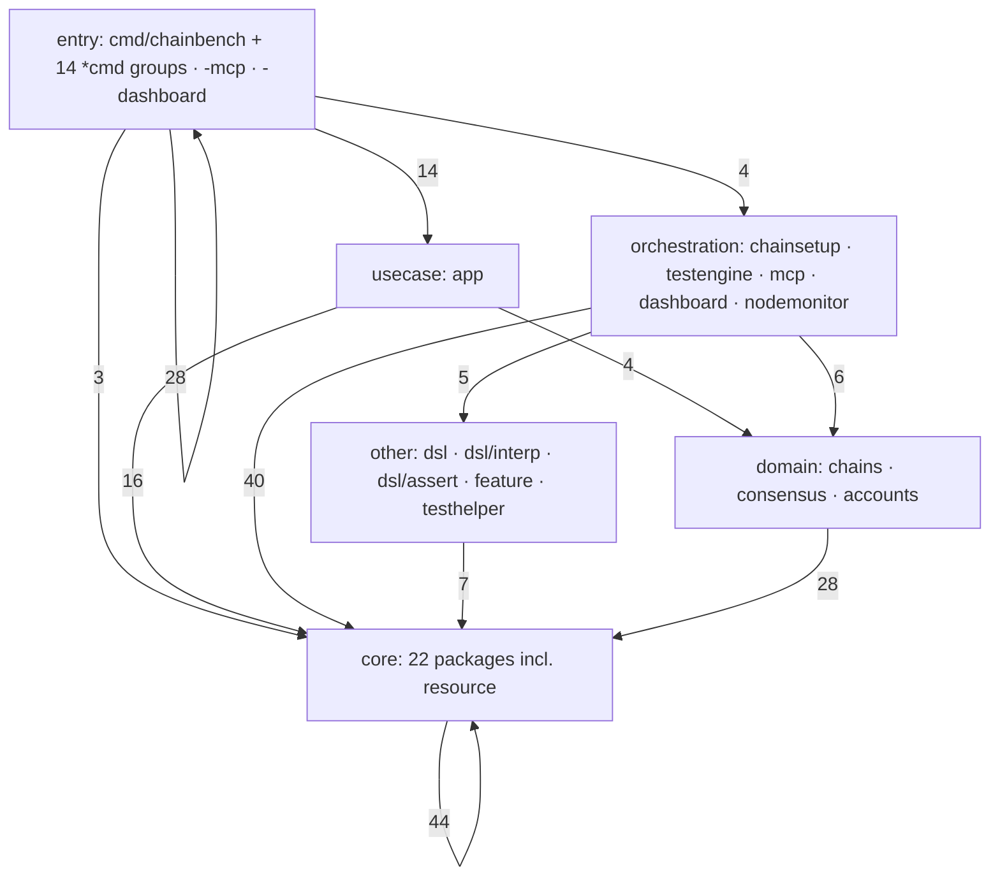
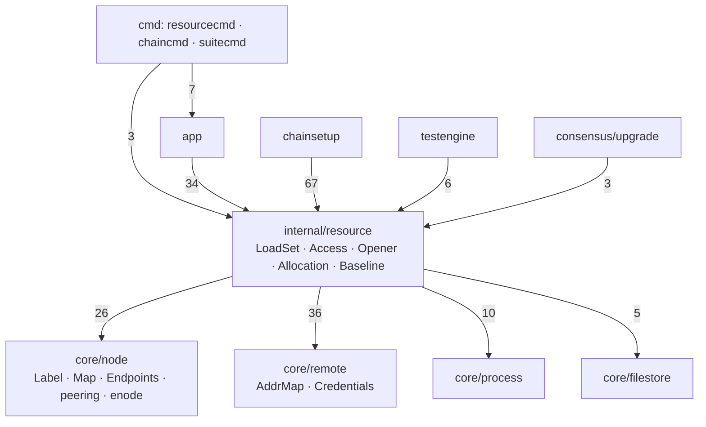

# Code graph — AST-measured package structure

> **측정 문서.** §2~§3 은 **2026-09-11 (main `3cf992db`)** 재측정이다. §4 는 완료된
> launchopt 리팩토링의 **[이력]** 이다. 측정은 다시 뽑으면 갱신되지만, 뽑지 않은
> 사이의 코드 변경은 반영되지 않는다 — 어긋나면 코드가 이긴다.
>
> Generated from `scripts/inventory/code-graph` (go/ast, no build required).
> Regenerate with `go run ./scripts/inventory/code-graph . > graph.json` after
> structural refactors; **do not hand-edit the numbers here.**
>
> 같은 수치 위에서 중복·패키지 문서·함수 크기까지 본 검토는
> [`code-health-review-2026-09-10.md`](code-health-review-2026-09-10.md) 에 있다.
> 호출(선택자) 그래프는 별도 도구다 — [`../codegraph/`](../codegraph/README.md).
>
> 측정 이력: 08-27 = 75/268 · 09-07 = 65/209 · 09-10 = 70/225 · 09-11 = 70/225.

## 1. Method

The tool parses every non-test `.go` file under `cmd/`, `internal/`, `scripts/`
and `tests/` and emits:

- **Nodes** — packages, with file/line counts, exported surface size, fan-in and
  fan-out (module-internal only).
- **Edges** — import relations annotated with the **exported symbols the
  importer actually references** (selector-expression count), so an edge shows
  *which part* of a package's surface is consumed, not just that it is imported.
- **Violations** — layering breaks against the coarse layer buckets in
  `layerOf` (the per-package placement is `layers.md` §3, which `internal/arch`
  enforces).

## 2. Measured shape — 2026-09-11 (70 packages, 225 edges, 51,151 lines)

`violations: null` — **zero layer breaks.**

| Layer | Packages | Lines | Outbound edges land in |
|---|---|---|---|
| core (`internal/core/*`, `resource`) | 22 | 17,217 | core 44 · domain 1 |
| orchestration (`chainsetup`, `testengine`, `mcp`, `dashboard`, `nodemonitor`) | 5 | 16,100 | core 40 · domain 6 · other 5 · orchestration 2 · usecase 1 |
| domain (`chains/*`, `consensus/*`, `accounts`) | 12 | 5,148 | core 28 · domain 12 |
| entry (`cmd/*`, incl. the 14 per-group `*cmd` packages) | 19 | 5,025 | entry 28 · usecase 14 · orchestration 4 · core 3 · domain 2 |
| other (`dsl/*`, `feature`, `testhelper`, `testsupport`) | 6 | 3,359 | core 7 · domain 1 · other 1 · usecase 1 |
| usecase (`app`) | 1 | 2,505 | core 16 · domain 4 · orchestration 2 · other 1 |
| tests (`tests/*`) | 2 | 1,007 | — |
| scripts (`scripts/inventory/*`) | 3 | 790 | tests 2 |

**표면은 app 을 지난다.** `cmd/chainbench/*` 의 최대 목적지는 `usecase`(14 엣지)이고,
`mcp -> app` 은 229 refs — MCP 가 app 을 우회하지 않는다는 규칙(architecture-v2 §2)이
그래프에 그대로 보인다. `internal/arch` 의 래칫 9개가 이것을 기계로 강제한다.

**Highest fan-in (the load-bearing contracts)**

| Package | in | out | lines |
|---|---:|---:|---:|
| `internal/core/node` | 18 | **0** | 1,102 |
| `internal/core/registry` | 17 | 1 | 650 |
| `internal/app` | 16 | 23 | 2,505 |
| `internal/core/filestore` | 12 | **0** | 196 |
| `internal/core/keyring` | 11 | 2 | 502 |
| `internal/core/keyring/store` | 10 | 4 | 1,294 |
| `cmd/chainbench/surface` | 9 | **0** | 36 |
| `internal/core/process` · `core/rpc` · `core/session` | 8 | 5 / **0** / 2 | 1,349 / 495 / 1,298 |

많이 의존되면서 아무것도 의존하지 않는 넷(`core/node`·`core/filestore`·`core/rpc`·
`cmd/chainbench/surface`)이 프리미티브 층이다.

**Highest fan-out (the assemblers):** `app` (23), `testengine` (23),
`chainsetup` (19), `cmd/chainbench` (17), `consensus/upgrade` (12).
`app` 은 in 16 / out 23 인 허브인데, 유스케이스 층이라 의도한 모양이다.

## 3. "노드가 어디서 도는가" — 한 소유자로 수렴했다

08-27 측정에서 이 질문에 답하던 패키지는 여섯이었다(`core/netmap`·`netmap`·
`netmap/internal/serverset`·`core/portplan`·`core/place`·`core/netreg`).
**그 여섯은 모두 없다.** R 트랙의 통폐합이 끝나 `internal/resource` 하나가 소유하고,
attached-network 레지스트리는 `core/session` 으로 흡수됐다.

| Package | Layer | Lines | Exported | in / out | What it answers |
|---|---|---:|---|---|---|
| `internal/resource` | core | 3,016 | 24f / 41t | 6 / 4 | 서버 세트·인벤토리·포트 슬롯·배치·풀·opener·localmap·workspace-config·baseline |
| `internal/core/node` | core | 1,102 | 12f / 17t | 18 / **0** | 노드 어휘: label · role · Map · placement · peering · enode · reservation |
| `internal/core/session` | core | 1,298 | 20f / 18t | 8 / 2 | 세션·아티팩트, 그리고 attached-network 레지스트리(옛 `core/netreg`) |
| `internal/core/blueprint` | core | 1,248 | 6f / 19t | 2 / 3 | 네트워크 선언 문서(N1) — 배치와 키를 한 장에 |

엣지가 이름보다 많이 말하는 것:

- **`resource` 는 `core/node` 의 어휘를 쓴다**(`Map`·`Label`·`Endpoints`, 26 refs).
  인벤토리가 배치 어휘에 의존하는 방향은 08-27 과 같고, architecture-v2 V2.4 가
  인벤토리를 그 모듈 *안에* 둔 결정이 지금 컴파일된 모양이다.
- **`chainsetup -> resource` 가 67 refs 로 가장 굵다.** 구성 단계가 자원 소유자를
  통해서만 서버·포트를 만진다는 뜻이고, 그것이 이 통폐합의 목적이었다.
- `resource` 는 3,016줄로 core 에서 가장 크다. 다음 통폐합 검토 대상이라면 여기다 —
  [`code-health-review-2026-09-10.md`](code-health-review-2026-09-10.md) §패키지 문서 참조.

## 4. Launch-argument assembly — 완료된 리팩토링 *(2026-08 이력)*

> **[이력] 이 절은 현재 상태를 말하지 않는다.** 여기 나오는 `internal/core/launchopt`·
> `internal/engine`·`internal/core/pipeline/setup`·`internal/chains/wemix/deploy` 는
> **모두 존재하지 않는다.** 실행 옵션 조립은 `internal/core/nodeconfig` 로 단일화됐다
> (`internal/core/nodeconfig/launchopt.go`). 그때의 설계 근거는
> [`../archive/chain-binary-flag-graph.md`](../archive/chain-binary-flag-graph.md) §3.3 이다.

그래프가 "실행 인자가 5곳에 흩어져 있다"는 주장(worklist T7.3/T7.4)을 정확한 지점으로
고정했던 기록이다.

| # | Site | What it contributed |
|---|---|---|
| 1 | `core/nodeconfig.LaunchArgs` | `--datadir --config --port --http --http.port --ws --ws.port` |
| 2 | `engine/launcher.go armSpecs` | identity: `--nodekey --unlock --password --miner.etherbase` |
| 3 | `consensus/{poa,wbft}.StartFlags` | family/role: `--mine --allow-insecure-unlock --rpc.*` |
| 4 | `consensus/upgrade.LaunchArgs` | handoff variant: adds `--http.addr --authrpc.port --networkid` |
| 5 | `chainsetup extraArgs` | handoff account/namespace: `--nat --http.api --unlock ...` |

**Gate note (그때의 결론, 지금도 유효한 교훈).** "byte-identical" 게이트는 구조적으로
만족 불가였다 — 레거시 argv 는 Identity 와 Mining 플래그를 두 번 교차로 낸다
(`--allow-insecure-unlock … --mine … --nodekey --unlock`). 실제로 쓴 게이트는 레거시
조립에 대한 **flag-pair equality** 와 정규 순서 스냅샷이다. geth 계열의 플래그 파싱은
위치 독립이므로 pair equality 가 의미상의 계약이다.
