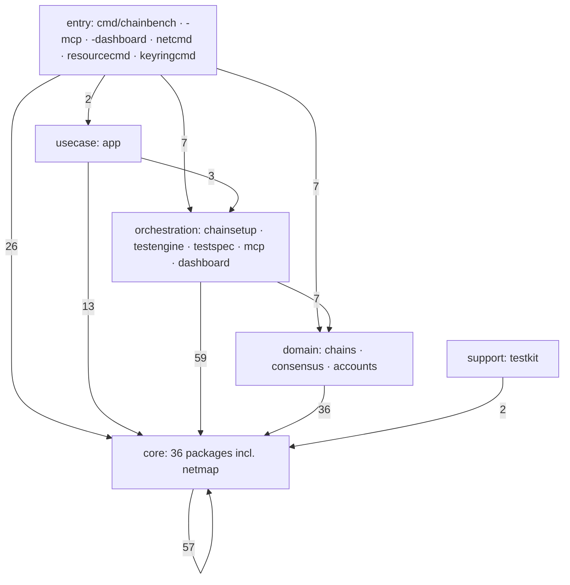
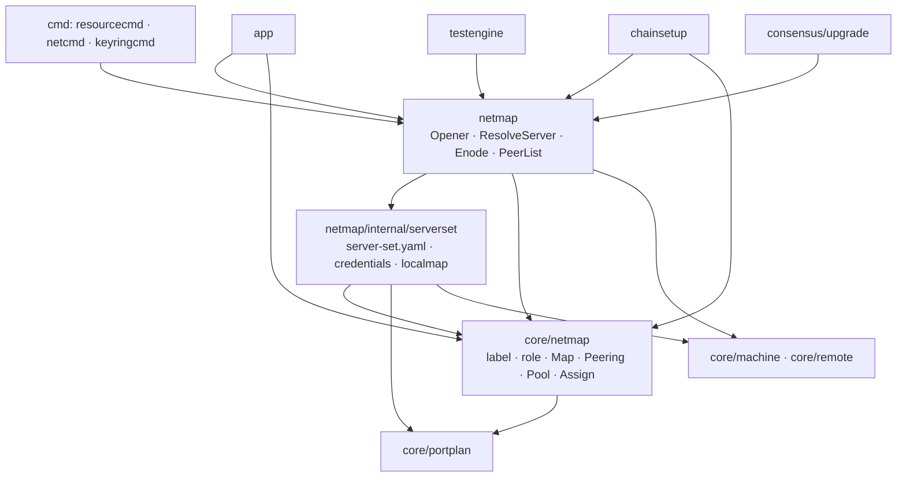

# Code graph — AST-measured package structure

> **측정 문서.** §2~§3 은 **2026-08-27 (main `a63b500`)** 실측이고, §4~§5 는
> 2026-08 launchopt 브랜치의 **[이력]** 이다. 측정은 다시 뽑으면 갱신되지만, 뽑지
> 않은 사이의 코드 변경은 반영되지 않는다 — 어긋나면 코드가 이긴다.
>
> Generated from `scripts/inventory/code-graph` (go/ast, no build required).
> Regenerate with `go run ./scripts/inventory/code-graph . > graph.json` after
> structural refactors; do not hand-edit the numbers here.

## 1. Method

The tool parses every non-test `.go` file under `cmd/`, `internal/`, `scripts/`
and `tests/` and emits:

- **Nodes** — packages, with file/line counts, exported surface size, fan-in and
  fan-out (module-internal only).
- **Edges** — import relations annotated with the **exported symbols the
  importer actually references** (selector-expression count), so an edge shows
  *which part* of a package's surface is consumed, not just that it is imported.
- **Violations** — layering breaks against the coarse layer buckets in
  `layerOf` (the per-package placement is `layers.md` §3, which `internal/arch`
  enforces).

## 2. Measured shape — 2026-08-27 (75 packages, 268 edges, 46.6k lines)

| Layer | Packages | Lines | Outbound edges land in |
|---|---|---|---|
| entry (`cmd/*`) | 7 | 5,301 | core 26 · orchestration 7 · domain 7 · entry 6 · usecase 2 · tests 2 |
| usecase (`app`) | 1 | 1,270 | core 13 · orchestration 3 · domain 1 |
| orchestration (`chainsetup`, `testengine`, `testspec`, `mcp`, `dashboard`) | 6 | 14,353 | core 59 · domain 7 · orchestration 4 · usecase 1 · support 1 |
| domain (`chains/*`, `consensus/*`, `accounts`) | 13 | 4,286 | core 36 · domain 12 |
| core (`internal/core/*`, `netmap`) | 36 | 13,324 | core 57 · domain 1 · support 1 |
| support (`testkit`) | 1 | 365 | core 2 |

**Layering holds.** Zero core-to-upper violations. Three edges leave their layer
and each is accounted for:

- `core/keyring/derive -> accounts` (`AddressForKey`, 1 ref) — a crypto helper
  used as a support library.
- `core/pipeline/testrun -> testkit` — legacy stack A, retires with T7.11.
- `mcp -> app` (69 refs) — the asymmetric surface rule, not a break: MCP is
  supposed to go through the app layer (architecture-v2 §2).

**Highest fan-in (the load-bearing contracts):** `core/node` (26),
`core/registry` (19, `ChainPlugin` is the chain boundary), `core/rpc` (13),
`core/driver` (10), `core/filestore` (10), **`core/netmap` (10)**.

**Highest fan-out (the assemblers):** `cmd/chainbench` (30), `chainsetup` (27),
`testengine` (19), `app` (17), `mcp` (15). The three parallel orchestration
stacks the earlier measurement found are gone: `engine` and `netcompose` no
longer exist, and `chainsetup` absorbed the composition.

## 3. The netmap family — subgraph

Six packages answer "where does a node run": one allocates, one holds the
inventory, one binds them to a live connection, and three are leftovers of the
same question.

| Package | Layer | Lines | Exported | in / out | What it answers |
|---|---|---|---|---|---|
| `core/netmap` | L1 | 652 | 9f / 11t | 10 / 2 | label · role · placement map · peering · pool · assignment |
| `netmap` | L1 | 261 | 6f / 6t | 7 / 4 | module surface: server resolution, enode/peer list, the one dial point (`Opener`) |
| `netmap/internal/serverset` | L1 | 1,028 | 9f / 13t | 1 / 4 | the gitignored server set: hosts, port bands, SSH credentials, docker localmap |
| `core/portplan` | L1 | 184 | 3f / 4t | 7 / 1 | port band arithmetic (`core/netmap` and `serverset` both call it) |
| `core/place` | L1 | 23 | 0f / 1t | 2 / 1 | `NodeReq` only — the remnant of the pre-netmap placement type |
| `core/netreg` | L1 | 161 | 6f / 0t | 1 / 1 | attached-network registry (`state/networks/*.json`) — named alike, unrelated |

Two things the edges say that the names do not:

- **`serverset` calls `core/netmap`, not the other way round** (`Bands` 4,
  `Host` 6, `Pool` 7). The inventory builds the allocator's input types, so the
  file format depends on the allocation vocabulary — the dependency the
  `netmap-design.md` §2.4 boundary ("netmap does not absorb the inventory")
  did not anticipate. architecture-v2 V2.4 then put the inventory *inside* the
  netmap module, which is the shape now compiled in.
- **`core/netmap` is consumed for its vocabulary as much as for its
  allocation.** Of the ten importers, four (`consensus/poa`, `consensus/wbft`,
  `core/nodeconfig`, `core/topology`) reference only `Is` / `NormalizeRole` /
  `LegacySpelling` — role spelling, not placement.

## 4. Launch-argument assembly — the refactoring target *(2026-08 이력)*

The graph pins the "launch args spread across 5 places" claim
(worklist T7.3/T7.4) to exact sites:

| # | Site | What it contributes | Graph evidence |
|---|---|---|---|
| 1 | `core/nodeconfig.LaunchArgs` | `--datadir --config --port --http --http.port --ws --ws.port` | consumed by `engine`, `core/pipeline/setup`, `chains/wemix/deploy` |
| 2 | `engine/launcher.go armSpecs` | identity: `--nodekey --unlock --password --miner.etherbase` | `engine -> driver.NodeSpec` ×12 |
| 3 | `consensus/{poa,wbft}.StartFlags` | family/role: `--mine --allow-insecure-unlock --rpc.*` | via `registry.ChainPlugin.StartFlags` |
| 4 | `consensus/upgrade.LaunchArgs` | handoff variant: adds `--http.addr --authrpc.port --networkid` | consumed by `chainsetup`, `cmd/chainbench` |
| 5 | `chainsetup extraArgs` | handoff account/namespace: `--nat --http.api --unlock ...` | closure passed into `upgrade.Launch` |

Site 1 is duplicated across two stacks (engine and legacy pipeline/setup), and
site 4 re-implements site 1 with three deltas. The same *concern* (e.g. the
unlock triple) appears in sites 2 and 5 with different spellings. This is the
duplication `core/launchopt` (design: `chain-binary-flag-graph.md` §3.3)
removes.

## 5. Execution work list for the launchopt branch *(2026-08 이력)*

Ordered so every step keeps `go test -race ./...` green, each conversion gated
by an equivalence test against the legacy argv:

1. **`internal/core/launchopt`** — `Dialect` tables ×2 (`geth114`,
   `geth110-wemix`), typed `Key` set, 10 concern modules, `Builder` with
   layered precedence (`family default < role < env.launch < case override`)
   and tri-state unsupported handling (skip / error / mapped). Pure functions,
   unit TDD.
2. **Conversion of sites 1+2** — argv assembly single-sited in
   `engine/launcher.go armSpecs` through the Builder; `engine/plan.go` no
   longer pre-assembles Args.
3. **Conversion of sites 4+5** — `upgrade.LaunchArgs` builds through the
   Builder; the two duplicated `ExtraArgs` closures (chainsetup + cmd) become
   typed `Overrides`.
4. **Customization boundaries** — `genesis.Inputs.ChainID` override,
   `LocalConfig.ChainID/NetworkID/LaunchOverrides`, CLI
   `--chain-id/--network-id/--launch-opt`.
5. **Config/flag boundary** (§3.4 of the flag-graph review) — deferred: the
   TOML endpoint entries stay until an e2e proves both surfaces agree.

**Gate note.** The worklist's original "byte-identical" gate is structurally
unsatisfiable: the legacy argv interleaves Identity and Mining flags twice
(`--allow-insecure-unlock … --mine … --nodekey --unlock`), which
concern-contiguous emission cannot reproduce. The implemented gate is
flag-pair equality against the legacy composition
(`TestArmSpecsLaunchoptEquivalence`) plus a canonical-order snapshot
(`TestBuildWbftValidatorSnapshot`); geth-family flag parsing is
position-independent, so pair equality is the semantic contract.

Out of scope on this branch: remote execution paths (tested on a separate
machine), legacy stack A removal (T7.11) — `core/pipeline/setup` and
`chains/wemix/deploy` still call `nodeconfig.LaunchArgs` and migrate when
their stacks do — and DSL v2 (T7.8).
