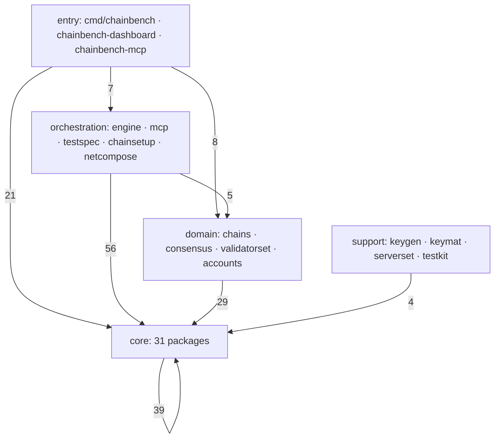

# Code graph — AST-measured package structure

> **[이력]** AST 실측 스냅샷. 측정 시점 이후 코드가 바뀌었다.
> **현재 상태를 말하지 않는다.** 그때 무엇을 측정·결정했는지의 기록이다.
> 현재 상태는 [[chainbench-worklist]] 와 코드가 정본이다.

> Generated from `scripts/inventory/code-graph` (go/ast, no build required).
> Regenerate with `go run ./scripts/inventory/code-graph . > graph.json` after
> structural refactors; do not hand-edit the numbers here.

## 1. Method

The tool parses every non-test `.go` file under `cmd/`, `internal/`, `scripts/`
and `tests/` and emits:

- **Nodes** — packages, with file/line counts, exported surface size, fan-in and
  fan-out (module-internal only).
- **Edges** — import relations annotated with the **exported symbols the
  importer actually references** (selector-expression count), so an edge shows
  *which part* of a package's surface is consumed, not just that it is imported.
- **Violations** — layering breaks against the layer model of
  `software-architecture.md`.

## 2. Measured shape (68 packages, 214 edges, 32.4k lines)

| Layer | Packages | Outbound edges land in |
|---|---|---|
| entry (`cmd/*`) | 3 | core 21 · domain 8 · orchestration 7 · support 3 |
| orchestration (`engine`, `mcp`, `testspec`, `chainsetup`, `netcompose`, `dashboard`) | 7 | core 56 · domain 5 · orchestration 4 |
| domain (`chains/*`, `consensus/*`, `validatorset`, `accounts`) | 13 | core 29 · domain 12 |
| core (`internal/core/*`) | 31 | core 39 · domain 1 · support 1 |
| support (`keygen`, `keymat`, `serverset`, `testkit`) | 4 | core 4 |

**Layering holds.** Zero core-to-upper violations. The two core edges leaving
the layer are benign or already tracked:

- `core/keyreg -> accounts` (`GenerateKey`, 1 ref) — crypto helper, effectively
  a support library.
- `core/pipeline/testrun -> testkit` — legacy stack A, removed by T7.11.

**Highest fan-in (the load-bearing contracts):** `core/node` (25),
`core/registry` (18, of which `ChainPlugin` is the chain seam), `core/rpc` (12),
`core/driver` (11, `NodeSpec` is the launch currency: 12 refs from engine
alone).

**Highest fan-out (the orchestrators):** `cmd/chainbench` (36), `engine` (22),
`mcp` (19), `chainsetup` (12) — three parallel orchestration stacks, as
`structure-and-atomic-cli-proposal.md` measured.

## 3. Launch-argument assembly — the refactoring target

The graph pins the "launch args spread across 5 places" claim
(worklist T7.3/T7.4) to exact sites:

| # | Site | What it contributes | Graph evidence |
|---|---|---|---|
| 1 | `core/nodeconfig.LaunchArgs` | `--datadir --config --port --http --http.port --ws --ws.port` | consumed by `engine`, `core/pipeline/setup`, `chains/wemix/deploy` |
| 2 | `engine/launcher.go armSpecs` | identity: `--nodekey --unlock --password --miner.etherbase` | `engine -> driver.NodeSpec` ×12 |
| 3 | `consensus/{poa,wbft}.StartFlags` | family/role: `--mine --allow-insecure-unlock --rpc.*` | via `registry.ChainPlugin.StartFlags` |
| 4 | `consensus/upgrade.LaunchArgs` | handoff variant: adds `--http.addr --authrpc.port --networkid` | consumed by `chainsetup`, `cmd/chainbench` |
| 5 | `chainsetup extraArgs` | handoff account/namespace: `--nat --http.api --unlock ...` | closure passed into `upgrade.Launch` |

Site 1 is duplicated across two stacks (engine and legacy pipeline/setup), and
site 4 re-implements site 1 with three deltas. The same *concern* (e.g. the
unlock triple) appears in sites 2 and 5 with different spellings. This is the
duplication `core/launchopt` (design: `chain-binary-flag-graph.md` §3.3)
removes.

## 4. Execution work list for the launchopt branch

Ordered so every step keeps `go test -race ./...` green, each conversion gated
by an equivalence test against the legacy argv:

1. **`internal/core/launchopt`** — `Dialect` tables ×2 (`geth114`,
   `geth110-wemix`), typed `Key` set, 10 concern modules, `Builder` with
   layered precedence (`family default < role < env.launch < case override`)
   and tri-state unsupported handling (skip / error / mapped). Pure functions,
   unit TDD.
2. **Conversion of sites 1+2** — argv assembly single-sited in
   `engine/launcher.go armSpecs` through the Builder; `engine/plan.go` no
   longer pre-assembles Args.
3. **Conversion of sites 4+5** — `upgrade.LaunchArgs` builds through the
   Builder; the two duplicated `ExtraArgs` closures (chainsetup + cmd) become
   typed `Overrides`.
4. **Customization seams** — `genesis.Inputs.ChainID` override,
   `LocalConfig.ChainID/NetworkID/LaunchOverrides`, CLI
   `--chain-id/--network-id/--launch-opt`.
5. **Config/flag boundary** (§3.4 of the flag-graph review) — deferred: the
   TOML endpoint entries stay until an e2e proves both surfaces agree.

**Gate note.** The worklist's original "byte-identical" gate is structurally
unsatisfiable: the legacy argv interleaves Identity and Mining flags twice
(`--allow-insecure-unlock … --mine … --nodekey --unlock`), which
concern-contiguous emission cannot reproduce. The implemented gate is
flag-pair equality against the legacy composition
(`TestArmSpecsLaunchoptEquivalence`) plus a canonical-order snapshot
(`TestBuildWbftValidatorSnapshot`); geth-family flag parsing is
position-independent, so pair equality is the semantic contract.

Out of scope on this branch: remote execution paths (tested on a separate
machine), legacy stack A removal (T7.11) — `core/pipeline/setup` and
`chains/wemix/deploy` still call `nodeconfig.LaunchArgs` and migrate when
their stacks do — and DSL v2 (T7.8).
