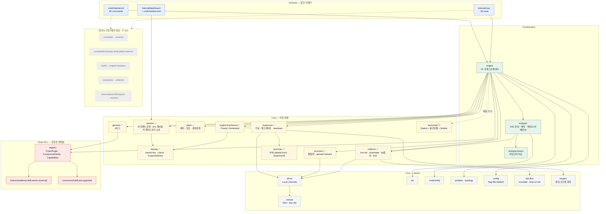
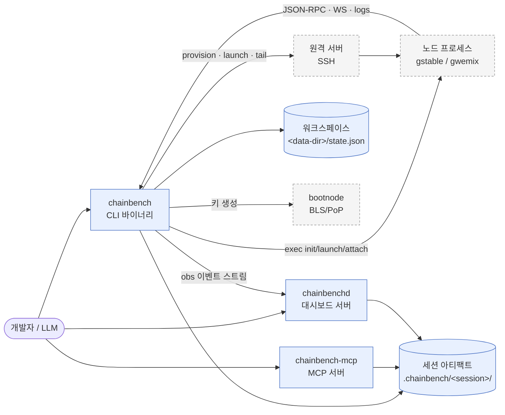
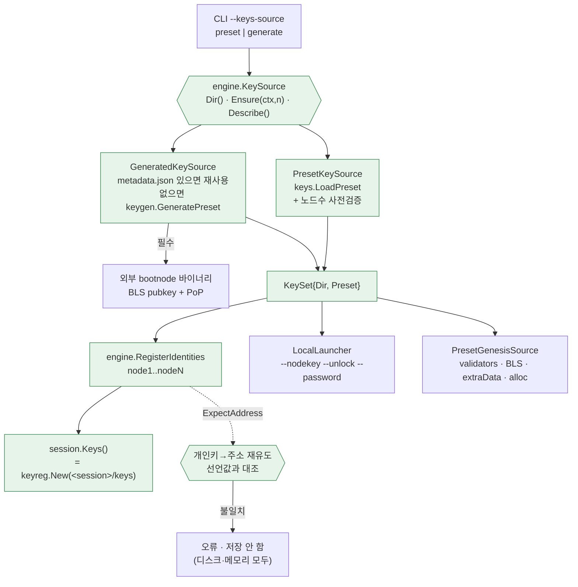
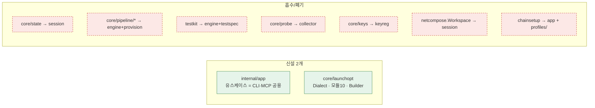
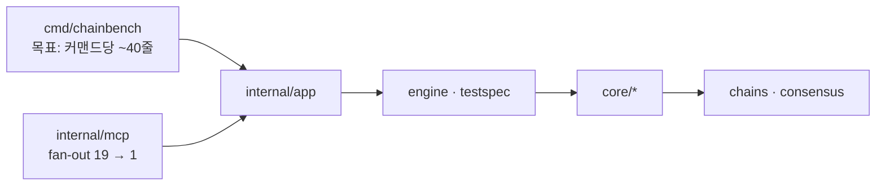

# 컴포넌트 다이어그램

> **[이력]** 2026-08-11 시점.
> **현재 상태를 말하지 않는다.** 그때 무엇을 측정·결정했는지의 기록이다.
> 현재 상태는 [[chainbench-worklist]] 와 코드가 정본이다.

> 2026-08-11 코드 실측. 자매 문서: [아키텍처](software-architecture.md) · [시퀀스](sequence-diagrams.md) · [상태](state-diagrams.md)
> 표기: `✅` 배선 완료 · `◐` 부분 · `☐` 미구현 · `→x` x 로 흡수 예정

---

## 1. 전체 컴포넌트 맵

---

## 2. C4 Level-2 — 컨테이너 관점

---

## 3. 키 소싱 컴포넌트 (T7.1 배선 결과)

| 구성요소 | 파일 | 책임 |
|---|---|---|
| `KeySource` | `internal/engine/keysource.go` | 알고리즘 2·3 의 결정 지점. `Dir()` 는 구성시점, `Ensure` 는 실행시점 |
| `PresetKeySource` | 〃 | 기존 세트 로드 + **노드 수 사전검증**(부족하면 기동 전에 실패) |
| `GeneratedKeySource` | 〃 | 신규 생성(idempotent). bootnode 부재 시 명확한 오류 |
| `RegisterIdentities` | 〃 | `sess.Keys()` 의 실소비자. C2 불변식 강제 |
| `keyreg.Literal` | `internal/core/keyreg/` | 보유 중인 키 자료의 진입 경로 |
| `keyreg.EnsureOpts.ExpectAddress` | 〃 | 선언 주소 ↔ 실제 키 대조 |
| `session.NewWithKeys` | `internal/core/session/` | 레지스트리를 세션 `keys/` 에 루팅(경로 단일소유) |

---

## 4. 목표 컴포넌트 델타

`internal/app` 도입 후 의존 방향:

