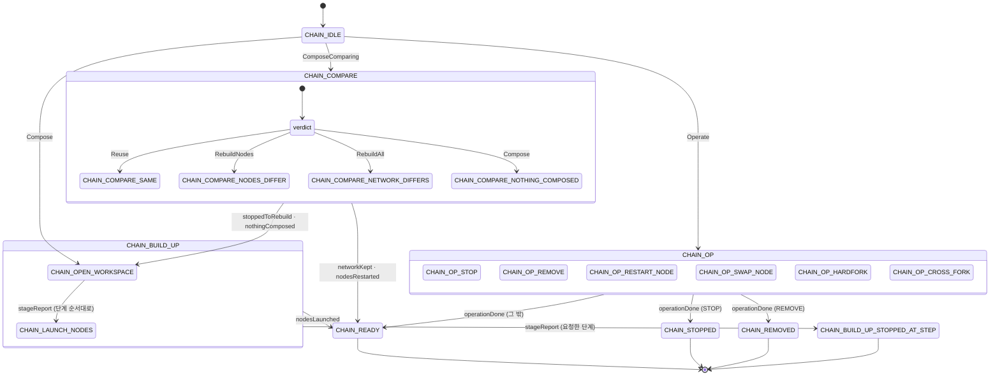

# 상태 기계 설계 6 — 이름, 상태별 계약, 예외 원칙 — [제안]

> **등급: [제안] ([proposal]).** 검토가 끝나면 [결정]으로 올리고, 02 문서 머리에 이 문서를
> 가리키는 줄을 넣는다. 그 전까지 02·05 는 바꾸지 않는다.
>
> 기준 코드: `cde3a08f`(PR #425 머지) 위의 `cd9664b3`. 2026-09-24.
> 근거 분석: [19 — 빈 경로](../../../research/chainbench/analyses/19-state-machine-gaps-2026-09-24.md),
> [20 — 이름 재검토](../../../research/chainbench/analyses/20-state-naming-review-2026-09-24.md).
> 결정 기록: ouroboros 인터뷰 `interview_20260924_082220`, 시드 `seed_c07a39436198`.
>
> **이 문서는 설계만 한다.** Go 코드는 이 문서가 검토를 통과한 뒤에 바꾼다.

## 1. 왜 이 문서가 필요한가

PR #425 는 chainbench 의 두 상태 기계를 계층형 상태 기계(HSM)로 옮겼다. 그 과정에서 세 가지가
02 문서와 어긋났다.

첫째, **이름.** 02 는 상태 이름을 `STATE_<영역>_<단계>[_<세부>][_FAIL_<사유>]` 로, 단계는 하는 일로
짓는다고 정했다. 리팩토링 전 코드(`a5386b0e` 의 `internal/core/lifecycle`)는 이 규약으로 117개 이름을
들고 있었다. #425 는 작업 지시서(15번 문서 §1)의 "큰 단계는 진행형" 한 줄을 따라 이것을
`OpeningWorkspace`·`Verifying`·`Ready` 같은 진행형 이름으로 바꿨고, 02 와의 대응은 어디에도 적지
않았다. 그래서 `Ready` 가 멈춘 체인에도 붙고, `Verifying` 이 아무것도 검증하지 않는다.

둘째, **빈 경로.** 두 메시지(`stoppedToRebuild`·`nodesRestarted`)를 받는 상태가 보낸 쪽의 형제
가지에 있어서, 메시지가 조용히 버려지고 rebuild 가 멈춘다. 프레임워크는 처리되지 않은 메시지를
에러 없이 버리고, 진입점은 끝 상태를 확인하지 않고 성공을 돌려준다. 2026-09-24 에 "같은
워크스페이스로 `chainbench run` 을 두 번 건다" 로 재현했다.

셋째, **gate 의 pid 스냅샷.** readiness gate 가 시작할 때 찍은 노드 목록을 끝까지 써서, gate 가
노드를 재시작해도 새 pid 를 보지 못하고 "죽었다" 고 판정한다.

이 문서는 세 가지를 한 번에 정리한다: 이름을 02 로 되돌리고(§3), 상태마다 받고 내고 무시하는
메시지를 코드로 선언하게 하고(§5), 처리되지 않은 메시지와 끝나지 않은 머신을 실패로 만든다(§6).

---

## 2. 결정 요약

| 번호 | 무엇 | 결정 |
|---|---|---|
| Q1 | 기록 호환 | `StateFormatVersion` 을 3 으로 올리고 2 를 거절한다. 변환 표 없음 (§8) |
| Q2 | 예외 원칙 | 처리되지 않은 메시지는 실패. 무시는 상태가 명시한 목록으로만. 진입점은 끝 상태 확인 (§6) |
| Q3 | 구조 범위 | S1·S2 는 이번에 고친다. S3·S4·S5 는 목표 모양만 적는다 (§4, §9) |
| D1 | 이름 표기 | 세부는 부모 이름을 앞에 단다. **값은 UPPER_SNAKE**(02 그대로), Go 식별자는 MixedCaps |
| D3 | 배포 단계 | 이름은 02 의 `CHAIN_DEPLOY_NODES`. 바이너리도 배포하고, sha256 이 같으면 보내지 않는다 (§7) |
| D4 | 조립 영역 낱말 | `CHAIN_BUILD_UP` (부모), `CHAIN_BUILD_UP_STOPPED_AT_STEP` (요청한 단계에서 멈춤) |
| D5 | 포크 순간 | `CHAIN_OP_CROSS_FORK_AWAIT_BOUNDARY` / `_HAND_OVER` / `_CONFIRM` |
| Q5 | 계약 위치 | **코드 선언**, CHAIN·TEST 두 머신 모두. 이 문서의 계약 표는 선언과 대조된다 (§5) |
| Q6 | 리포트 | 한 번에 전환. 저장소 안의 소비처는 같은 변경에서 새 이름으로 |
| Q7 | 완료 기준 | 결함별 RED 먼저 회귀 테스트, 선언 점검 테스트, golden, 기록 테스트, 재실행 재현, 209건 스위프 (§10) |

`COMPOSE`·`BUILD` 를 조립 영역 낱말로 쓰지 않은 이유: `BUILD` 는 단계 이름 넷(`CHAIN_BUILD_NODE_TABLE` 등)과
CLI `chain build`(실행 인자만 조립)와 겹친다. `BUILD_UP` 은 겹치는 곳이 없고 CLI `chain up` 과 맞는다.
실행 방식을 가리키는 compose/attach 어휘(CLI 도움말, TEST 의 세부 이름)는 그대로 둔다.

---

## 3. 이름 표

### 3.1 표기 규칙

| 자리 | 규칙 | 예 |
|---|---|---|
| 상태 이름 값 | UPPER_SNAKE, 02 그대로 | `CHAIN_BUILD_GENESIS_FROM_TEMPLATE` |
| 세부 상태 | 부모 단계 이름을 앞에 단다 | `CHAIN_BUILD_GENESIS` 아래 `CHAIN_BUILD_GENESIS_FROM_TEMPLATE` |
| 경로 | 값을 `/` 로 잇는다 | `CHAIN/CHAIN_BUILD_UP/CHAIN_BUILD_GENESIS/CHAIN_BUILD_GENESIS_FROM_TEMPLATE` |
| Go 식별자 | `name` + MixedCaps | `nameChainBuildGenesisFromTemplate` |
| 영역 | `CHAIN`(조립·비교·운영), `TEST`(실행) | |

경로 문자열은 `chain-record.json` 의 `statePath`, 로그, 리포트의 `failedAt`·`ComposeFailedAt` 에 그대로
찍힌다.

### 3.2 CHAIN 머신 (`internal/chainsetup`) — 43개

들여쓰기가 트리다. "지금" 열은 #425 의 이름, "하는 일" 은 `Enter`·`Process` 에서 옮겼다.

| # | 이름 | 지금 | 하는 일 | 끝 상태 |
|---|---|---|---|---|
| 1 | `CHAIN` | `Composition` | root. 어느 상태의 `stageFailed` 든 `CHAIN_FAILED` 로 보낸다 | |
| 2 | &nbsp;&nbsp;`CHAIN_IDLE` | `Stopped` | 명령을 기다리는 시작 상태. 체인이 멈췄다는 뜻이 아니다 | |
| 3 | &nbsp;&nbsp;`CHAIN_COMPARE` | `Comparing` | 워크스페이스에 있는 것과 원하는 것을 견줘 판정 넷 중 하나로 보낸다 | |
| 4 | &nbsp;&nbsp;&nbsp;&nbsp;`CHAIN_COMPARE_SAME` | (새로) | 판정 "같다". 할 일 없음을 기록하고 `CHAIN_READY` 로 **(S1)** | |
| 5 | &nbsp;&nbsp;&nbsp;&nbsp;`CHAIN_COMPARE_NODES_DIFFER` | `RestartingNodes` | 판정 "일부 노드가 다르다". 그 노드만 다시 띄운다 | |
| 6 | &nbsp;&nbsp;&nbsp;&nbsp;`CHAIN_COMPARE_NETWORK_DIFFERS` | `StoppingToRebuild` | 판정 "망 전체가 다르다". 망을 내리고 조립을 처음부터 | |
| 7 | &nbsp;&nbsp;&nbsp;&nbsp;`CHAIN_COMPARE_NOTHING_COMPOSED` | (새로) | 판정 "아무것도 없다". 조립을 처음부터 | |
| 8 | &nbsp;&nbsp;`CHAIN_BUILD_UP` | `Composing` | 조립 단계들의 부모. 단계 보고를 받아 다음 단계로 | |
| 9 | &nbsp;&nbsp;&nbsp;&nbsp;`CHAIN_OPEN_WORKSPACE` | `OpeningWorkspace` | 워크스페이스를 열고 요청을 기록 | |
| 10 | &nbsp;&nbsp;&nbsp;&nbsp;`CHAIN_BUILD_NODE_TABLE` | `BuildingNodeTable` | 역할·경로·포트로 노드 표를 만든다 | |
| 11 | &nbsp;&nbsp;&nbsp;&nbsp;`CHAIN_ENSURE_KEYS` | `EnsuringKeys` | 키 출처를 정하고(원격 키링이면 가져와) 세부로 | |
| 12 | &nbsp;&nbsp;&nbsp;&nbsp;&nbsp;&nbsp;`CHAIN_ENSURE_KEYS_FROM_PRESET` | `KeysFromPreset` | 있는 키 세트를 쓴다 | |
| 13 | &nbsp;&nbsp;&nbsp;&nbsp;&nbsp;&nbsp;`CHAIN_ENSURE_KEYS_GENERATE` | `KeysGenerated` | 새 키 세트를 만든다 | |
| 14 | &nbsp;&nbsp;&nbsp;&nbsp;&nbsp;&nbsp;`CHAIN_ENSURE_KEYS_FROM_BLUEPRINT` | `KeysDeclared` | blueprint 가 노드마다 적은 키를 쓴다 | |
| 15 | &nbsp;&nbsp;&nbsp;&nbsp;`CHAIN_RECONCILE` | `Reconciling` | reuse-if-matching 일 때 키 다음에 돌고 있는 망과 견준다 (S3 대상) | |
| 16 | &nbsp;&nbsp;&nbsp;&nbsp;`CHAIN_BUILD_GENESIS` | `BuildingGenesis` | 템플릿/기존 genesis 를 고른다 | |
| 17 | &nbsp;&nbsp;&nbsp;&nbsp;&nbsp;&nbsp;`CHAIN_BUILD_GENESIS_FROM_TEMPLATE` | `GenesisFromTemplate` | 체인 템플릿으로 만든다 | |
| 18 | &nbsp;&nbsp;&nbsp;&nbsp;&nbsp;&nbsp;`CHAIN_BUILD_GENESIS_FROM_EXISTING` | `GenesisFromExisting` | 주어진 genesis 를 쓴다 | |
| 19 | &nbsp;&nbsp;&nbsp;&nbsp;`CHAIN_BUILD_NODE_CONFIG` | `BuildingNodeConfig` | 노드마다 config 를 렌더 | |
| 20 | &nbsp;&nbsp;&nbsp;&nbsp;`CHAIN_BUILD_NODE_COMMAND` | `BuildingNodeCommand` | 노드마다 실행 인자를 조립 | |
| 21 | &nbsp;&nbsp;&nbsp;&nbsp;`CHAIN_DEPLOY_NODES` | `DeployingInputs` | 실행 입력(genesis·config·키)과 **바이너리**(§7)를 대상에 둔다 | |
| 22 | &nbsp;&nbsp;&nbsp;&nbsp;&nbsp;&nbsp;`CHAIN_DEPLOY_NODES_VERIFIED_LOCAL` | `InputsVerifiedLocal` | 보낼 것이 없었다는 기록 | |
| 23 | &nbsp;&nbsp;&nbsp;&nbsp;&nbsp;&nbsp;`CHAIN_DEPLOY_NODES_SHIPPED_REMOTE` | `InputsShippedRemote` | 원격으로 보냈다는 기록 | |
| 24 | &nbsp;&nbsp;&nbsp;&nbsp;`CHAIN_INIT_NODES` | `InitializingDatadirs` | 노드마다 datadir 를 genesis 로 init | |
| 25 | &nbsp;&nbsp;&nbsp;&nbsp;`CHAIN_LAUNCH_NODES` | `Launching` | 체인 집안의 phase 목록을 받아 phase 마다 띄운다 | |
| 26 | &nbsp;&nbsp;&nbsp;&nbsp;&nbsp;&nbsp;`CHAIN_LAUNCH_NODES_PHASE` | `LaunchingPhase` | phase 하나의 노드를 띄운다 | |
| 27 | &nbsp;&nbsp;&nbsp;&nbsp;&nbsp;&nbsp;`CHAIN_LAUNCH_NODES_PHASE_ACTIONS` | `RunningPhaseActions` | 그 phase 의 뒷작업 | |
| 28 | &nbsp;&nbsp;&nbsp;&nbsp;&nbsp;&nbsp;`CHAIN_LAUNCH_NODES_RECORD_RUN` | `RecordingRun` | 모든 phase 뒤 실행 기록을 쓴다 | |
| 29 | &nbsp;&nbsp;`CHAIN_BUILD_UP_STOPPED_AT_STEP` | `Composed` | `--stage` 나 한 단계 실행이 요청한 곳에서 멈춘 조립 | 예 |
| 30 | &nbsp;&nbsp;`CHAIN_READY` | `Ready` | 조립이 끝났고 망이 요청대로 서 있다 **(S2: 운영의 부모가 아니다)** | 예 |
| 31 | &nbsp;&nbsp;`CHAIN_OP` | (새로) | 운영 동작의 부모. 끝나면 동작별 결과 상태로 **(S2)** | |
| 32 | &nbsp;&nbsp;&nbsp;&nbsp;`CHAIN_OP_STOP` | `Stopping` | 떠 있는 노드를 모두 내린다 | |
| 33 | &nbsp;&nbsp;&nbsp;&nbsp;`CHAIN_OP_REMOVE` | `Removing` | 조립한 망의 데이터를 지운다 | |
| 34 | &nbsp;&nbsp;&nbsp;&nbsp;`CHAIN_OP_RESTART_NODE` | `Restarting` | 노드 하나를 내렸다 올린다 | |
| 35 | &nbsp;&nbsp;&nbsp;&nbsp;`CHAIN_OP_SWAP_NODE` | `Swapping` | 노드 하나의 바이너리를 바꿔 다시 띄운다 | |
| 36 | &nbsp;&nbsp;&nbsp;&nbsp;`CHAIN_OP_HARDFORK` | `Hardforking` | 포크 블록에서 망 전체의 바이너리를 바꾼다 | |
| 37 | &nbsp;&nbsp;&nbsp;&nbsp;`CHAIN_OP_CROSS_FORK` | `CrossingFork` | 망이 포크를 넘을 때까지 지켜보며 생산을 넘긴다 | |
| 38 | &nbsp;&nbsp;&nbsp;&nbsp;&nbsp;&nbsp;`CHAIN_OP_CROSS_FORK_AWAIT_BOUNDARY` | `BeforeFork` | 포크 직전 블록까지 기다린다 | |
| 39 | &nbsp;&nbsp;&nbsp;&nbsp;&nbsp;&nbsp;`CHAIN_OP_CROSS_FORK_HAND_OVER` | `HandingOver` | 포크 전 노드를 내리고 포크 후 빌드를 올린다 | |
| 40 | &nbsp;&nbsp;&nbsp;&nbsp;&nbsp;&nbsp;`CHAIN_OP_CROSS_FORK_CONFIRM` | `Crossed` | 넘었는지 확인한다 | |
| 41 | &nbsp;&nbsp;`CHAIN_STOPPED` | (새로) | `CHAIN_OP_STOP` 뒤. 망이 내려가 있다 **(S2)** | 예 |
| 42 | &nbsp;&nbsp;`CHAIN_REMOVED` | (새로) | `CHAIN_OP_REMOVE` 뒤. 데이터가 없다 **(S2)** | 예 |
| 43 | &nbsp;&nbsp;`CHAIN_FAILED` | `Failed` | 실패 이유를 들고 멈춘다. `ClearError` 만 받는다 | 예 |

없어지는 상태: `Verifying`(S1). 들어오는 길은 판정 "같다" 하나였고 일이 없었다.

### 3.3 TEST 머신 (`internal/testengine`) — 12개

| # | 이름 | 지금 | 하는 일 | 끝 상태 |
|---|---|---|---|---|
| 1 | `TEST` | `Run` | root. 스테이지의 `stageStopped` 를 `TEST_COLLECT` 로 보낸다 | |
| 2 | &nbsp;&nbsp;`TEST_IDLE` | `Pending` | 시작 상태. `startRun` 을 받아 선언 읽기로 | |
| 3 | &nbsp;&nbsp;`TEST_READ_DECLARATION` | `ReadingDeclaration` | 스펙과 chain-preset 을 읽어 요청과 계획을 만든다 | |
| 4 | &nbsp;&nbsp;`TEST_OPEN_SESSION` | `OpeningSession` | 계획을 적고 아티팩트 자리를 연다 | |
| 5 | &nbsp;&nbsp;`TEST_STAND_UP_NETWORK` | `ReachingNetwork` | 망을 세우거나 이미 선 망을 찾는다 | |
| 6 | &nbsp;&nbsp;&nbsp;&nbsp;`TEST_STAND_UP_NETWORK_COMPOSE` | `ComposingNetwork` | **CHAIN 머신으로 들어가** 조립을 끝내고(§6.3 끝 상태 확인), 계획과 대조하고, gate 를 지난다 | |
| 7 | &nbsp;&nbsp;&nbsp;&nbsp;`TEST_STAND_UP_NETWORK_ATTACH` | `AttachingToNetwork` | 기존 워크스페이스의 망을 읽고 gate 를 지난다 (S4 대상) | |
| 8 | &nbsp;&nbsp;`TEST_PREPARE` | `Preparing` | 포크·높이·계정 준비 | |
| 9 | &nbsp;&nbsp;`TEST_RUN_CASES` | `RunningCases` | 케이스를 돈다 | |
| 10 | &nbsp;&nbsp;`TEST_COLLECT` | `Collecting` | 증거를 모으고 망을 내린다. 실패한 실행도 반드시 지난다 | |
| 11 | &nbsp;&nbsp;`TEST_DONE` | `Done` | 실행이 끝났다(케이스 판정과 무관) | 예 |
| 12 | &nbsp;&nbsp;`TEST_FAILED` | `Failed` | 실행이 어느 스테이지에서 더 가지 못했다. 자리는 경로가 말한다 | 예 |

---

## 4. 이번에 바뀌는 구조 — S1, S2



`verdict` 는 `CHAIN_COMPARE` 가 `comparisonMade` 를 처리하는 순간이다. 상태가 아니다.

**S1.** `Verifying` 을 없앤다. 판정 "같다" 는 `CHAIN_COMPARE_SAME` 을 지나 `CHAIN_READY` 로 간다.
`CHAIN_VERIFY`(02 §4.10, 블록이 나오는지 보는 일)는 검증이 chainsetup 안으로 들어오는 날 **그 일과
함께** 만든다. 지금 검증은 TEST 쪽의 `verifyAgainstPlan` 과 readiness gate 가 한다.

**S2.** 운영 동작의 부모를 `CHAIN_READY` 에서 떼어 `CHAIN_OP` 로 둔다. 운영이 끝나면(`operationDone`)
`CHAIN_OP` 가 어느 동작이었는지 보고 결과 상태로 보낸다. 멈춤은 `CHAIN_STOPPED`, 지움은 `CHAIN_REMOVED`,
나머지는 `CHAIN_READY`. 리팩토링 전 코드에는 `ChainStopped`·`ChainRemoved` 가 있었다.

**빈 경로의 수정.** `stoppedToRebuild`·`nodesRestarted` 는 보낸 상태의 부모인 `CHAIN_COMPARE` 가 받는다.
`CHAIN_BUILD_UP` 에 있던 두 case(`manager_states.go:143-148`)는 도달할 수 없으므로 지운다.

**재조립이 실제로 다시 도는지.** 판정 "망 전체가 다르다" 뒤 `CHAIN_OPEN_WORKSPACE` 부터 다시 들어갈 때
단계들이 기록의 `done: true` 를 보고 건너뛰지 않아야 한다. 지금 단계 본문은 기록을 보지 않고 일을
하므로(`steps_*.go` 에 `Steps[..].Done` 을 읽는 곳이 preflight 한 곳뿐이다) 다시 돈다고 본다. **확인되지
않았다** — §10 의 재실행 재현이 이것을 확인한다.

**`ResumeStep` 이 새 끝 상태를 읽는 법.** `CHAIN_READY`·`CHAIN_STOPPED`·`CHAIN_REMOVED` 는 조립이 끝난
것이므로 다시 할 단계가 없다(`""`). `CHAIN_IDLE`·`CHAIN_BUILD_UP_STOPPED_AT_STEP` 은 지금처럼 기록의 첫
미완 단계(`FirstUndone`)를 본다. 경로에 단계 이름이 있으면 그 단계로.

---

## 5. 상태별 계약 — 받는 것, 내는 것, 무시하는 것

### 5.1 코드에 두는 모양

계약은 코드에 선언한다. 문서만 두면 이름이 그랬듯 다시 어긋난다.

```go
// internal/core/statemachine
//
// Contract is what a state says about the messages it deals with. The machine
// checks it at run time and a test checks it against the code, so a message
// that nobody handles is found before a run finds it.
type Contract struct {
	Accepts []What // messages this state's Process handles
	Emits   []What // messages this state's Enter/Process send to the machine
	Ignores []What // messages this state deliberately swallows
	Refuses bool   // every message not in Accepts is an error (the failed states)
}

// Declared is implemented by every state added to a machine.
type Declared interface{ Contract() Contract }
```

- `Machine.Add` 는 `Declared` 가 아닌 상태를 **설정 오류**로 거절한다.
- 상태의 `Process` 가 `Accepts` 에 없는 메시지를 처리했다고 답하면 오류다(선언과 코드가 어긋났다).
- 선언 점검 테스트(`internal/arch` 의 새 테스트)가 go/ast 로 각 상태의 type switch·type assertion 과
  `SendSelf`·`Post` 지점을 읽어 선언과 대조한다. 19번 문서를 쓸 때 만든 분석기가 출발점이다. 이 테스트는
  다음 셋을 실패로 본다: 선언에 없는 처리, 선언에 없는 송신, **보낸 상태에서 root 까지 아무도 받거나
  무시하지 않는 메시지.**
- 아래 §5.3·§5.4 표는 `<!-- contract:begin -->` 과 `<!-- contract:end -->` 사이에 둔다. 같은 테스트가
  코드 선언에서 표를 만들어 이 구간과 비교하고, `-update` 플래그로 다시 쓴다. 표를 손으로 고치지 않는다.

### 5.2 메시지 목록

**CMD** 는 밖(Manager 의 메서드, runner)이 보내는 명령, **EVT** 는 상태가 자기 머신에 알리는 사실이다.
메시지의 Go 타입 이름은 바꾸지 않는다 — 상태 이름과 달리 기록에 남지 않는다.

| 메시지 | 종류 | 보내는 곳 | 받는 곳 | 뜻 |
|---|---|---|---|---|
| `Compose` | CMD | `Manager.Compose` | `CHAIN_IDLE` | 처음부터(또는 `From` 단계부터) 조립 |
| `ComposeComparing` | CMD | `Manager.ComposeComparing` | `CHAIN_IDLE` | 있는 것과 견준 뒤 조립 |
| `Operate` | CMD | `Manager.Operate` | `CHAIN_IDLE` | 운영 동작 하나 |
| `RunStep` | CMD | `Manager.Step` | `CHAIN_IDLE` | 조립 단계 하나 |
| `ClearError` | CMD | 호출자 | `CHAIN_FAILED` | 실패를 지우고 `CHAIN_IDLE` 로 |
| `comparisonMade` | EVT | `CHAIN_COMPARE` | `CHAIN_COMPARE` | 판정 넷 중 하나 |
| `networkKept` | EVT (새로) | `CHAIN_COMPARE_SAME` | `CHAIN_COMPARE` | 할 일 없음 |
| `nothingComposed` | EVT (새로) | `CHAIN_COMPARE_NOTHING_COMPOSED` | `CHAIN_COMPARE` | 조립을 처음부터 |
| `nodesRestarted` | EVT | `CHAIN_COMPARE_NODES_DIFFER` | `CHAIN_COMPARE` (**바뀜**) | 다른 노드를 다시 띄웠다 |
| `stoppedToRebuild` | EVT | `CHAIN_COMPARE_NETWORK_DIFFERS` | `CHAIN_COMPARE` (**바뀜**) | 망을 내렸다 |
| `workspaceOpened` … `nodesLaunched` (9종, `stageReport`) | EVT | 각 조립 단계 | `CHAIN_BUILD_UP` | 단계가 끝났다 |
| `keySourceChosen` | EVT | `CHAIN_ENSURE_KEYS` | 자신 | 키 출처를 골랐다 |
| `genesisWayChosen` | EVT | `CHAIN_BUILD_GENESIS` | 자신 | genesis 방식을 골랐다 |
| `inputsPresent` | EVT | `CHAIN_DEPLOY_NODES` | 자신 | 입력이 대상에 있다(몇 개 보냈나) |
| `launchPlanned`, `phaseLaunched`, `phaseActionsDone` | EVT | `CHAIN_LAUNCH_NODES` 와 세부 | `CHAIN_LAUNCH_NODES` | phase 진행 |
| `reconciled`, `reconcileRefused` | EVT | `CHAIN_RECONCILE` | `CHAIN_BUILD_UP` | 재사용 판정 |
| `operationDone` | EVT | 운영 동작, `CHAIN_OP_CROSS_FORK_CONFIRM` | `CHAIN_OP` (**바뀜**) | 동작이 끝났다 |
| `forkStandingRead`, `forkBoundaryReached`, `productionHandedOver` | EVT | `CHAIN_OP_CROSS_FORK` 와 세부 | `CHAIN_OP_CROSS_FORK` | 포크 넘기의 세 순간 |
| `stageFailed` | EVT | 어느 상태든 | `CHAIN` | 실패 |
| `startRun` | CMD | `runner.Run` | `TEST_IDLE` | 실행 시작 |
| `declarationRead`, `sessionOpened`, `networkWayChosen`, `networkReached`, `chainPrepared`, `casesRun`, `collected` | EVT | 각 TEST 스테이지 | 보낸 스테이지(또는 `TEST_STAND_UP_NETWORK`) | 스테이지가 끝났다 |
| `stageStopped` | EVT | 어느 TEST 스테이지든 | `TEST` | 실패 — 수집으로 |

### 5.3 CHAIN 계약

<!-- contract:begin chain -->
| 상태 | Accepts | Emits | Ignores |
|---|---|---|---|
| `CHAIN` | `stageFailed` | — | — |
| `CHAIN_IDLE` | `Compose`, `ComposeComparing`, `Operate`, `RunStep` | — | — |
| `CHAIN_COMPARE` | `comparisonMade`, `networkKept`, `nothingComposed`, `nodesRestarted`, `stoppedToRebuild` | `comparisonMade` | — |
| `CHAIN_COMPARE_SAME` | — | `networkKept` | — |
| `CHAIN_COMPARE_NODES_DIFFER` | — | `nodesRestarted`, `stageFailed` | — |
| `CHAIN_COMPARE_NETWORK_DIFFERS` | — | `stoppedToRebuild`, `stageFailed` | — |
| `CHAIN_COMPARE_NOTHING_COMPOSED` | — | `nothingComposed` | — |
| `CHAIN_BUILD_UP` | `stageReport` 9종, `reconciled`, `reconcileRefused` | — | — |
| `CHAIN_OPEN_WORKSPACE` | — | `workspaceOpened`, `stageFailed` | — |
| `CHAIN_BUILD_NODE_TABLE` | — | `nodeTableBuilt`, `stageFailed` | — |
| `CHAIN_ENSURE_KEYS` | `keySourceChosen` | `keySourceChosen`, `stageFailed` | — |
| `CHAIN_ENSURE_KEYS_FROM_PRESET` · `_GENERATE` · `_FROM_BLUEPRINT` | — | `keysEnsured`, `stageFailed` | — |
| `CHAIN_RECONCILE` | — | `reconciled`, `reconcileRefused`, `stageFailed` | — |
| `CHAIN_BUILD_GENESIS` | `genesisWayChosen` | `genesisWayChosen`, `stageFailed` | — |
| `CHAIN_BUILD_GENESIS_FROM_TEMPLATE` · `_FROM_EXISTING` | — | `genesisBuilt`, `stageFailed` | — |
| `CHAIN_BUILD_NODE_CONFIG` | — | `nodeConfigBuilt`, `stageFailed` | — |
| `CHAIN_BUILD_NODE_COMMAND` | — | `nodeCommandBuilt`, `stageFailed` | — |
| `CHAIN_DEPLOY_NODES` | `inputsPresent` | `inputsPresent`, `stageFailed` | — |
| `CHAIN_DEPLOY_NODES_VERIFIED_LOCAL` · `_SHIPPED_REMOTE` | — | `inputsDeployed` | — |
| `CHAIN_INIT_NODES` | — | `datadirsInitialized`, `stageFailed` | — |
| `CHAIN_LAUNCH_NODES` | `launchPlanned`, `phaseLaunched`, `phaseActionsDone` | `launchPlanned`, `stageFailed` | — |
| `CHAIN_LAUNCH_NODES_PHASE` | — | `phaseLaunched`, `stageFailed` | — |
| `CHAIN_LAUNCH_NODES_PHASE_ACTIONS` | — | `phaseActionsDone`, `stageFailed` | — |
| `CHAIN_LAUNCH_NODES_RECORD_RUN` | — | `nodesLaunched`, `stageFailed` | — |
| `CHAIN_BUILD_UP_STOPPED_AT_STEP` | — | — | — |
| `CHAIN_READY` | — | — | — |
| `CHAIN_OP` | `operationDone` | — | — |
| `CHAIN_OP_STOP` · `_REMOVE` · `_RESTART_NODE` · `_SWAP_NODE` · `_HARDFORK` | — | `operationDone`, `stageFailed` | — |
| `CHAIN_OP_CROSS_FORK` | `forkStandingRead`, `forkBoundaryReached`, `productionHandedOver` | `forkStandingRead`, `stageFailed` | — |
| `CHAIN_OP_CROSS_FORK_AWAIT_BOUNDARY` | — | `forkBoundaryReached`, `stageFailed` | — |
| `CHAIN_OP_CROSS_FORK_HAND_OVER` | — | `productionHandedOver`, `stageFailed` | — |
| `CHAIN_OP_CROSS_FORK_CONFIRM` | — | `operationDone`, `stageFailed` | — |
| `CHAIN_STOPPED` | — | — | — |
| `CHAIN_REMOVED` | — | — | — |
| `CHAIN_FAILED` | `ClearError` (Refuses: 그 밖 전부) | — | — |
<!-- contract:end chain -->

### 5.4 TEST 계약

<!-- contract:begin test -->
| 상태 | Accepts | Emits | Ignores |
|---|---|---|---|
| `TEST` | `stageStopped` | — | — |
| `TEST_IDLE` | `startRun` | — | — |
| `TEST_READ_DECLARATION` | `declarationRead` | `declarationRead`, `stageStopped` | — |
| `TEST_OPEN_SESSION` | `sessionOpened` | `sessionOpened`, `stageStopped` | — |
| `TEST_STAND_UP_NETWORK` | `networkWayChosen`, `networkReached` | `networkWayChosen` | — |
| `TEST_STAND_UP_NETWORK_COMPOSE` | — | `networkReached`, `stageStopped` | — |
| `TEST_STAND_UP_NETWORK_ATTACH` | — | `networkReached`, `stageStopped` | — |
| `TEST_PREPARE` | `chainPrepared` | `chainPrepared`, `stageStopped` | — |
| `TEST_RUN_CASES` | `casesRun` | `casesRun`, `stageStopped` | — |
| `TEST_COLLECT` | `collected` | `collected` | — |
| `TEST_DONE` | — | — | — |
| `TEST_FAILED` | — | — | — |
<!-- contract:end test -->

**Ignores 가 모두 비어 있는 이유.** 정적 점검에서 일부러 버리는 메시지는 하나도 없었다. 버려지던
두 건은 결함이었다. 무시 목록은 앞으로 그런 메시지가 생길 때 이름을 대고 적는 자리다.

**표를 만든 방법과 한계.** 19번 문서의 go/ast 분석기로 `cd9664b3` 의 두 패키지를 읽어 뽑았다.
`CHAIN_ENSURE_KEYS_*` 세 leaf 는 타입 생략 map 리터럴로 만들어져 분석기가 잇지 못했고, 코드를 읽어
`keysEnsured` 를 채웠다(`stage_keys.go:137`). 새 상태(`CHAIN_COMPARE_SAME` 등)와 바뀐 수신처는 이 설계의
목표값이다.

---

## 6. 예외 원칙

### 6.1 처리되지 않은 메시지는 실패다

지금 `statemachine.dispatch`(`machine.go:314-350`)는 현재 상태에서 root 까지 아무도 받지 않은 메시지를
링 로그에만 남기고 버린다. 에러가 없다. 바꾼 뒤:

1. 경로 위의 어느 상태의 `Ignores`(무시 목록, ignore list)에 있으면 기록만 하고 넘어간다.
2. 그 밖이면 `ErrUnhandled`(메시지 이름, 현재 경로 포함)를 만들고, 머신에 지정된 실패 상태로 옮긴다.
   `Machine.SetFailed(state)` 로 머신마다 하나 정한다 — CHAIN 은 `CHAIN_FAILED`, TEST 는 `TEST_FAILED`.
   `Send` 는 그 에러를 돌려준다.
3. 실패 상태가 지정되지 않은 머신에서 이 일이 생기면 `Send` 가 에러를 돌려주고 머신은 그 자리에
   멈춘다(설정 오류로 본다).

`CHAIN_FAILED` 가 `ClearError` 밖의 메시지를 에러로 거절하는 지금 동작(`manager_states.go:229-236`)은
`Refuses: true` 로 선언된 것으로 유지한다.

### 6.2 진입점은 끝 상태를 확인한다

지금 네 진입점은 `failure` 가 비어 있으면 성공을 돌려준다. 머신이 도중에 멈춘 것을 모른다. 바꾼 뒤
각 진입점은 `Send` 가 돌아온 다음 현재 상태가 **자기 끝 상태 집합** 안인지 확인하고, 아니면
`ErrNotTerminal`(현재 경로 포함)로 실패한다. `statemachine` 에 `Machine.RequireAt(states ...State) error`
를 둔다.

| 진입점 | 끝 상태 집합 |
|---|---|
| `Manager.Compose` | `CHAIN_READY`, `CHAIN_BUILD_UP_STOPPED_AT_STEP`, `CHAIN_FAILED` |
| `Manager.ComposeComparing` | `CHAIN_READY`, `CHAIN_FAILED` |
| `Manager.Operate` | `CHAIN_READY`, `CHAIN_STOPPED`, `CHAIN_REMOVED`, `CHAIN_FAILED` |
| `Manager.Step` (`RunStep`) | `CHAIN_BUILD_UP_STOPPED_AT_STEP`, `CHAIN_FAILED` |
| `runner.Run` | `TEST_DONE`, `TEST_FAILED` |

`*_FAILED` 에서 끝나면 지금처럼 기록된 실패 이유를 돌려준다. 집합 밖에서 끝나면 그것 자체가 실패다.

### 6.3 두 머신이 만나는 곳

`TEST_STAND_UP_NETWORK_COMPOSE` 는 `verb.ChainUpComparing` → `Manager.ComposeComparing` 으로 CHAIN 머신을
돌린다. §6.2 로 CHAIN 머신이 도중에 멈추면 여기서 곧바로 에러가 나고, TEST 머신은 `stageStopped` 로
`TEST_COLLECT` 를 지나 `TEST_FAILED` 로 간다. 리포트의 `ComposeFailedAt` 에 CHAIN 쪽 경로가 찍힌다.
지금처럼 두 단계 뒤 readiness gate 에서 엉뚱한 메시지로 나타나지 않는다.

### 6.4 gate 의 pid 스냅샷

`healthObserver`(`internal/testengine/nodegate.go:27-38`)는 라운드마다 워크스페이스 기록에서 노드 목록을
**다시 읽는다**(`verb.NetworkStatus` 를 `readWorkspaceComposed` 가 쓰는 것과 같은 방식으로). 재시작이
기록한 새 pid 가 다음 라운드의 `PIDAlive` 에 반영된다. 라운드마다 파일을 한 번 더 읽는 비용은
작다(기록은 원격 대상이어도 로컬에 있다). 재시작한 쪽이 observer 에 pid 를 넘겨 주는 방식은 쓰지
않는다 — 재시작 말고 다른 곳에서 바뀐 pid 는 여전히 못 보기 때문이다.

---

## 7. `CHAIN_DEPLOY_NODES` 의 바이너리 배포

지금 이 단계는 genesis·config·키만 대상에 두고, 바이너리는 대상의 `paths.binaries` 에 미리 있어야
한다. 바꾼 뒤 이 단계가 바이너리도 둔다.

1. **어떤 파일을 어디로.** 로컬 원본은 명령이 받은 바이너리 경로(`--binary`, 또는 chain-preset 이 가리키는
   파일)다. 대상 경로는 지금처럼 workspace-config 의 `dataRoot`·`paths.binaries`·`binaryAliases` 로 정한다.
   로컬 대상이면 원본을 그 자리에서 쓰므로 배포할 것이 없다.
2. **이미 있다의 판단.** 로컬 원본의 sha256 과 대상 파일의 sha256 을 비교한다. 같으면 보내지 않는다.
   다르거나 대상에 파일이 없으면 보낸다.
3. **보낸 뒤 확인.** 올린 파일의 sha256 을 다시 구해 로컬과 같은지 본다. 기록된 값이 아니라 대상 파일을
   직접 확인해야 "보냈다" 를 성공으로 친다. 다르면 `stageFailed`.
4. **실행 권한.** 올린 파일에 실행 권한을 준다.
5. **해시를 구할 수 없는 대상.** 대상에 `sha256sum`(또는 `shasum -a 256`)이 없으면 이 단계는 이유를 대고
   실패한다. 해시 없이 보내거나 건너뛰지 않는다.
6. **기록.** 보낸 파일 수에 바이너리가 포함된다. 하나라도 보냈으면 `CHAIN_DEPLOY_NODES_SHIPPED_REMOTE`,
   아니면 `CHAIN_DEPLOY_NODES_VERIFIED_LOCAL`.

**검토가 필요한 것.** 원격 대상일 때 "로컬 원본" 을 어디서 얻을지는 지금 코드에 자리가 없다(원격
대상에서는 바이너리 이름만 나른다). 위 1 의 규칙이 맞는지, workspace-config 에 로컬 원본 자리를 따로
둘지 검토에서 정한다.

---

## 8. 기록 형식 v3 — `chain-record.json`

- `StateFormatVersion` 을 2 에서 3 으로 올린다(`internal/chainsetup/state.go:21`).
- 형식 2 기록은 지금처럼 열 때 거절한다(`workspace.go:86-90`). 오류는 찾은 형식과 이 빌드가 읽는 형식을
  말하고, `chain new` 로 다시 조립하라고 안내한다.
- **변환 표는 두지 않는다.** 옛 진행형 경로를 새 이름으로 옮겨 적지 않는다. 형식을 올리지 않고 이름만
  바꾸면 `ResumeStep` 이 모르는 이름을 조용히 `FirstUndone` 으로 넘겨 옛 기록을 다른 재개 지점으로
  해석하는데, 그 경로를 막는 것이 형식을 올리는 이유다.
- **어휘는 한 번에 바꾼다.** 저장소 안의 소비처 — 트리 golden 테스트, 리포트의 `failedAt`·`ComposeFailedAt`,
  로그, 19·20번 문서의 그림과 표 — 는 같은 변경에서 새 이름으로 간다. 두 어휘를 함께 내보내는 기간은 없다.
  이미 만들어진 리포트는 옛 이름을 가진 기록으로 남는다.

---

## 9. 이번에 하지 않는 것 — S3, S4, S5

| 번호 | 목표 모양 | 미루는 이유 |
|---|---|---|
| S3 | 02 §5.2 대로 `CHAIN_COMPARE`(조립 전)와 `CHAIN_RECONCILE`(키 다음)을 한 블록으로 합친다. 같은 질문에 답하는 자리가 하나가 된다 | 두 비교는 보는 것이 다르다(하나는 기록, 하나는 돌고 있는 망). 합치면 재사용 판정의 순서와 조립 단계의 순서가 함께 바뀐다. 이름·계약을 먼저 고정한 뒤에 한다 |
| S4 | 붙기는 02 의 `CHAIN_ADOPT`(`_BY_RPC`·`_BY_WORKSPACE`·`_BY_DECLARATION`)로 체인 영역에 두고, 붙는 실행은 05 대로 `TEST_OPEN_SESSION` 에서 시작해 망 세우기를 건너뛴다 | TEST 머신의 시작 상태가 둘이 되고 CLI 의 `--attach`·`--rpc` 갈래가 함께 움직인다. 이번 변경과 섞으면 회귀를 가려 보기 어렵다 |
| S5 | 02 대로 단계마다 `+0x80` 실패 상태(`CHAIN_<단계>_FAIL_<사유>`)를 둔다 | 지금은 `*_FAILED` 하나와 이유, 그리고 경로가 "어디서" 를 말한다. 어떤 실패가 자기 상태를 가질 가치가 있는지는 실패 뒤에 무엇을 되돌려야 하나로 정해지고, 그것은 라이브 실행으로 재야 한다(15번 지시서의 판단을 유지) |

---

## 10. 검증 — 구현 단계가 내야 할 증거

모두 필요하다. 결함 테스트는 **지금 코드에서 먼저 실패**(RED)하는 것을 보이고, 수정 뒤 통과(GREEN)한다.

| 번호 | 증거 | 모양 |
|---|---|---|
| E1 | `stoppedToRebuild` 가 버려져 rebuild 가 멈춤 | 네트워크 없는 상태 기계 테스트. 판정 "망 전체가 다르다" 에서 `ComposeComparing` 이 `CHAIN_OPEN_WORKSPACE` 에 들어가는지 본다. 지금 코드에서는 `StoppingToRebuild` 에 멈춘다 |
| E2 | `nodesRestarted` 가 버려짐 | 같은 방식. 판정 "일부 노드가 다르다" 뒤 `CHAIN_READY` 에 닿는지 |
| E3 | 진입점이 끝 상태 없이 성공 | 상태 기계 테스트. 도중에 멈추는 머신에서 `Compose`·`ComposeComparing`·`Operate`·`runner.Run` 이 `ErrNotTerminal` 을 돌려주는지. 지금은 `nil` |
| E4 | 처리되지 않은 메시지 | `statemachine` 단위 테스트. 아무도 받지 않는 메시지가 `ErrUnhandled` 와 실패 상태로 가는지, `Ignores` 에 있으면 넘어가는지 |
| E5 | gate 의 pid 스냅샷 | 가짜 observer 입력과 가짜 restarter 로 gate 를 돌린다. 재시작이 새 pid 를 기록한 뒤 다음 라운드에서 살아 있다고 보는지. 지금은 `exhausted 1 restart(s)` |
| E6 | 선언 점검 | 두 머신의 모든 상태가 `Declared` 이고, 선언과 코드가 맞고, 받는 이 없는 메시지가 0 건. §5.3·§5.4 표가 선언에서 다시 만든 것과 같다 |
| E7 | 트리 golden | `manager_test.go` 와 run 머신의 트리 golden 이 §3 의 새 이름·새 구조(S1·S2)와 같다 |
| E8 | 기록 | 형식 2 기록을 열면 찾은/기대 형식을 대며 거절(`state_format_test` 확장). 형식 3 기록이 새 `statePath` 를 왕복하고 `ResumeStep` 이 새 단계 이름을 푼다 |
| E9 | 배포 | 대상에 같은 sha256 의 바이너리가 있으면 보내지 않고, 다르거나 없으면 보내고, 보낸 뒤 해시가 다르면 실패 |
| E10 | 라이브 재실행 | 같은 워크스페이스에 `chainbench run` 을 두 번 걸어 두 번째도 pass(2026-09-24 재현의 반대) |
| E11 | 전체 스위프 | 로컬 209건 스위프 통과(지난번 약 71분). 명령은 `tests/tc/RUN-EACH.md` |

---

## 11. 바꾸면 닿는 곳

- 상태 이름 const 와 트리: `internal/chainsetup`(manager·manager_states·stage_*), `internal/testengine`
  (runmachine·runprotocol).
- 프레임워크: `internal/core/statemachine`(`Contract`, `Declared`, `SetFailed`, `RequireAt`, dispatch).
- gate: `internal/testengine/nodegate.go`.
- 배포: `internal/chainsetup/stage_deploy.go`, `steps_compose.go`.
- 기록: `internal/chainsetup/state.go`, `workspace.go`, `ResumeStep`(`manager.go:273-289`).
- 선언 점검 테스트: `internal/arch` 에 새로.
- 리포트: `cmd/chainbench/suitecmd/run.go`(출력 문자열이 바뀐다).
- 문서: 19·20번 분석의 그림과 표, 이 문서의 §5 표(테스트가 다시 쓴다), 02 머리의 가리킴 줄(검토 뒤).

## 12. 검토에서 정할 것

1. §7 의 원격 대상 "로컬 원본" 자리 — 명령이 받은 경로로 충분한가, workspace-config 에 따로 두나.
2. `CHAIN_COMPARE_NOTHING_COMPOSED` 를 상태로 둘지(02 는 세부로 둔다), 지금처럼 곧장
   `CHAIN_OPEN_WORKSPACE` 로 갈지. 이 문서는 02 를 따라 상태로 두었다.
3. 재실행 때 preflight 가 "살아 있는 노드가 없다" 를 "망 전체가 다르다" 로 판정하는 것 — 설정이 같고
   노드만 내려가 있는 망은 다시 띄우기(`NODES_DIFFER`)가 맞을 수 있다. 이번 설계의 범위 밖이지만
   E10 의 결과를 보고 판단한다.
