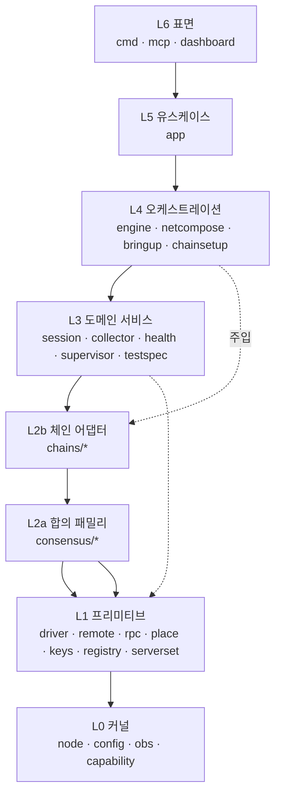

# 레이어 아키텍처 — 모듈 배치 · 의존 규칙 · 상태 소유

> 목적: 코드 복잡도를 **규칙으로** 낮춘다. 레이어를 명시하고, 의존을 단방향으로 고정하고,
> 상태를 쓸 수 있는 곳을 한정한다.
>
> 실측 기준: 2026-08-18, 내부 패키지 **57개** / 패키지 간 의존 엣지 전수 조사(`go list`).
> 관련: [[family-bringup-design]](../family-bringup-design.md) · [[server-inventory]](../server-inventory.md) · [[code-graph]](code-graph.md)

---

## 1. 진단 — 복잡도가 어디서 오는가

레이어 자체는 이미 거의 지켜지고 있다. **상향 의존은 0건이다.**

문제는 두 가지다.

1. **규칙이 문서에 없다.** 그래서 새 코드가 어느 층에 속하는지 매번 판단해야 하고,
   판단이 갈리면 조용히 무너진다. 실제로 지난주 `serverset`(L1)이 `place`를 참조하며
   경계가 애매해졌다.
2. **상태를 쓰는 곳이 14개 패키지로 흩어져 있다.** 이것이 실질 복잡도의 본체다 —
   "이 파일을 누가 썼는가"에 답하려면 14곳을 봐야 한다.

```
파일을 쓰는 패키지 14개:
  app · chainsetup · chains/wemix/deploy · consensus/upgrade · core/bringup
  core/driver · core/keyreg · core/netreg · core/obs · core/provision
  core/session · core/state · keygen · keymat
```

---

## 2. 레이어 정의와 의존 규칙

**규칙: 의존은 아래로만 흐른다. 같은 층 참조는 허용하되 순환은 금지한다.**

| 층 | 이름 | 역할 | 아는 것 / 모르는 것 |
|---|---|---|---|
| **L6** | 표면 (surface) | CLI · MCP · 대시보드. 플래그 바인딩과 렌더링만. | cobra/MCP 타입을 안다. 도메인 규칙은 모른다. |
| **L5** | 유스케이스 (use case) | 유스케이스 1개 = 함수 1개. 입출력은 평범한 struct. | 표면 타입을 **모른다**. 렌더링하지 않는다. |
| **L4** | 오케스트레이션 | 서비스들을 하나의 실행으로 조립. 순서·재시도·teardown. | 어떤 체인인지 모른다(주입받는다). |
| **L3** | 도메인 서비스 | 정책. 세션·수집·헬스·배치·검증. | 프로세스/SSH/파일을 직접 다루지 않는다. |
| **L2b** | 체인 어댑터 | 체인 1개(stablenet/wbft/wemix)의 특화. | 자기 체인만 안다. |
| **L2a** | 합의 패밀리 | 패밀리 1개(wbft/poa)의 특화. | 체인 id 를 모른다. |
| **L1** | 프리미티브 | 바깥세계와의 접점(프로세스·SSH·RPC·파일·키) + 순수 계산. | 정책이 없다. |
| **L0** | 커널 | 공용 어휘(타입). 정책도 I/O 도 없다. | 아무것도 모른다. |



점선은 **주입**이다. L4 는 체인 패키지를 import 하지 않고, L6/L5 가 조립해 넘긴 인터페이스를 받는다.
이것이 core 가 어떤 체인도 import 하지 않는다는 C6 ACL 을 유지하는 방법이다.

---

> **보정 있음**: 이 문서는 *패키지가 어느 층인지*만 답한다. *관심사의 주인이 누구인지*와
> 3체인 실행 추적은 [[module-responsibilities]](module-responsibilities.md) 에 있고,
> 거기서 이 문서의 보정 3건(B1 `testspec` 분할 · B2 노드 생명주기 소유자 · B3 관심사 열)을 제기한다.

## 3. 모듈 배치 (57개 전수)

### L0 커널 — 공용 어휘

| 패키지 | 담는 것 |
|---|---|
| `core/node` | `Node` · `NodeSet` · `Role` · `Endpoints`. **최다 피참조(25)** — 층을 잇는 공용 언어 |
| `core/config` | 평면 dot-path 설정값 |
| `core/obs` | 이벤트 타입 · `Bus`(bounded, drop-on-full) |
| `core/capability` | capability 집합 |
| `core/netid` · `core/logs` | 네트워크 id · 로그 라인 모델 |

### L1 프리미티브 — 바깥세계 접점 + 순수 계산

| 패키지 | 담는 것 |
|---|---|
| `core/driver` | 프로세스 기동/정지/provision. `Initializer`·`FileProvisioner`·`LogReader` capability |
| `core/remote` | SSH 자격증명 · 실행 · host-key 정책 |
| `core/rpc` | JSON-RPC 클라이언트 |
| `core/procman` | PID 추적 · 검증된 종료 |
| `core/provision` | `FileSink` — **타깃에 파일을 놓는 유일한 통로** |
| `core/portplan` · `core/place` | 포트 계산 · 노드 배치 (순수) |
| `core/nodeconfig` · `core/launchopt` | config.toml 렌더 · argv 조립 |
| `core/genesis` | genesis 병합·오버라이드·fork 검증 |
| `core/keys` · `core/keyreg` · `keygen` · `keymat` | 키 자료 |
| `accounts` | tx 서명(외부 SDK 래핑) |
| `core/topology` · `serverset` | 토폴로지 YAML · **서버 인벤토리(포트·호스트)** |
| `core/registry` | `ChainPlugin`/`ConsensusFamily` **인터페이스** + 레지스트리 |
| `core/consensus` · `core/preflight` | 검증자 조회 · 사전 점검 |

> `core/registry` 가 L1 인 것이 핵심이다. **인터페이스는 아래, 구현은 위**(L2)에 있고,
> 그래서 L3/L4 가 체인을 모른 채 `ChainPlugin` 만 쓸 수 있다.

### L2a 합의 패밀리 — 패밀리 특화

| 패키지 | 담는 것 |
|---|---|
| `consensus/wbft` | wbft genesis(extraData RLP) · start flags |
| `consensus/poa` | wemix config · genesis 생성 · **거버넌스/etcd 부트스트랩 프리미티브** |
| `consensus/upgrade` | 체인 핸드오프 |

### L2b 체인 어댑터 — 체인 특화

`chains/{stablenet,wbft,wemix}` (+`wemix/deploy`, `stablenet/govbind`) · `chains/external`(외부 매니페스트) · `chains/all`(등록 집합) · `chains/common`

### L3 도메인 서비스 — 정책

| 패키지 | 담는 것 |
|---|---|
| `core/session` | **아티팩트 레이아웃의 소유자.** 세션·환경·컴포지션 |
| `core/collector` | live tail · chainstate · bp 참여 · reorg |
| `core/health` | 블록 전진 판정 |
| `core/supervisor` | 기동 순서 · 헬스 게이트 · 진단 · 재시도 · teardown |
| `core/hardfork` | 업그레이드 계획/실행 |
| `core/netreg` · `core/state` | 네트워크 레지스트리 · **(레거시)** nodeset.json |
| `testspec` (+`assert`) | DSL 파싱 · 인터프리터 · 어세션 |
| `validatorset` | 검증자셋 계산 |

### L4 오케스트레이션

`engine`(엔진 조립) · `netcompose`(스텝 컴포지션) · `core/bringup`**(레거시)** · `chainsetup` · `testkit`**(레거시)** · `core/pipeline/testrun`**(레거시)**

### L5 유스케이스 — `app`

### L6 표면 — `cmd/{chainbench,chainbench-mcp,chainbenchd}` · `mcp` · `dashboard`

---

## 4. 실측 결과

```
상향 의존(위 레이어를 import): 0건
```

같은 층 참조 31건은 전부 정당한 하위 구조다.

| 층 | 같은 층 엣지 | 성격 |
|---|---:|---|
| L1 | 10 | `place→portplan`, `driver→remote` 등 — 프리미티브 간 세분화 |
| L2 | 11 | `chains/*→consensus/*` (L2b→L2a, 실제로는 하향) + 등록 집합 |
| L3 | 4 | `testspec→collector/session` |
| L4 | 3 | `netcompose→engine`, `chainsetup→engine` — 조립 공유 |
| L6 | 3 | `cmd→mcp/dashboard` |

**L2 의 11건 중 7건은 L2b→L2a 로 사실상 하향이다.** 그래서 L2 를 a/b 로 쪼개 표기했다.

---

## 5. 상태 소유 규칙 — 복잡도의 본체

> **규칙: 상태를 쓰는 곳은 두 곳뿐이다.**
> **컨트롤 플레인은 `core/session`, 데이터 플레인은 `core/provision.FileSink`.**
> 나머지 모든 패키지는 **바이트를 만들어 넘길 뿐, 어디에 쓸지 결정하지 않는다.**

### 두 개의 플레인

| | 컨트롤 플레인 | 데이터 플레인 |
|---|---|---|
| 무엇 | 실행 기록 · 판정 · 컴포지션 상태 | genesis · config.toml · datadir · 로그 |
| 어디 | **항상 조작자의 로컬 머신** | 타깃(이 머신 또는 원격 SSH 호스트) |
| 소유 | `core/session` | `core/provision.FileSink` |
| 예 | `session.json` · `env.json` · `workspace.json` · `chainstate.jsonl` | `genesis.json` · `config_nodeN.toml` · `nodeN/` |

이 분리가 로컬/원격을 분기하지 않게 해준다 — 스텝은 `Sink` 에 쓰고, 어느 머신인지는 `Target` 이 안다.

### 현재 위반 (실측 14곳 중 8곳)

| 패키지 | 무엇을 쓰나 | 판정 |
|---|---|---|
| `core/session` | 세션·컴포지션 매니페스트 | ✅ 소유자 |
| `core/provision` | 타깃 파일 | ✅ 소유자 |
| `core/driver` | config·log (LocalDriver) | ✅ 전송 계층, Sink 의 구현 짝 |
| `core/keyreg` | 키 자료(0600) | ✅ 키는 별도 소유자가 정당(보안 권한) |
| `keygen` · `keymat` | 생성한 키 | ✅ 생산물 |
| `core/netreg` | 네트워크 레지스트리 | ◐ session 으로 흡수 검토 |
| `core/obs` | 이벤트 파일 싱크 | ◐ session 으로 흡수 검토 |
| **`app`** | `topology.yaml` | ❌ **유스케이스 층이 파일 경로를 안다** |
| **`core/bringup`** | `genesis.json` 직접 쓰기 | ❌ Sink 우회 (레거시) |
| **`chainsetup`** | 자체 아티팩트 | ❌ |
| **`chains/wemix/deploy`** | 원격 config | ❌ 자체 원격 쓰기 |
| **`consensus/upgrade`** | 자체 아티팩트 | ❌ L2 가 파일을 쓴다 |
| **`core/state`** | `nodeset.json` | ❌ 레거시, 삭제 예정 |

**❌ 6곳이 정리 대상이다.** 이 중 `bringup`·`state` 는 이미 삭제 일정이 있고([[chainbench-worklist]] §1f b-6),
`app`·`chainsetup`·`wemix/deploy`·`upgrade` 는 `Sink` 경유로 바꾸는 독립 작업이다.

### 인메모리 가변 상태

| 패키지 | 상태 | 판정 |
|---|---|---|
| `core/procman` | PID 테이블 | ✅ 프로세스 소유자 |
| `core/obs` | 이벤트 버퍼(bounded) | ✅ |
| `core/collector` | 샘플 윈도우 | ✅ |
| `core/session` · `core/keyreg` · `core/capability` | 각자 소유 | ✅ |
| `engine` | 조립 시 캐시 | ◐ 검토 |
| `testkit` | 레거시 전역 케이스 레지스트리 | ❌ 삭제 예정 |

---

## 6. 패밀리 기동 설계가 앉는 자리

[[family-bringup-design]] 의 4 seam 을 레이어에 매핑하면 **새 패키지가 왜 0개인지** 드러난다.

| seam | 층 | 왜 그 층인가 |
|---|---|---|
| `Phase` · `ConsensusFamily.BringUpPhases` | **L1** (`core/registry`) | 인터페이스는 아래. 구현은 L2a |
| `PortReservation` | **L1** (`core/registry` 선언 / `core/portplan` 사용) | 순수 계산 |
| `supervisor.Deps.Action` | **L3** (`core/supervisor`) | 실행 시점·타임아웃·진단은 정책 |
| 액션 구현(거버넌스·etcd) | **L2a** (`consensus/poa`) | 이미 존재 |
| `GenesisArtifacts` | **L4** (`engine`) | 조립 산출물 |
| 유스케이스 수렴(3곳→1곳) | **L5** (`app`) | 유스케이스 1개 = 함수 1개 |

**층이 정해지면 배선이 정해진다.** L3 supervisor 는 `Action` 을 이름으로만 알고,
L5 app 이 L2a 구현을 주입한다 — L3 는 여전히 wemix 를 모른다.

---

## 7. 규칙을 어떻게 지킬 것인가

문서만으로는 무너진다. **레이어 검사를 테스트로 만든다.**

```go
// internal/architecture/layers_test.go (제안)
// TestLayering asserts that no package imports one above it. The layer map is
// the design; this test is what keeps the design and the code the same thing.
func TestLayering(t *testing.T) { ... }
```

`go list` 로 엣지를 뽑아 위 배치표와 대조하면 된다(이 문서의 수치가 그 방식으로 나왔다).
새 패키지가 배치표에 없으면 **실패**시킨다 — 그래야 "어느 층인가"를 미루지 못한다.

동일하게 **상태 규칙도 검사 가능하다**: `os.WriteFile`/`os.MkdirAll` 을 호출하는 패키지가
허용 목록 밖이면 실패.

---

## 8. 정리 순서

> **작업 순서와 상태는 [[chainbench-worklist]](../chainbench-worklist.md) §1g 에서 관리한다.**
> 이 문서는 *무엇을 왜* 를 정하고, 트래커는 *언제 어디까지* 를 기록한다.
> 순서를 여기 두면 두 곳이 갈라진다.

> A1(레이어 검사 테스트)·A2(상태 쓰기 허용목록 테스트)가 이 문서를 실행 가능하게 만든다 —
> 그것이 없으면 "상향 의존 0건"은 오늘의 사실일 뿐 내일의 보증이 아니다.
