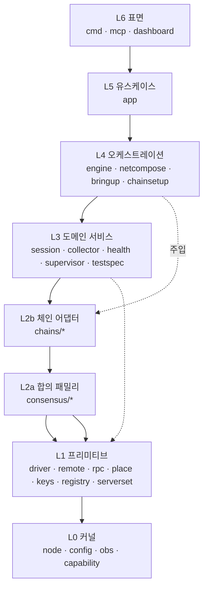

# 레이어 아키텍처 — 모듈 배치 · 의존 규칙 · 상태 소유

> **[현행 설계]** 레이어·상태·이름 세 규칙.
> 지금 향하는 목표. 근거는 정본([[chainbench-requirements-review]]·[[chainbench-feature-spec]])이고,
> 작업 순서는 [[chainbench-worklist]] §1g 다.

> 목적: 코드 복잡도를 **규칙으로** 낮춘다. 레이어를 명시하고, 의존을 단방향으로 고정하고,
> 상태를 쓸 수 있는 곳을 한정한다.
>
> 실측 기준: 2026-08-18, 내부 패키지 **57개** / 패키지 간 의존 엣지 전수 조사(`go list`).
> 관련: [[family-bringup-design]](../family-bringup-design.md) · [[server-inventory]](../server-inventory.md) · [[code-graph]](code-graph.md)

---

## 1. 진단 — 복잡도가 어디서 오는가

레이어 자체는 지켜지고 있다. **상향 의존은 0건이다** — §3 의 배치를 정본으로 삼아
`internal/` 52개 패키지의 import 그래프를 대조한 결과이며, 그 대조는 이제 테스트다
(A1, `internal/arch`).

> 이 숫자는 두 번 잘못 보고됐다. 두 번 다 원인이 같다 — 검사하는 쪽이 **이 문서를 읽지 않고
> 자기 배치 맵을 따로 들고 있었고**, 그 맵이 문서와 달랐다. 한 번은 없는 위반을 만들어냈고
> (`testkit` 을 L5 로 잘못 두어 `core/pipeline/testrun`→`testkit` 이 상향으로 보였다),
> 한 번은 맵에 없는 패키지를 조용히 건너뛰었다.
>
> 그래서 A1 은 배치를 코드에 복제하지 않고 **이 문서의 §3 표를 파싱한다.** 정본이 하나면
> 검사와 문서가 어긋날 수 없다. 표에 없는 패키지는 통과가 아니라 실패다.

문제는 두 가지다.

1. **규칙이 문서에 없다.** 그래서 새 코드가 어느 층에 속하는지 매번 판단해야 하고,
   판단이 갈리면 조용히 무너진다. 실제로 지난주 `serverset`(L1)이 `place`를 참조하며
   경계가 애매해졌다.
2. **상태를 쓰는 곳이 14개 패키지로 흩어져 있다.** 이것이 실질 복잡도의 본체다 —
   "이 파일을 누가 썼는가"에 답하려면 14곳을 봐야 한다.

```
파일을 쓰는 패키지 14개:
  app · chainsetup · chains/wemix/deploy · consensus/upgrade
  core/driver · core/keyring · core/netreg · core/obs · core/provision
  core/session
```

---

## 2. 레이어 정의와 의존 규칙

**규칙: 의존은 아래로만 흐른다. 같은 층 참조는 허용하되 순환은 금지한다.**

| 층 | 이름 | 역할 | 아는 것 / 모르는 것 |
|---|---|---|---|
| **L6** | 표면 (surface) | CLI · MCP · 대시보드. 플래그 바인딩과 렌더링만. | cobra/MCP 타입을 안다. 도메인 규칙은 모른다. |
| **L5** | 유스케이스 (use case) | 유스케이스 1개 = 함수 1개. 입출력은 평범한 struct. | 표면 타입을 **모른다**. 렌더링하지 않는다. |
| **L4** | 오케스트레이션 | 서비스들을 하나의 실행으로 조립. 순서·재시도·teardown. | 어떤 체인인지 모른다(주입받는다). |
| **L3** | 도메인 서비스 | 정책. 세션·수집·헬스·배치·검증. | 프로세스/SSH/파일을 직접 다루지 않는다. |
| **L2b** | 체인 어댑터 | 체인 1개(stablenet/wbft/wemix)의 특화. | 자기 체인만 안다. |
| **L2a** | 합의 패밀리 | 패밀리 1개(wbft/poa)의 특화. | 체인 id 를 모른다. |
| **L1** | 프리미티브 | 바깥세계와의 접점(프로세스·SSH·RPC·파일·키) + 순수 계산. | 정책이 없다. |
| **L0** | 커널 | 공용 어휘(타입). 정책도 I/O 도 없다. | 아무것도 모른다. |



점선은 **주입**이다. L4 는 체인 패키지를 import 하지 않고, L6/L5 가 조립해 넘긴 인터페이스를 받는다.
이것이 core 가 어떤 체인도 import 하지 않는다는 C6 ACL 을 유지하는 방법이다.

---

> **보정 있음**: 이 문서는 *패키지가 어느 층인지*만 답한다. *관심사의 주인이 누구인지*와
> 3체인 실행 추적은 [[module-responsibilities]](module-responsibilities.md) 에 있고,
> 거기서 이 문서의 보정 3건(B1 `testspec` 분할 · B2 노드 생명주기 소유자 · B3 관심사 열)을 제기한다.

## 3. 모듈 배치 (57개 전수)

### L0 커널 — 공용 어휘

| 패키지 | 담는 것 |
|---|---|
| `core/node` | `Node` · `NodeSet` · `Role` · `Endpoints`. **최다 피참조(25)** — 층을 잇는 공용 언어 |
| `core/config` | 평면 dot-path 설정값 |
| `core/obs` | 이벤트 타입 · `Bus`(bounded, drop-on-full) |
| `core/capability` | capability 집합 |
| `core/netid` · `core/logs` | 네트워크 id · 로그 라인 모델 |

### L1 프리미티브 — 바깥세계 접점 + 순수 계산

| 패키지 | 담는 것 |
|---|---|
| `core/driver` | 프로세스 기동/정지/provision. `Initializer`·`FileProvisioner`·`LogReader` capability |
| `core/remote` | SSH 자격증명 · 실행 · host-key 정책 |
| `core/rpc` | JSON-RPC 클라이언트 |
| `core/procman` | PID 추적 · 검증된 종료 |
| `core/provision` | `FileSink` — **타깃에 파일을 놓는 유일한 통로** |
| `core/portplan` · `core/place` | 포트 계산 · 노드 배치 (순수) |
| `core/netmap` | **노드 배치의 소유자** — NodeLabel · 역할 정규화 · Map(정/역방향) ([[netmap-design]]) |
| `core/target` | 단일 경로 문법 — 로컬/원격을 한 표기로 |
| `core/nodeconfig` · `core/launchopt` | config.toml 렌더 · argv 조립 |
| `core/genesis` | genesis 병합·오버라이드·fork 검증 |
| `core/keyring` | **키 자료의 단일 소유자** — 생성·파생(주소·devp2p·BLS·PoP, in-process)·백엔드·링·색인 |
| `accounts` | tx 서명(외부 SDK 래핑) |
| `core/topology` · `serverset` | 토폴로지 YAML · **서버 인벤토리(포트·호스트)** |
| `core/registry` | `ChainPlugin`/`ConsensusFamily` **인터페이스** + 레지스트리 |
| `core/consensus` · `core/preflight` | 검증자 조회 · 사전 점검 |

> `core/registry` 가 L1 인 것이 핵심이다. **인터페이스는 아래, 구현은 위**(L2)에 있고,
> 그래서 L3/L4 가 체인을 모른 채 `ChainPlugin` 만 쓸 수 있다.

### L2a 합의 패밀리 — 패밀리 특화

| 패키지 | 담는 것 |
|---|---|
| `consensus/wbft` | wbft genesis(extraData RLP) · start flags |
| `consensus/poa` | wemix config · genesis 생성 · **거버넌스/etcd 부트스트랩 프리미티브** |
| `consensus/upgrade` | 체인 핸드오프 |

### L2b 체인 어댑터 — 체인 특화

| 패키지 | 담는 것 |
|---|---|
| `chains/stablenet` · `chains/wbft` · `chains/wemix` | 체인 플러그인 |
| `chains/wemix/deploy` · `chains/stablenet/govbind` | 체인 특화 하위 기능 |
| `chains/external` | 외부 매니페스트 |
| `chains/all` · `chains/common` | 등록 집합 · 공통 헬퍼 |

### L3 도메인 서비스 — 정책

| 패키지 | 담는 것 |
|---|---|
| `core/session` | **아티팩트 레이아웃의 소유자.** 세션·환경·컴포지션 |
| `core/collector` | live tail · chainstate · bp 참여 · reorg |
| `core/health` | 블록 전진 판정 |
| `core/supervisor` | 기동 순서 · 헬스 게이트 · 진단 · 재시도 · teardown |
| `core/hardfork` | 업그레이드 계획/실행 |
| `core/netreg` | 네트워크 레지스트리 |
| `testspec` · `testspec/assert` | DSL 파싱 · 인터프리터 · 어세션 |
| `validatorset` | 검증자셋 계산 |

### L4 오케스트레이션

| 패키지 | 담는 것 |
|---|---|
| `engine` | 엔진 조립 · 로컬 plan/provision/launch |
| `netcompose` | 스텝 컴포지션 |
| `chainsetup` | 체인별 셋업 절차 |
| `testkit` | **(레거시)** 케이스 레지스트리 |
| `core/pipeline/testrun` | **(레거시)** 케이스 실행 |

### L5 유스케이스

| 패키지 | 담는 것 |
|---|---|
| `app` | 유스케이스 1개 = 함수 1개. cobra·MCP 타입을 모른다 |

### L6 표면

| 패키지 | 담는 것 |
|---|---|
| `mcp` | MCP 도구 — 스키마 바인딩과 렌더링 |
| `dashboard` | 대시보드 데몬 |

### 규칙 자체

| 패키지 | 담는 것 |
|---|---|
| `arch` | 이 문서의 규칙을 강제하는 테스트. 프로덕션 코드가 없고 무엇도 import 하지 않으므로 층이 없다 |

> `cmd/{chainbench,chainbench-mcp,chainbenchd}` 도 L6 이지만 표에 없다. 배치 검사는
> `internal/` 만 대상으로 한다 — `cmd` 는 정의상 최상위이고, 무엇이든 import 할 수 있다.

---

## 4. 실측 결과

```
상향 의존(위 레이어를 import): 0건 — A1 이 매 테스트마다 재확인한다
```

같은 층 참조 31건은 전부 정당한 하위 구조다.

| 층 | 같은 층 엣지 | 성격 |
|---|---:|---|
| L1 | 10 | `place→portplan`, `driver→remote` 등 — 프리미티브 간 세분화 |
| L2 | 11 | `chains/*→consensus/*` (L2b→L2a, 실제로는 하향) + 등록 집합 |
| L3 | 4 | `testspec→collector/session` |
| L4 | 3 | `netcompose→engine`, `chainsetup→engine` — 조립 공유 |
| L6 | 3 | `cmd→mcp/dashboard` |

**L2 의 11건 중 7건은 L2b→L2a 로 사실상 하향이다.** 그래서 L2 를 a/b 로 쪼개 표기했다.

---

## 5. 상태 소유 규칙 — 복잡도의 본체

> **규칙: 상태를 쓰는 곳은 두 곳뿐이다.**
> **컨트롤 플레인은 `core/session`, 데이터 플레인은 `core/provision.FileSink`.**
> 나머지 모든 패키지는 **바이트를 만들어 넘길 뿐, 어디에 쓸지 결정하지 않는다.**

### 두 개의 플레인

| | 컨트롤 플레인 | 데이터 플레인 |
|---|---|---|
| 무엇 | 실행 기록 · 판정 · 컴포지션 상태 | genesis · config.toml · datadir · 로그 |
| 어디 | **항상 조작자의 로컬 머신** | 타깃(이 머신 또는 원격 SSH 호스트) |
| 소유 | `core/session` | `core/provision.FileSink` |
| 예 | `session.json` · `env.json` · `workspace.json` · `chainstate.jsonl` | `genesis.json` · `config_nodeN.toml` · `nodeN/` |

이 분리가 로컬/원격을 분기하지 않게 해준다 — 스텝은 `Sink` 에 쓰고, 어느 머신인지는 `Target` 이 안다.

### 파일을 쓰는 패키지 (A2 가 이 표를 강제한다)

| 패키지 | 무엇을 쓰나 | 판정 |
|---|---|---|
| `core/session` | 세션·컴포지션 매니페스트 | ✅ 소유자 |
| `core/provision` | 타깃 파일 | ✅ 소유자 |
| `core/driver` | config·log (LocalDriver) | ✅ 전송 계층, Sink 의 구현 짝 |
| `core/keyring` | 키 자료(0600) · 생성한 링 | ✅ 키는 별도 소유자가 정당(보안 권한) |
| `core/netreg` | 네트워크 레지스트리 | ◐ session 으로 흡수 검토 |
| `core/obs` | 이벤트 파일 싱크 | ◐ session 으로 흡수 검토 |
| `engine` | `chainstate.jsonl` | ◐ 경로는 `session` 이 정하고 쓰기만 L4 가 한다 — netreg·obs 와 같은 모양 |
**❌ 는 0 이다**(A4b, 2026-08-23). `chainsetup`·`consensus/upgrade` 가 마지막이었고, F4·F5 가
같은 코드를 다시 쓸 때까지 미뤄뒀다가 그것이 끝난 뒤 함께 옮겼다 — 13곳의 직접 쓰기가
`provision.FileStore` 경유가 되어 두 패키지는 이 표에서 내려갔다.

`os.MkdirAll` 이 대부분 사라진 것은 부수효과가 아니다. `FileStore.Write` 가 부모 디렉토리를
만들므로, 디렉토리를 미리 만드는 코드는 **경로를 아는 코드**였고 그게 층 위반의 실체였다.
남은 읽기(`os.ReadDir`/`os.ReadFile`)는 조작자 머신의 키 preset 을 읽는 쪽이라 그대로다 —
`copyFiles` 가 **로컬에서 읽어 seam 으로 쓰는** 비대칭이 원격 배치를 가능하게 하는 지점이다.

`app`(A3)·`chains/wemix/deploy`(A4) 는 앞서 정리됐다. A3 은 정리가 아니라 **결함 수정**이었다 — 아래.

### A3 이 드러낸 것 — 원격 프로비전이 로컬에 쓰고 있었다

`app` 이 파일 경로를 아는 것은 층 위반이자 **동작 결함**이었다. 원격 타깃으로 네트워크를
구성하면 이렇게 갈렸다.

| 무엇 | 어디로 갔나 |
|---|---|
| 신원(nodekey·keystore·password) | 원격 — 런처가 드라이버에게 직접 보낸다 |
| **genesis · config.toml · topology.yaml** | **로컬** — 파일 seam 에 저장소가 주어진 적이 없어 기본값(이 머신)이 쓰였다 |

원격 노드는 genesis 없는 datadir 로 기동하게 된다. `app.Deps` 에 `Files` seam 을 더하고,
저장소를 명시하지 않았지만 드라이버가 파일을 보낼 수 있으면 **그 드라이버가 저장소**가 되게
했다 — 프로세스를 원격으로 보내면서 파일에 대해 아무 말도 하지 않았다면, 파일도 따라가라는
뜻이다.

> `engine` 은 A2 가 찾아냈다. 이전 실측이 `os.WriteFile`·`os.MkdirAll` 만 세고 `os.Create` 를
> 빠뜨려서, 표에 오르지 못한 채 3주를 지났다. 사람이 고른 패턴으로 한 번 세는 것과 매 테스트
> 재는 것의 차이가 이것이다.
>
> 이 표는 목록이 아니라 **허용목록**이다. 표에 없는 패키지가 파일을 쓰면 A2 가 실패한다.
> ❌ 는 알려진 위반이므로 통과하지만, 지워질 때 표에서도 지워야 한다 — 남아 있으면 A2 가
> "존재하지 않는 패키지"로 잡는다.

### 인메모리 가변 상태

| 패키지 | 상태 | 판정 |
|---|---|---|
| `core/procman` | PID 테이블 | ✅ 프로세스 소유자 |
| `core/obs` | 이벤트 버퍼(bounded) | ✅ |
| `core/collector` | 샘플 윈도우 | ✅ |
| `core/session` · `core/keyring` · `core/capability` | 각자 소유 | ✅ |
| `engine` | 조립 시 캐시 | ◐ 검토 |
| `testkit` | 레거시 전역 케이스 레지스트리 | ❌ 삭제 예정 |

---

## 5b. 이름 규칙 — 세 번째 규칙

> **규칙: 한 개념은 한 이름, 다른 개념은 다른 이름, 식별자는 명명된 타입.**

의존 방향과 상태 소유를 정해도, 이름이 겹치면 읽는 사람이 매번 문맥을 추론해야 한다.
이 프로젝트가 "유사하면서 다른 코드"를 반복 생산한 원인 중 하나가 이름이다.

### 5b.1 실측 — 지금 무엇이 겹치는가

| 겹치는 이름 | 개수 | 서로 다른 것들 |
|---|---:|---|
| `Node` | 2 | `node.Node`(런타임 노드) · `topology.Node`(선언). `keygen.Node` 는 `keyring.Entry` 로 통합됨 |
| `Plan` | 4 | `driver.Plan`(기동) · `hardfork.Plan`(스왑) · `upgrade.Plan`(핸드오프) · … |
| `Config` | 3 | `poa.Config`(거버넌스) · `place.Config`(포트 밴드) · `serverset.Config`(인벤토리) |
| `Step` | 4 | `session.Step`(스탬프) · `poa.Step`(부트스트랩 단계) · … |
| `capability` | 2 **패키지** | `engine/capability`(DSL 게이팅) · `core/capability`(표면 카탈로그) |
| `Name string` | **12 필드** | 노드 라벨 · 키 이름 · 서버 이름 · 테스트 이름 · 기능 이름 … |

`Name string` 12곳이 가장 나쁘다. **전부 무명 `string`** 이라 타입이 아무것도 구분해 주지 않고,
호출부에서 노드 라벨 자리에 계정 라벨을 넣어도 컴파일러가 잡지 못한다.

### 5b.2 규칙

1. **경계를 넘거나 map 키가 되는 식별자는 명명 타입으로 만든다.**
   구조체 안에 머물며 통째로만 쓰이면 `Name` 도 무방하다 — `Server.Name` 은 문맥 안에서 모호하지 않다.
   **문제는 단어가 아니라 무명 `string`** 이다: 값이 홀로 돌아다니는 순간 무엇의 이름인지 사라진다.

   ```go
   func Endpoint(s string) …      // 무엇의 string 인가
   func Endpoint(n NodeLabel) …   // 명확
   Fund(node NodeLabel, acct AcctLabel)   // 뒤바꾸면 컴파일 실패
   ```

   이 기준으로 실측 12곳을 나누면 — `place.NodeReq.Name`(netmap 으로 넘어가고 키가 됨) ·
   `serverset.Server.Name`(`--server` 조회 키) · `capability.Name`(레지스트리 키)은 **타입 필요**,
   `session.record.Name`(기록 안에 머묾)은 **그대로 둬도 된다.**
2. **한 개념 = 한 단어.** 같은 것을 `Name`/`Label`/`ID` 로 번갈아 부르지 않는다.
3. **다른 개념 = 다른 단어.** `Plan` 이 셋을 뜻하면 각각 무엇의 계획인지 이름에 넣는다.
4. **`Config`·`Options`·`Data` 처럼 아무것도 말하지 않는 이름을 피한다.**
   `poa.Config` 가 거버넌스 설정이면 `poa.Governance`.
5. **패키지 이름이 역할을 말한다.** `core`·`testspec` 처럼 무엇인지 모르는 이름은 리팩토링 대상이다.

### 5b.3 리팩토링에서의 개명 (제안)

| 지금 | 제안 | 왜 |
|---|---|---|
| `place.NodeReq.Name` · `NodePlacement.Name` | `netmap.NodeLabel` | 노드를 지칭하는 유일한 이름. 계정 라벨과 타입으로 구분 |
| (없음) | `netmap.AcctLabel` | `account1`·`faucet` — tx 의 from/to 에 쓰인다 |
| `hardfork.Plan` + `upgrade.Plan` | `hardfork.Plan` 하나 | 아래 §5b.3a·b |
| ~~`keygen.Node`~~ | `keyring.Entry` | ☑ **완료** — 신원 타입 5개가 하나로 |
| `topology.Node` | `blueprint.NodeSpec` | 선언이지 실행 중 노드가 아니다 |
| `driver.Plan` | `driver.LaunchPlan` | 무엇의 계획인지 |
| `hardfork.Plan` · `upgrade.Plan` | **`hardfork.Plan` 하나로 통합** | `upgrade` 는 hardfork 의 한 종류다 (§5b.3a·b) |
| `poa.Config` | `poa.Governance` | 거버넌스 설정이다 |
| `place.Config` | `place.Bands` | 포트 밴드다 |
| `serverset.Config` | `serverset.Inventory` | 파일 이름과도 맞는다 |
| `poa.Step` | `poa.BootstrapStep` | `session.Step` 과 구분 |
| `core/capability` | `feature`(카탈로그) | `engine/capability`(게이팅)와 무관하다 |
| `testspec` | `dsl` + `dsl/interp` | 언어와 엔진 |

#### 5b.3a `hardfork` 는 상위 범주다 — `upgrade` 는 그 한 종류 (정정)

**앞서 나는 `hardfork` 를 "같은 체인"으로 좁히자고 적었다. 틀렸다.**
바이너리가 바뀌고 그 시점부터 합의가 달라지면 **전부 하드포크**이고,
go-wemix → go-wbft 도 그중 하나다.

**이것은 새 판단이 아니다 — 이 프로젝트의 요구 문서가 처음부터 그렇게 정의했다:**

```
chainbench-requirements-review.md §D-2.8
  "하드포크 2종: ① 체인 업그레이드(go-wemix→go-wbft, 서로 다른 바이너리 동시=handoff)
                ② 동일체인 하드포크(fork 블록 전에 fork-aware 바이너리로 교체)"
  "환경은 node→(binary, buildVersion) 집합"

chainbench-feature-spec.md
  "type-1(체인 업그레이드) / type-2(동일체인, supervisor.ForkSwaps)"
```

코드 주석도 같다:

```go
// consensus/upgrade/plan.go — 패키지 자신의 설명
// "a single, validated launch plan for a hardfork handoff"

// supervisor.go
// ForkSwaps schedules same-chain (type-2) binary swaps before a fork block.
// Type-1 (a chain upgrade / handoff) needs no swap — those nodes run
// different binaries from the start.
```

| 종류 | 무엇이 바뀌나 | 재기동 | 사전조건 |
|---|---|---|---|
| **type-2 스왑** | 같은 노드가 바이너리 교체 | **필요** — 포크 블록 **전에** 끝나야 하고, 늦으면 실패다 | — |
| **type-1 핸드오프** | 후계자가 **처음부터 다른 바이너리**로 동시 기동, 포크에서 생산 주체가 넘어감 | 없음 | 후계자가 동기화 + unlock |
| *(설정만)* | 바이너리 그대로, genesis 의 포크 블록만 이동 | 없음 | — |

세 번째는 `hardfork:` 선언 대상이 아니다 — **하나의 바이너리가 양쪽 규칙을 다 알기 때문**이고,
`genesis.overrides.<fork>Block` 이 이미 그 자리다.

#### 5b.3b 통합안 — 선언은 하나, 메커니즘은 파생

실행 방식은 실제로 다르지만 그것은 **선언이 아니라 실행의 차이**다.
이 프로젝트는 같은 문제를 `Family.BringUpPhases` 로 이미 풀었다 — **데이터로 선언하고 페이즈를 파생**한다.

```go
type Hardfork struct {
    Name    string                       // "croissant" · "boho"
    AtBlock uint64
    BinaryAfter    map[NodeLabel]string  // 포크 이후 바이너리. 전과 같으면 스왑 없음
    ProducersAfter []NodeLabel           // 포크 이후 생산 주체. 비면 순수 스왑
}

// 메커니즘은 파생이다 — 선언하지 않는다.
func (h Hardfork) Swaps(pre map[NodeLabel]string) []Swap
func (h Hardfork) IsHandoff() bool
```

실제 사례 대입:

| 사례 | `BinaryAfter` | `ProducersAfter` | 파생 |
|---|---|---|---|
| gstable v1→v2 @N | `{bp01..04: v2}` | 없음 | type-2 스왑 |
| wemix→wbft @100 | 없음(v01 이 처음부터 gwbft) | `[v01..04]` | type-1 핸드오프 |
| boho @10 | 없음 | 없음 | 하드포크 선언 대상 아님 → genesis 설정 |

아래 통합안은 **새 제안이 아니라 §D-2.8 을 자료구조로 옮긴 것**이다.
`node→(binary, buildVersion)` 집합이 곧 `BinaryAfter` 이고, handoff/swap 구분이 곧 파생 규칙이다.

**통합이 낫다고 보는 근거 넷**: (1) 선언이 하나로 접힌다 — 지금은 명령 둘에 플래그가 다르다.
(2) 파생 로직이 "바이너리가 바뀌나 / 생산자가 바뀌나" 두 질문뿐이라 작고 테스트 가능하다.
(3) 코드 자신의 표현과 일치한다. (4) `hardfork --to-chain` 은 겹침이 아니라
**같은 것의 두 모습**이었으므로 겹침 자체가 소멸한다.

실행 분기는 남지만 **다른 모든 패밀리 분기가 이미 가 있는 자리(페이즈 목록)로** 옮겨갈 뿐이다.

> 개명은 **한 번에 하지 않는다.** 각 리팩토링 항목이 자기 범위의 이름을 함께 고친다 —
> 개명만 하는 커밋은 리뷰가 어렵고, 동작 변경과 섞이면 더 어렵다.

### 5b.4 강제

이름 규칙은 의미를 다루므로 완전 자동화는 안 된다. 다만 **겹침 검출은 가능하다**:

```
exported 식별자가 2개 이상 패키지에 같은 이름으로 존재하면 보고한다.
허용 목록(New · Deps · Options 등 관용)은 명시한다.
```

A1·A2(레이어·상태 검사)와 같은 자리에 A7 로 둔다.

---

## 6. 패밀리 기동 설계가 앉는 자리

[[family-bringup-design]] 의 4 seam 을 레이어에 매핑하면 **새 패키지가 왜 0개인지** 드러난다.

| seam | 층 | 왜 그 층인가 |
|---|---|---|
| `Phase` · `ConsensusFamily.BringUpPhases` | **L1** (`core/registry`) | 인터페이스는 아래. 구현은 L2a |
| `PortReservation` | **L1** (`core/registry` 선언 / `core/portplan` 사용) | 순수 계산 |
| `supervisor.Deps.Action` | **L3** (`core/supervisor`) | 실행 시점·타임아웃·진단은 정책 |
| 액션 구현(거버넌스·etcd) | **L2a** (`consensus/poa`) | 이미 존재 |
| `GenesisArtifacts` | **L4** (`engine`) | 조립 산출물 |
| 유스케이스 수렴(3곳→1곳) | **L5** (`app`) | 유스케이스 1개 = 함수 1개 |

**층이 정해지면 배선이 정해진다.** L3 supervisor 는 `Action` 을 이름으로만 알고,
L5 app 이 L2a 구현을 주입한다 — L3 는 여전히 wemix 를 모른다.

---

## 7. 규칙을 어떻게 지킬 것인가

문서만으로는 무너진다. **레이어 검사를 테스트로 만든다.**

```go
// internal/architecture/layers_test.go (제안)
// TestLayering asserts that no package imports one above it. The layer map is
// the design; this test is what keeps the design and the code the same thing.
func TestLayering(t *testing.T) { ... }
```

`go list` 로 엣지를 뽑아 위 배치표와 대조하면 된다(이 문서의 수치가 그 방식으로 나왔다).
새 패키지가 배치표에 없으면 **실패**시킨다 — 그래야 "어느 층인가"를 미루지 못한다.

동일하게 **상태 규칙도 검사 가능하다**: `os.WriteFile`/`os.MkdirAll` 을 호출하는 패키지가
허용 목록 밖이면 실패.

---

## 8. 정리 순서

> **작업 순서와 상태는 [[chainbench-worklist]](../chainbench-worklist.md) §1g 에서 관리한다.**
> 이 문서는 *무엇을 왜* 를 정하고, 트래커는 *언제 어디까지* 를 기록한다.
> 순서를 여기 두면 두 곳이 갈라진다.

> A1(레이어 검사 테스트)·A2(상태 쓰기 허용목록 테스트)가 이 문서를 실행 가능하게 만든다 —
> 그것이 없으면 "상향 의존 1건"은 오늘의 측정일 뿐 내일의 보증이 아니며, 측정 자체가
> 자기 맵에 없는 패키지를 조용히 건너뛴다.
