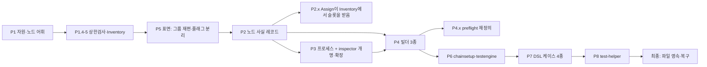

# 모듈 재편 계획 — 자원 · 노드정보 · 프로세스, 그리고 빌더 셋

> **[현행 설계]** 아키텍처 v2(§모듈 경계)를 이어받아, 남은 재편을 **관심사 단위**로
> 다시 그린다. 모듈 경계는 [[architecture-v2]](architecture-v2.md) 가 이기고,
> 작업 순서·상태는 [[chainbench-worklist]](../chainbench-worklist.md) 가 이긴다.
> 이 문서는 그 사이를 잇는 **이동표**다.
>
> 실측 기준: 2026-08-27 · main `a63b500` · `go run ./scripts/inventory/code-graph -symbols .`
> (패키지 75 · 엣지 268 · 선언 2,860 · 내부 코드 30.3k줄).
> **P1 완료 후(2026-08-28)**: 패키지 71 · 엣지 246. §2 의 "지금 위치" 서술 중 P1 이
> 옮긴 것은 완료 상태가 §4·§8 에 적혀 있다 — 어긋나 보이면 §8 이 이긴다.

## 0. 한 장 요약

지금 코드는 **관심사가 아니라 파이프라인 단계로 잘려 있다.** 그래서 같은 개념이
여러 이름으로 여러 번 나타난다. 실측이 말하는 세 가지다.

| 실측 | 수치 | 어디에 |
|---|---|---|
| "노드 하나"를 뜻하는 타입 | **10개** | driver·upgrade·chainsetup×3·collector·node·topology·process·deploy |
| 노드를 띄우는 진입점 | **8개** | chainsetup×4 · driver×2 · upgrade · supervisor |
| 경로를 계산하는 곳 | **4곳** | netmap.Layout · session×5 · chainsetup.Workspace · deploy.RemotePaths |

한 패키지가 이 모두를 안고 있다. `chainsetup` **6,593줄 27파일**로, 내부 코드의
22%다. 여기서 관심사를 뽑아내는 것이 이번 재편의 본체다.

목표 모듈은 여섯이고, 그 위에 표면 둘, 그 위에 오케스트레이션 둘이 온다.

부서 이름은 **그 부서가 소유한 대상**으로 짓는다. 재무팀이 재무를, 개발팀이 개발을
소유하듯이 — 간판이 산출물(`layout`)도 동작(`assign`)도 아니어야 한다(§6).

```
표면        cmd(cli)                    mcp
             │                           │
오케스트레이션  chainsetup  ───────────  testengine
             │                           │
빌더        genesis    nodeconfig      dsl
             └───────────┬─────────────┘
             ┌───────────┴─────────────┐
자원 resource ────────────────→ 노드 node ←────── 프로세스 process
             ↑                                        ↑
          inspector (요청 시 실사)  ←──────  preflight (현재 vs 목표 비교)
```

**자원이 정하고, 노드가 기록하고, 프로세스가 돌린다.** 그 옆에 둘이 선다:
**inspector 는 요청받으면 실물을 보고, preflight 는 그것으로 현재와 목표를
비교한다**(§2 M7·M8).

## 1. 방법 — 그래프를 먼저 갱신하고 시작한다

모든 단계는 **재측정으로 열고 재측정으로 닫는다.** 도구는 빌드 없이 go/ast 만 쓴다.

```bash
go run ./scripts/inventory/code-graph .           > graph.json   # 패키지·엣지
go run ./scripts/inventory/code-graph -symbols .  > symbols.json # + 선언 2,860개
```

`-symbols` 는 선언마다 `pkg · file · line · kind · name · recv · sig · doc · lines`
를 낸다. "이 관심사를 지금 누가 구현하고 있나", "같은 계산이 몇 곳에 있나" 는
패키지 그래프가 아니라 이 인벤토리가 답한다. 단계마다 **착수 전 스냅샷**과
**완료 후 스냅샷**을 떠서 `docs/dev/architecture/code-graph.md` §2~§3 을 갱신한다.

단계의 완료 판정은 말이 아니라 숫자다. 아래 각 단계의 **게이트**는 전부
재측정으로 확인할 수 있는 형태로 적었다.

## 2. 목표 모듈 — 무엇을 소유하고 무엇을 소유하지 않는가

### M1 자원 (`resource`) — 어디에 놓을 수 있고 어떻게 닿는가

| 소유 | 소유하지 않음 |
|---|---|
| 서버 정보(local · remote · docker) 로딩·검증 | 노드가 무엇인지 |
| 접속 자격 · 호스트키 정책 · 주소 치환 | 프로세스 |
| 가용 자원 풀(호스트 × 포트 슬롯) · 포트 밴드 산술 | 체인 의미론 |
| 결정적 배정 — 풀과 요청을 받아 **노드 사실을 만들어 넘긴다** | 키 파생 |
| 서버 이름 → 능력 손잡이(유일 다이얼 지점) | |
| **가용/할당 현황(`Inventory`)** — 몇 노드가 배정됐고 몇 자리가 남았는가 (§2a) | |

지금 위치: `netmap/internal/serverset`(1,028) · `netmap`(261) ·
`core/netmap` 의 pool.go(145) · `core/portplan`(184).
의존은 `resource → node` 한 방향이다.

**이름.** `netmap` 은 은유(지도)라 업무를 말하지 않았고, 코드의 3분의 1만
설명했다 — 서버 세트·자격증명·호스트키·docker 치환·다이얼 바인딩 1,257줄(65%)은
지도가 아니다. `resource` 는 저장소에 충돌이 없고(실측 0건), 인벤토리·분배·접속을
한 간판이 덮는다. 후보 비교는 §6.

### M2 노드 (`node`) — 노드 하나에 대해 아는 모든 것

한 노드의 사실을 한 곳에 모은다.

```
label · role · enode · host · ports(p2p/etcd/http/ws/auth/metrics)
data root · binary path · node data dir · genesis path · config path
key path · nodekey path · pid · process state
```

여기에 **사실에서 파생되는 질문**이 붙는다 — 누가 어디 있나(`Map`), 누가 누구를
다이얼하나(`Peering`), 이 노드의 경로는 어디인가(`Layout`).

**새 패키지를 만들지 않는다.** `core/node` 가 이미 그 부서다: import 0(L0), 소비자
26곳. 위 사실은 전부 문자열과 정수라 옮겨도 의존이 늘지 않는다. 포트도 이미
`node.Endpoints` 가 정본이고 `portplan.Ports`·`netmap.Ports` 가 그 별칭이다.

지금 이 사실들은 **10개 타입에 흩어져** 있고, 어느 것도 전부를 갖지 않는다.

| 타입 | 위치 | 갖고 있는 것 |
|---|---|---|
| `driver.NodeSpec` | `core/driver/driver.go:19` (15줄) | 기동 입력(binary·args·datadir) |
| `upgrade.NodeSpec` | `consensus/upgrade/plan.go:74` (21줄) | 핸드오프용 재정의 |
| `chainsetup.NodeState` | `workspace.go:41` (38줄) | 워크스페이스가 기억하는 상태 |
| `chainsetup.NodeStatus` | `state.go:45` (10줄) | 조회 결과 |
| `chainsetup.PlacedNode` | `plan.go:16` (4줄) | 배치+계획 |
| `collector.NodeState` | `collector_impl.go:30` (6줄) | 수집 시점의 상태 |
| `node.Node` | `core/node/node.go:61` (21줄) | 런타임 노드(L0 어휘) |
| `topology.Node` | `core/topology.go:33` (6줄) | 선언된 노드 |
| `process.Proc` | `core/process/process.go:29` (16줄) | pid·머신·바이너리 |
| `deploy.BuildNodeSpec` | `chains/wemix/deploy/plan.go:60` (27줄) | wemix 원격 전용 |

경로 계산도 같은 모양이다. `netmap.Layout` 이 datadir·config·log·genesis 넷을
계산하는데, `session` 이 다섯을 따로 계산하고(`env.Dir`·`DataPath`·`LogPath`·
`ChainstateDir`·`SessionDir`), `chainsetup.Workspace.Dir` 와 `deploy.RemotePaths` 가
또 따로 계산한다.

**설계 방향**: `node` 가 사실 레코드를 소유하고 나머지는 참조한다.
`driver.NodeSpec` 은 남되 레코드에서 파생되는 **기동 입력 뷰**가 된다.

### M3 프로세스 (`process`) — 실행·정지·제거·배포·조회·수집

지금 `core/process`(455)가 대장(`Ledger`)과 관리자(`Manager`)를 갖고, `core/driver`
(773)가 local/remote 실행을 갖는다. 그 위에 **진입점이 8개** 겹쳐 있다.

| 진입점 | 위치 | 무엇이 다른가 |
|---|---|---|
| `LocalLauncher.Launch` / `LaunchArmed` / `InitAndLaunch` | `chainsetup/launcher.go` 64·78·230 | 세 변형이 한 파일에 |
| `LocalSetup.Launch` | `chainsetup/locallaunch.go:54` | 정적 셋업 경로 |
| `NodeController.Launch`/`Start`/`Stop` | `chainsetup/nodecontrol.go` | 단일 노드 제어 |
| `Handoff.Launch` | `consensus/upgrade/handoff.go` (P6.3 에서 `chainsetup/handoff_driver.go` 에서 이동) | 핸드오프 |
| `upgrade.Launch` | `consensus/upgrade/exec.go:165` (44줄) | 혼합 바이너리 |
| `supervisor.BringUp` | `core/supervisor` (51줄) | 단계+진단 |
| `driver.{Local,Remote}.Launch` | `core/driver` | 실제 실행 |
| `driver.StopNode`/`StopNodeSet`/`RelaunchNode` | `core/driver/lifecycle.go` | 자유 함수 |

**설계 방향(정정 2026-08-28)**: 실행은 `driver` 한 층. 정책은 방향에 따라 둘이다 —
**띄우는 정책은 `launcher`**(어떻게 띄우나 `Direct` + 올라올 때까지 어떻게 반복하나
`Launcher`), **죽이는 정책은 `process`**(pid 대장 + SIGTERM→grace→SIGKILL→검증).
진입점은 8 → **3** 이다. "8 → 2" 는 억지였다: 기동과 종료는 층이 아니라 방향이 다르고,
이름이 둘인 것이 정직하다.

**이름 결정(사용자, 2026-08-28).** 옛 `core/supervisor` 는 sudo 와 무관한 기동 재시도
정책이었는데(실측: 패키지 안에 sudo·권한 언급 0), "supervisor" 는 sudo 승격 역할로
읽힌다. 그 뜻은 이미 `resource` 의 `ssh.sudo`(허용 선언)와 `driver.SSHSudoRunner`
(승격 실행)에 있다. `runner` 는 아래층에서 "명령 하나 실행" 으로 이미 네 번 쓰여
충돌한다. **`launcher`** 로 확정 — 코드가 이미 `chainsetup.LocalLauncher` 로 부르던
아래 절반과 `supervisor` 의 위 절반이 한 일의 두 조각이었다.

**P3.1 결과(2026-08-28).** `core/launcher` 신설 = `core/supervisor` + `chainsetup.LocalLauncher`
(→`Direct`) + `driver/lifecycle.go`. `supervisor` 낱말은 코드에서 0. `node.Node` 를 기동에서
조립하는 곳 **4 → 1**(`driver.NodeOf`; hardfork 의 loopback 리터럴, upgrade·relaunch 의
사본 소멸). `workspace.go` 의 `Endpoints` 필드별 복사(etcd 포트가 또 빠지던 곳)를 통째
복사로. `chainsetup` 6,593 → 6,256줄.

**P3.2 결과(2026-08-28).** pid 를 기억하는 곳 **3 → 모드당 1**. 엔진 실행에서는
`session.Environment` 의 노드표가, 조립에서는 `node.Record.PID` 가 기록이고,
`process.Manager` 는 teardown 용 장부(pid+datadir, 죽은 것 포함)라 다른 관심사다.
`NodeController` 의 사설 pid 맵이 세 번째 사본이었고 이것을 지웠다 —
`launcher.Controller` 는 **arming 만** 기억하고, `testspec.NodeControl.Stop/Start` 가
갱신된 노드를 돌려주면 fault 액션이 `Env.UpdateNode` 로 노드표에 써넣는다.
`chainsetup` 6,256 → 6,123줄.

### M4 genesis 빌더

지금 네 층에 걸쳐 있다. `core/genesis`(340: `Build`·`BuildNetwork`·`Customize`·
config 병합·fork 검증) → `consensus/{poa,wbft}.BuildGenesis` → `chains/*.GenesisTemplate`
→ `chainsetup/genesis.go`+`wemixgenesis.go`(360, `GenesisSource` 3종) →
`registry.GenesisSpec`. 소스 선택(`GenesisSourceFor`)이 `chainsetup` 과
`testengine` 양쪽에 있다.

**설계 방향**: `genesis` 가 소스 선택·병합·오버레이·검증을 전부 소유하고,
체인/패밀리는 **템플릿과 extraData 만** 제공한다. `chainsetup` 에는 호출만 남는다.

**P4.1 결과(2026-08-28).** `core/genesis` 가 `Source`·`Request`·`Artifacts`·`Config`·
`PresetSource`·`Compose`(소스 + 오버라이드 + 오버레이 + fork 검증)·`SourceFor` 를 소유한다.
소스 선택에 **패밀리 id 분기가 0**: 패밀리가 `genesis.SourceProvider`(`GenesisSource(cfg)`)를
선언하면 그것을, 아니면 프리셋 치환을 쓴다 — 타입 단언이라 `core/genesis` 는 어떤
패밀리도 이름 부르지 않는다. wemix 소스(`WemixGenesisSource`)는 poa 지식이라
`consensus/poa.GenesisSource` 로 갔고, `Family` 가 그 capability 를 구현한다.
호출자 5곳(`steps_compose`·`static`·`wemix`·`locallaunch`·`buildenv`)이 전부
`genesis.Compose` 또는 주입된 `genesis.Source` 를 부른다. `genesisArtifacts` 의
"poa 일 때만 배치를 넘긴다" 분기도 없앴다(배치는 항상 넘기고 안 쓰는 패밀리는 무시).
`chainsetup` 은 이제 파일을 직접 쓰지 않는다(전부 file seam) — layers §5 표에서 빠졌다.
`chainsetup` 6,123 → 5,828줄.

### M5 config 빌더

**사실상 비어 있다.** `core/nodeconfig` 는 134줄뿐이고(`Params`·`Generate`·
`LaunchArgs`), 실제 렌더는 `chainsetup/steps_compose.go` 의 `Config` 단계에 있다.
한편 `core/launchopt` 935줄이 실행 인자를 소유한다. **파일 설정(TOML)과 실행
인자(argv)가 같은 관심사의 두 표현인데 소유자가 둘**이다.

**설계 방향**: `nodeconfig` 가 "노드 하나의 구성" 을 소유하고, TOML 과 argv 는
같은 입력에서 나오는 두 렌더러가 된다. `launchopt` 는 argv 렌더러로 그 안에 든다.

**P4.2 결과(2026-08-28).** `nodeconfig.Spec` 이 단일 입력(체인 사실 `Chain` + 역할·포트·
경로·신원·피어 목록), `TOML(spec)` 과 `Argv(spec, overrides…)` 가 두 렌더러. 파일이
담는 것은 명령줄에 반복하지 않는다는 규칙이 코드에 있다(`ConfigPath` 가 있으면
`--authrpc.port` 를 내지 않는다). Spec 조립은 `launcher.NodeConfig`(플랜+키셋에서) 한 곳이고,
compose 의 config·launchopts·start 세 단계가 `chainsetup.peerPlan` 으로 같은 네 입력
(키셋·배치·피어링·공개키)을 모아 그것을 부른다. 이전에 config 단계는 Params 를 손으로
채우고 launchopts 는 `launcher.NodeLaunchArgs` 를 불렀다 — 두 렌더가 각자 입력을
재조립하던 것이 사라졌다. `upgrade.LaunchArgs` 와 wemix4 원격 `deploy` 의 평평한
`LaunchArgs` 도 `Argv` 를 거친다(argv 조립 3 → 1). 착수하며 잡은 결함 하나:
`driverSpec` 이 `SyncMode` 를 빠뜨려 config 에는 닿고 argv 에는 안 닿던 것.
**`launchopt` 디렉터리는 그대로다.** "편입" 은 소유의 문제로 풀었다: 노드를 대변해 argv 를
만드는 호출자는 `nodeconfig.Argv` 뿐이고, 다른 소비자 5곳은 `Override` 값만 만든다. 1,3k줄
방언표를 디렉터리째 옮기는 것은 이름만 바꾸는 일이라 하지 않았다.

### M6 dsl — 정의와 파서

`testspec` 3,520줄 15파일 + `testspec/assert` 368줄. 큰 파일이 관심사를 겸한다.

| 파일 | 줄 | 심볼 | 무엇이 섞여 있나 |
|---|---|---|---|
| `builtins.go` | 521 | 47 | **액션 구현**(테스트가 실제로 하는 일) |
| `read.go` | 498 | 27 | 읽기 어세션 + RPC 호출 |
| `spec_v2.go` | 395 | 23 | v2 문법 정의 |
| `derived.go` | 392 | 18 | 파생 값 계산 |
| `fault.go` | 283 | 23 | 장애 주입 액션 |
| `assets.go` | 239 | 13 | 컨트랙트·자산 액션 |

**설계 방향**: `dsl`(문법·파싱·검증) / `interp`(해석·바인딩) / **액션 구현은
`test-helper` 로**(§6). 지금 `builtins`·`read`·`fault`·`assets` 1,541줄이 액션이고,
이것이 마지막 단계에서 옮겨갈 몸통이다.

**P4.3 결과(2026-08-28).** `testspec`(9파일 1,432줄)은 문법·파싱·검증·해석기·바인딩만
남았고, 액션·어세션·리더 구현 7파일 2,129줄(테스트 포함)은 **`internal/testhelper`** 로
갔다 — P8 이 testkit·tests 공통부를 모을 바로 그 모듈이다. 경계는 `testspec.Registry` 다:
`Action`·`Assertion` 에 **`Reader`** 를 더해 "read/waitFor 가 어디서 읽나" 도 등록으로
답하게 했고(전에는 `Unresolved` 가 액션 파일의 `readerFor` 를 직접 불러 문법이 액션을
알았다), `NewRegistry()` 는 빈 레지스트리를 주며 `testhelper.Register(r)`/`Registry()` 가
내장 어휘를 얹는다. 문법이 아는 액션 이름은 `ActionRead` 하나뿐이다(read 의 source 를
오프라인 검증하려면 그 이름은 알아야 한다). `NodeControl` 계약과 `BigString` 은 testspec
쪽으로 올라왔다(액션이 아니라 계약·표기). **게이트: `testspec → testhelper` import 0.**
`dsl`/`interp` 두 패키지로 더 가르는 것은 하지 않았다 — 1,432줄에 소비자 5곳이라 가르면
경계만 하나 늘고 얻는 것이 없다.

### M7 inspector — 요청 시 실사 (결정 2026-08-28)

지금의 `core/occupancy`(129줄, 포트만 찔러봄)를 개명·확장한다. 소유하는 질문은
**"타깃이 지금 실제로 어떤 상태인가"** 다:

- ip 가 살아 있는가 · port 가 비어 있는가
- 경로가 유효하고 사용 가능한가 — data root · node data dir · genesis ·
  keystore · nodekey · config · log · binary

**요청에 의해서만 확인한다.** 상시 감시가 아니다. 사실만 답하고 판단하지 않는다
(판단은 preflight 의 일이다).

이름 `inspector` 는 사용자 확정(2026-08-28). 주의 둘: `inspector.Inspector` 는
stutter 이므로 타입은 `Report`·`Check` 등으로 짓는다. `driver.ProcessInspector`
인터페이스와는 패키지가 달라 충돌은 아니나, P3(프로세스) 때 어휘를 함께 본다.

**P3.3 결과(2026-08-28).** `core/inspector` = 옛 `core/occupancy` + 두 질문.
`Ports(addrs)`(옛 `Scan`) · `Paths(store, paths)` · `Hosts(hosts, dial)`. 타입은
`Addr`·`Path`·`Host`(stutter 없음). 의존은 `filestore`·`node` 뿐이라 L1 에 그대로.
첫 소비는 `net start` 의 `checkPaths` — 기동 직전에 각 노드의 머신에서 binary·genesis·
datadir·config 존재를 묻고, 빠진 것을 "무엇(node2 config) on server1" 로 보고한다.
`preflight` 재정의(M8, P4.x)는 이 셋을 조합해 현재와 목표를 비교한다.

### M8 preflight — 현재 vs 목표 비교 (역할 재정의, 결정 2026-08-28)

지금의 `core/preflight` 는 계획의 자기모순만 본다(네트워크 id 균일 · 포트 겹침 ·
genesis 포크 절). 재정의된 역할은 **테스트를 연속 수행할 때 재구성 비용을 없애는
것**이다:

1. 타깃에 지금 구성된 체인 환경을 분석한다
2. 그것이 정상 동작 중인지 **inspector 로** 확인한다
3. 다음 테스트가 요구하는 환경과 비교한다
4. 같으면 재구성 없이 그대로 쓰고, 다르면 **어디까지 다시 만들지** 알려준다 —
   5번 서버만 고치면 되는지, 전체를 다시 세워야 하는지

설정 파일 비교만으로는 부족하다: 파일이 같아도 앞선 테스트가 노드 몇 개를 비정상
상태로 남겼을 수 있다. 그래서 preflight 는 **inspector 를 사용하는 쪽**이다.

지금 안에 있는 계획 검사는 각 빌더로 흩어진다 — 포트 충돌은
`resource.ValidatePorts`(이미 그렇다), genesis 포크 검사는 genesis 빌더(M4),
네트워크 id 균일성은 config 빌더(M5)로. **자기 산출물은 자기 빌더가 검사한다.**

**P4.x 결과(2026-08-28).** `core/preflight` 는 이제 **판단만** 한다: `Have`(타깃에 조립된
체인 — chainsetup 이 워크스페이스 기록에서 읽음) 대 `Want`(다음 테스트가 원하는 체인 —
`NetUpIn` 에서), `Compare` 가 종이 위에서 `reuse` / `rebuild-nodes N` / `rebuild-all` /
`compose` 를 내고, `Check` 가 주입된 liveness(pid 는 그 노드의 머신에서, RPC head 는 그
노드의 주소에서)로 죽은 노드를 재구성 목록에 더한다. 네트워크 전체 사실(체인·키·genesis
해시·피어링·노드 수·시작 여부)이 다르면 rebuild-all, 노드 하나의 사실(동기화 모드·서버)이
다르거나 죽어 있으면 그 노드만, 전부 죽어 있으면 rebuild-all(노드 루프가 아니라 조립이
되살린다). `app.RunSuite` 가 `NetUp` 전에 이것을 물어 reuse 면 건너뛰고, rebuild-nodes 면
그 노드만 `NetRestart`, 아니면 `NetUp` 한다 — 결정은 `RunSuiteOut.Preflight` 에 남는다.
옛 계획 검사(`NetworkPlan`/`Validate`)의 유일한 소비자는 핸드오프였고, 그 검사는
`consensus/upgrade.NetworkPlan.validate` 로 갔다(netid·ports·forks 는 각 빌더 함수 호출,
"검증자는 멤버가 아니다" 는 핸드오프 자신의 규칙). 의존은 `node` 뿐이다.
`Want.Nodes` 는 명명된 노드의 사실을 고정할 뿐 노드 수가 아니다(테스트가 잡은 실수).

### 2a. `resource.Inventory` — 가용과 할당의 관리 주체 (결정 2026-08-28)

서버 세트의 정보를 관리하는 모듈(resource)이 **사용할 수 있는 것과 할당된 것**을
관리한다. ip·port 가 필요한 곳은 여기서 할당받는다. 그래야 총 몇 노드가 배정됐고
몇 자리가 남았는지가 한 곳에서 관리된다.

```go
// Inventory is one server set's live view: what it offers, and what has
// been handed out. One instance per set, in memory for the process's life.
type Inventory struct {
    pool  Pool
    taken map[Slot]Holder
}
type Slot   struct { Host string; Index int } // 포트는 밴드에서 계산된다
type Holder struct { Network string; Node string }

func Open(setPath string) (*Inventory, error)
func (i *Inventory) Adopt(records []Allocation)            // 기존 기록에서 파생
func (i *Inventory) Take(n int, by string) ([]Slot, error) // 부족하면 ErrFull
func (i *Inventory) Release(network string)                // 삭제 시 반납
func (i *Inventory) Usage() Usage                          // Cap/Used/Free/ByNetwork
```

**원칙 셋** (모두 사용자 결정 2026-08-28):

- **메모리가 정본이다.** 인스턴스가 프로세스 수명 동안 최신 상태를 갖는다.
  파일 영속·복구(프로세스 장애 후 이전 진행 복원 + 서버 재확인)는 **모든 작업의
  맨 마지막**에 한다 — worklist 최종 항목으로만 등록.
- **`Adopt` 은 사본이 아니라 파생이다.** 새 프로세스는 기존 워크스페이스 기록을
  읽어 taken 을 세운다. 자기 파일을 따로 쓰기 시작하는 순간 같은 사실이 두 곳에
  생긴다(§8.4 의 `Placement` 와 같은 병) — 그래서 영속을 미룬다.
- **반납은 삭제다, 종료가 아니다.** `stop` 은 pid 만 지운다(자원은 그 노드 것으로
  유지 — 테스트 중 노드를 멈추고 설정을 바꿔 다시 띄우는 흐름이 있고, 그때 pid 만
  갈린다). `start` 는 같은 자원에 새 pid 를 단다. **`rm` 이 반납이다.** 그래서
  Inventory 는 pid 를 보지 않는다: 노드 레코드가 있으면 그 자원은 나간 것이다.

`Full` 은 가용한 모든 ip 에서 모든 port 슬롯이 나간 상태다. 오류는 숫자만이
아니라 **누가 쥐고 있는지**를 말한다:

```
resource: the set is full — 15 hosts × 1 slot = 15 nodes, all taken
  net-a  5 (node1..node5)
  net-b 10 (node1..node10)
remove one with `chainbench net rm`
```

지금 `app.NetPool` 이 워크스페이스 하나만 열어 `Used` 를 세는 것(같은 세트의 다른
네트워크는 안 보인다)이 이 모듈로 옮겨와 고쳐진다.

**구현(P1.5, 2026-08-28).** 위 모양 그대로 `internal/resource/inventory.go`. 워크스페이스는
등록되지 않고 **발견**된다 — `chainsetup.Discover(root)` 가 `~/.chainbench/*/chainsetup`
의 `workspace.json` 을 찾고, `chainsetup.Allocations(ws)` 가 노드 레코드를 `Allocation`
(network·node·host·p2p)으로 읽는다. 인벤토리는 host 와 p2p 포트로 슬롯을 역산한다
(`(p2p-base)/step+1`). 다른 곳에 만든 워크스페이스는 이름을 대야 센다.
`Take` 의 순서는 `Assign` 과 같다(호스트 먼저, 슬롯 나중) — 그래야 plan 과 take 가
같은 자리를 말한다. 라이브에서 같은 세트의 두 조립이 같은 포트를 받는 것이
확인됐고(인벤토리는 먼저 것만 보유자로 센다), 그것이 P2.x 가 고칠 충돌이다.

**P2.x(2026-08-28).** 고쳤다. `Inventory.Assign(reqs, network)` 이 빈 슬롯을 `Take` 한 뒤
배치하고, `chainsetup.Inventory` 가 allocate·plan·pool 셋이 읽는 claim 집합을 한 곳에서
조립한다(자기 워크스페이스는 제외 — 재실행이 자기 이전 답과 경쟁하지 않게).
`resource.Assign(pool)` 은 "빈 세트의 계획" 으로 남아 골든이 그대로다. 슬롯의 호스트
키는 항목 이름, 이름 없는 항목은 주소(`hostKey`) — srv:// 와 같은 규칙.

## 3. 합칠 것과 지울 것

재측정으로 확인된 잔재다. 단계 진행 중 **해당 모듈을 손댈 때 함께** 처리한다.

| 대상 | 실측 | 판정 |
|---|---|---|
| `core/place` | 23줄, `NodeReq` 타입 하나. 소비자 2(chainsetup 14회·testengine 4회) | `resource.Request` 로 흡수 후 삭제 (P1.3) |
| `core/topology` | 149줄. `NodeRole`·`BootnodeIndex` 가 역할 어휘와 중복 | 선언 파서만 남기고 어휘는 `node` 참조 |
| `core/netreg` | 161줄. 이름이 netmap 과 혼동되나 하는 일은 무관(attach 레지스트리) | **개명**(규칙 7: `netreg` 는 표준 약어 아님) |
| `core/pipeline/testrun` + `testkit` | 159+365줄. T7.11 잔여, `testrun→testkit` 이 층 이탈 엣지 | **케이스 이관 후 삭제** |
| `chainsetup/verbs_*.go` | 6파일 1,144줄. app 층 함수가 chainsetup 안에 있고 `app` 은 별칭만 | app 으로 이동 또는 소유 정리 |
| `chainsetup/cases.go`+`static.go` | 524줄. 레거시 사례 러너 | ~~T7.11 과 함께 은퇴~~ → **삭제됨(P6.4, 2026-08-28)**, `tests/cases/` 선언이 대신 |
| `chainsetup/wemix*.go`+`handoff*.go` | 1,083줄. 체인 특화가 오케스트레이터 안에 | **끝남**: 부트스트랩 실행자 → `consensus/poa`(P6.1), 핸드오프 본문 → `consensus/upgrade.Handoff`(P6.3), 러너 자체는 삭제(P6.4) |
| MCP 직결 import | 14종(래칫 목록) | 각 모듈 정리 시 app 경유로 |

## 4. 단계 — 의존 순서대로

각 단계는 **한 PR = 빌드·테스트·lint 통과**를 지킨다. 신설(추가만) → 소비자 전환 →
구코드 제거의 세 걸음으로 나눈다.

### P1. 자원과 노드 (M1 · M2 의 앞부분)

세 커밋으로 끊는다. 상세 이동표는 §8.

1. **P1.1 어휘·지도를 `core/node` 로.** label · role · map · peering · layout · enode
   약 380줄. 어휘만 쓰던 6곳(poa · wbft · nodeconfig · session · topology · testspec)은
   이미 `core/node` 를 import 하고 있어 **import 줄이 사라진다**.
2. **P1.2 `serverset` 승격 + `Opener` 합류 → `internal/resource`.** serverset 1,028 +
   netmap 표면 229. `internal/` 봉인의 목적(접근 우회 금지)은 wrapper 가 같은
   패키지로 들어오면서 유지된다.
3. **P1.3 풀·배정·포트밴드를 `resource` 로.** pool 145 + portplan 184.
   `place.NodeReq` 를 `resource.Request` 로 흡수하고, `Ports` 별칭을
   `node.Endpoints` 로 통일한다. (서버 쪽 `Placement` 삭제는 P1.2 에서 끝난다.)

**게이트**: 패키지 4개 소멸(`core/netmap` · `netmap` · `core/portplan` · `core/place`),
어휘 소비 엣지 6개 소멸, `serverset → core/netmap` 엣지 소멸(같은 패키지가 됨),
`resource → node` 단방향 · `node` out-edge 0 유지, 계층 위반 0 유지.

### P1.4 슬롯 상한 검사 · P1.5 Inventory (결정 2026-08-28)

- **P1.4** — `Pool.Validate()` 가 선언한 슬롯 수만큼 실제로 `PlanBands` 를 돌려
  `ValidatePorts` 로 충돌을 검사한다. "가용 포트가 4개면 slots 는 4를 넘을 수
  없다" 를 **선언 시점에** 강제한다. 지금은 밴드에 끝이 없어 `slots: 1000` 도
  통과하고, `pool.go` 의 주석("마지막 슬롯 검사가 앞을 다 검사한다")은 하지 않는
  검사를 한다고 적혀 있다. 형식 변경 없음.
- **P1.5** — `resource.Inventory` 신설(§2a). 메모리 인스턴스로 가용/할당을 관리.
  `net pool` 의 `Used` 가 이것을 통해 답한다.

> **폐기: "호스트별 슬롯"(옛 P1.4?).** 슬롯은 포트 슬롯이고 밴드는 세트 공통이라,
> 포트가 허용하는 노드 수는 모든 호스트에서 같다 — 호스트마다 슬롯이 다르다는
> 개념 자체가 성립하지 않는다(사용자 확인 2026-08-28). 장비 사양에 따른 노드 수
> 제한이 필요해지면 그것은 포트와 무관한 별개 축(용량 정책)으로 설계한다.

### P2. 노드 사실 레코드 (M2 의 본체)

1. 10개 타입이 갖고 있는 사실을 `node` 레코드로 모은다.
2. 경로 계산을 `node` 기준으로 통합하고 `session`·`chainsetup`·`deploy` 의 자체
   계산을 호출로 바꾼다.
3. `chainsetup.PlacedNode`·`NodeState`·`NodeStatus` 를 뷰로 좁힌다.

**게이트**: "노드 하나" 타입 **10 → 3**(사실 레코드 · 기동 입력 뷰 · 런타임 뷰).
경로 계산 지점 **4 → 1**. 둘 다 심볼 인벤토리로 셀 수 있다.

**결과(2026-08-28).** 사실 레코드는 **`node.Record`** 로 승격했다 —
`chainsetup.NodeState` 가 가장 완전한 형태였고(라벨·역할·서버·호스트·경로·포트·
argv·pid) JSON 태그가 `workspace.json` 계약이라 그대로 가져왔다. 셋만 노드를 뜻한다:
`node.Record`(정본) · `driver.NodeSpec`(기동 입력 뷰) · `node.Node`(런타임 hand-off,
fan-in 24). 나머지는 노드가 아니라 **노드에 대한 다른 것**이었고 이름이 그것을
말하게 했다: `collector.NodeState`→**`Sample`**(관측 한 번), `chainsetup.NodeStatus`
→**`Probe`**(`net status` 의 답), `topology.Node`→**`Entry`**(선언 항목).
`process.Proc` 은 이미 프로세스 기록이고 `upgrade.NodeSpec` 은 핸드오프 계획 항목이라
그대로 둔다(둘 다 `driver.NodeSpec` 으로 파생된다). `PlacedNode` 는 요청+배치
쌍이며 플랜 조립의 입력이라 유지한다.

경로는 **`node.Layout` 이 정본**이고 여기에 없던 넷을 더했다 — `NodekeyPath` ·
`KeystoreDir` · `StaticNodesPath` · `IPCPath`(사용자 14 사실 중 빠져 있던 key·nodekey
경로). 손조립 `fmt.Sprintf("node%d")` 는 데이터 플레인에서 0 이 됐다. 남은 둘은
**키셋 소스**(`keys/preset/node1`) 레이아웃이라 keyring store 의 것이고, 착수 전에
4곳으로 세었던 것 중 `session` 의 경로는 다른 평면(세션 아티팩트), `deploy.RemotePaths`
는 외부 고정 레이아웃 선언이라 사본이 아니었다 — 실제 중복은 chainsetup 안의
손조립이었고 그것이 사라졌다.

### P3. 프로세스 (M3)

1. `driver` 를 실행 한 층으로 좁힌다(`lifecycle.go` 자유 함수 3개 포함).
2. `process` 가 정책을 소유 — 순서·재시도·teardown·진단(`supervisor` 흡수 검토).
3. `chainsetup` 의 진입점 6개를 조합 호출로 대체.

**게이트**: Launch 진입점 **8 → 3**(driver 실행 · launcher 기동 정책 · process 종료
정책). `chainsetup` 라인 수 감소가 `launcher.go`+`locallaunch.go`+`nodecontrol.go`(714줄)
규모로 나타난다.

### P4. 빌더 셋 (M4·M5·M6)

- **genesis**: 소스 선택 3종을 `genesis` 로, `chainsetup/genesis.go`·`wemixgenesis.go`
  (360줄)는 호출만. `testengine` 의 중복 `GenesisSourceFor` 제거.
- **nodeconfig**: TOML 렌더를 `steps_compose.Config` 에서 끌어오고, `launchopt` 를
  argv 렌더러로 편입.
- **dsl**: 문법·파서(`spec*.go`·`read.go` 의 파싱부)와 해석(`interpreter`·`binding`)
  을 가르고, 액션은 P8 까지 자리를 지킨다.

**게이트**: genesis 를 만드는 곳 **5 → 1**. config 를 렌더하는 곳 **2 → 1**.
`testspec` 에서 액션 파일이 분리 가능한 상태(파서가 액션을 import 하지 않는다).

### P5. 표면 정리 — cmd(cli) 와 mcp (P2 앞으로 당김, 결정 2026-08-28)

**P1 이 만든 부채 때문에 앞당긴다**: `netmap` 모듈은 사라졌는데 CLI 에는
`chainbench netmap` 그룹과 `netmapcmd` 패키지가 남아, **표면이 없는 모듈의
이름을 부르고 있다.** `net` 그룹 자체는 이 재편이 넣은 것이 아니라 T7.6
(2026-08-10, PR #232)의 산물이지만, 지금 한 그룹에 세 모듈의 일이 섞여 있다:

| 지금 명령 | 실제로 무엇인가 | 소유 모듈 |
|---|---|---|
| `netmap pool` | 자원 조회 | resource |
| `netmap plan` | 이 모양이면 어떤 배치가 나오나 | resource (배정 미리보기) |
| `netmap show` | 조립된 네트워크의 노드가 어디 있나 | node (배치 조회) |
| `net <13 단계>` | 조립 단계 | chainsetup |

keyring 을 정리한 방식(모듈 하나 = CLI 그룹 하나 = MCP 묶음 하나)을 그대로
적용한다. 그룹 재편의 구체 모양은 착수 시 제안 후 결정한다.

**플래그 두 개를 가른다** (사용자 결정 2026-08-28). 지금 `--data-dir` 은
워크스페이스 루트를 뜻하는데, geth 계열 바이너리에 넘기는 `--datadir` 은 노드의
블록 데이터 디렉터리다 — 같은 낱말이 한 칸 옆에서 다른 것을 뜻한다:

- **`--workspace-dir`** — 테스트 수행을 위해 셋업 정보들을 생성하는 경로.
  기본 경로 규칙도 함께 넣는다(`~/.chainbench/<날짜시간>/<테스트명>/chainsetup`
  방향, 최종 형태는 착수 시 확정 — 노드 IPC 소켓 104자 제한 고려).
- **`--data-dir`** — 노드를 실행할 때 블록 데이터가 쌓이는 디렉터리.

비대칭 규칙은 그대로: CLI 는 모듈을 직접 부르고, MCP 는 `app` 을 거친다.

1. `netmapcmd` 해체 — 자원 조회/배정 미리보기는 resource 의 그룹으로, 배치 조회는
   node 쪽 표면으로. MCP 도구도 같은 경계로.
2. `--workspace-dir` / `--data-dir` 분리 + 워크스페이스 기본 경로.
3. `cmd/chainbench` 31파일 3,227줄에서 모듈 직접 호출이 아닌 것(자체 조립)을 걷어낸다.
4. MCP 직결 14종 래칫 축소(`internal/arch/mcp_imports_test.go` 가 강제).
5. 새 모듈마다 CLI 그룹 하나 + MCP 도구 묶음 하나가 **같은 동사 집합**인지 확인.

**게이트**: `netmap` 문자열이 표면에서 0(또는 재편으로 정한 새 이름만) ·
`--data-dir` 이 워크스페이스를 뜻하는 곳 0 · 래칫 14 → 한 자릿수 ·
`cmd/*` fan-out 이 모듈 수에 수렴.

**두 번 일하지 않기 위한 선긋기**: P2 가 노드 기록 구조를 바꾸므로, P5 에서는
**이름과 경계만** 정리하고 출력 형식·기록 구조는 건드리지 않는다.

### P6. chainsetup · testengine

앞 단계가 끝나야 시작할 수 있다. 남는 것은 **순서**뿐이어야 한다.

- `chainsetup`: 단계 순서 · 사전 점검 · 실행 기록. 목표는 6,593 → 2,000줄 이하.
- `testengine`: 구성된 체인 위의 테스트 수행·수집·요약. `setup_bridge.go`(68줄,
  17심볼의 재수출)가 사라지는 것이 경계가 선 신호다.

**게이트**: `chainsetup` fan-out 27 → 10 대. `testengine → chainsetup` 엣지 소멸
(레이어 상향 1건도 함께).

**P6 착수 전 실측(2026-08-28).** `chainsetup` 5,935줄(테스트 제외)은 세 덩어리다.
v2 워크스페이스 3,337줄(`workspace`·`record`·`discover`·`new`·`verbs_*`·`steps_*`),
체인 구성 케이스 1,793줄(`cases`·`static`·`wemix`·`handoff*`·`report`·`state` —
`chain up --case` 러너), 옛 엔진 빌드 경로 805줄(`buildenv`·`keysource`·`localplan`·
`locallaunch`·`wemixbootstrap`). `testengine → chainsetup` 엣지는 셋째 덩어리
때문이었고, `app.RunSuite` 는 이미 위에서 조립한다(`NetUp` + attach 엔진). 둘째
덩어리는 P7 의 DSL 케이스 4종이 대체할 대상이라 P6 에서 지우지 않는다. 그래서 P6
은 네 조각으로 간다.

- **P6.1 경계 이동(동작 불변) — 완료 2026-08-28.** 옮긴 것: 키 출처
  `KeySet/KeySource/PresetKeySource/GeneratedKeySource/RegisterIdentities` →
  `core/keyring/store` (`KeySource`·`PresetKeys`·`GeneratedKeys`·`(*KeySet).Register`;
  `net keys` 와 `run --binary` 가 같은 경계를 쓰므로 저장소가 주인이다) ·
  `WemixBootstrap` + `WemixInfo/ReadWemixInfo/WaitEtcdCluster` → `consensus/poa`
  (`Bootstrap`·`Info`·`ReadInfo`·`WaitEtcdCluster`; 패밀리가 선언한 액션의
  실행자 절반, `chainsetup.Runner` 는 `poa.Runner` 의 사본이라 삭제) ·
  `PlacedNode/AssemblePlan` → `launcher.PlanOf` (요청+배치 → `node.Record` →
  `driver.SpecOf`; 워크스페이스의 `driverSpec` 도 `driver.SpecOf` 로 합쳐져 플랜
  빌더 셋이 하나가 됐다. `launcher/direct_test.go` 의 상향 import 도 함께 사라짐) ·
  `NewBuildEnv/BuildDeps/BuildEnvFunc/TeardownFunc` → `testengine` (엔진의 환경
  조립이지 순서가 아니다). `setup_bridge.go` 삭제, 재수출 0.
  결과: `testengine → chainsetup` 엣지 소멸, 레이어 위반 0, `chainsetup`
  5,935 → 5,210줄, fan-out 26 → 24.
- **P6.2 옛 `setup` 경로 은퇴 — 완료 2026-08-28.** 지운 것: `chainsetup/localplan.go`·
  `locallaunch.go`, `app.NetworkPlan/Provision/Launch`(`app/setup.go`), CLI `setup`,
  MCP `chainbench_start`·`chainbench_setup_plan`, `session/localnet.go`(`nodeset.json`·
  `nodespecs.json`), `process.TrackNodeSet`. 상태 파일은 워크스페이스 하나만 남았다.
  옛 경로만 쓰던 verb 는 워크스페이스 위로 옮겼다: `NetworkStatus/Stop/Remove`,
  `NodeStop/NodeStart`(`Workspace.StopNode/StartNode`, `Restart` 는 그 둘의 합성),
  `HardforkPlan/Execute`(`Workspace.Hardfork` — 기록된 argv 로 재기동하고 새 pid·
  바이너리·체인을 기록). `Deps.Driver` 는 워크스페이스의 머신 드라이버를 덮는 seam 이
  됐다(테스트 더블·다른 전송). 레거시 명령 9곳의 `--data-dir` 은 `--workspace-dir` 로,
  MCP 의 `data_dir` 인자는 `workspaceDir` 로 바꿨다(`upgrade run --data-dir` 만 노드
  데이터 루트라는 뜻 그대로 남는다). e2e 하네스와 repro 3종은 `net up` 으로 띄우고
  `workspace.json` 을 읽는다. **라이브(gstable)**: e2e `StablenetChain`·`SyncGap`
  (node stop/start)·`HardforkSwap` 을 새 경로로 통과. 결과: `chainsetup` 3,589 →
  **3,313줄**, `app` 1,757 → 1,410, `cmd/chainbench` 2,746 → 2,580, 위반 0.
- **P6.3 핸드오프 중복 제거 — 완료 2026-08-28.** `handoff_driver.go`(371줄)와
  `cmd/chainbench/upgrade_run.go`(396줄)가 함수 단위로 같은 일을 했다(8쌍).
  본문은 `consensus/upgrade.Handoff` 하나가 됐다(546줄: `NewHandoff` →
  `WriteConfig` → `BaseGenesis` → `ComposePlan` → `ApplyOverlay` → `Launch` →
  `WireMesh` → `DeployGovernance` → `EtcdInit` → `VerifyEtcd` → `AwaitFork`;
  `Exec`·`Files`·`Driver`·`Peers` 는 주입). 케이스 러너의 `liveHandoff` 는 85줄의
  단계 어댑터, `upgrade run` 은 132줄의 표면이다. 그 김에 `upgrade run` 도
  verify-etcd 를 하게 됐다(옛 CLI 가 부트스트랩 실패를 성공으로 보고하던 구멍,
  chain-setup README 잔여 5번). `upgrade.LaunchHandoff`/`Bootstrap`/`WaitReady` 는
  소비자가 없어져 삭제. 결과: `chainsetup` 5,210 → 4,865줄, 레이어 위반 0,
  `Handoff` 종이 절반 테스트 4건(profile+preset 으로 config·plan·overlay 조립).
- **P6.4 케이스 러너 삭제 — 완료 2026-08-28.** `cases`·`static`·`wemix`·`handoff`·
  `handoff_driver`·`report`·`state`(7파일)와 `cmd/chainbench/chain.go`, 그 테스트
  2파일을 지웠다. 소비자는 `chain.go` 하나였고, P7 의 선언 4개 + `app.RunSuite` 가
  같은 일을 한다(단계 보고는 `SetupSteps`, `chain status/down` 은 `net status/stop`).
  결과: `chainsetup` 4,865 → **3,589줄**(14파일), `cmd/chainbench` 2,966 → 2,746줄,
  레이어 위반 0. 2,000줄까지 남은 것은 P6.2(옛 `setup` 경로 265줄 + `verbs_*` 의
  app 이전 여부) 뿐이다.

### P7. DSL 테스트 케이스 4종

여기까지 와야 케이스를 **문법대로** 쓸 수 있다. 네 갈래를 각각 만든다.

| 케이스군 | 체인 구성 | 특이점 |
|---|---|---|
| `go-wemix` | wemix + etcd, PoA | governance·etcd 부트스트랩 |
| `go-wemix → go-wbft` | 혼합 바이너리, Croissant 핸드오프 | 포크 전후 검증 |
| `go-wbft` 단독 | WBFT | BLS 검증자 집합 |
| `go-stablenet` | stablenet | 시스템 컨트랙트·거버넌스 |

**게이트**: 네 갈래가 같은 DSL 어휘를 쓰고, 체인별 분기가 **선언에만** 있다
(러너에 `if chain ==` 가 없다).

**P7 결과(2026-08-28).** 네 갈래는 `tests/cases/` 에 있다 — `env/` 아래 선언 4개
(`stablenet`·`wbft`·`wemix`·`wemix-wbft`)와 각 갈래의 케이스 하나. 실행기는
`app.RunSuite` 하나다: 케이스의 env 를 읽어 **선언의 모양**으로 조립기를 고른다.
`upgrade` 블록이 있으면 `consensus/upgrade.Handoff`(혼합 바이너리 핸드오프), 없으면
워크스페이스 단계(`NetUp`). 어느 쪽이든 attach 엔진이 케이스를 돌린다. wemix 의
2-페이즈 부트스트랩은 패밀리가 선언한 phase 로 `NetUp` 안에서 돈다(F5b·F6).
- 문법: `env.upgrade {profile, template}` 를 더했다(schema·strict parser·lowering).
  이때 `binaries` 는 `producer`/`validator` 역할 이름만 받는다. `env.topology` 는
  `bp|validators`·`en|endpoints`·`syncMode` 를 읽고, 모르는 키는 거부한다.
  `hardforks` → genesis `--set`, `launch.all` → launchopts `--set`, `genesis.set/overlay`
  → 워크스페이스 안의 overlay 파일(파일 인터페이스 경유). 선언 안의 경로와 바이너리는
  `${VAR:-default}` 로 머신별 빌드 위치를 받는다.
- 표면: `chainbench run --workspace-dir DIR [--binary] [--keep-up] [--wait-blocks]`
  가 `RunSuite` 로 간다(전에는 라이브 테스트만 부르던 함수). `validate` 는 env 참조를
  풀고, env 파일 자체는 선언으로 검증한다. 케이스 디렉터리가 공유하는 `../env/` 도
  찾는다.
- 게이트: `app`·`testengine`·`chainsetup` 에 `if chain ==` 0건(있는 것은 빈 문자열
  검사 하나). 네 케이스와 env 4개가 `validate` 통과. **라이브는 stablenet 만**
  (이 머신의 gstable): 조립 → 4노드 → 케이스 통과 → 정리. wbft·wemix·핸드오프는
  바이너리가 없어 선언과 실행기 경로까지만 검증됐다(`tests/cases/README.md` 표).
- 남은 것: P6.4 — `chain up --case` 러너(cases·static·wemix·handoff·report·state,
  `cmd/chainbench/chain.go`)를 지운다. 케이스의 단계 보고는 `RunSuiteOut.SetupSteps`
  가 대신한다.

### P8. test-helper 모듈

케이스가 실제로 하는 일을 한곳에 모은다. 지금 후보는 `testspec` 의
`builtins.go`(521) · `read.go`(498) · `fault.go`(283) · `assets.go`(239) = **1,541줄**
과 `testkit`(365), `tests/anzeon`(4,237) · `tests/wbft/accounts`(1,526) 의 공통부다.

**게이트**: DSL 파서가 액션을 모르고, 액션이 DSL 문법을 모른다. 케이스 4종이
같은 헬퍼를 부른다.

**P8 결과(2026-08-28).** 게이트 두 개는 앞 단계가 이미 닫았다 — 파서와 액션의
분리는 P4.3(`testspec → testhelper` import 0), 케이스 4종의 공통 헬퍼는 P7(넷 다
`testhelper` 내장 어휘로 확인). 이번에 한 것은 **취합의 남은 절반**, 레거시 Go 케이스다.
`testkit.Cases()` 실측 134건 중 96건이 같은 id 의 DSL 스펙으로 이미 이관돼 있었고,
그 Go 파일 41개와 유닛테스트를 지웠다(`tests/api`·`tests/network` 패키지 소멸,
부분 이관 파일 5개는 이관된 케이스만 걷어냄). 남은 파일이 공유하던 헬퍼는
`tests/anzeon/helpers.go`(208줄)·`tests/wbft/accounts/helpers.go`(47줄)로 모았다.
남은 등록 56건 = 미이관 34건(사유는 `tests/specs/README.md` 잔여 표: fee-delegation
0x16, EIP-7702, 비동기 제출·부정 채굴 기대, 토폴로지 파생 quorum, delayed-boho
크로스오버, ws 구독 순서, SDK 클라이언트 가드) + 표 구동 파일에 섞인 이관분 22건.
`tests/` 는 12,000 → 3,144줄. 옮기면서 레거시가 들고 있던 faucet 개인키
리터럴은 없앴다(결정 2026-08-28): genesis alloc 에 잔고가 있는 preset 노드 계정에서
보내면 되므로 별도 faucet 키가 필요 없다 — `fundedKey(t)` 가 `CHAINBENCH_FUNDED_KEY`
또는 preset node1 의 키를 쓴다. **`testkit`·`testrun`·`chainbench test`·MCP
`chainbench_test` 는 그 34건이 이관될 때 함께 은퇴한다** — 그때까지는 그 케이스들의
유일한 실행기라 남긴다(T7.11 잔여, 위 §3 표).

## 5. 단계 간 의존



순서 변경(2026-08-28): **P5 를 P2 앞으로.** 표면이 사라진 모듈 이름(`netmap`)을
부르는 상태를 길게 두지 않는다. 대신 P5 는 이름과 경계만 손대고 기록 구조는
P2 의 것으로 남긴다(위 선긋기).

P2 가 병목이다. 노드 정보가 한 레코드로 서지 않으면 프로세스도 빌더도 각자
필드를 다시 조립한다 — 지금 10개 타입이 생긴 경로가 그것이다.

## 6. 이름 규칙 — 부서 간판은 대상 명사다

재무팀도 개발팀도 **대상 명사**다. 간판을 보면 무슨 일을 하는지 안다. 이 잣대로
지금 이름들이 갈린다.

| 잘 붙은 이름 | 왜 | 안 붙은 이름 | 왜 |
|---|---|---|---|
| `genesis` · `keyring` · `driver` · `process` | 소유한 대상 | `netmap` | 은유 — 지도는 산출물이지 업무가 아니다 |
| | | `netreg` · `portplan` | 약어(규칙 7 위반) |
| | | `place` · `layout` · `slot` | 산출물 이름 |
| | | `alloc` · `assign` | 동작 이름 — 결과까지 소유하는 패키지에 안 맞는다 |

`alloc` 은 이 저장소에서 **쓸 수 없다.** 이미 genesis 계정 배분을 뜻한다
(`decodeAlloc` · `extraAllocBalanceWei`), 그리고 같은 낱말이 `NetAllocate`(자리 배정)
로도 쓰여 뜻이 둘이다(실측 13건).

M1 후보를 이 잣대로 비교한 결과다.

| 후보 | 간판이 말하는 업무 | 판정 |
|---|---|---|
| **`resource`** | 자원을 관리하고 나눠준다 | **채택.** 충돌 0건. 인벤토리·분배·접속을 한 간판이 덮는다 |
| `supply` | 공급한다 | 업무는 분명하나 공급망 연상 |
| `capacity` | 용량을 관리한다 | 풀·슬롯에는 맞고 접속이 안 읽힘 |
| `facility` | 설비를 관리한다 | 서버·접속에는 맞고 포트 분배가 안 읽힘 |
| `serverset` | 서버 세트를 관리한다 | 대상이 좁아 포트 분배가 밖으로 밀림 |

`fabric` · `estate` · `grid` · `site` 는 인벤토리와 배치를 한 낱말로 덮으려던
후보였다. 배치가 `node` 로 가면서 쓸 자리가 없어졌다.

## 6a. 재편 결과 — P1 착수 전과 후 (실측 2026-08-28)

P1 착수 전(§0)과 P6.2 를 마친 뒤를 같은 도구(`scripts/inventory/code-graph`)로 잰 것이다.

| 실측 | 착수 전 | 지금 | 어디에 |
|---|---|---|---|
| 패키지 수 | 75 | **71** | `netmap`·`core/place`·`core/portplan`·`core/supervisor`·`tests/api`·`tests/network` 소멸, `resource`·`launcher`·`inspector`·`testhelper` 신설 |
| `chainsetup` | 6,593줄 27파일 | **3,313줄 14파일** | 옛 엔진 빌드 경로·케이스 러너·옛 `setup` 경로·핸드오프 본문이 각자 주인에게 갔다 |
| 노드 하나의 **사실** 타입 | 10 | **2** (`node.Node`·`node.Record`) | 나머지는 목적별 뷰다: `driver.NodeSpec`(실행 명세), `preflight.Node`(비교), `hardfork.NodeSwap`(교체 계획), `upgrade.NodeSpec`(핸드오프 계획) |
| 노드를 띄우는 진입점 | 8 | **3** | `driver`(실행) · `launcher`(기동 정책) · `upgrade.Handoff`(혼합 바이너리). 워크스페이스 `Start/StartNode` 는 `driver` 를 부른다 |
| 경로를 계산하는 곳 | 4 | `node.Layout` 1 + 잔여 2 | 잔여: `hardfork.BuildPlan`·`upgrade.BuildNodeSpecs` 가 아직 `fmt.Sprintf("node%d")` 를 쓴다(둘 다 실행은 레코드의 경로를 쓰므로 표시용) |
| 상태 파일 | 3종 (`chain-network.json`·`nodeset.json`+`nodespecs.json`·`workspace.json`) | **1종** (`workspace.json`) | P6.4·P6.2 |
| 레이어 위반 | 1 (`launcher` 테스트 → `chainsetup`) | **0** | |
| `node` out-edge | 0 | **0** | 게이트 유지 |
| `testspec → testhelper` | — | **0** | P4.3 게이트 |
| `testengine → chainsetup` | 1 | **0** | P6.1 게이트 |
| 레거시 Go 케이스 등록 | 134 | **56** (미이관 34 + 표 구동 파일의 이관분 22) | P8 |
| `tests/` | 12,000줄 | **3,144줄** | |
| 전체 | — | 41,787줄 · 71패키지 · 엣지 263 | |

`chainsetup` 2,000줄 목표에는 못 닿았다(3,313). 남은 큰 덩어리는 `verbs_*.go` 5파일
(~1,100줄) 과 `steps_compose/steps_lifecycle` 의 단계 본문이다. `verbs_*` 는 app 층
함수가 chainsetup 안에 있는 모양이라(§3 표) `app` 으로 옮기면 목표에 닿지만, CLI 가
core 를 직접 부른다는 v2 원칙과 부딪힌다 — §7 열린 질문 7 로 남긴다.

## 7. 열린 질문

1. ~~`supervisor` 를 `process` 가 흡수할까~~ → **`launcher` 로 합쳤다**(P3.1). 진단 6종은
   오류 문자열 분류라 체인을 import 하지 않으며 `launcher` 에 남는다.
2. **`session` 의 경계.** 1,050줄이 세션·환경·기록·잠금을 겸한다. `node` 와 겹치는
   부분(노드 테이블·경로)이 옮겨간 뒤 무엇이 남는지 P2 완료 시점에 다시 잰다.
3. ~~CLI 표면도 가를까~~ → **갈랐다**(P5 완료 2026-08-28): `resource pool·plan` ·
   `net show` · 공용 렌더러 `cmd/chainbench/internal/mapview`. 레거시 명령 14곳의
   `--data-dir` 은 T7.11 은퇴와 함께 사라진다(두 번 손대지 않기).
4. **`node` 가 덤핑 패키지가 되지 않게** — 사실과 그 사실에서 파생되는 질문만
   소유하고, I/O 는 절대 들이지 않는다(out-edge 0 을 게이트로 고정).
5. **`netreg` 의 새 이름.** 약어(규칙 7 위반)이고 netmap 과 혼동됐다. 붙어 있는
   네트워크의 레지스트리라는 역할에 맞는 이름을 P5 그룹 재편과 함께 정한다.
7. **`verbs_*.go` 의 자리.** 1,100줄의 use-case 함수(`NetKeys`·`NetUp`·`NetworkStop` …)가
   `chainsetup` 안에 있고 `app` 은 별칭만 둔다. `app` 으로 옮기면 `chainsetup` 은 2,000줄
   아래로 가지만, CLI 가 `app` 을 거치게 된다(v2 는 CLI → core 직접). 그대로 두면 chainsetup
   이 "순서 + 표면" 을 겸한다. F1 뒤에 정한다.
6. ~~워크스페이스 낱말의 삼중 정의~~ → **소유 확정(P2, 2026-08-28)**. 코드를 읽은
   결과 셋은 겹치는 것이 아니라 층이 다르다:
   - **`workspace.json` 을 만드는 것은 `session.Composition`** 이다 — 단계별
     조립이 명령 사이를 건너 누적되는 "장수명 환경 모드" 의 persistence 를
     session 이 소유한다(파일명 상수 `compositionFile = "workspace.json"`).
   - **`chainsetup.Workspace`** 는 그 위의 도메인 상태와 단계 함수다. 파일을
     직접 쓰지 않고 Composition 에 위탁한다.
   - **`session.Environment`** 는 다른 수명이다 — 엔진 실행 한 번의 아티팩트
     세션(`.chainbench/<session>/`), 수집기가 tail 을 누적하는 곳. 데이터
     플레인의 노드 경로(`node.Layout`)와는 **다른 평면**이라 사본이 아니다.
   정의는 그대로 유지한다: **워크스페이스 = 조립 중인 네트워크 하나의 로컬 기록.**
   그 안의 노드 한 줄이 `node.Record` 다.


## 8. P1 이동표 — 심볼 단위

실측 기준 2026-08-27. 대상 4패키지 1,120줄, 선언 70개. 옮기는 곳은 둘뿐이다:
**`core/node`**(사실과 그 사실에서 파생되는 질문)와 **`internal/resource`**(자원).

### 8.1 무엇이 어디로

| 지금 | 줄 | 심볼 | → | 근거 |
|---|---|---|---|---|
| `core/netmap/label.go` | 35 | `NodeLabel` · `LabelFor` · `Index` · `RoleLabel` · `ParseRoleLabel` | **node** | 노드를 부르는 이름 |
| `core/netmap/role.go` | 36 | `NormalizeRole` · `LegacySpelling` · `Is` | **node** | `node.Role` 의 철자 규칙 |
| `core/netmap/map.go` | 114 | `Placement` · `Map` · `NewMap` · `Lookup` · `At` · `Labels` · `Placements` | **node** | 누가 어디 있나 = 노드 사실 |
| `core/netmap/peering.go` | 159 | `Peering` · `Mesh` · `Proxied` · `ParsePeering` · `RoleSupport` · `Validate` · `Peers` · `StaticNodes` | **node** | 누가 누구를 다이얼하나 = 노드 관계 |
| `core/netmap/layout.go` | 38 | `Layout` · `DataDir` · `ConfigPath` · `LogPath` · `GenesisPath` | **node** | 이 노드의 경로 |
| `netmap/enode.go` | 32 | `Enode` · `PeerList` | **node** | enode 는 노드 사실(공개키는 입력) |
| `core/netmap/map.go:15` | 1 | `Ports` (별칭) | **삭제** | `node.Endpoints` 가 정본 |
| `core/netmap/pool.go` | 145 | `Bands` · `Host` · `Pool` · `Cap` · `Validate` · `Request` · `Assign` | **resource** | 가용 자원과 그 분배 |
| `core/portplan/*` | 184 | `Band` · `Bands` · `Plan` · `PlanBands` · `Validate`→`ValidatePorts` | **resource** | 포트 밴드 산술 |
| `core/portplan.Reservation` | 20 | `Reservation` · `DefaultReservation` · `WithDefaults` | **node** | 착수 후 정정: 노드 하나가 **몇 개의 연속 포트를 필요로 하는가**는 노드의 사실이다. 패밀리(poa·wbft)와 registry 가 이것만 쓰므로 `resource` 를 import 하지 않게 된다 |
| `core/portplan.Ports` | 1 | (별칭) | **삭제** | 위와 같은 이유 |
| `netmap/netmap.go` | 89 | `Opener` · `Open` · `AddrMap` · `OpenPath` | **resource** | 서버에 닿는 유일 통로 |
| `netmap/serverset.go` | 140 | `DefaultSetFile` · `Set` · `Server` · `LoadSet` · `Builtin` · `ServerRef` · `ResolveServer` · `SetPolicy` | **resource** | 서버 정보 |
| `netmap/internal/serverset/*` | 1,028 | 전체 | **resource** | 같은 부서, `internal/` 봉인 해제 |
| `core/place` | 23 | `NodeReq` | **`node.LaunchReq` 로** | 착수 후 정정: `resource.Request`(역할·라벨, 배정)와 달리 이것은 역할·동기화모드·바이너리, 즉 **기동** 요청이다. 배정 쪽으로 합치면 바이너리가 할당기 안으로 들어간다 |
| `netmap/serverset.go` 의 `Placement` | 18 | (타입 + `Builtin` 반환) | **삭제** | 세 필드가 전부 같은 반환값에 이미 있다(§8.4) |

`node` 는 옮긴 뒤에도 **import 0** 이어야 한다. 위 목록은 전부 문자열·정수·
`node.Role`·`node.Endpoints` 만 쓰므로 성립한다. 이것이 P1 의 첫 게이트다.

### 8.2 소비자 전환

| 소비자 | 지금 import | P1 후 | 작업 |
|---|---|---|---|
| `consensus/poa` | `core/netmap`(`Is`·`NormalizeRole`) + `portplan`(`Reservation`) | `node` + `resource` | netmap import 삭제 — 이미 node 를 쓴다 |
| `consensus/wbft` | `core/netmap`(`NormalizeRole`) + `portplan`(`Reservation`) | `node` + `resource` | 같음 |
| `core/nodeconfig` | `core/netmap`(`Is`) | `node` | import 삭제 |
| `core/session` | `core/netmap`(`LegacySpelling`·`NodeLabel`·`NormalizeRole`) | `node` | import 삭제 |
| `core/topology` | `core/netmap`(`LegacySpelling`·`NormalizeRole`) | `node` | import 삭제 |
| `testspec` | `core/netmap`(`LabelFor`) | `node` | import 삭제 |
| `core/preflight` | `portplan`(`Ports`·`Validate`) | `node`(`Endpoints`) + `resource`(`Validate`) | 별칭 정리 |
| `core/registry` | `portplan`(`Reservation`) | `resource` | 경로만 |
| `consensus/upgrade` | `portplan`(3) + `netmap`(`Enode`) | `resource` + `node` | 경로만 |
| `testengine` | `netmap`(`Builtin`·`Placement`) + `place`(`NodeReq`×4) | `resource` | `Placement` → `Pool`, `NodeReq` → `Request` |
| `cmd/chainbench` | `netmap`(`SetPolicy`) | `resource` | 경로만 |
| `cmd/.../serverflag` | `netmap`(`DefaultSetFile`·`ServerRef`) | `resource` | 경로만 |
| `cmd/.../keyringcmd` | `netmap`(`DefaultSetFile`·`LoadSet`·`Opener`) | `resource` | 경로만 |
| `app` | `core/netmap`(7) + `netmap`(4) | `node` + `resource` | 둘로 갈라 부른다 |
| `chainsetup` | `core/netmap`(17) + `netmap`(6) + `place`(`NodeReq`×14) | `node` + `resource` | 가장 큼. `NodeReq` → `Request` |

여섯 패키지(poa · wbft · nodeconfig · session · topology · testspec)는 **import 줄이
사라진다.** 이미 `core/node` 를 import 하고 있어 새로 추가할 것이 없다.

### 8.3 커밋 셋

**P1.1 — 어휘·지도·경로·enode → `core/node`** (약 380줄, 6패키지의 import 소멸)

- 게이트: `node` out-edge 0 · `core/netmap` 에 pool.go 만 남음 ·
  어휘 소비 엣지 6 소멸 · 기존 테스트 무변경 통과

**P1.2 — `serverset` 승격 + `Opener` 합류 → `internal/resource`** (1,257줄)

- `internal/netmap/internal/serverset` → `internal/resource`,
  `netmap.go`·`serverset.go` 를 같은 패키지로 흡수
- 봉인 목적 유지: 접근 wrapper 가 같은 패키지에 있으므로 "resource 를 import 한다 =
  wrapper 를 지난다"
- **서버 쪽 `Placement` 삭제**(§8.4): `ResolveServer` 와 `Config.Fleet` 이 `Pool` 과
  `machine.Spec` 을 따로 돌려준다. 소비자 4곳 — `app/netmap_query.go:188,241` 은
  `.Placement.Pool` 이 `.Pool` 로 짧아지고, `chainsetup/verbs_steps.go:143` 은 두
  값을 넘기며, `testengine` 은 타입 참조뿐이다
- **`fleet` 낱말 제거**(§8.5): `--fleet` → `--all-servers`, MCP `"fleet"` →
  `"all_servers"`, `ServerRef.Fleet` → `.All`, `fleetTarget` → `setTarget`,
  `testkit.EnvDockerServers`(`CHAINBENCH_DOCKER_SERVERS`) → `EnvDockerServers`
  (`CHAINBENCH_DOCKER_SERVERS`), `ServersBuildDir` → `ServersBuildDir`, 주석의 은유까지
- **`Config.Fleet()` 삭제 — `Config.Pool()` 로 통합.** 혼합 local/remote 거부와 첫
  서버 포트 기준은 가져오고, **슬롯 내림은 버린다**: 서버별 슬롯이 다르면 이 단계에서는
  **명시적으로 거부**한다(조용히 깎지 않는다). 살리는 것은 P1.3
- 게이트: `serverset → core/netmap` 엣지 소멸(같은 패키지) · 서버 쪽 `Placement`
  심볼 0 · `fleet` 문자열 0(주석·테스트·스크립트 포함) · `--server-set` 플래그와
  docker 라이브 경로 동작 동일 · keyring 원격 스위트 통과

**P1.3 — 풀·배정·포트밴드 → `resource`, `place` 흡수** (약 350줄)

- `core/netmap` · `core/portplan` · `core/place` 삭제
- `place.NodeReq` → `node.LaunchReq`(위 표의 정정)
- `Ports` 별칭 2개 제거, `node.Endpoints` 로 통일
- 게이트: 패키지 4개 소멸 · `resource → node` 단방향 · 계층 위반 0 ·
  `net allocate`·`netmap plan` 산출이 이전과 바이트 동일

### 8.3a P1.3 에서 드러난 중복 하나 더

`Bands` 라는 타입이 **둘**이었다. `netmap.Bands`(평평한 `P2PBase`/`P2PStep`/…)와
`portplan.Bands`(중첩 `P2P Band`/`RPC Band`/…)이고, 둘 사이를 `netmap.Bands.plan()`
이 변환했다. 한 패키지로 모이면 이름이 부딪히므로 개명하거나 합쳐야 했는데,
변환 함수가 있다는 것 자체가 같은 데이터라는 증거였다.

중첩 쪽을 남기고 평평한 쪽을 지웠다 — 밴드는 밴드다. `plan()` 도 함께 사라졌다.
`Placement` 때와 같은 패턴이다: **이름이 겹친 것은 신호였고, 답은 개명이 아니라
하나를 없애는 것이었다.**

### 8.4 주의

- **개명은 한 PR 안에서 원자적으로.** 별칭을 남기지 않는다(아키텍처 v2 의 빌드 안전 순서).
- **`Placement` 이름이 둘인 문제는 개명이 아니라 포장지를 벗겨 푼다.**
  `core/netmap.Placement`(노드 하나의 배치)는 `node` 로 가면서 그 낱말을 혼자 쓴다.
  서버 쪽 `serverset.Placement` 는 **삭제한다.** 이름이 겹친 것이 신호였다 — 그
  타입은 `Pool` 을 감싼 포장지이고, 덧붙인 세 필드가 전부 같은 반환값 안에 이미 있다.

  | 필드 | 이미 어디에 있나 |
  |---|---|
  | `Source` | `Pool.Source`. `Config.Placement` 가 **같은 문자열을 두 곳에 넣는다**(`placement.go:62`) |
  | `DataRoot` | 같은 반환값의 `ResolveServerOut.Target`(`machine.Spec.DataRoot`) — `serverTarget` 첫 줄 |
  | `Remote` | `machine.Spec.IsRemote()` 가 주소에서 파생한다. 그 함수 주석이 **"derived, never stored"** 라고 못 박은 바로 그것의 사본 |

  그래서 결과는 이렇게 된다.

  ```go
  type ResolveServerOut struct {
      Pool      Pool         // 자원
      Target    machine.Spec // 데이터 평면이 어디 사는가
      HasTarget bool
  }
  ```

  타입 하나와 중복 세 개가 사라지고, `Pool` 은 배정 계산의 **입력**으로 순수하게
  남는다(`Assign` 은 데이터 루트도 원격 여부도 보지 않는다). 필드를 `Pool` 안으로
  옮기는 안은 검토했다가 접었다 — 중복의 위치만 바뀌고 `Pool` 이 데이터 평면
  사실을 들게 된다.

  `resource.Server` 로 부르지 않는 이유는 **fleet 모드**다. 서버 여럿이 하나의
  자원으로 해석되므로(`Config.Fleet`), 그 결과를 `Server` 라 부르면 틀린 말이 된다.
  `Server` 는 서버 세트 파일의 항목 하나를 뜻하는 이름으로 남는다.
- **CLI 표면은 이번에 건드리지 않는다.** `chainbench netmap show|pool|plan` 은
  그대로 두고 P5 에서 정한다.

### 8.5 `fleet` — 낱말과 그 아래의 중복

제품 용어는 **server set** 으로 확정됐는데(S9) 표면에는 `--fleet` 이 남아 있다. 한
제품이 같은 것을 두 낱말로 부른다. 게다가 문서가 이미 fleet 은 별개 개념이 아니라고
적어놨다 — `server-set.sample.yaml:14` 과 `dev/server-set.md:53` 이 같은 말을 한다:

> 한 호스트 × 여러 슬롯은 이 머신 위의 네트워크, 여러 호스트 × 1슬롯은 fleet 이다 —
> **같은 격자를 달리 읽은 것**이다.

즉 `fleet` 은 **풀의 한 모양**이지 별개의 것이 아니다. 그 모양 이름이 함수 간판이 된
것이 문제였다(`layout`·`slot` 이 간판이 못 됐던 것과 같은 이유).

**낱말 정리** (전수 약 60곳, 성격 넷):

| 갈래 | 지금 | 바꿀 것 |
|---|---|---|
| 사용자 표면 | `--fleet` · MCP `"fleet"` · `ServerRef.Fleet` | `--all-servers` · `"all_servers"` · `ServerRef.All` |
| 코드 API | `Config.Fleet()` · `fleetTarget()` | **삭제**(→`Config.Pool()`) · `setTarget()` |
| 테스트 환경 | `EnvDockerServers`(`CHAINBENCH_DOCKER_SERVERS`) · `ServersBuildDir` | `EnvDockerServers`(`CHAINBENCH_DOCKER_SERVERS`) · `ServersBuildDir` |
| 주석의 은유 | "on a fleet each node…" | "세트 전체에 펼쳤을 때" / "one node per server" |

`--server all` 안은 접었다. 서버 이름이 실제로 `all` 일 수 있어 검증이 하나 더 붙는다.

**아래에 있던 중복.** `Config.Pool()` 과 `Config.Fleet()` 이 사실상 같은 일을 한다 —
세트의 모든 서버를 호스트로 삼아 풀 하나를 만든다. 다른 것은 셋뿐이다: `Pool()` 은
`Defaults.Slots` 를 쓰고 `Fleet()` 은 서버별 슬롯을 더해 호스트 수로 나눈다,
`Fleet()` 만 local/remote 혼합을 거부한다, `Fleet()` 만 첫 서버 포트를 기준으로 쓴다.
그리고 **`Config.Pool()` 은 프로덕션 호출자가 없다**(테스트 3곳뿐). 하나로 합친다.

**슬롯 — 착수해보니 결함이 아니었다(2026-08-27 실측).** `Fleet()` 의
`Slots: slots / len(hosts)`(`placement.go:106`)는 정수 나눗셈이라 내림하지만, **그
경로에 도달할 수 없다.** v2 형식은 풀 하나에 `slots` 하나를 선언하고, `expand()` 가
모든 호스트에 같은 값을 복사한다. 같은 값 N개를 더해 N으로 나누면 그 값이므로,
파일이 만들 수 있는 어떤 세트에서도 손실이 없었다. 죽은 산술이었다.

그래서 P1.2 는 나눗셈을 없애고 첫 서버의 값을 그대로 쓴다. 거부는 필요 없다.

**남는 것은 형식 결정이다.** 서버마다 슬롯을 다르게 주려면 `pool.hosts` 항목이
자기 `slots` 를 가질 수 있어야 한다(`HostSpec` 확장). 이는 리팩토링이 아니라
**서버 세트 형식 변경**이므로, P1.3 이 아니라 별도 결정으로 뺀다.

지금 `Assign` 은 `slot := i/hosts + 1` · `host := i%hosts` 로 **모든 호스트가 같은
슬롯 수**임을 가정한다(`pool.go:130`). 호스트별 슬롯을 살리려면 슬롯 순회에서
소진된 호스트를 건너뛰어야 한다. 균등한 세트에서는 지금과 같은 순서가 나오므로
기존 골든이 그대로 게이트가 된다.

