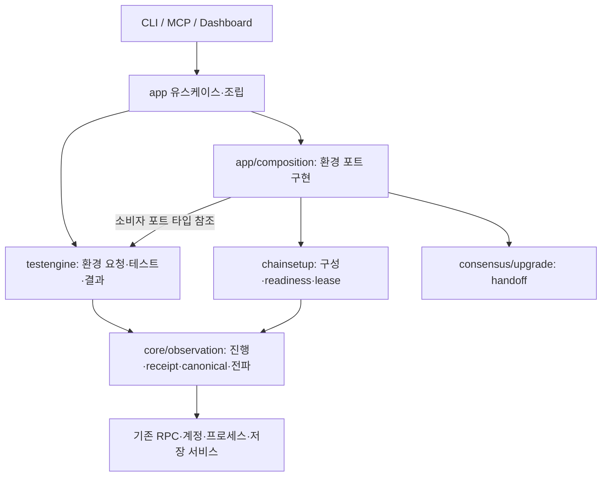

# Chainbench 리팩토링 제안 · 검토 초안

> **[제안]** 아직 결정이 아니다. 이 묶음은 **정본에도 [현행 설계]에도 지지 않는다** —
> 지는 것이 아니라 **등급 밖**이고, 여기 적힌 목표 구조는 `architecture-v2`·`layers` 가
> 말하는 현행 설계를 대체하지 않는다. 그렇게 하려면 먼저 검토가 끝나고 등급이 올라야 한다.
>
> 근거로 인용할 때는 **어느 문서의 어느 절**인지 대고, "제안"이라고 적는다. 여기의 분석과
> 측정은 인용할 수 있고, **목표 구조와 P0~P5 일정은 인용할 수 없다** — 아래가 스스로
> historical draft 라고 적고 있다.

상태: **DRAFT / 구현 전 설계 검토**. Seed v1.0.5에 기반한 분석·목표 구조·단계별 계획을 PR에서 계속 검토하기 위한 문서다. 이 문서의 병합은 제품 리팩토링 실행이나 전체 호환성 검증 완료를 의미하지 않는다. 최종 검토된 문서 revision을 후속 구현의 기준으로 확정한다.

## Continuing on another machine

Read the [handoff document](HANDOFF.md) for agreed requirements, review priorities, current call paths, verification status, destination preparation, and evidence that is not included in this PR. Heavy testing is moving to a more capable machine.

## Current review direction (supersedes the earlier sequencing)

The agreed priority is **CLI functionality and refactoring preparation → MCP → dashboard and daemon**. CLI execution remains independent of a daemon. Both execution modes should publish interoperable environment, test, event and metric records; reading those records does not transfer process-control ownership. `.dsl` migration and `chainbenchd` are explicit requirements whose transitions remain to be designed.

Start with [CLI review 1: standalone composition and later testing](cli-composition-review.md), including the current call graph, storage/reuse paths, selected test receipt, and open questions. The P0–P5 plan below is a historical draft to revise after these functional reviews; its layout and schedule are not final decisions. The earlier evaluation did not cover these newly clarified requirements.

## 읽는 순서

1. [분석과 근거](analysis-evidence.md): 현재 사실, 위험 후보, 유지할 경계 및 상충 문서의 해석.
2. [목표 구조와 단계별 계획](target-and-plan.md): 책임 배치, 허용 의존 방향, F1–F6 진단과 P0–P5 단계의 연결, 변경 대상, 인수·되돌림 조건.
3. [검증 계획](verification.md): 보존할 계약, 기준선과 미검증 범위, 단계별 비교 및 Stablenet 관측 절차.
4. [선택 근거 원문](evidence-excerpts.json): 제안서가 인용한 근거의 위치·snapshot·내용 해시·발췌.

## 설계 방향

체인 구성과 구성된 체인 기반 테스트를 두 기능 책임으로 구별한다. 의존 레이어는 표면 → app 조립 → 구성/테스트 → 관측·서비스로 별도 정의한다. 테스트는 환경 의도와 assertion을 소유하고 구성은 설정·프로세스·readiness·자원 해제를 소유한다. testengine이 환경 포트를 정의하고 app/composition이 구현을 주입한다. runtime 구성 요청 방향과 Go import 방향을 혼동하지 않는다.

화살표는 제안된 주요 정적 의존이며 모든 import를 열거하지 않는다. testengine→app 역방향 import는 금지한다. 새 observation 모듈 및 bridge는 제안 경로이며 현재 구현이 아니다. 기존 체인 어댑터와 서비스 재사용 범위는 목표 구조 문서의 소유자 표에 정의한다.

기본 계획은 CLI/DSL/MCP/설정/결과/세션과 Wemix·WBFT·Stablenet 지원 계약을 보존한다. 세 체인 저장소 내부 리팩토링은 범위 밖이다. P1 환경 요청 분리 → P2 필요한 타입 경계 변환 → P3 동작을 보존한 관측 추출 → P4 판정 강화 별도 검토 → P5 정리 순으로 진행하며, P0에서 현재 계약과 입력을 먼저 고정한다.

## 현재 검토 결과와 남은 사항

- 목표 구조·단계별 계획(AC2), 검증 절차(AC3)는 의미 평가에서 통과했다. 전체 준비 산출물은 미승인이다. 체크리스트 2/3은 QA 점수나 구현 완료율이 아니다.
- 그래프 분석(AC1)은 수집 뒤 추가된 문서에 대한 최신 입력 검증과 AC1/AC2/AC3 전체의 ID·근거 참조 통합 검사 보완이 필요하다. 보존 snapshot의 진단 PASS로 원본 검증 FAIL을 대체하지 않는다.
- lint는 지정된 Go 1.25.13 / golangci-lint v2.12.2 직접 실행에서 통과했지만 평가 환경에서 SA5011 세 건이 반복됐다. 이후 환경을 명시한 평가 명령은 검사 누락으로 처리되어 다섯 기계 검사가 SKIP됐다. 그 표면상 PASS는 수락하지 않았고 설정은 원복했다. 원인은 아직 확정하지 않았다.
- 전체 그래프·원시 로그를 이 문서 PR에 포함하지 않았다. 선택 근거 발췌는 설계 리뷰용이며 전체 그래프 무결성·재현성 증거를 대신하지 않는다. 후속 근거 보완 시 이 차이를 명시한다.
- 기존 테스트만으로 개별 CLI flag/MCP tool/schema의 전수 golden을 보장하지 않는다. 변경 경계의 계약 fixture 보강이 필요하다.

## PR에서 결정할 사항

- [ ] 구성/테스트 책임 및 app 조립 경계를 수락한다.
- [ ] testengine 환경 포트, owned/borrowed lease 및 handoff 연결 방식을 수락한다.
- [ ] observation 배치와 B1–B6 소유권을 검토하고 불필요한 추상화를 줄인다.
- [ ] 단계별 변경 대상·검증·되돌림 조건을 확정한다.
- [ ] 최신 입력 및 전역 근거 검사와 기계 평가 문제를 보완한다.
- [ ] P4 판정 강화의 수락 또는 보류를 명시한다.
- [ ] 최종 문서 커밋과 구현 범위를 확정한 후 구현 PR을 시작한다.

리뷰 의견은 진단 F*, 경계 B*, 단계 P*, 검증 AC2-V* ID로 연결한다. 설계 변경 시 관련 목표·단계·검증을 함께 수정하고 아래 이력에 이유를 남긴다. 기존 실패나 미검증을 삭제하여 수락 조건을 맞추지 않는다.

## 출처와 변경 이력

- 분석 기준 코드: `7f39c5627e0bdaccaa8e207a67767d71579283f5`.
- Seed: v1.0.5, SHA-256 `b0aaf9063b03c9616f95a4a92a7fa0bee4177a874b662f052dcaf50e707cac37`.
- 원 실행: `orch_6cf3d0cff337`; 원 산출물 AC1 `preparation-ac1-v2/artifacts-verified`, AC2 `preparation-ac2-v1`, AC3 `preparation-ac3-retry1`.
- 의미 평가 기록: `job_67642b613320`.기계 검사는 SKIP이므로 승인 근거로 사용하지 않는다.
- 초안 1: 기존 분석·계획을 PR에서 독립적으로 읽을 수 있게 편집하고 선택 근거와 미완료 검증 상태를 함께 보관. 제품 변경 없음.
