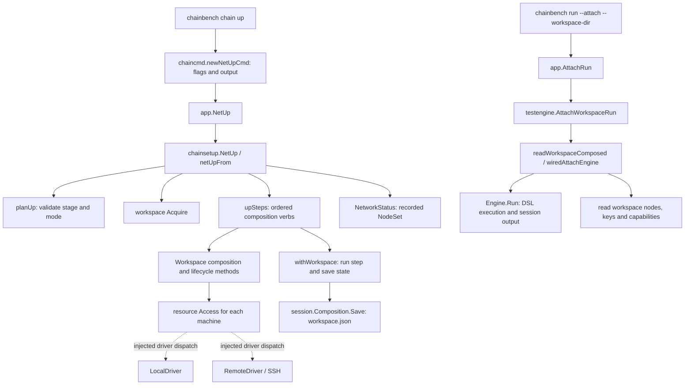

# CLI review 1: compose a chain, keep it available, test it later

Status: **discussion draft; no implementation change**. This review traces the current code at `7f39c5627e0bdaccaa8e207a67767d71579283f5`. Edges below are source-confirmed calls or explicitly identified injected dispatch, not a newly generated exhaustive AST graph or a live three-chain certification.

## Agreed direction and review order

1. Review CLI functionality and prepare its refactoring first: local CI, isolated-network remote deployment, standalone composition, DSL-driven composition/testing, and existing-RPC testing.
2. Review MCP exposure next, including discoverability and composition without mandatory tests for external LLM-driven harnesses.
3. Design dashboard and daemon after those functional boundaries are understood. Dashboard must support operations, debugging, and eventually GUI-triggered tests, not merely display test results.

CLI must work without a daemon. Persistent environment management, metrics collection, and dashboard control can be hosted by `chainbenchd` later. CLI and daemon should produce interoperable records; sharing records does not transfer process-control ownership. Transport, database choice, and daemon command APIs are not decided.

The requested `.json` to `.dsl` test-file transition and `chainbench` / `chainbench-mcp` / `chainbenchd` executable roles are requirements to plan explicitly. Their migration details remain open. They amend the old blanket external-contract-preservation assumption; the frozen Seed and historical evaluation have not been rewritten to claim coverage of these additions.

The previous P0–P5 ordering is an earlier proposal, not the current implementation schedule. Review the CLI paths first and revise that plan with the user rather than treating its package layout as settled.

## Current call graph

There is no test-engine call in the `chain up` path. The test engine is introduced by the later `run` request. Dashed edges represent the concrete driver selected through injected interfaces; they do not claim every driver runs for every command.

### Source map

Paths below resolve inside this PR; the reviewed implementation is the baseline revision above.

| Edge or behavior | Source |
|---|---|
| CLI flags → app.NetUp; completed steps printed even on failure | [chaincmd/up.go](../../../../cmd/chainbench/chaincmd/up.go) |
| app.NetUp → chainsetup.NetUp | [app/net.go](../../../../internal/app/net.go) |
| Validation, ordered verbs, composite lock, reuse, return | [chainsetup/verbs_up.go](../../../../internal/chainsetup/verbs_up.go) |
| Step lock, execution, save on success or failure | [chainsetup/verbs_steps.go](../../../../internal/chainsetup/verbs_steps.go) |
| Node initialization, launch, stop and machine-specific execution | [steps_lifecycle.go](../../../../internal/chainsetup/steps_lifecycle.go) |
| Remote file store / driver backed by SSHRunner | [resource/machine.go](../../../../internal/resource/machine.go) |
| Detached local launch and recorded PID handle | [process/local.go](../../../../internal/core/process/local.go) |
| Persistent composition state and stable composition ID | [chainsetup/workspace.go](../../../../internal/chainsetup/workspace.go) |
| JSON load and direct file save | [session/composition.go](../../../../internal/core/session/composition.go) |
| CLI compose / workspace attach / URL attach selection | [suitecmd/run.go](../../../../cmd/chainbench/suitecmd/run.go) |
| app workspace-vs-URL attach routing | [app/workflow.go](../../../../internal/app/workflow.go) |
| Workspace attach reads composition and wires test execution | [testengine/suite.go](../../../../internal/testengine/suite.go) |

## CLI-C1: composition is an independent operation

`chain up` runs `new → place → keys → genesis → config → build → deploy → init → start`. Individual step commands invoke the same use cases. Here `build` means assembling launch options, not compiling a chain project's node binary.

- `--stage=deploy` stops before init/start. It creates/deploys inputs but does not launch nodes. The remote path still needs access to its target; deploy does not mean a purely local dry run.
- `--stage=start` is the default and requires a binary. For a remote target that binary path is on the remote host. Artifact deployment alone does not establish an offline binary distribution solution.
- Composition success returns recorded steps and the node table. It does not imply that a test passed or that every node agrees on canonical state.
- This call does not automatically tear the network down when it returns. Local launch uses the detached-launch path by default; lifecycle verbs operate later on the recorded processes. Full real-node survival across CLI exit remains a live acceptance check.
- `execution.chain=attach` is rejected by `chain up`, because attachment does not compose. `reuse-if-matching` is a separate reconciliation path; it must not be conflated with test attachment.

**Design implication:** retain standalone composition as an application use case. Do not make every composition request enter the test engine merely to obtain an environment. A test-owned environment port can support tests, but cannot be the only public owner of composition.

## CLI-C2: persisted records already bridge separate invocations

The current design keeps control state in the operator's local `workspace.json`; genesis, configs, datadirs, and logs live on the selected local or remote target. The state includes chain identity, composition ID, target references, node records, keys references, and step history. Credentials are resolved separately rather than making the workspace a credential store.

The composition ID is derived from the workspace location and survives resume/binary swap. Do not assume it remains stable after arbitrary workspace relocation without checking that contract.

`withWorkspace` saves state even if the step failed, preserving partial effects such as launched PIDs. If both the step and save fail, it reports both. `netUpFrom` holds a workspace lock across the entire sequence, with nested step acquisition. That is a useful existing boundary to preserve, not a reason to replace storage wholesale.

**Open data-contract concerns, not confirmed production failures:**

- `Composition.Save` writes the manifest with `os.WriteFile`, without a temporary-file/rename publication protocol in that method. A future concurrent dashboard reader needs a defined complete-record visibility contract. Writer locking alone does not prove unlocked readers cannot observe an incomplete write.
- `NetworkStatus` reads the recorded node set; a stored PID is not a fresh process or RPC liveness observation. Display recorded state and current observations separately.
- Shared discovery across CLI output roots is not established by sharing a JSON schema. The dashboard needs to know which workspaces and session roots to read.
- A later daemon must not infer management ownership merely from discovering a record. Observation and control require separate contracts.

## CLI-C3: later tests can use the recorded environment

The CLI distinguishes three requests:

| Request shape | Actual route | Meaning |
|---|---|---|
| `run --workspace-dir <dir> <spec>` | app.RunSuite → testengine.RunSuite | Compose according to the definition; not implicit attachment |
| `run --attach --workspace-dir <dir> <spec>` | app.AttachRun → AttachWorkspaceRun | Read the existing workspace, then test without composition |
| `run --chain <chain> --rpc <url> <spec>` | app.AttachRun → NewAttachEngine | Test reachable RPC capabilities without workspace/process ownership |

These are routing examples, not ready-to-run scenarios: valid definitions, binaries and target inputs must be supplied separately. Current examples still use JSON definitions; `.dsl` handling is a pending change.

Workspace attachment reads the node table, keys and advertised capabilities and wires readiness, failure evidence, remote logs and fault control. Bare URLs lack that workspace context and cannot be assumed to support all the same tests. The engine defaults workspace-attach artifacts to `<workspace>/sessions` when ArtifactRoot is empty, but the CLI supplies its own default artifact root; unify or document effective defaults only after checking the surface-to-engine inputs. Do not claim that every session currently lands beside its composition.

**Design implication:** preserve the distinction between environment identity, a test execution, and the capabilities/ownership available to that execution. This is also the future MCP composition-only handoff contract.

## Verification performed for this review

Selected existing tests were run with Go 1.25.13, `-count=1 -json -timeout=90s`, with a 120-second outer subprocess limit, in these packages:

- `./cmd/chainbench/chaincmd`
- `./internal/chainsetup`
- `./internal/app`

Selection: `^(TestNetCmd_|TestNetNew_|TestNetUp_|TestWithWorkspace_|TestAttachRun_|TestReconcileReuse_AttachesAndRecordsEachServersOwnPID|TestReconcileReuse_IdenticalInputsStillKeepServersApart)`.

The first run failed because the sandbox blocked the local allocator lock under the user's chainbench home. It is retained as an environment failure. The retry result is recorded in [the verification receipt](cli-composition-verification.json). These are selected automated checks, not real remote deployment, a three-chain E2E run, crash-consistency proof, or complete CLI coverage.

## Next discussion and acceptance work

1. Agree on the composition completion contract: deployed artifacts, launched processes, RPC readiness, and chain progress should be distinguishable results. Determine which one default `chain up` must promise after reviewing current health/bootstrap paths.
2. Trace one local CI scenario and one isolated-network, multiple-server scenario through input preparation, binary availability, endpoints, failure and explicit cleanup. SSH implementation presence is not closed-network certification.
3. Check the effective workspace/session paths and observation timestamps before introducing a new store or daemon.
4. Review DSL-driven composition/testing and `.dsl` file discovery next; then examine RPC-only eligibility and external-contract fixtures.
5. Use those findings to revise the implementation plan together. MCP comes after CLI; dashboard/daemon transport and continuous collection stay deferred.
