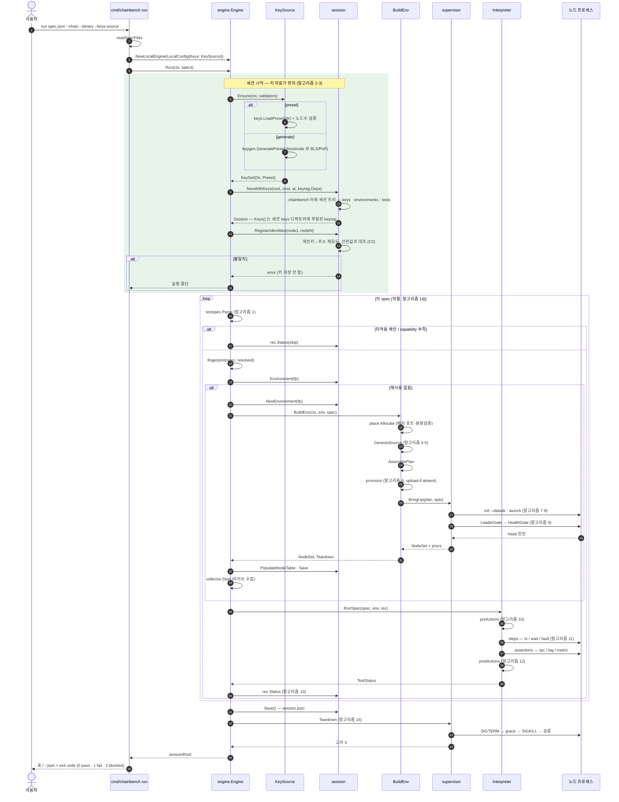
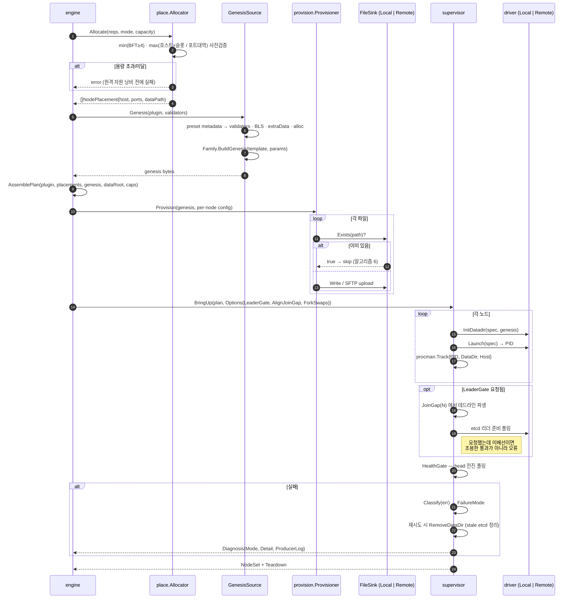
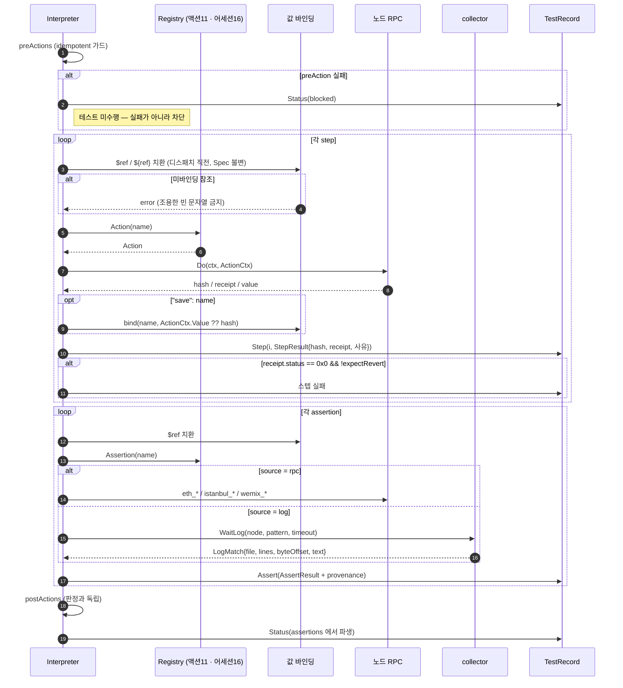
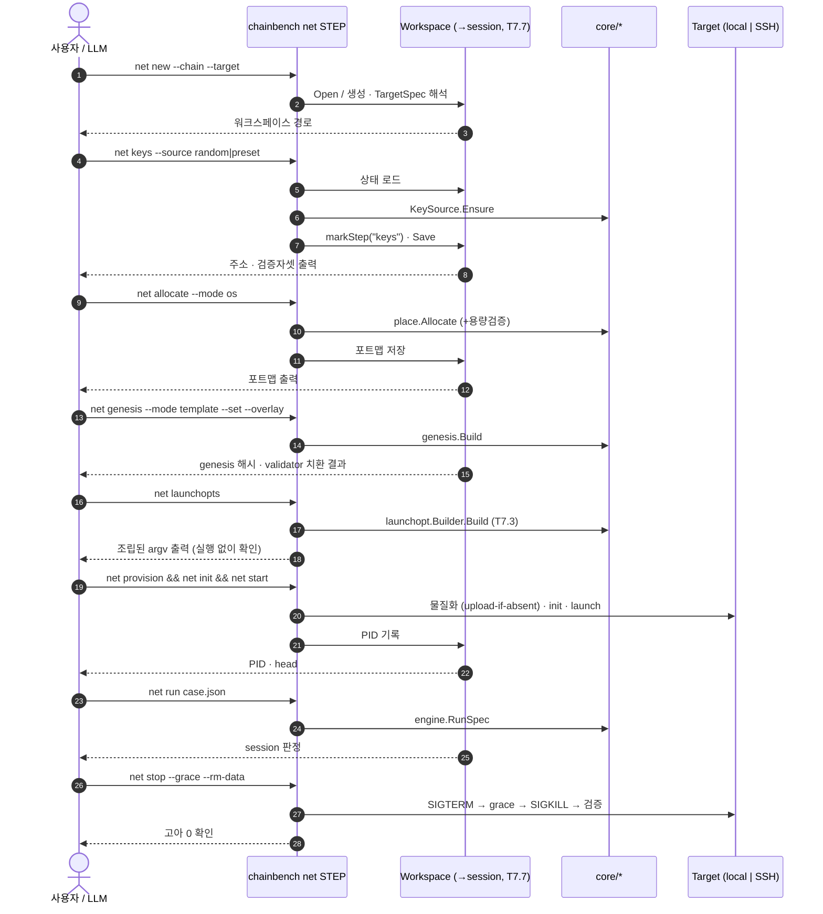
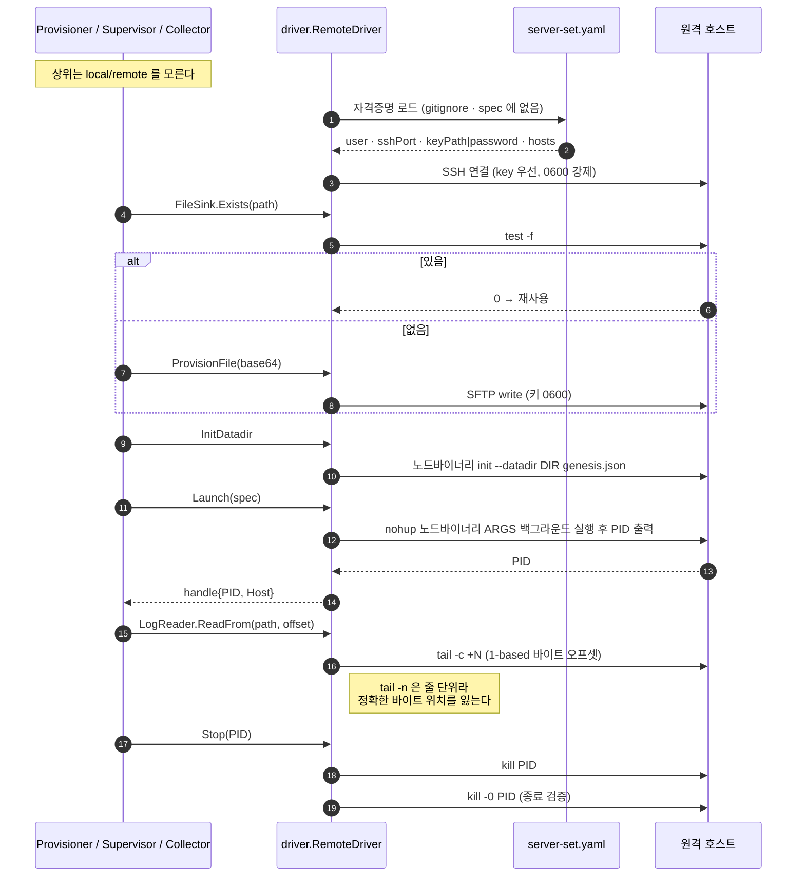
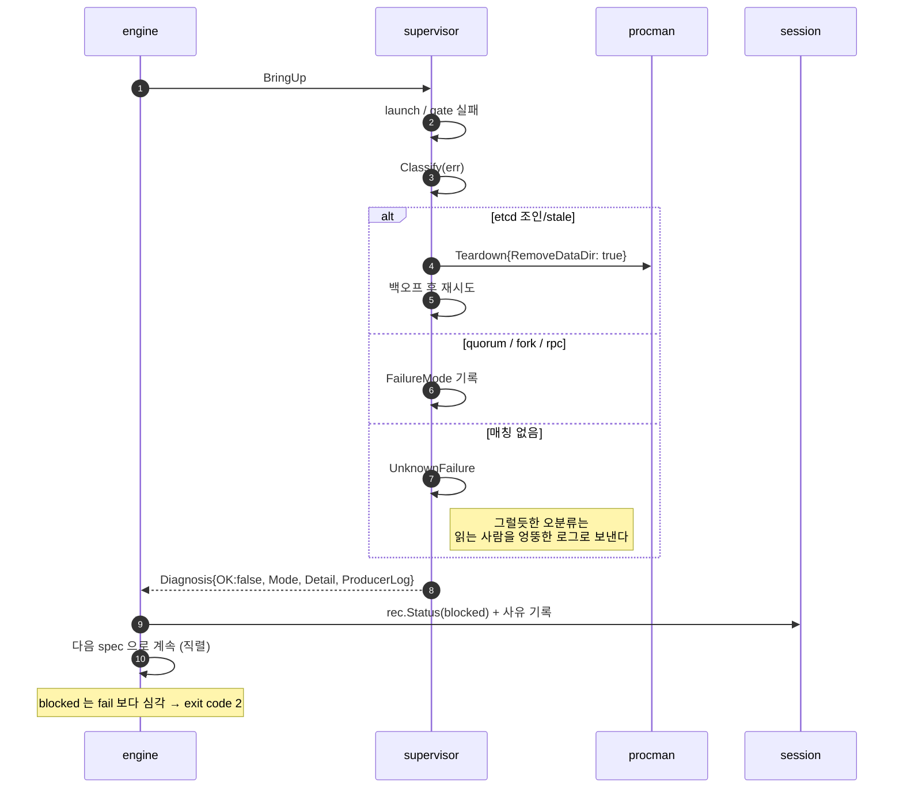

# 시퀀스 다이어그램

> **[이력]** 2026-08-11 시점.
> **현재 상태를 말하지 않는다.** 그때 무엇을 측정·결정했는지의 기록이다.
> 현재 상태는 [[chainbench-worklist]] 와 코드가 정본이다.

> 2026-08-11 코드 실측(keyreg 배선 포함). 자매 문서: [아키텍처](software-architecture.md) · [컴포넌트](component-diagram.md) · [상태](state-diagrams.md)
> 각 다이어그램은 배경 문서의 **알고리즘 1~15** 단계 번호를 주석으로 단다.

---

## 1. 전체 실행 — `chainbench run` (local 모드)

알고리즘 1~15 전 구간.

**설계상 중요한 순서 2가지**

- 키 자료 materialize 가 **세션 생성보다 먼저**다. 생성이 실패할 수 있는데(bootnode 부재), 시작하지 못할
  실행을 위해 세션 트리를 만들 이유가 없다.
- 신원 등록이 **네트워크 기동보다 먼저**다. 등록신원과 실제 키의 불일치는 기동 후에는
  "설명되지 않는 합의 정지"로만 드러난다.

---

## 2. 환경 구성 상세 — BuildEnv

알고리즘 4~9.

---

## 3. 테스트 해석 — Interpreter

알고리즘 10~13.

---

## 4. 원자 스텝 CLI — `chainbench net`

지시 3 의 조합 가능한 표면. 각 스텝은 워크스페이스를 읽고 자기 단계를 수행한 뒤 되쓴다.

**규율**: 각 스텝은 idempotent(재실행 안전)이고, 선행조건 미충족 시 조용히 성공하지 않고
"무엇을 먼저 실행하라"를 말한다. CLI 스텝 1개 = MCP 도구 1개 = `app` 유스케이스 1개.

---

## 5. 원격 실행 — stateless SSH

---

## 6. 실패 경로 — 진단과 분류

