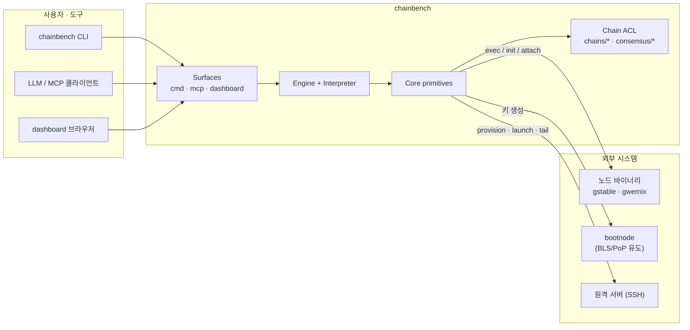
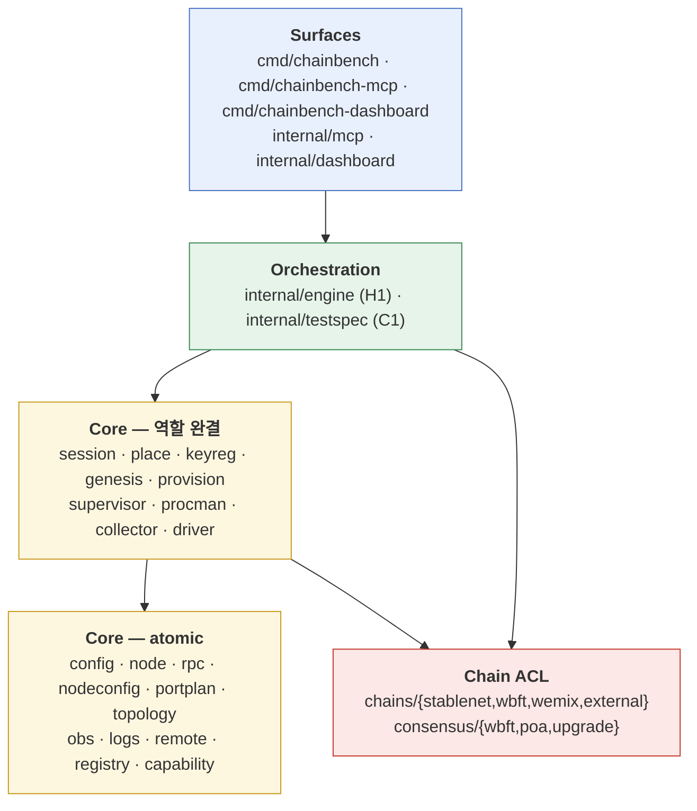
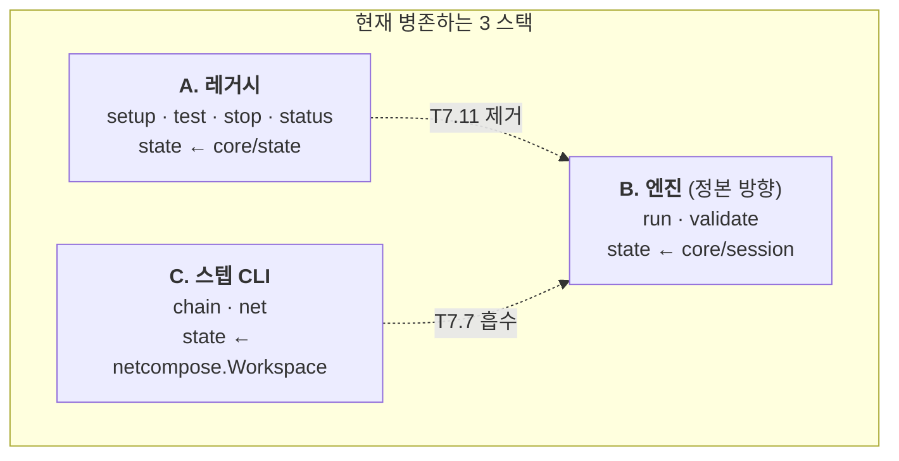
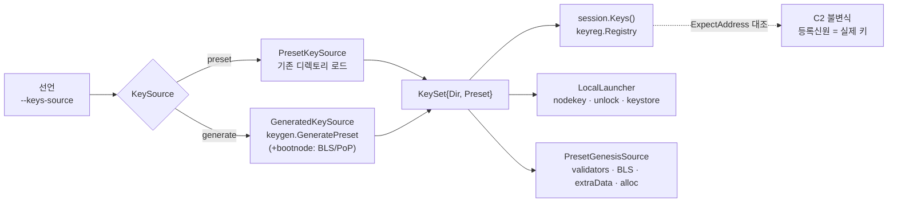
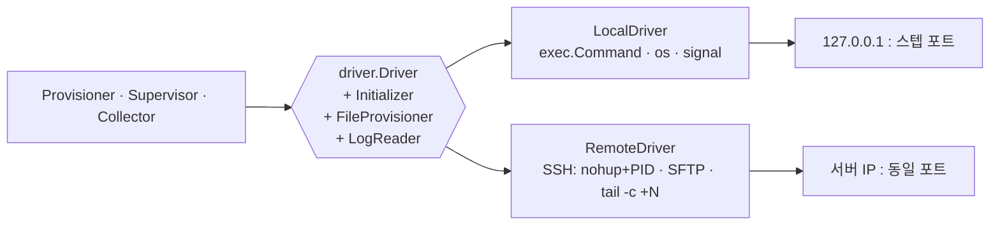

# chainbench 소프트웨어 아키텍처

> **[이력]** 2026-08-11 시점 아키텍처.
> **현재 상태를 말하지 않는다.** 그때 무엇을 측정·결정했는지의 기록이다.
> 현재 상태는 [[chainbench-worklist]] 와 코드가 정본이다.

> 지위: **현재 코드 기준 아키텍처 서술**(2026-08-11, 커밋 `2181191` + keyreg 배선).
> 설계 의도의 정본은 [`../chainbench-design.md`](../chainbench-design.md), 진행 상태의 정본은
> [`../chainbench-worklist.md`](../chainbench-worklist.md) 다. 이 문서는 **지금 코드가 실제로 어떤 모양인가**를
> 그리고, 목표 구조와의 차이를 명시한다.
> 자매 문서: [컴포넌트](component-diagram.md) · [시퀀스](sequence-diagrams.md) · [상태](state-diagrams.md)

---

## 1. 시스템 개요

chainbench 는 **go-stablenet / go-wbft / go-wemix 노드 바이너리로 테스트용 체인 네트워크를 구성하고,
정의서(DSL)로 기술된 테스트를 실행해 log·RPC·metric 으로 검증하는 하네스**다.



**핵심 불변 3가지**

1. **상위 레이어는 체인을 모른다.** 체인차는 `registry.ChainPlugin` + `ConsensusFamily`(C6 ACL) 뒤에만 있다.
2. **상위 레이어는 local/remote 를 모른다.** `driver.Driver`(+`Initializer`/`FileProvisioner` capability)가
   흡수한다. local = 루프백 IP + 스텝 포트, remote = 서버 IP + 동일 포트.
3. **아티팩트 경로는 `session` 이 단독 소유한다.** 다른 패키지는 경로를 조립하지 않는다.

---

## 2. 계층 구조 (실측)

`go list -json ./internal/...` 기준 55 패키지. **`core/*` → 상위 레이어 임포트는 0건**(계층 규율 준수).



| 계층 | 책임 | 검증 방식 |
|---|---|---|
| Surfaces | 플래그·JSON 스키마 바인딩 + 출력 포매팅. **로직 없음**(목표) | CLI/MCP 통합 테스트 |
| Orchestration | 균일 플로우 조립. 체인 분기 없음 | mock/attach e2e + 라이브 |
| Core (역할 완결) | 한 역할을 끝까지 담당, atomic 을 조립 | 통합 테스트(실 FS/프로세스) |
| Core (atomic) | 순수함수·단일 syscall | table-driven 단위 |
| Chain ACL | 외부 바이너리 quirk 격리 | 플러그인별 |

---

## 3. 바운디드 컨텍스트

| # | 컨텍스트 | 분류 | Aggregate | 핵심 불변식 | 구현 |
|---|---|---|---|---|---|
| C1 | 테스트 오케스트레이션 | **Core** | `TestRun` | 스텝 원자성 · status=assertion 파생 · preAction 실패⇒BLOCKED | `testspec` · `engine` |
| C2 | 네트워크 구성 | **Core** | `Environment` | 포트 무충돌 · fingerprint 불변 · **등록신원=실제 키 일치** · BFT min≥4 | `place` · `keyreg` · `genesis` · `provision` |
| C3 | 노드 생명주기 | Supporting | `NodeProcess` | **고아 0** · 정지⇒내장 etcd 종료 · datadir 삭제=별개 연산 | `supervisor` · `procman` |
| C4 | 관측·진단 | Supporting | (읽기 모델) | 노드 무영향 · 로그 누락 0 | `collector` · `obs` · `logs` |
| C5 | 세션·아티팩트 | Supporting | `Session` | 경로 단일소유 · 결정적 레이아웃 · env 재사용=fingerprint | `session` |
| C6 | Chain Adapter | Generic **ACL** | — | 외부 바이너리 quirk 를 Core 로 누출 금지 | `chains/*` · `consensus/*` |
| C7 | Transport | Generic infra | — | 상위는 local/remote 무관 | `driver` · `remote` |
| C8 | 공유 커널 | Generic | VO 팩토리 | 값 불변 | `config` · `node` · `rpc` · `portplan` |

**C2 의 "등록신원=실제 키 일치"는 이제 코드가 강제한다** — `keyreg.EnsureOpts.ExpectAddress` 가 개인키에서
주소를 재유도해 선언값과 대조하고, 불일치하면 키를 저장하지 않는다(`engine.RegisterIdentities` 경유).

---

## 4. 실행 모델 — 3개 진입 경로



- **B(엔진)가 목표 경로**다. `Engine.Run` 하나가 parse → applicable → fingerprint → env 재사용/구축 →
  interpreter → 기록 → teardown 전 구간을 담당하고, 실 gstable 4노드 라이브로 증명되어 있다.
- A·C 는 하위호환·단계별 진단을 위해 병존한다. 통합 순서는 worklist §1c T7.5·T7.7·T7.11.

---

## 5. 환경 구성의 5요소 (배경 요구 1)

| 요소 | 소유 모듈 | 소스 선택 | 상태 |
|---|---|---|---|
| 1.1 실행 바이너리 | CLI `--binary` / manifest | 경로 지정 | ✅ |
| 1.2 genesis | `core/genesis` (4모드) | existing·build·template+override·upgrade-inherit | ✅ 코드 / ◐ DSL 노출 1모드 |
| 1.3 config | `core/nodeconfig` | 역할·포트·sync 로 렌더 | ✅ |
| 1.4 node key | **`core/keyreg` + `engine.KeySource`** | **preset · generate**(random) | ✅ 배선됨 |
| 1.5 key store | 동상 (preset 의 `node<i>/keystore/`) | 동상 | ✅ 배선됨 |

`KeySource` 가 알고리즘 2·3("random 생성할지 기존 사용할지 결정")의 구현 지점이다.



> **해소됨(T7.2)**: `keygen.WBFTExtraData` 가 생성 검증자셋·BLS 키에서 extra-data RLP 를 계산하므로,
> extraData 에서 검증자셋을 읽는 wbft 계열 genesis 도 생성 키셋으로 성립한다.

---

## 6. 실행옵션(launch args) — 단일 조립 심 (T7.3·T7.4 적용됨)

`core/launchopt` 가 Dialect 2장(geth114 / geth110-wemix) + 관심사 모듈 10 + Builder 로
노드 실행 인자를 단일 조립한다. 프로덕션 경로는 `engine.armSpecs` 한 곳에서 Builder 를
호출하고, 핸드오프(`upgrade.LaunchArgs` + `Overrides`)도 같은 Builder 를 지난다.
가족(StartFlags)은 `launchopt.ParseFamilyFlags` 로 typed policy 가 되어 들어온다.

**잔여(레거시 스택 A, T7.11 에서 이관)**: `core/pipeline/setup`·`chains/wemix/deploy` 의
`nodeconfig.LaunchArgs` 호출 2곳.

근거·비판적 검토는 [`../chain-binary-flag-graph.md`](../chain-binary-flag-graph.md),
실측은 [`code-graph.md`](code-graph.md) §3–4.

---

## 7. local / remote 통합

상위(Provisioner·Supervisor·Collector)는 배치를 모른다.



- 원격 제어는 **에이전트 없는 stateless SSH**(`nohup <cmd> & echo $!` → PID, `kill <PID>`).
- SSH 자격증명은 **정의서에 넣지 않는다**. `remote-server-config.yaml`(gitignore)을 런타임에 읽고,
  정의서는 참조만 한다. 추적 대상은 `remote-server-config.sample.yaml` 뿐이다.

---

## 8. 검증원 3종 (배경 요구 3)

| 소스 | 수집 | 어세션 | 상태 |
|---|---|---|---|
| **RPC** | `core/rpc` 단건 호출 | `chainId` `blockNumber` `peerCount` `balanceAt` `codeAt` `nonceAt` `call` `txStatus` `blockAdvance` `sameBlockHash` `baseFee` `estimateGas` `gasPrice` `rpcCall` | ✅ |
| **log** | `collector` live tail (로컬 파일 / 원격 SSH `tail -c +N`) | `logs`(eth_getLogs) · `WaitLog` | ✅ |
| **metric** | — | — | ☐ **미구현** (worklist T7.9) |

수집은 항상 out-of-process 이며 **노드를 절대 블로킹하지 않는다**: 로그 tail 은 손실 불가라
버퍼 초과 시 디스크 스풀, chainstate 폴링은 파생 지표라 최신값 병합/드롭을 허용한다.

---

## 9. 동시성 모델

- **범위**: "한 환경 내 N노드" 처리만 동시. **테스트 실행은 항상 직렬.**
- **패턴**: `errgroup`(최초 에러 시 ctx 취소) + `semaphore.Weighted(max(1, min(GOMAXPROCS-2, N)))` + 채널 팬인.
- **소유권**: `procman` PID맵 = mutex · `session` 쓰기 = 단일 writer · `collector` 로그 = 노드별 tail → 단일 writer ·
  `obs.Bus` = bounded buffer(256) + drop-on-full(관측이 실행을 막지 않는다).
- CI 는 `go test -race ./...` 로 상시 검출한다.

---

## 10. 품질 게이트

```sh
gofmt -l cmd internal scripts     # 빈 출력
go build ./... && go vet ./...
go test -race ./...
golangci-lint run                 # unused 등 vet 미포착
```

**규율**: "테스트 있음 ≠ 프로덕션 배선됨". 인터페이스가 선언한 논항이 구현에서 방출되는지를
실측으로 대조한다 — 이 규율이 잡아낸 최근 2건이 supervisor 선언 논항 미방출(T3.2b)과
keyreg 프로덕션 호출 지점 0(T7.1)이다.
