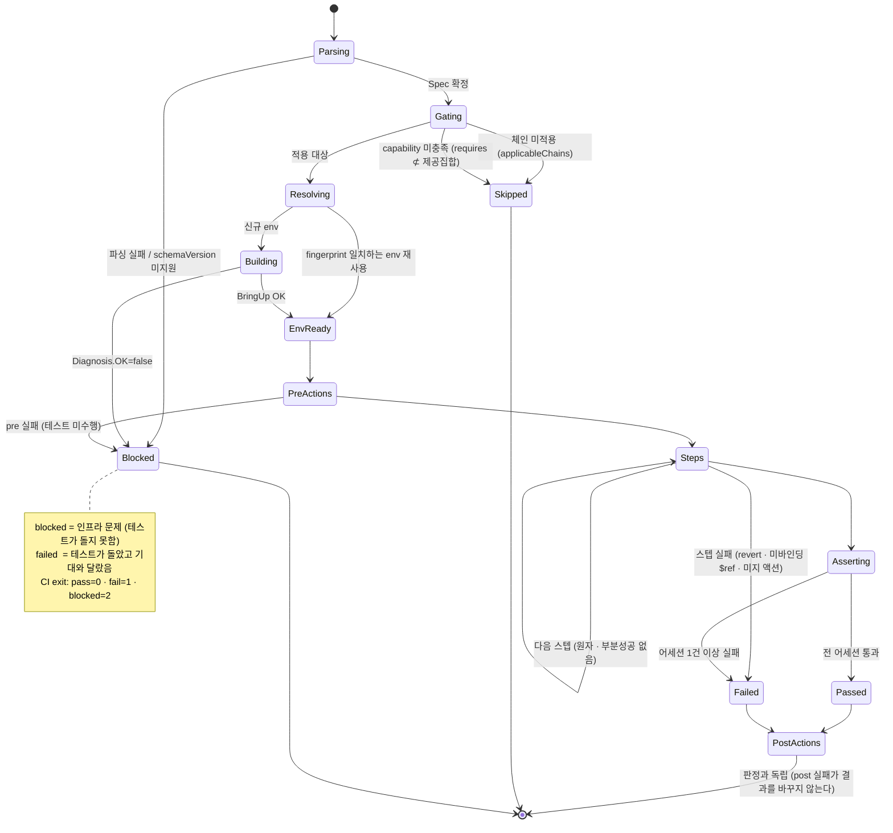
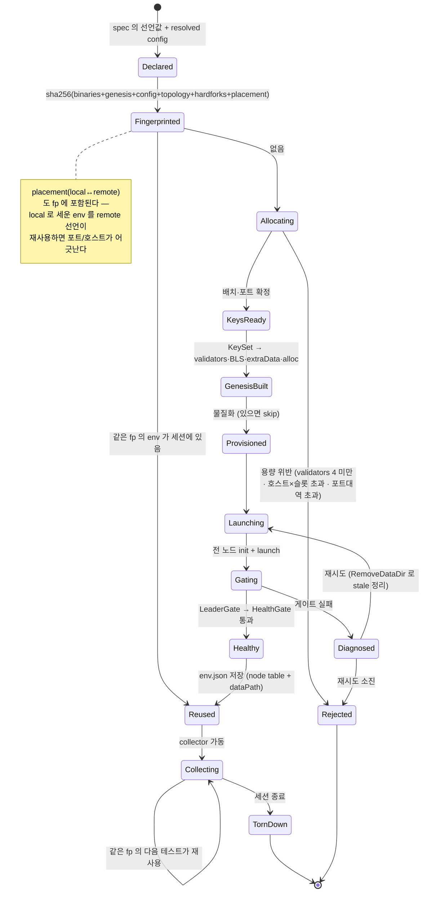
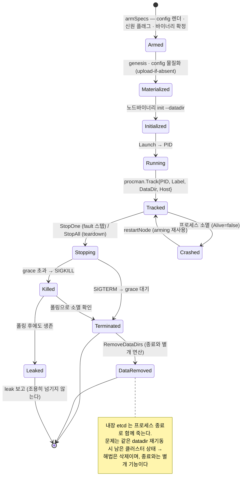
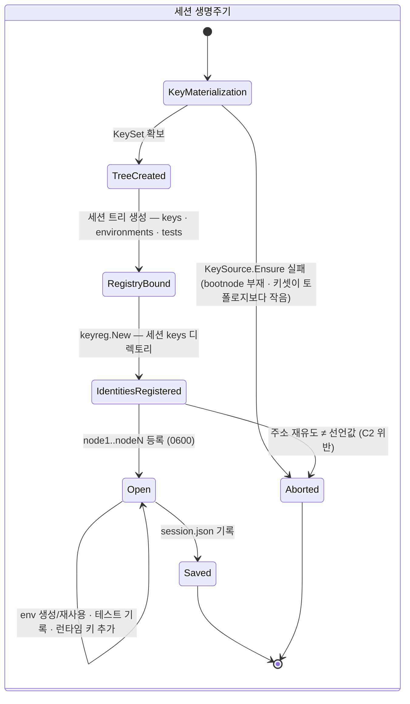
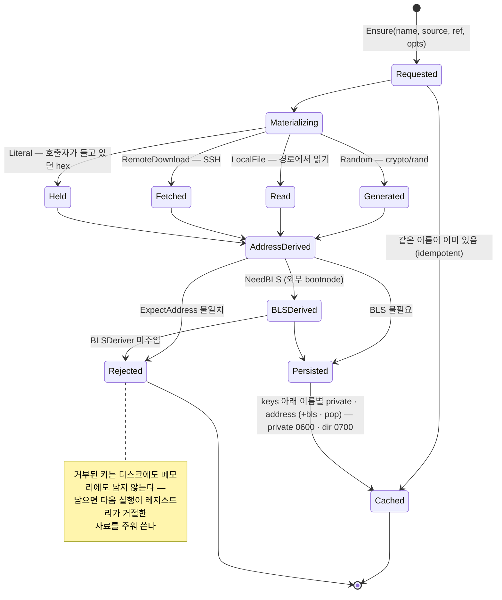
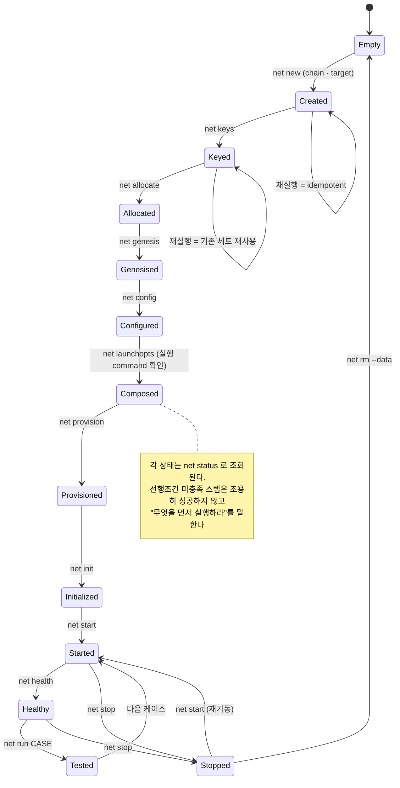

# 상태 다이어그램

> 2026-08-11 코드 실측. 자매 문서: [아키텍처](software-architecture.md) · [컴포넌트](component-diagram.md) · [시퀀스](sequence-diagrams.md)
> 대상 Aggregate: `TestRun`(C1) · `Environment`(C2) · `NodeProcess`(C3) · `Session`(C5) + 워크스페이스 스텝.

---

## 1. 테스트 하나의 생애 — `TestRun` (C1)

| 상태 | 의미 | 기록 |
|---|---|---|
| `skip` | 이 체인/능력에 해당 없음 — 실패가 아니다 | `status.json` |
| `blocked` | 환경 구성 또는 preAction 실패로 **테스트가 수행되지 않음** | + `Diagnosis` |
| `fail` | 스텝 또는 어세션이 기대와 다름 | + `steps.json` · `assert.json`(provenance) |
| `pass` | 전 어세션 통과 | + provenance |

---

## 2. 환경 — `Environment` (C2)

fingerprint 가 재사용의 유일한 판정 기준이다.

**env-id** = `"env-" + fingerprint[:12]`. 전체 64-hex 는 `env.json` 의 `fingerprint` 에만 기록한다
(경로 길이 상한 보호).

---

## 3. 노드 프로세스 — `NodeProcess` (C3)

불변식: **고아 0**.

- `StopOne` 과 `StopAll` 이 분리된 이유: `StopAll` 은 네트워크 전체를 내려 쿼럼 테스트에 쓸 수 없다.
- `Host` 가 loopback 이면 **local** 로 판정한다(원격 오판 시 단일 노드 정지가 불가능해진다 — 라이브에서만
  드러났던 결함).

---

## 4. 세션과 키 레지스트리 — `Session` (C5)

키 하나의 상태:

---

## 5. 워크스페이스 스텝 — `chainbench net`

각 스텝은 독립적으로 실행·재실행 가능하고, 워크스페이스가 진행을 누적한다.

---

## 6. 상태 저장소 대응표 (통합 전/후)

| 개념 | 현재 A(레거시) | 현재 B(엔진) | 현재 C(스텝) | 통합 후 |
|---|---|---|---|---|
| 노드 목록 | `state.SaveNetwork` | `env.json` node table | (미보유) | `session.Environment` |
| 진행 상태 | 없음 | `session.json` | `state.json` steps | `session.json` + steps |
| 키 자료 | preset 경로 | **`<session>/keys/`** | preset 경로 | `<session>/keys/` |
| PID | 없음 | `procman` + env | `state.json` | `procman` + `session` 영속 |

통합 순서는 [`../chainbench-worklist.md`](../chainbench-worklist.md) §1c T7.5·T7.7·T7.11.
