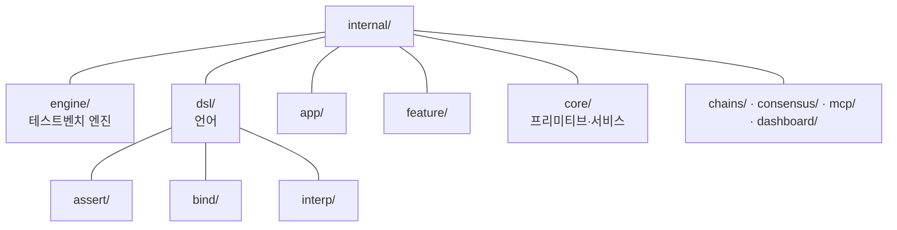
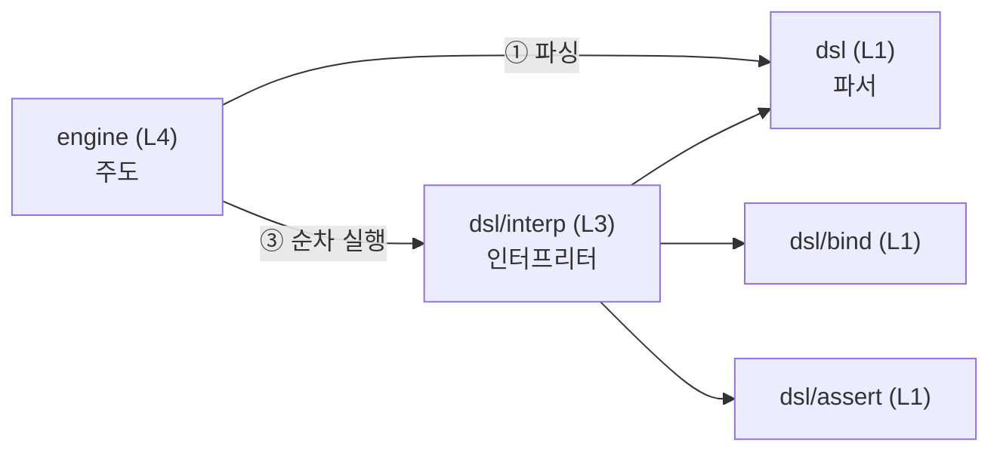
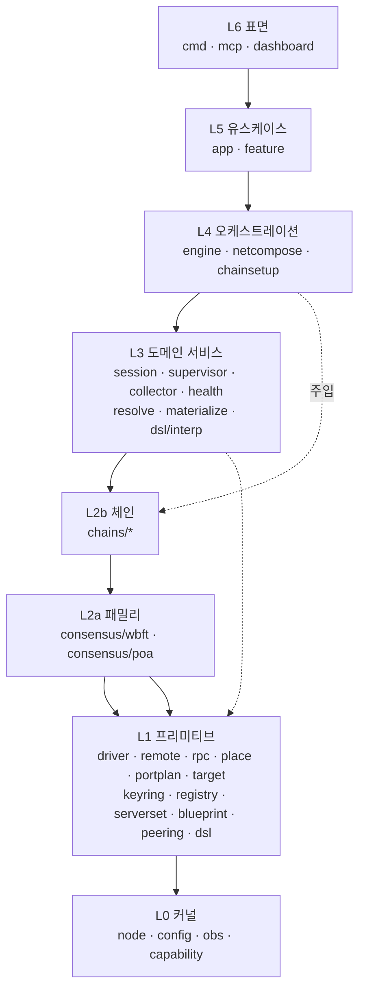
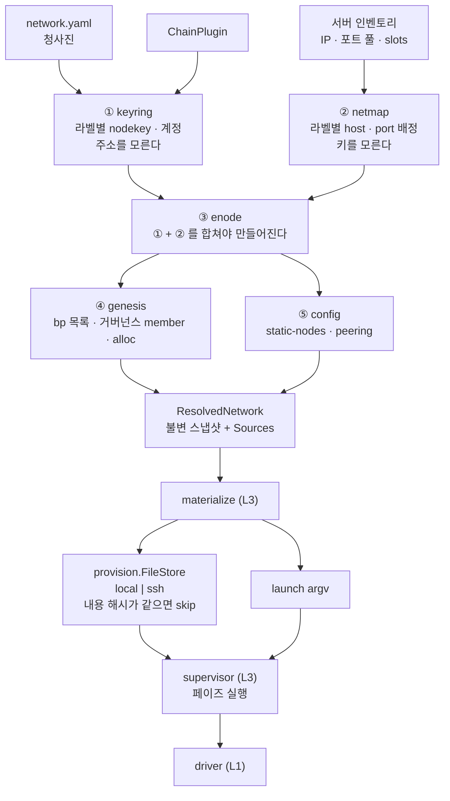
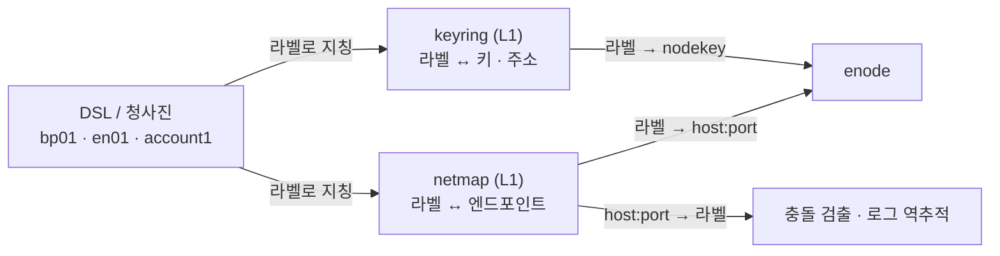
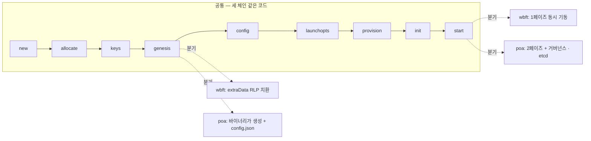
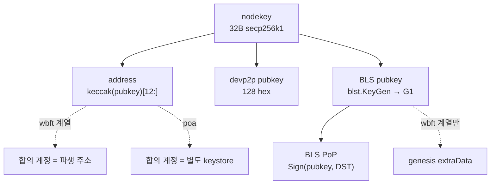
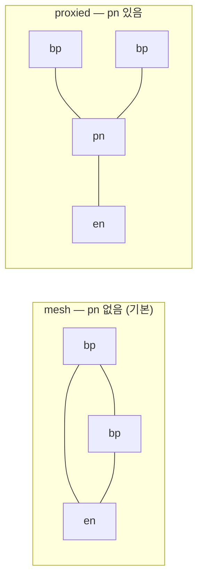
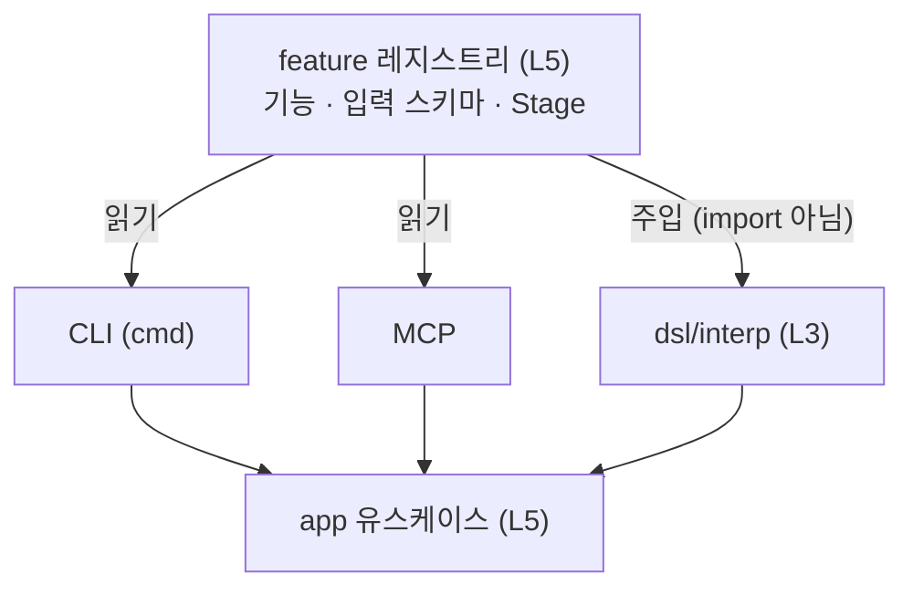

# 목표 아키텍처 — 다이어그램

> 산문으로 흩어진 결정을 **그림 하나로 검토**하기 위한 문서.
> 각 결정의 근거와 실측은 아래 문서에 있고, 여기서는 반복하지 않는다.
>
> [[layers]](layers.md) 현재 레이어·상태 소유 · [[module-responsibilities]](module-responsibilities.md) 관심사 소유자 ·
> [[network-blueprint-design]](../network-blueprint-design.md) 청사진 · [[family-bringup-design]](../family-bringup-design.md) 패밀리 기동 ·
> [[keyring-design]](../keyring-design.md) 키 · [[surface-unification-design]](../surface-unification-design.md) 표면.
> **작업 순서·상태는 [[chainbench-worklist]](../chainbench-worklist.md) §1g.**
>
> 다이어그램은 mermaid v11 파서로 전수 검증했다.

---

## 1. 디렉토리와 호출은 다른 축이다

두 축을 한 그림에 그리면 `dsl` 이 `engine` 하위인 것처럼 읽힌다. **형제다.** 따로 그린다.

### 1-A. 디렉토리 (목표)



### 1-B. 호출 관계 — DSL 은 인터프리터이고 엔진이 주도한다



이 흐름은 **이미 코드에 있다** — `engine.Run` 이 파싱→환경 준비→인터프리터 호출→기록을 주도하고,
`engine/wire.go` 의 `NewRunSpec` 이 둘을 묶는다. 이름이 그것을 말하지 않았을 뿐이다.

엔진이 파서를 직접 부르는 것은 **L4 → L1 이라 하향**이며 층 위반이 아니다.

> **`engine` 은 하나뿐이다.** 인터프리터를 `dsl/engine` 으로 두면 이름이 겹쳐,
> 이 리팩토링이 없애려는 "유사하면서 다른 이름"이 하나 더 는다.

---

## 2. 레이어 (목표 — 신규 패키지 포함)



점선은 **주입**이다. L3·L4 는 체인 패키지를 import 하지 않고 인터페이스를 받는다 —
그래서 core 가 어떤 체인도 모른다(C6 ACL).

현재 상태 실측: **상향 의존 0건**([[layers]] §4).

---

## 3. 체인 구성 파이프라인 — 순서가 있다

**enode 는 키와 주소가 모두 정해진 뒤에만 만들어진다.** 그래서 해석에는 강제된 순서가 있고,
genesis·config 는 그 뒤에만 만들 수 있다. 지금 코드가 스텝마다 조각을 다시 모으는 이유가
이 순서를 명시하지 않았기 때문이다.



**`ResolvedNetwork` 가 못이다.** ①②③ 이 끝난 상태이고, ④⑤ 와 그 아래 전부가 이것만 읽는다.
고쳐야 하면 청사진을 고치고 다시 해석한다.

출처 사슬: `청사진 명시값 > 인벤토리 > 키셋 > 체인 플러그인 > 패밀리 기본 > 내장 기본`.
어느 단계에서 왔는지를 `Sources` 에 기록한다 — 값의 유래가 추측 대상이면 안 된다.

### 3-B. 라벨이 주소를 대신한다



**테스트 정의에 주소가 등장하지 않는다.** `account1` 로 tx 를 보내고, `bp01` 을 재기동한다.
역방향(`10.0.0.11:8545` → `bp01`)이 있어야 포트 충돌이 기동 전에 잡히고,
로그 한 줄에서 어느 노드인지 즉시 안다.

> 정방향 매핑은 **이미 만들어진다**(`place.NodePlacement{Name, Host, Ports}`).
> 문제는 **저장되지 않는다는 것**이다 — `netcompose.NodeState` 에 `Name` 필드가 없어
> 라벨이 배치 직후 사라진다. `netmap` 이 더하는 것은 영속·역방향·계정 라벨이다.

세 배치가 **같은 코드**이며 다른 것은 인벤토리 데이터뿐이다:

| 경우 | 인벤토리 | 결과 |
|---|---|---|
| 로컬 | 서버 1개, `slots` 큼 | 같은 host(127.0.0.1), 포트 증가 |
| 원격 · 서버당 1노드 | 서버 N개, `slots: 1` | host 다름, 포트 동일 가능 |
| 원격 · 서버당 여러 노드 | 서버 M개, `slots > 1` | host 안에서 포트 증가 |

---

## 4. 패밀리 분기는 두 곳뿐



9스텝 중 **7개가 완전 공통**이다. 특화가 사는 곳은 인터페이스 5개뿐:

```
Family.PortReservation()   포트 예약 폭       L1 선언 / L2a 구현
Family.BuildGenesis()      genesis 생성 방식   L1 선언 / L2a 구현
Family.BringUpPhases()     기동 순서          L1 선언 / L2a 구현
Family.SupportsRole()      pn 가용 여부       L1 선언 / L2a 구현
Deps.Action(name, node)    부트스트랩 액션     L3 호출 / L2a 구현
```

---

## 5. 키 — 세 체인이 동일하다



**nodekey 하나가 루트 시크릿**이고 나머지는 파생이다(실증: 배포 preset node1..5 바이트 동일).
그래서 **BLS 는 청사진의 선언 필드가 아니다** — 선언하면 nodekey 와 어긋날 수 있고,
그 불일치는 genesis 를 통과한 뒤 합의에서 터진다.

파생은 전부 순수 Go 로 가능하다(`CGO_ENABLED=0` 확인) — **키 생성에 체인 바이너리가 필요 없다.**

---

## 6. 피어링 그래프는 역할에서 파생된다



**`bp ↔ pn ↔ en`. en 은 bp 를 직접 알지 못한다** — 알면 프록시 계층이 우회되어 무의미해진다.

**poa 는 pn 을 쓰지 않는다** — etcd 가 그 자리다. 청사진이 poa 체인에 `pn` 을 선언하면
조용히 무시하지 않고 **오류**로 거부한다(`Family.SupportsRole`).

현재 구현은 **풀메시 고정**이라 pn 을 두어도 효과가 없다.

---

## 7. 표면 — 하나 등록, 셋이 소비



**엔진은 주입받는다.** L3 가 L5 를 import 하면 상향이라 불가능하지만,
인터프리터가 `Registry`·`Action`·`Assertion`·`Deps` 를 **스스로 정의**하고 L5 가 구현체를 넘기므로
값 전달이며 층을 거스르지 않는다 — 이미 그 모양이다.

`feature` 는 `app` 의 하위가 아니라 **별도 패키지**다. `app/feature` 로 두면 `Deps` 때문에
`app → app/feature → app` 참조 순환이 된다.

---

## 8. 아직 판단하지 않은 것

`internal/core/` 아래에 패키지가 몰려 있고 `core` 는 아무것도 말하지 않는다 —
이 문서들이 금지한 `util`/`common` 덤핑과 성격이 같고, 그 안에 L0·L1·L3 이 섞여 있다.

레이어를 디렉토리로 드러내는 안이 있으나 **전 패키지 경로가 바뀐다.**
리팩토링이 끝나 패키지 수가 줄어든 뒤에 판단한다 — 지금은 아니다.
