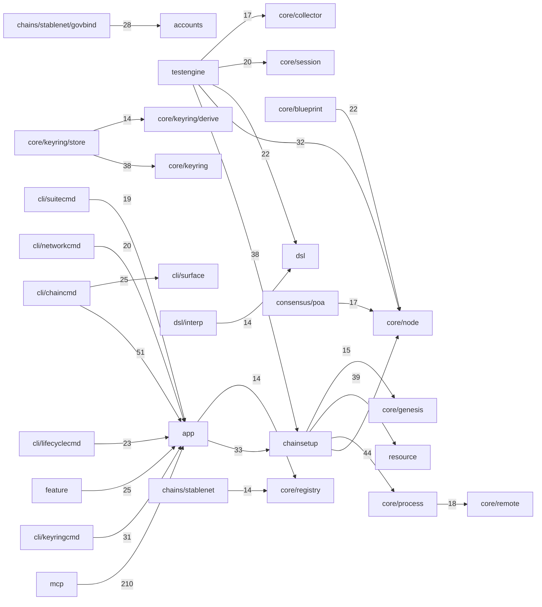

```mermaid
graph LR
  mcp["mcp"] -->|210| app["app"]
  chainsetup["chainsetup"] -->|78| core_node["core/node"]
  cli_chaincmd["cli/chaincmd"] -->|51| app["app"]
  chainsetup["chainsetup"] -->|44| core_process["core/process"]
  chainsetup["chainsetup"] -->|39| resource["resource"]
  testengine["testengine"] -->|38| chainsetup["chainsetup"]
  core_keyring_store["core/keyring/store"] -->|38| core_keyring["core/keyring"]
  app["app"] -->|33| chainsetup["chainsetup"]
  testengine["testengine"] -->|32| core_node["core/node"]
  cli_keyringcmd["cli/keyringcmd"] -->|31| app["app"]
  chains_stablenet_govbind["chains/stablenet/govbind"] -->|28| accounts["accounts"]
  feature["feature"] -->|25| app["app"]
  cli_chaincmd["cli/chaincmd"] -->|25| cli_surface["cli/surface"]
  cli_lifecyclecmd["cli/lifecyclecmd"] -->|23| app["app"]
  testengine["testengine"] -->|22| dsl["dsl"]
  core_blueprint["core/blueprint"] -->|22| core_node["core/node"]
  testengine["testengine"] -->|20| core_session["core/session"]
  cli_networkcmd["cli/networkcmd"] -->|20| app["app"]
  cli_suitecmd["cli/suitecmd"] -->|19| app["app"]
  core_process["core/process"] -->|18| core_remote["core/remote"]
  testengine["testengine"] -->|17| core_collector["core/collector"]
  consensus_poa["consensus/poa"] -->|17| core_node["core/node"]
  chainsetup["chainsetup"] -->|15| core_genesis["core/genesis"]
  dsl_interp["dsl/interp"] -->|14| dsl["dsl"]
  core_keyring_store["core/keyring/store"] -->|14| core_keyring_derive["core/keyring/derive"]
  chains_stablenet["chains/stablenet"] -->|14| core_registry["core/registry"]
  app["app"] -->|14| core_registry["core/registry"]
```
