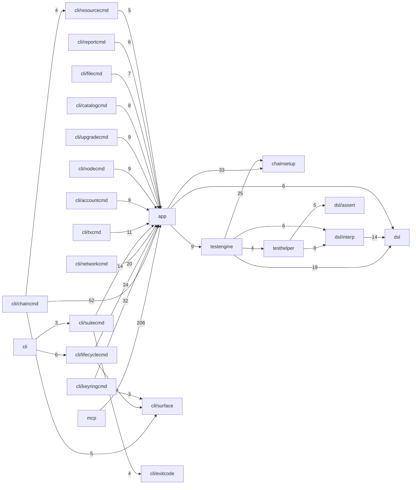

```mermaid
graph LR
  mcp["mcp"] -->|206| app["app"]
  cli_chaincmd["cli/chaincmd"] -->|52| app["app"]
  app["app"] -->|33| chainsetup["chainsetup"]
  cli_keyringcmd["cli/keyringcmd"] -->|32| app["app"]
  testengine["testengine"] -->|25| chainsetup["chainsetup"]
  cli_lifecyclecmd["cli/lifecyclecmd"] -->|24| app["app"]
  cli_networkcmd["cli/networkcmd"] -->|20| app["app"]
  testengine["testengine"] -->|19| dsl["dsl"]
  cli_suitecmd["cli/suitecmd"] -->|14| app["app"]
  dsl_interp["dsl/interp"] -->|14| dsl["dsl"]
  cli_txcmd["cli/txcmd"] -->|11| app["app"]
  app["app"] -->|9| testengine["testengine"]
  cli_accountcmd["cli/accountcmd"] -->|9| app["app"]
  cli_nodecmd["cli/nodecmd"] -->|9| app["app"]
  cli_upgradecmd["cli/upgradecmd"] -->|9| app["app"]
  cli_catalogcmd["cli/catalogcmd"] -->|8| app["app"]
  testhelper["testhelper"] -->|8| dsl_interp["dsl/interp"]
  cli_filecmd["cli/filecmd"] -->|7| app["app"]
  app["app"] -->|6| dsl["dsl"]
  cli["cli"] -->|6| cli_lifecyclecmd["cli/lifecyclecmd"]
  cli_reportcmd["cli/reportcmd"] -->|6| app["app"]
  testengine["testengine"] -->|6| dsl_interp["dsl/interp"]
  cli_chaincmd["cli/chaincmd"] -->|5| cli_surface["cli/surface"]
  cli_resourcecmd["cli/resourcecmd"] -->|5| app["app"]
  testhelper["testhelper"] -->|5| dsl_assert["dsl/assert"]
  cli_chaincmd["cli/chaincmd"] -->|4| cli_resourcecmd["cli/resourcecmd"]
  cli_lifecyclecmd["cli/lifecyclecmd"] -->|4| cli_surface["cli/surface"]
  cli_suitecmd["cli/suitecmd"] -->|4| cli_exitcode["cli/exitcode"]
  testengine["testengine"] -->|4| testhelper["testhelper"]
  cli["cli"] -->|3| cli_suitecmd["cli/suitecmd"]
  cli_keyringcmd["cli/keyringcmd"] -->|3| cli_surface["cli/surface"]
```
