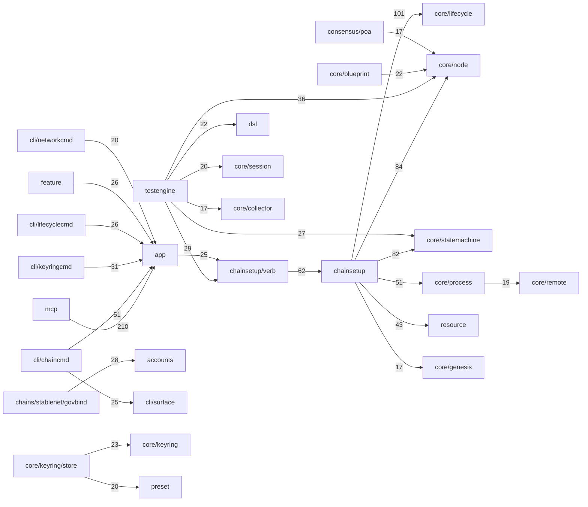

```mermaid
graph LR
  mcp["mcp"] -->|210| app["app"]
  chainsetup["chainsetup"] -->|101| core_lifecycle["core/lifecycle"]
  chainsetup["chainsetup"] -->|84| core_node["core/node"]
  chainsetup["chainsetup"] -->|82| core_statemachine["core/statemachine"]
  chainsetup_verb["chainsetup/verb"] -->|62| chainsetup["chainsetup"]
  cli_chaincmd["cli/chaincmd"] -->|51| app["app"]
  chainsetup["chainsetup"] -->|51| core_process["core/process"]
  chainsetup["chainsetup"] -->|43| resource["resource"]
  testengine["testengine"] -->|36| core_node["core/node"]
  cli_keyringcmd["cli/keyringcmd"] -->|31| app["app"]
  testengine["testengine"] -->|29| chainsetup_verb["chainsetup/verb"]
  chains_stablenet_govbind["chains/stablenet/govbind"] -->|28| accounts["accounts"]
  testengine["testengine"] -->|27| core_statemachine["core/statemachine"]
  cli_lifecyclecmd["cli/lifecyclecmd"] -->|26| app["app"]
  feature["feature"] -->|26| app["app"]
  cli_chaincmd["cli/chaincmd"] -->|25| cli_surface["cli/surface"]
  app["app"] -->|25| chainsetup_verb["chainsetup/verb"]
  core_keyring_store["core/keyring/store"] -->|23| core_keyring["core/keyring"]
  core_blueprint["core/blueprint"] -->|22| core_node["core/node"]
  testengine["testengine"] -->|22| dsl["dsl"]
  cli_networkcmd["cli/networkcmd"] -->|20| app["app"]
  core_keyring_store["core/keyring/store"] -->|20| preset["preset"]
  testengine["testengine"] -->|20| core_session["core/session"]
  core_process["core/process"] -->|19| core_remote["core/remote"]
  chainsetup["chainsetup"] -->|17| core_genesis["core/genesis"]
  consensus_poa["consensus/poa"] -->|17| core_node["core/node"]
  testengine["testengine"] -->|17| core_collector["core/collector"]
```
