# 1. 레거시 셸 테스트 AST 그래프 (packages/chainbench/tests)

`tree-sitter-bash` 로 셸 스크립트를 파싱해 만든 그래프다. 노드는 묶음·스크립트·헬퍼 함수·RPC 메서드·단언이고, 간선은 포함·호출·RPC·단언이다.

노드 943개, 간선 3866개.

| 노드 종류 | 개수 | | 간선 | 개수 |
|---|---:|---|---|---:|
| `assert` | 13 | | `ASSERTS` | 1499 |
| `category` | 24 | | `CALLS` | 672 |
| `libfn` | 255 | | `CONTAINS` | 832 |
| `rpc` | 66 | | `RPC` | 417 |
| `script` | 416 | | `SOURCES` | 446 |
| `sourced` | 163 | |  |  |
| `suite` | 6 | |  |  |

## 묶음 구조

```mermaid
flowchart LR
  S_wemix4["wemix4"]
  S_basic["basic"]
  S_fault["fault"]
  S_stablenet["stablenet"]
  S_stress["stress"]
  S_remote["remote"]
  S_wemix4 --> C_wemix4wemix4["wemix4<br/>1"]
  S_wemix4 --> C_wemix4TX["TX<br/>20"]
  S_wemix4 --> C_wemix4lib["lib<br/>8"]
  S_wemix4 --> C_wemix4NODE["NODE<br/>7"]
  S_wemix4 --> C_wemix4WBFT["WBFT<br/>12"]
  S_wemix4 --> C_wemix4RPC["RPC<br/>23"]
  S_wemix4 --> C_wemix4envs["envs<br/>2"]
  S_wemix4 --> C_wemix4GOV["GOV<br/>22"]
  S_basic --> C_basicbasic["basic<br/>7"]
  S_fault --> C_faultfault["fault<br/>6"]
  S_stablenet --> C_stablenetpost_v1_0_0_change_common_all["post-v1.0.0-change/common-all<br/>40"]
  S_stablenet --> C_stablenetpost_v1_0_0_change_extra_state["post-v1.0.0-change/extra-state<br/>14"]
  S_stablenet --> C_stablenetpost_v1_0_0_change_string_handling["post-v1.0.0-change/string-handling<br/>12"]
  S_stablenet --> C_stablenetpost_v1_0_0_change_effectivegasprice["post-v1.0.0-change/effectivegasprice<br/>6"]
  S_stablenet --> C_stablenetpost_v1_0_0_change_stand_alone["post-v1.0.0-change/stand-alone<br/>8"]
  S_stablenet --> C_stablenetregression_blacklist_authorized["regression/blacklist-authorized<br/>18"]
  S_stablenet --> C_stablenetregression_fee_delegation["regression/fee-delegation<br/>8"]
  S_stablenet --> C_stablenetregression_anzeon["regression/anzeon<br/>14"]
  S_stablenet --> C_stablenetregression_api["regression/api<br/>46"]
  S_stablenet --> C_stablenetregression_wbft["regression/wbft<br/>24"]
  S_stablenet --> C_stablenetregression_system_contracts["regression/system-contracts<br/>48"]
  S_stablenet --> C_stablenetregression_ethereum["regression/ethereum<br/>64"]
  S_stress --> C_stressstress["stress<br/>2"]
  S_remote --> C_remoteremote["remote<br/>4"]
```

## 스크립트 역할별 개수

| 역할 | 개수 | 설명 |
|---|---:|---|
| `scenario` | 151 | stablenet 의 `tests/NN-test-*.sh` — 실제 검증 로직 |
| `setup` | 151 | stablenet 의 체인 구성 스크립트 |
| `test` | 114 | wemix4 · basic · fault · stress · remote (구성+검증 한 파일) |

## 가장 많이 쓰인 RPC 메서드 (상위 20)

| 메서드 | 사용 스크립트 수 |
|---|---:|
| `eth_call` | 76 |
| `eth_call_raw` | 62 |
| `eth_getBlockByNumber` | 29 |
| `eth_getTransactionByHash` | 18 |
| `eth_getCode` | 18 |
| `istanbul_getWbftExtraInfo` | 18 |
| `eth_getBalance` | 16 |
| `eth_blockNumber` | 12 |
| `eth_getTransactionCount` | 11 |
| `eth_sendRawTransaction` | 11 |
| `istanbul_getValidators` | 10 |
| `personal_signRawFeeDelegateTransaction` | 8 |
| `personal_signTransaction` | 8 |
| `txpool_content` | 8 |
| `eth_get_balance` | 8 |
| `personal_importRawKey` | 7 |
| `eth_sendTransaction` | 6 |
| `eth_estimateGas` | 5 |
| `eth_syncing` | 5 |
| `eth_chainId` | 5 |

## 단언 헬퍼 사용량

| 단언 | 사용 횟수 |
|---|---:|
| `assert_eq` | 453 |
| `_assert_fail` | 271 |
| `assert_not_empty` | 262 |
| `_assert_pass` | 242 |
| `assert_gt` | 91 |
| `assert_ge` | 89 |
| `assert_contains` | 39 |
| `assert_true` | 36 |
| `assert_gt_dec` | 7 |
| `assert_code_hash_eq` | 4 |
| `assert_balance_eq` | 3 |
| `assert_ge_dec` | 1 |
| `assert_receipt_matches_legacy` | 1 |
