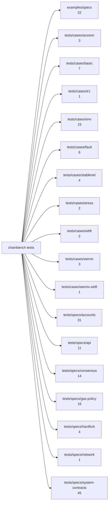

# 2. chainbench(신규) AST 그래프 — Go 코드 + DSL

Go 소스는 `tree-sitter-go` 로, DSL 테스트는 JSON 문서 구조 그대로 파싱해 하나의 그래프로 합쳤다. DSL 은 그 자체가 선언형이라 JSON 트리가 곧 AST 다.

노드 1413개, 간선 3052개.

> **경로 안내(2026-09-10):** 아래 그래프와 표는 생성 당시의 트리를 그대로 담고 있어
> `tests/cases/…` 로 적혀 있다. 그 트리는 `3c42fb76` 에서 `tests/tc/` 로 통합됐다.
> 산출물을 사실대로 두기 위해 본문은 고치지 않았으니, 지금 경로는 `tests/tc/` 로 읽는다.

| 노드 종류 | 개수 | | 간선 | 개수 |
|---|---:|---|---|---:|
| `capability` | 6 | | `CONTAINS` | 255 |
| `dslgroup` | 18 | | `DEFINES_TEST` | 1061 |
| `dslspec` | 188 | | `IMPORTS` | 947 |
| `goarea` | 4 | | `REQUIRES` | 212 |
| `gopkg` | 67 | | `RPC` | 80 |
| `gotest` | 1059 | | `USES_VERB` | 497 |
| `rpc` | 23 | |  |  |
| `verb` | 48 | |  |  |

## 2.1 DSL 테스트 구조

| 묶음 | 파일 수 | 종류 |
|---|---:|---|
| `examples/specs` | 22 | example 22 |
| `tests/cases/anzeon` | 3 | case 3 |
| `tests/cases/basic` | 7 | case 7 |
| `tests/cases/e1` | 1 | case 1 |
| `tests/cases/env` | 15 | env 15 |
| `tests/cases/fault` | 6 | case 6 |
| `tests/cases/stablenet` | 4 | case 4 |
| `tests/cases/stress` | 2 | case 2 |
| `tests/cases/wbft` | 2 | case 2 |
| `tests/cases/wemix` | 3 | case 3 |
| `tests/cases/wemix-wbft` | 1 | case 1 |
| `tests/specs/accounts` | 31 | spec 31 |
| `tests/specs/api` | 11 | spec 11 |
| `tests/specs/consensus` | 14 | spec 14 |
| `tests/specs/gas-policy` | 16 | spec 16 |
| `tests/specs/hardfork` | 4 | spec 4 |
| `tests/specs/network` | 1 | spec 1 |
| `tests/specs/system-contracts` | 45 | spec 45 |

## 2.2 DSL 어휘 (verb) 사용량

| verb | 사용 스펙 수 |
|---|---:|
| `assert:txStatus` | 107 |
| `assert:rpcCall` | 54 |
| `assert:call` | 38 |
| `do:waitBlock` | 34 |
| `assert:derive` | 28 |
| `expect:rpc` | 22 |
| `assert:blockNumber` | 18 |
| `assert:logs` | 16 |
| `expect:reject` | 15 |
| `assert:codeAt` | 12 |
| `expect:blockNumber` | 11 |
| `assert:balanceAt` | 10 |
| `expect:sameBlockHash` | 10 |
| `do:read` | 10 |
| `expect:blockAdvance` | 8 |
| `expect:peerCount` | 8 |
| `assert:baseFee` | 6 |
| `expect:revert` | 5 |
| `do:newAccount` | 5 |
| `do:sendTx` | 5 |
| `expect:receipt` | 5 |
| `expect:chainId` | 5 |
| `expect:call` | 5 |
| `do:stopNode` | 5 |
| `assert:chainId` | 4 |
| `assert:nonceAt` | 4 |
| `assert:txMined` | 4 |
| `expect:balanceAt` | 4 |
| `do:load` | 4 |
| `assert:estimateGas` | 3 |
| `expect:baseFee` | 3 |
| `do:startNode` | 3 |
| `assert:sameBlockHash` | 3 |
| `assert:receiptLog` | 2 |
| `assert:gasPrice` | 2 |
| `assert:wsSubscribe` | 2 |
| `do:partition` | 2 |
| `do:healPartition` | 2 |
| `do:restartNode` | 2 |
| `assert:blockAdvance` | 2 |

## 2.3 Go 패키지 구조

| 최상위 영역 | 패키지 수 |
|---|---:|
| `cmd` | 16 |
| `internal` | 47 |
| `scripts` | 3 |
| `tests` | 1 |

가장 많이 참조되는 내부 패키지 (import 피인용 상위 15):

| 패키지 | 피인용 |
|---|---:|
| `internal/core/node` | 124 |
| `internal/app` | 63 |
| `internal/core/session` | 60 |
| `internal/core/process` | 45 |
| `internal/core/registry` | 44 |
| `internal/resource` | 39 |
| `internal/core/rpc` | 37 |
| `internal/chainsetup` | 35 |
| `internal/core/collector` | 33 |
| `internal/dsl` | 33 |
| `internal/dsl/interp` | 32 |
| `internal/chains/all` | 31 |
| `internal/core/keyring` | 29 |
| `internal/core/filestore` | 27 |
| `internal/core/keyring/store` | 27 |

## 2.4 Go 테스트 계층

- 단위/통합 테스트 함수: 1019개
- `//go:build e2e` 로 격리된 e2e 테스트 함수: 40개

e2e 테스트 목록:

- `TestE2E_StablenetBlockPropagation`
- `TestE2E_StablenetChain`
- `TestE2E_StablenetConsensusLifecycle`
- `TestE2E_StablenetHardforkSwap`
- `TestE2E_StablenetProposalExpiry`
- `TestE2E_StablenetSyncGap`
- `TestE2E_WbftAdminPeers`
- `TestE2E_WbftChain`
- `TestE2E_WbftFaultHalt`
- `TestE2E_WbftFaultTolerance`
- `TestE2E_WbftGenesisEmptyNCP`
- `TestE2E_WbftGenesisNCPWhitespace`
- `TestE2E_WbftIsValidator`
- `TestE2E_WbftQuorum6of6Halts2`
- `TestE2E_WbftQuorum6of6Tolerates1`
- `TestE2E_WbftQuorumAllRequired`
- `TestE2E_WbftRoundRobinProposer`
- `TestE2E_WbftSnapSync`
- `TestE2E_WbftViewChange`
- `TestRemoteDriver_E2E`
- `TestUpgradeRunE2E`
- `TestWemixDataMigrationE2E`
- `TestWemixGovValidatorSelectionScenarioE2E`
- `TestWemixGovernanceBlockRewardE2E`
- `TestWemixGovernanceClaimGuardE2E`
- `TestWemixGovernanceCredentialExpiryE2E`
- `TestWemixGovernanceDelegateE2E`
- `TestWemixGovernanceDelegatorClaimE2E`
- `TestWemixGovernanceE2E`
- `TestWemixGovernanceEmergencyModeE2E`
- `TestWemixGovernanceFeeChangeDelayedE2E`
- `TestWemixGovernanceFeeChangeE2E`
- `TestWemixGovernanceNCPAddE2E`
- `TestWemixGovernanceNCPLifecycleE2E`
- `TestWemixGovernanceOperatorClaimE2E`
- `TestWemixGovernanceReactivateE2E`
- `TestWemixGovernanceRegisterStakerE2E`
- `TestWemixGovernanceStabilizingE2E`
- `TestWemixGovernanceUnstakeE2E`
- `TestWemixGovernanceUnstakeMinimumGuardE2E`
