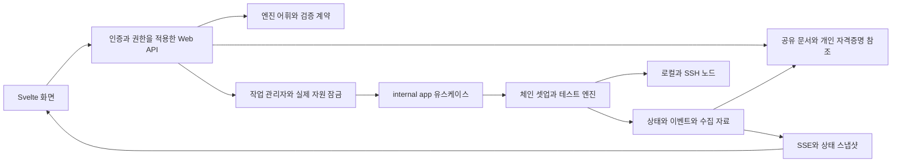
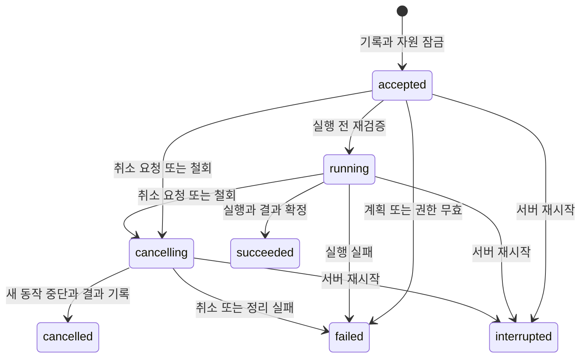

# chainbench Web UI 동작 명세

> **등급: [현행 설계]** — 요구 범위와 운영 정책은 사용자 인터뷰와 최종 확인으로
> 확정했다. 기준 코드는 `9923df85a8d11f2c20e47d2e215d4209500af28a`이다.
> 아래 화면·API·데이터 모델은 이 요구를 구현하는 계약이다. 작업 순서·진척의 정본은
> [worklist](chainbench-worklist.md)이며 이 문서의 구현 단계는 의존 순서만 설명한다.

개인 PC와 팀 공용 서버에서 체인 구성, 셋업, 서버 배치, 플러그인 설정, DSL 테스트 작성,
배포, 노드 제어, 모니터링, 히스토리 관리까지 브라우저에서 완료한다. 파일 생성만으로
완료하지 않는다. CLI/MCP와 같은 엔진을 호출하고, 실제 로컬·SSH 체인에서 동작을 검증한다.

실행 계약은 [Seed](architecture/chainbench-web-ui.seed.yaml), HTTP 인터페이스는
[OpenAPI](web-ui.openapi.yaml), 요구별 검증 계약은 [인수 기준](web-ui-acceptance.md)에 둔다. 엔진이 소유하는 YAML/DSL/어휘의 필드 정의를
프론트나 OpenAPI에 다시 하드코딩하지 않는다. 확정 범위를 바꾸려면 요구와 검증 기준을
함께 갱신한다.

## 요구와 화면의 연결

| 요구 | 사용자가 완료하는 동작 | 화면 | 완료 기준 |
|---|---|---|---|
| 1 체인 구성 | 프리셋 선택, 필수·선택 필드 설정, 구성 검증·저장 | 체인 구성 | WEB-01 |
| 2 설정 기반 셋업 | 기존 설정 import, 편집·export, 셋업 실행 | 체인 구성과 실행 | WEB-02 |
| 3 서버와 workspace | 서버 풀·포트·경로·입력·실행 정책 설정 | 서버 배치 | WEB-03 |
| 4 플러그인 | 기존 매니페스트 관리, 지원 family의 외부 매니페스트 등록·검증 | 플러그인 | WEB-04 |
| 5 DSL 케이스 | 현행 DSL 전체를 구조화 편집하고 변수·노드 참조 검증 | 테스트 작성 | WEB-05 |
| 6 배포 | 선택한 서버에 파일·호환 바이너리 배포와 체인 구축 | 실행 계획과 작업 상세 | WEB-06 |
| 7 노드 제어 | 실행·정지·파일 교체·재실행·허용된 초기화 | 노드 상세 | WEB-07 |
| 8 모니터링 | 상태·이벤트·metric·시점 연계 로그 확인 | 모니터링 | WEB-08 |
| 9 히스토리 | 검색·필터·상세·실행 비교·내보내기·관리자 삭제 | 히스토리 | WEB-09 |

공통 조건은 인증·비밀정보 격리(WEB-10), 실제 자원 충돌 차단(WEB-11), 서버 재시작
처리(WEB-12), 취소와 노드 유지 정책(WEB-13), 임베드 빌드·회귀·인수 검증(WEB-14)이다.

## 실행 모드와 권한

개인 모드는 기본적으로 loopback에 바인딩하고 최초 관리자 계정으로 로그인한다. 팀 모드는
설정한 주소로 서비스하고 관리자가 팀 계정을 등록한다. 공개 회원가입·SSO는 첫 출시에
포함하지 않는다. 최초 관리자 등록은 설치 시 받은 일회용 초기화 수단으로 제한하며,
등록 후 다시 사용할 수 없다. 기본 비밀번호를 배포하지 않는다.

| 동작 | 관리자 | 운영자 | 조회자 |
|---|---|---|---|
| 공유 구성·체인·테스트·결과 조회 | 허용 | 허용 | 허용 |
| 공유 설정 편집과 파일·매니페스트 등록 | 허용 | 허용 | 거절 |
| 배포·테스트·소유 노드 제어 | 본인 자격증명으로 허용 | 본인 자격증명으로 허용 | 거절 |
| 개인 SSH 자격증명 등록·조회·폐기 | 본인 것만 | 본인 것만 | 거절 |
| 작업 취소 | 모든 작업 | 본인 작업 | 거절 |
| 사용자·역할·계정 활성 상태 관리 | 허용 | 거절 | 거절 |
| 히스토리와 연결 자료 삭제 | 허용 | 거절 | 거절 |

역할은 서버가 판정한다. 버튼 숨김만으로 권한을 보장하지 않는다. 관리자는 운영자 기능을
포함하지만 다른 사람의 자격증명을 조회하거나 실행에 사용할 수 없다. 역할 변경과 계정
비활성화는 세션·이후 요청에 즉시 반영하고, 비활성화 시 진행 중 작업도 철회 정책을 따른다.

공유 설정과 실제 실행 체인은 팀 자원이다. 다른 운영자의 체인을 제어하려면 본인 계정에
그 서버 접근 권한이 있어야 한다. 자격증명이 없는 경우 구성·상태를 읽을 수 있어도 원격
동작은 실행하지 못하며, 실행 전 부족한 접근 권한을 표시한다.

## UI 구성과 사용 흐름

왼쪽 내비게이션은 대시보드, 체인·workspace, 테스트, 모니터링·디버깅, 히스토리,
개인 자격증명, 관리로 구성한다. 현재 workspace와 개인·팀 모드, 사용자·역할을 항상
확인할 수 있게 한다. 작업 목록의 상태를 누르면 같은 작업 상세로 이동한다.

데스크톱에서는 목록과 상세 패널을 나란히 놓는다. 좁은 화면에서는 상세를 별도 페이지로
전환한다. 표는 검색·필터·페이지 이동을 제공하고, 상태는 색과 텍스트를 함께 사용한다.
키보드로 선택·입력·저장·취소할 수 있고 입력 오류는 해당 필드와 오류 요약에 연결한다.
문구는 한국어를 기본으로 하되 어휘 이름·체인 ID·파일명은 엔진 표기를 유지한다.

| 화면 | 주요 구성 | 주 동작 | 오류와 빈 상태 |
|---|---|---|---|
| 대시보드 | 체인 상태, 진행 작업, 최근 결과, 연결 상태 | 체인 만들기, 실행 상세 열기 | 첫 구성 안내, 서버 연결 실패 |
| 체인·workspace | 프리셋, 노드 배치, 서버 풀, 파일·바이너리 참조, 구성 revision | 구성 검증, 계획 확인, 셋업·배포 | 필수 값·포트 충돌·접근 권한 오류 |
| 테스트 | 케이스 목록, 순서가 있는 do/expect 카드, 인자 패널, 참조 선택 | import, 복제, 검증, 저장, 실행 | 미등록 어휘, 잘못된 참조, 지원 불가 필드 |
| 노드 상세 | 역할, 소유 여부, PID/RPC 상태, 바이너리·설정 revision, 로그 | 시작, 정지, 교체, 초기화 | attach 제한, 생산 노드 초기화 제한, busy |
| 모니터링 | 단계·케이스 진행, 노드별 차트, 이벤트 타임라인, 로그 | 시점 선택, 노드 비교, 작업 취소 | stale, 누락, 수집 불가, 중단·부분 실패 |
| 히스토리 | 필터 목록, 요약·어세션 상세, 비교, 연결 자료 | export, 관리자 삭제 | 비교 불가 이유, 과거 형식의 자료 없음 |
| 개인 자격증명 | 본인 자격증명 이름·서버 연결·사용 상태 | 등록, 접근 확인, 폐기 | 형식·호스트 키·접근 거절 |
| 관리 | 사용자·역할·활성 상태, 감사 기록 | 사용자 등록·변경·비활성화 | 권한 오류, 중복 계정 |

### 체인 구성과 실행

1. 등록된 체인·프리셋을 선택하거나 기존 구성 묶음을 import한다.
2. 체인·노드·서버·workspace를 구성한다. 필수 필드는 처음부터 보이고 선택 필드는
   추가 메뉴로 연다. 기본값과 실제 적용값, 프리셋 상속으로 바뀐 값을 구분한다.
3. 파일·바이너리·매니페스트를 등록하고 목록에서 참조한다. 바이너리는 checksum,
   체인 정체성, OS/아키텍처와 실제 사용 가능한 dialect를 확인한다.
4. 엔진 검증 후 실행 계획을 만든다. 대상 서버·경로·포트, 생성·교체할 파일, 노드,
   필요한 접근 권한, 실행할 단계와 기존 구성과의 차이를 표시한다.
5. 계획을 확인하고 실행한다. HTTP 요청은 작업 ID를 즉시 반환하고 진행은 작업 상세에서
   본다. 구성 revision이나 대상 상태가 달라졌으면 오래된 계획으로 실행하지 않는다.

워크스페이스가 명시적으로 참조한 서버·경로 문서 revision은 불변 입력이다.
그 문서의 새 revision을 저장해도 기존 참조는 바뀌지 않으며, 이전 참조로 새 계획을
만들 수 있다. 다른 revision을 적용하려면 워크스페이스를 다시 저장하고 계획을
재검토한다. 계획 이후 워크스페이스 revision 또는 참조가 바뀌면 접수를 거절한다.

선택 목록은 실제 레지스트리와 엔진 계약에서 가져온다. 사용자 정의 이름·호스트 주소·경로·
숫자는 계약이 허용하는 타입·범위 안에서 입력한다. 모든 값을 enum으로 제한하여 신규
서버를 등록할 수 없게 만들지 않는다. 서버 경로는 등록한 workspace 루트·목적별 경로
규칙을 따른다. 임의 쉘 명령이나 임의 서버 파일 경로를 실행 API에 보내지 않는다.

### DSL 테스트 작성

체인 환경 선언과 테스트 case를 분리하여 편집한다. 기존 parser/schema가 허용하는 모든
선언 필드와 내장 do/expect/reader 인자를 포함한다. 환경 상속, topology, binary·manifest
참조, accounts, upgrade, attach, 요구 capability와 실제 제공 capability를 구분한다.
새 조건·반복·중첩 실행 문법을 이 작업에서 만들지 않는다.

do/expect 카드는 순서를 바꿀 수 있고 인자는 동작별 계약으로 생성한다. `on`/노드 선택,
`save`/변수 참조, timeout·비교값은 실제 엔진의 의미를 따른다. 참조는 앞에서 정의된
값과 사용 가능한 노드만 제시한다. UI의 임시 편집 상태와 직렬화된 엔진 선언을 구분하고,
실행 전 파서·정적 참조·체인/소유 capability 검증을 모두 통과해야 한다.

v1은 기존 migration 경로로 v2에 대응시킨다. import 원문과 변환 차이를 확인할 수 있으며
검증 실패 시 공유 구성으로 저장하거나 실행하지 않는다. 알 수 없는 확장 필드를 조용히
버리지 않는다. 원문은 보존하고 미지원 지점을 표시하며 해결 전 실행을 막는다.
round-trip은 공백·필드 순서의 동일성이 아니라 유효 선언과 실행 의미의 보존으로 검증한다.

### 노드 제어

시작·정지·파일 교체·초기화는 작업으로 실행한다. 현재 소유 상태와 engine capability,
실행자 접근 권한을 매번 다시 확인한다. 제어 계획의 생산자 수·전체 노드 배치·포트는
소유 기록에서 읽으며 새 배치 입력으로 추정하지 않는다. 비생산자와 기존 inventory
슬롯도 자원 충돌 검사에 포함한다. 선택 서버·역할·ID·구성 경로·허용 포트 범위를
벗어난 기록과 검토 후 변경된 기록은 실행 전에 거절한다. 테스트 내부의 fault 동작은 테스트가 소유한
자원에서 실행하고 외부 수동 제어는 충돌로 차단한다.

초기화는 [NodeReset](../../internal/chainsetup/verb/verbs_network.go)의 기존 의미를 따른다.
소유한 비생산 노드를 정지하고 그 노드 데이터를 초기화하며, 이후 별도 시작 전까지
정지 상태로 남는다. 생산 노드·attach 노드에 새 초기화 권한을 만들지 않는다. 화면은
영향받는 노드·데이터를 확인시킨다. 설정·바이너리 교체는 선택한 등록 파일을 사용하고
실제 재시작 결과를 확인하며 실패·기존 파일 상태를 기록한다.

## 엔진 계약과 공유 자료

API 접두사는 `/api/v1`이다. 기존 `/api/runs`, `/api/sessions`, `/events`와 신규 계약을
섞어 응답 형식을 변경하지 않는다. Web API는 `internal/app`을 통해 엔진을 호출한다.
공유 문서·작업·세션 상태의 보관과 Web 권한은 서버가 관리하고, 노드·테스트 실행 의미는
기존 엔진이 소유한다.

어휘 계약에는 이름만 아니라 동작·단언·리더의 인자 schema, required/default/enum/range,
참조 타입, 체인과 소유 모드별 prerequisite를 담는다. DSL grammar는
[`dsl.SchemaV2`](../../internal/dsl/spec_v2.go), 동작 의미는 testhelper 등록 구현,
server-set/workspace는 resource 타입과 validator, 매니페스트는 registry 계약에서 유도한다.
메타데이터가 빠진 동작은 완료된 폼 지원으로 계산하지 않는다. 이름 열거·schema와 등록
구현·엔진 검증의 동기화를 자동 검사하고 프론트에 별도 어휘 표를 만들지 않는다.

UI는 받은 `contractVersion`과 schema reference를 보관한다. 서버가 계약을 갱신하면
편집 중인 선언을 새 계약으로 다시 검증하고 변경점을 표시한다. `WEB-05`의 지원 커버리지
표에는 기준 커밋의 문법, 내장 이름, 인자 계약, 편집/round-trip/실행 검증 사례가 있어야 한다.

### 체인 바이너리 명령·옵션 계약

[체인 분석 정본](../chain-analysis/README.md)의 네 산출물을 함께 사용한다.
`cli-surface.txt`는 명령별 help·값 형태·기본값·등록 범위,
`cli-flags.txt`는 전체 플래그 인덱스, `cli-graph.md`는 AST 기반 정의→setter→설정 필드와
제약, `rpc-metrics-graph.md`는 RPC·metric 수집 지점의 근거다. help만으로 숨김 플래그를
누락하거나 소스에 정의됐지만 명령에 등록되지 않은 플래그를 선택지로 만들지 않는다.

| 엔진 체인 ID | 분석 디렉터리 | 실제 build 결과 | manifest dialect | 저장된 캡처의 체인 커밋 |
|---|---|---|---|---|
| stablenet | [gstable](../chain-analysis/gstable/cli-graph.md) | go-stablenet의 gstable | geth114 | 0937ac5c9 |
| wbft | [gwbft](../chain-analysis/gwbft/cli-graph.md) | go-wbft의 gwemix; 엔진 별칭 gwbft | geth114 | 7af50e45d |
| wemix | [gwemix](../chain-analysis/gwemix/cli-graph.md) | go-wemix의 gwemix | geth110-wemix | 1350376a6 |

캡처 시각은 2026-08-22다. 이는 문서 기준이며 현재 선택한 바이너리를 검증했다는 뜻이
아니다. 바이너리 이름이 같은 wbft/wemix를 basename으로 식별하지 않는다. Asset의 checksum,
version·체인 커밋·OS/아키텍처, manifest family/dialect, 대상 호스트 정보를 묶어 판정한다.

**선택 가능한 옵션은 바이너리 지원 ∩ 엔진 매핑 ∩ 필드 계약 ∩ 현재 작업의 권한·소유 조건이다.**
현행 dialect 소유자는 [nodeconfig/launchopt.go](../../internal/core/nodeconfig/launchopt.go)다.
[Args](../../internal/core/nodeconfig/args.go)와 모듈 validator의 검증을 재사용하고 raw argv
우회 경로를 만들지 않는다. 전체 CLI 표면과 이 교집합의 차이는 지원 현황에서 읽을 수 있지만
미매핑·부재·검증 불가 항목을 실행 폼의 선택지로 제시하지 않는다. 엔진이 파생하는 datadir·포트·
키 파일은 적용값과 출처를 표시하며 개인 비밀정보는 credential/asset 참조로 연결한다.

명령 카탈로그는 전체 command/subcommand 경로, 위치 인자, global/command-local 플래그를
보존한다. 기본 노드 실행·init·키/계정 준비·genesis/governance 단계 중 실제 기존 유스케이스가
호출하는 항목만 작업 단계에 연결한다. `removedb`, DB 도구, console/js 등 문서에 있는 명령의
존재가 새 Web 실행 권한을 뜻하지 않는다. 노드 초기화는 기존 NodeReset 계약을 유지한다.
DSL `do`/`expect`, chainbench 명령, 체인 바이너리 명령은 서로 다른 이름 공간으로 둔다.

| 실제 차이 | 폼·계획·검증에 반영할 규칙 |
|---|---|
| genesis `config.chainId`와 `--networkid` | 체인 ID와 P2P network ID를 별도 필드로 검증 |
| WEMIX `--consensusmethod`와 전용 block 옵션 | geth110-wemix 및 해당 엔진 경로에서만 노출; 문서의 1–4 값과 실제 family 정책을 함께 검사 |
| `--miner.recommit` | CLI duration과 TOML의 manifest `miner_recommit` 표현을 구분; 기본값의 출처도 구분 |
| `--http`/`--ws`와 주소·포트·API, `--metrics`와 addr/port | 활성화·의존 필드와 포트 잠금, 실제 노출 endpoint를 함께 검증 |
| `--nodekey`/`--nodekeyhex`, unlock/password | 상호 배타·필수 동반 조건을 엔진과 대조; 현재 엔진에 매핑된 입력만 편집 |
| hidden 플래그와 `--docroot` 등 부재 항목 | 지원 범위의 hidden 항목은 직접 검증 근거를 요구; 소스 정의만 있는 부재 항목은 거절 |
| 서로 다른 RPC namespace·metric 이름/단위 | 해당 바이너리의 수집 가능 항목만 차트·진단에 연결; 실제 수집 실패·자료 없음 표시 |

`GET /api/v1/chains/{chainId}/surface`는 문서·엔진의 기준 카탈로그를 반환하고 `assetId`가
있으면 선택한 바이너리의 검증 결과를 결합한다. 응답에는 engine contractVersion, dialect,
문서 경로·digest·체인 커밋·캡처 시각, 바이너리 fingerprint, 명령·옵션의 schemaRef와
지원 여부·제외 이유·숨김 여부·입력/파생/비밀 참조 구분을 담는다. 기준 카탈로그로 구성 초안을
편집할 수 있으나 배포·실행·교체 계획은 사용될 각 바이너리의 실제 검증 근거를 요구한다.

문서와 바이너리 커밋이 다르면 stale 차이를 표시한다. 해당 바이너리의 help 재캡처와
안전한 플래그 검증으로 실행에 필요한 매핑을 확인하기 전에는 계획을 실행할 수 없다.
검증은 노드·DB를 변경하는 명령을 시험 실행하지 않는 격리된 검사다. 원문 캡처는 덮어쓰지 않고
버전별 증거로 보관한다. `capture-cli.sh`·`verify-docs.sh`와 기존
[dialect 검사](../../internal/core/nodeconfig/dialect_surface_test.go)를 활용하되 기존 테스트의
skip은 Web 필수 검증 성공으로 계산하지 않는다. command-local 범위와 숨김 항목의 검증도
별도로 기록한다. 계획은 문서·contract·바이너리 fingerprint를 고정하고 변경 시 재검증한다.

WEB-01/04/06/07/08/14의 coverage는 각 체인의 문서 표면→엔진 매핑→schema→폼→실제
검증 근거를 연결한다. 전체 바이너리 옵션을 엔진에 새로 구현하는 것은 이번 명세의 완료 기준이
아니다. 현행 엔진 지원 범위는 누락 없이 제공하고 미지원 항목은 이유를 명시한다.

### 데이터 모델

| 엔티티 | 식별과 핵심 필드 | 소유와 저장 규칙 |
|---|---|---|
| User | id, username, role, active, password hash | 관리자 관리, 세션은 사용자에 연결 |
| Credential | id, ownerId, label, auth kind, encrypted material, revoked | 사용자 비공개, 응답에는 material 없음 |
| Asset | id, kind, checksum, compatibility, uploaderId | 공유 파일·바이너리, 외부 실행 파일은 호환성 검증 |
| ChainSurface | chainId, dialect, contractVersion, sources, binary fingerprint, commands/options, support | 체인 분석과 엔진 매핑의 버전별 카탈로그, 실행 가능한 선택지의 근거 |
| Document | id, kind, revision, contractVersion, validated content, asset refs | 팀 공유, 저장 revision 불변 |
| Workspace | id, name, document revisions, server mapping | 팀 공유, 실행 대상은 구성에서 유도 |
| Network | id, workspaceId, ownership, nodes, observation version | owned/attached 구분, 실제 상태와 선언 상태 구분 |
| Node | id, networkId, role, host identity, data path, ports, PID/state, supported controls | 제어 capability는 엔진 판정 |
| Plan | id, actorId, operation, config revisions, target fingerprint, expiry | 실행 전 차이·권한·충돌 검증, 비밀정보 없음 |
| Job | id, actorId, planId, state, phases, credential refs, retention, cancel reason | 서버 지속 실행, 계획·구성 revision 고정 |
| ResourceLock | canonical host, data paths, node/process identity, port ranges, jobId | 다른 workspace에서도 동일 자원은 공유 잠금 |
| Run | id, jobId, session refs, result summary, fingerprints, archive refs | 기존 engine session을 참조하는 Web 인덱스 |
| Observation | stream cursor, snapshot version, job/network/node, time, coverage | 단조 cursor, 누락·stale와 수집 범위 포함 |
| AuditRecord | actor, operation, target, request/job, result, timestamp | 비밀정보 없이 append, 역사 삭제 자체도 기록 |

Document 종류는 체인 환경, server-set, workspace-config, 플러그인 매니페스트, DSL case,
실행 목록이다. content는 종류별 엔진 schema로 검증하고 unknown field 처리는 해당 parser를
따른다. UI 전용 credential binding은 엔진 YAML의 새 필드로 저장하지 않고 별도로 보관한다.

Document의 base revision과 `If-Match`를 사용해 동시 편집 덮어쓰기를 거절한다.
import는 종류 감지·검증·차이·민감 필드 분리 후 사용자 확인으로 저장한다. export는
선택한 revision의 선언과 참조 파일 목록을 내보낸다. 비밀정보는 빼고 필요한 사용자별
binding을 표시한다. 실행 시 서버가 해당 사용자의 private overlay를 적용해 기존 엔진이
읽는 설정·0600 비밀 파일을 준비한다. 민감 필드가 있는 import를 팀 공유 content에 넣지 않는다.

## HTTP API 동작

자세한 요청·응답 schema는 [OpenAPI](web-ui.openapi.yaml)를 따른다. `operator`는 관리자도
포함한다. 본인 자격증명·작업 소유권 검사는 역할 검사와 별도로 적용한다.

| API 그룹 | 주요 경로 | 권한과 효과 |
|---|---|---|
| 설치·인증 | `/bootstrap`, `/auth/login`, `/auth/logout`, `/auth/me` | 최초 등록 제한, 로그인·세션 갱신·로그아웃 |
| 사용자 | `/users`, `/users/{userId}` | 관리자 등록·역할·활성 변경 |
| 어휘·schema | `/vocabulary`, `/contracts/{contractId}`, `/chains/{chainId}/surface` | 읽기, 엔진 지원 목록·필드 계약·체인 명령/옵션 근거 |
| 개인 자격증명 | `/credentials`, `/credentials/{credentialId}`, `/credentials/{credentialId}/check` | 운영자 본인만, 삭제 시 철회 |
| 파일 | `/assets`, `/assets/{assetId}` | 읽기/운영자 upload, 참조 ID로 관리 |
| 선언 | `/documents`, `/documents/validate`, `/documents/import`, `/documents/{documentId}/export` | 운영자 저장·import, 조회자 읽기·안전 export |
| workspace | `/workspaces`, `/workspaces/{workspaceId}`, `/workspaces/{workspaceId}/networks` | 조회/운영자 생성·수정 |
| 실행 계획 | `/plans` | 운영자, 엔진 dry-plan와 실제 자원·접근 검증 |
| 작업 | `/jobs`, `/jobs/{jobId}`, `/jobs/{jobId}/cancel` | 목록·상세 조회, 운영자 생성, 본인/관리자 취소 |
| 상태·SSE | `/snapshot`, `/events` | 인증된 읽기, 버전과 cursor로 상태 복원 |
| 수집 자료 | `/networks/{networkId}/metrics`, `/nodes/{nodeId}/logs` | 인증된 읽기, 시간·노드 범위 명시 |
| 히스토리 | `/history`, `/history/{runId}`, `/history/compare`, `/history/{runId}/export` | 읽기·안전 export, 삭제는 관리자 |
| 감사 | `/audit` | 관리자 조회, 변경·권한 거절·취소·삭제 기록 |

성공한 job 생성은 `202 Accepted`와 `jobId`를 반환한다. 같은 actor의 같은
`Idempotency-Key`·같은 요청은 같은 작업을 반환하며 다른 요청에 키를 재사용하면 409다.
이 재시도 규칙은 실행을 다시 수행하지 않는다. 사용자가 재실행하면 새 계획·키·작업을 만든다.

오류는 `{code, message, fieldErrors, requestId, details}`로 표현한다. 미인증은 401,
역할·소유권 거절은 403, 오래된 revision/계획·실제 자원 busy는 409, parser/참조/인자
오류는 422다. 비밀 자격증명·호스트의 실제 비밀번호를 details에 넣지 않는다. busy 응답은
읽을 권한이 있는 현재 작업 ID·실행자·충돌 자원을 알려준다. 실행 후의 SSH 실패는 HTTP
요청을 기다리게 하지 않고 작업의 phase/result에 남긴다.

## 작업 생명주기와 복구

작업 상태는 `accepted`, `running`, `cancelling`, `succeeded`, `failed`, `cancelled`,
`interrupted`다. `accepted`는 영속 기록과 실제 자원 잠금을 확보한 상태이며 장시간
대기열을 뜻하지 않는다. `running`으로 넘어가기 전에 자격증명 활성 상태와 계획을 재검증한다.
최종 상태 이후에도 `nodeDisposition`으로 retained/cleaned/cleanup_failed/unknown을
구분한다. 부분 실행과 노드 유지가 작업 성공을 뜻하지 않는다.

브라우저 연결·로그아웃과 서버 job context를 분리한다. 취소는 협력적으로 처리하므로
완료된 파일 전송·노드 변경을 되돌렸다고 표시하지 않는다. 이미 시작한 원격 명령이 아직
끝나지 않았으면 알려진 상태와 미확인 상태를 분리해 기록하고 새 충돌 작업을 허용하지 않는다.

| 상황 | 작업 처리 | 노드·정리 처리 |
|---|---|---|
| 정상 종료 | 성공/실패 및 engine 결과 기록 | 실행 전에 선택한 유지/정리, 기본 유지 |
| 브라우저 종료·네트워크 끊김·로그아웃 | 계속 실행 | 선택 정책 유지 |
| 실행자 또는 관리자의 일반 취소 | cancelling 후 실제 결과 확정 | 선택 정책 적용, 실패는 cleanup_failed |
| 계정 비활성화·사용 자격증명 삭제 | 관련 accepted/running 작업 취소, 새 호출 차단 | 노드 보존 우선, 철회된 자격증명으로 후속 정리 금지 |
| UI 서버 재시작 | 비최종 작업을 interrupted로 기록 | 실제 상태 확인, 자동 재실행·자동 삭제 없음 |

취소 결과가 미확정이거나 서버가 재시작된 경우 실제 PID·배포 파일·workspace 상태를
확인해 잠금이 해제 가능한지 판단한다. unresolved 자원은 명시적 복구 전까지 잠근다.
재실행은 새로운 계획과 새 작업으로 수행하며 이전 작업에 결과를 덮어쓰지 않는다.

물리 잠금은 SSH username이나 workspace ID만으로 나누지 않는다. 같은 host의 다른
계정도 같은 데이터 경로·포트를 사용할 수 있기 때문이다. host alias 해석과 실제 target
identity를 정규화하고 native workspace 잠금·대상 사전 확인과 함께 적용한다. 별도 workspace
두 개가 같은 물리 자원을 가리키는 충돌을 자동 검증한다.

## 모니터링과 결과 보관

상태 스냅샷을 기준으로 하고 SSE는 변경 전달에 사용한다. 스냅샷은 `version`·`cursor`를
같이 반환한다. 화면은 그 cursor 이후 이벤트만 적용하고 오래된 version은 무시한다.
SSE는 단조 `id`를 제공하고 `Last-Event-ID`로 재연결한다. replay 범위를 벗어나면
`resync_required`와 누락 범위를 알려 새 스냅샷을 받게 한다. 변경 도중 스냅샷을 받아도
중복 적용·뒤로 돌아가는 상태가 발생하지 않아야 한다.

버스의 기존 `Dropped()`는 모든 구독자에 대한 전달 누락 합계이다. 이를 화면 하나의
손실 개수로 표시하지 않는다. 신규 스트림의 cursor/replay gap과 전역 bus drop을
각각 표시하며 구독 해제·heartbeat·느린 소비자 처리를 구현한다. 재접속해도 성공 이벤트를
다 받았다고 가정하지 않고 최종 작업 결과를 조회한다.

metric은 등록한 노드의 endpoint를 자체 수집한다. 기본 수집 주기는 5초이고 실행 중
메모리 차트 창은 2시간으로 둔다. 보관 자료는 실행에 연결하고 샘플 주기·라벨·단위·실패와
다운샘플 구간을 기록한다. 시간 범위·노드·metric 선택으로 차트를 비교한다. 블록 높이와
피어 수처럼 RPC에서 확인할 수 있는 값은 출처를 표시하고 metric endpoint 실패와 구분한다.
비싼 metric 수집을 기본으로 켜지 않는다. 지원하지 않는 지표는 0으로 꾸미지 않는다.

로그는 node/job/run과 시간 범위에 연결한다. timestamp가 없는 로그는 수집 시각이라는
사실과 해상도를 표시한다. 과거 시점 로그 연계는 저장한 자료 범위에서 제공하고,
현재 tail만으로 과거 로그를 찾았다고 표시하지 않는다. 조회자에게도 비밀정보를 제거한
공유 관측 자료만 제공한다.

SSH 대상 노드의 로그는 운영자가 명시적으로 시작한 수집 작업만 읽는다(2026-10-09 사용자 결정).
이 작업은 시작한 운영자 본인의 SSH binding을 쓰고 일반 job처럼 감사·취소된다. 계정이나
자격증명을 철회하면 작업이 취소되고 이후 SSH 접속은 없다. 수집 작업은 노드 제어를 막는
배타 자원을 잡지 않는다. 작업이 없는 구간의 원격 로그는 gap으로 표시한다. RPC와 metric은
SSH 없이 기록된 endpoint로 수집한다.

히스토리는 시간·체인·workspace·실행자·상태·케이스로 검색·필터하고 cursor pagination을
사용한다. 비교는 DSL/구성 fingerprint, 체인, 케이스·어세션, 결과·소요 시간과 수집된
노드 지표를 기준으로 한다. 서로 다른 metric 단위·케이스 식별·자료가 없으면 해당 비교의
제한을 표시한다. 과거 session에는 없는 자료를 생성해 보이지 않는다.

관리자 삭제는 해당 Run 인덱스와 그 실행 소유의 결과·metric·로그를 함께 제거한다.
공유 파일·다른 실행이 참조하는 자료·실행 중 노드 데이터·감사 기록은 삭제하지 않는다.
진행 중 작업의 기록은 최종 상태 전까지 삭제하지 못한다. 삭제 실패는 부분 성공으로
숨기지 않고 다시 확인 가능한 상태로 남긴다. 자동 만료는 없다.

## 인증과 호환성

로그인은 서버 세션과 HttpOnly 쿠키를 사용한다. 팀 서비스는 TLS 또는 신뢰하는 TLS
종단 뒤에서 운영하고 쿠키 보안 속성을 적용한다. 변경 요청은 CSRF·origin·권한 검증을
수행한다. 비밀번호는 전용 password hash로 저장하며 자격증명 암호화 키는 공유 DB/문서
export에 포함하지 않는다. 자격증명은 owner 기준으로 조회하고 비밀 material을 되돌려주지
않으며 사용 시에만 engine bridge에 전달한다. 비밀 값은 저장 전부터 로그·오류·감사·export에서
제거하고 임시 파일 권한·수명을 관리한다.

기존 이벤트 대시보드의 읽기 응답과 세션 아티팩트 형식은 유지한다. 기존 CLI/MCP는
Web 서버 없이 계속 동작하며 Web 유지 기본값을 CLI/MCP에 전파하지 않는다. 기존
`--dashboard` 전송을 지원하되 팀 제어 서비스에 무인증 이벤트 쓰기를 열지 않는다.
인증된 publisher 전송을 추가하고, 기존 무토큰 producer는 제어 API가 없는 loopback
legacy 관측 모드에서 지원한다. 두 모드의 인증 차이·실행 예시는 README에 명시하고
기존 producer/세션 계약과 신규 publisher 경로를 각각 회귀 검증한다.

SPA build 출력은 [`internal/dashboard/spa`](../../internal/dashboard/spa.go)에 일치시킨다.
빌드와 Go 임베드의 asset manifest/checksum 또는 화면 build ID를 검증하여 성공한
프론트 빌드가 과거 UI를 서비스하는 경우를 검출한다. SPA 경로 이동·새로고침도 API나
asset 404를 HTML 성공 응답으로 가리지 않아야 한다.

## 구현 의존 순서와 검증

아래 순서는 한 릴리스 안의 의존 관계이다. 읽기 화면이나 설정 다운로드만 완성해 놓고
9개 요구가 완료됐다고 판정하지 않는다.

1. build 출력·임베드 검증과 프론트 테스트 기반을 마련한다.
2. 엔진 어휘·인자·server/workspace/manifest 계약과 grammar 지원 커버리지를 노출한다.
3. 계정·역할·개인 자격증명·공유 document revision·import/export를 연결한다.
4. 계획·job 영속화·물리 잠금·취소·복구와 기존 app 유스케이스를 연결한다.
5. 체인 구성·배포·노드 제어·DSL 작성·실행 화면을 완성한다.
6. 스냅샷·SSE·metric·로그·히스토리와 비교·관리자 삭제를 연결한다.
7. 개인/팀·로컬/SSH·owned/attach 시나리오와 기존 surface 회귀를 검증한다.

fixture 소스는 `tests/webui`, 런타임 루트는 `/private/tmp/chainbench-web-ui-e2e`이다.
전용 SSH 서버·test key·server-set/workspace 설정·호환 바이너리와 설치/해제 스크립트를
구현 작업이 먼저 준비한다. 기존 외부 운영 서버나 사용자 비밀정보를 가정하지 않는다.
인접 `/Users/0xtopaz/work/github/0xmhha/chain`의 바이너리는 identity·OS/아키텍처를 확인하고
필요한 버전을 준비한다. 특히 go-wbft의 build 결과 이름 `gwemix`와 engine 별칭 `gwbft`를
혼동하지 않는다. 기존 소스 저장소를 수정하지 않고 테스트용 빌드를 별도 runtime root에 둔다.

| 검증 | 증거 | 완료 조건 |
|---|---|---|
| 정적·엔진 회귀 | `make check`, `go test -race ./...`, `go vet -tags e2e ./...` | 새 변경과 기존 표면·아키텍처 규칙 통과 |
| Web 빌드 | `npm --prefix web run build`, 임베드 build ID 확인 | 실제 Go 브라우저 응답이 새 asset 사용 |
| 폼·DSL | 프론트 계약/편집 테스트와 지원 커버리지 표 | 모든 필수/선택 인자 및 의미 보존, 미지원 입력 거절 |
| 브라우저 | 새 E2E harness와 실제 Go 서버 | 9개 흐름, 로딩·오류·권한·재접속·키보드 동작 |
| 실제 실행 | 로컬·전용 SSH 노드와 서버 기록 | 배포·파일 교체·재시작·허용 reset의 실제 결과 |
| 운영 정책 | 직접 API·서버 재시작·두 사용자·두 별칭 workspace | 비밀 격리·권한·충돌·취소 사유·보관·복구 확인 |

각 WEB 기준에는 통과/실패, 테스트 명령, 관측된 결과, 아티팩트 경로를 연결한다.
Seed의 `verify_command`는 구현할 `tests/webui/verify.sh` 인터페이스를 고정한다.
현재 runner가 존재하거나 검증을 통과했다고 주장하지 않는다. [인수 기준](web-ui-acceptance.md)의
결과·증거 형식과 required scenario 검증을 구현하고 필수 증거가 없는 PASS를 거절해야 한다.
필수 검증이 환경 부족으로 skip되면 미완료다. mock은 오류·단위 검증에 사용하지만
실제 배포·노드 제어의 완료 증거를 대신하지 않는다. 이 명세 작성의 YAML/schema 검증과
제품 구현의 인수 테스트 통과는 서로 다른 결과다.

## 현재 코드와 설계 근거

| 근거 | 현재 계약과 재사용 지점 |
|---|---|
| [app](../../internal/app/app.go), [chain verbs](../../internal/app/net.go) | CLI/MCP 공통 유스케이스와 node 제어 |
| [suite 실행](../../internal/app/runsuites.go) | 순서·KeepUp·engine 결과의 기존 의미 |
| [registry](../../internal/core/registry/capability.go), [family](../../internal/core/registry/family.go) | capability와 연결된 family 목록 |
| [DSL grammar](../../internal/dsl/schema/v2.schema.json), [interp](../../internal/dsl/interp/interpreter.go) | 문법, 소유 모드와 control capability |
| [builtins](../../internal/testhelper/builtins.go) | 실제 동작·단언·리더와 인자 검증 |
| [server-set](../../internal/resource/serverset.go), [workspace](../../internal/resource/workspaceconfig.go) | 타입·경로·포트·입력 검증 |
| [dashboard](../../internal/dashboard/server.go), [sessions](../../internal/dashboard/sessions.go) | 기존 라우트·SSE·세션 조회 |
| [bus](../../internal/core/collector/bus.go) | 버퍼·전역 drop의 현재 의미 |
| [metric 설계](dashboard-metrics-design.md) | 자체 수집·차트 방향, 외부 서버 필수 의존 없음 |
| [체인 분석](../chain-analysis/README.md), [nodeconfig](../../internal/core/nodeconfig/launchopt.go) | 체인 명령·옵션·RPC/metric 근거와 실제 방출 가능한 dialect의 교차 검증 |

기준 코드의 AST 분석은 Go 872, Shell 57, Python 6, JavaScript 4, HTML 3, Svelte 1,
CSS 1, Makefile 1의 총 945개 파일을 포함한다. Go package graph는 75개 패키지와
251개 import 관계를 가지며 구문 그래프는 type-resolved 호출이나 동적 등록의 완전한
증명이 아니다. 생성 번들과 테스트도 포함하고 두 파일의 파서 진단은 native 구문 확인과
구분해 남겼다. 대용량 분석 자료는 로컬 `.ouroboros/web-ui-analysis`에 있고 실행 명세에는
그 수치를 설계의 완료 증거로 사용하지 않는다.
