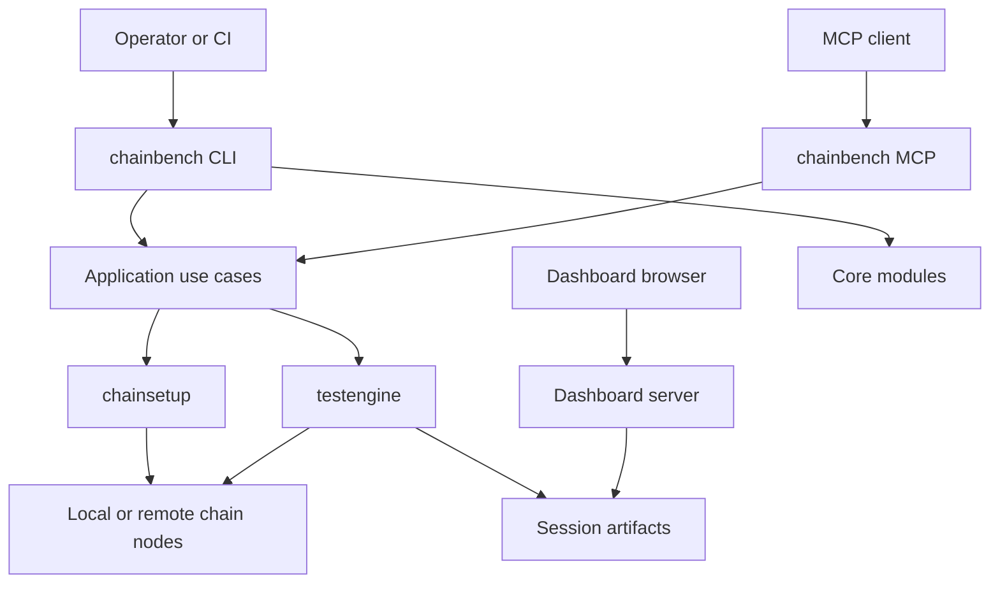
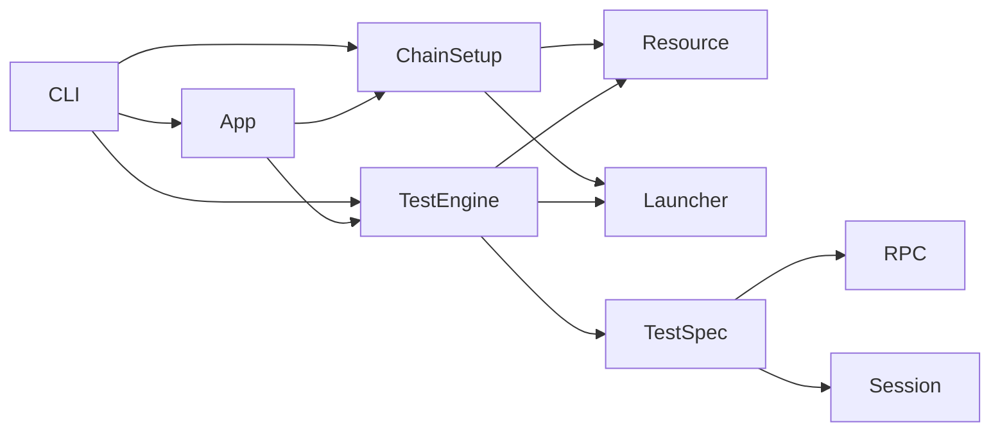
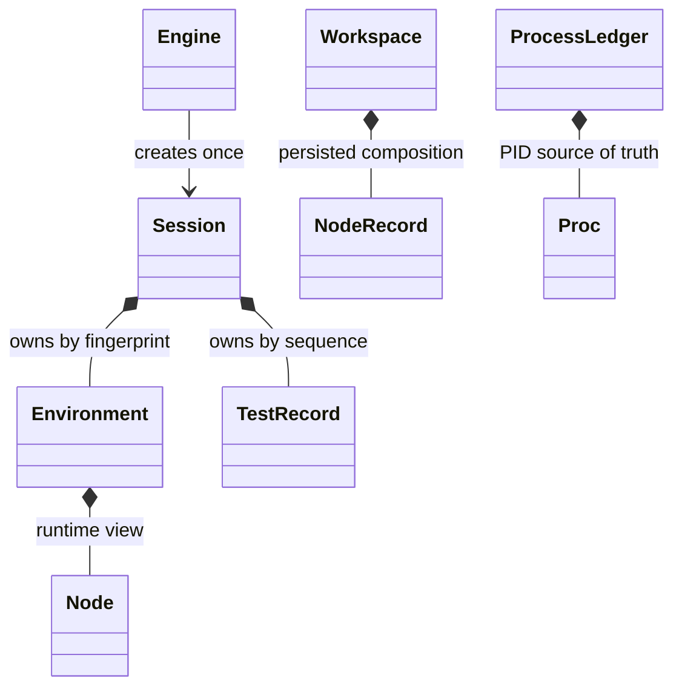
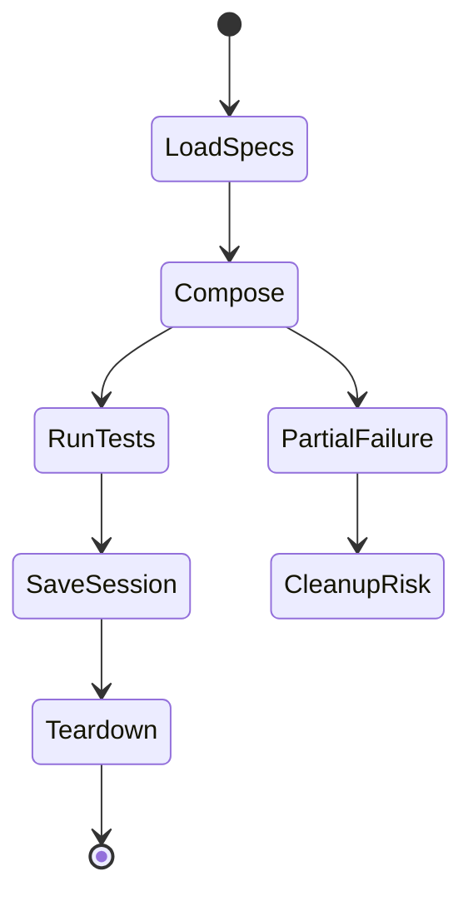
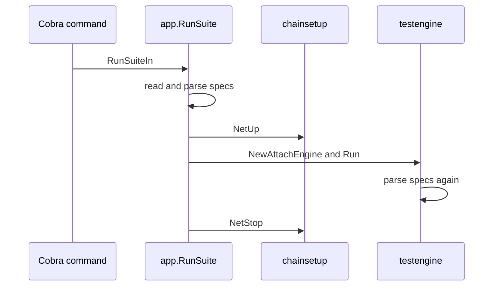
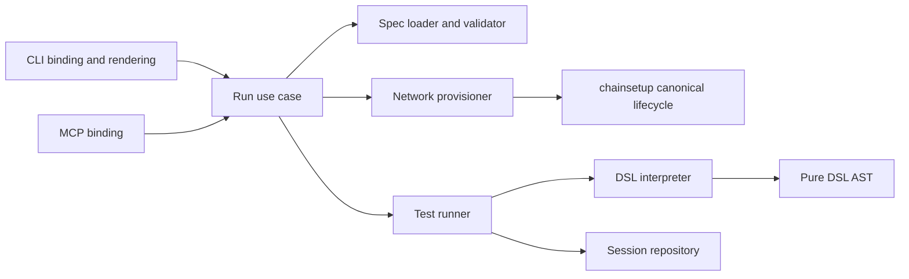
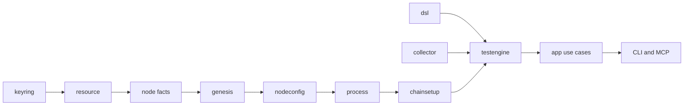

# 구조 다이어그램

## 1. 시스템 컨텍스트

**이 그림이 말하는 것**: CLI는 일부 core 모듈을 직접 호출하고 MCP는 app 경유를 목표로 하지만, 현재 두 표면의 경로가 완전히 통일되지는 않았다 (`docs/dev/architecture/architecture-v2.md:38`, `internal/arch/mcp_imports_test.go:17`).

## 2. 현재 모듈 의존과 중복 구성

**이 그림이 말하는 것**: 의존 방향보다 중요한 문제는 `ChainSetup`과 `TestEngine`이 모두 resource·launcher를 이용해 환경을 구성한다는 점이다 (`internal/chainsetup/verbs_up.go:85`, `internal/testengine/buildenv.go:71`).

## 3. 테스트 객체 소유권

**이 그림이 말하는 것**: 테스트 결과 소유권은 비교적 명확하지만, workspace의 노드 상태는 topology record와 PID ledger로 나뉜다 (`internal/chainsetup/workspace.go:103`, `internal/core/process/ledger.go:17`).

## 4. 실행 수명주기

**이 그림이 말하는 것**: 정상 경로는 분명하지만 부분 구성 실패 때 cleanup closure가 반환되지 않고, 취소된 context를 teardown에 다시 쓰는 위험이 있다 (`internal/testengine/buildenv.go:117`, `internal/testengine/engine_impl.go:74`).

## 5. CLI workspace 실행

**이 그림이 말하는 것**: 하나의 workspace 실행에서 스펙이 application과 engine에서 두 번 파싱된다 (`internal/app/workflow.go:113`, `internal/testengine/engine_impl.go:83`).

## 6. 목표 구조

**이 그림이 말하는 것**: 표면은 하나의 유스케이스를 공유하고, 구성·실행·문법·저장을 각각 하나의 소유자에게 둔다. CLI는 각 하위 계약을 별도 명령이나 테스트 seam으로 검증할 수 있다.

## 7. 리팩토링 진행 방향

**이 그림이 말하는 것**: 상위 실행 경로를 먼저 합치지 않는다. `keyring` 다음의 작은 모듈부터 계약과 산출물을 확정하고, 상위 모듈은 검증된 결과만 조합한다.
