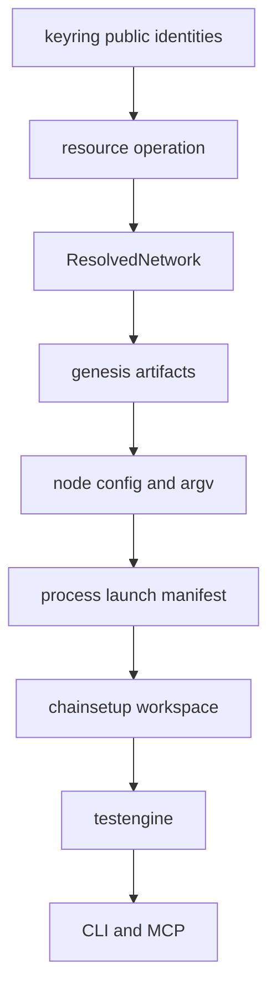

# Bottom-up 모듈 리팩토링 계획

## 1. 목적과 원칙

목표는 현재 약 55개인 관심사와 패키지를 약 20개 주요 모듈로 정리하는 것이다. 주요 모듈 수와 실제 Go 패키지 수는 구분한다. 외부에서 보는 관심사는 하나여도 내부 원자 하위 패키지는 유지한다.

`keyring`이 기준이다. 모델과 계산, 저장, 동작을 나눴고 operation은 자신이 쓰는 작은 `Opener`만 요구한다 (`internal/core/keyring/operation/operation.go:14`, `internal/core/keyring/operation/operation.go:21`). 이 구조를 단일 패키지로 평탄화하지 않는다.

각 단계는 다음 세 조건을 모두 충족해야 완료다.

1. 새 모듈이 판단과 불변식을 실제로 소유한다.
2. 옛 모듈의 중복 판단 지점과 우회 경로를 삭제한다.
3. 다음 계층이나 CLI가 새 산출물을 다시 읽어 동작을 증명한다.

파일 이동, 이름 변경, alias, forwarding wrapper, LOC 감소만으로는 완료로 판정하지 않는다.

## 2. 목표 모듈 검토

| 관심사 | 목표 모듈 | 판정과 보정 |
|---|---|---|
| 자원 | `resource` | 채택. `serverset`, `portplan`, `pool`, `inventory`, `allocate`, `access`, `enode`, `operation` 경계를 유지한다. |
| 노드 사실 | `node` | 채택. model, layout, placement, topology를 나눈다. YAML loader를 model에 합치지 않는다. |
| 프로세스 | `process` | 상위 관심사로 채택. record, control, driver, materialize, launch를 내부에서 나눈다. |
| 키 | `keyring` | 채택. derive, store, operation은 유지한다. 4개 패키지를 하나로 합치지 않는다. |
| genesis | `genesis` | 채택. json, build, source를 나눈다. 실행 중 binary swap은 `upgrade/hardfork`로 둔다. |
| config 빌더 | `nodeconfig` | 채택. launchopt는 하위로 둔다. 범용 config는 `settings`로 분리한다. |
| DSL | `dsl` | 채택. 문법, 파싱, migration, binding, 정적 검증만 소유한다. |
| 구성 실행 | `chainsetup` | 채택. 하위 operation의 순서와 workspace checkpoint만 소유한다. |
| 테스트 실행 | `testengine` | 채택. interpreter, 수집 hook, 결과 기록을 조합한다. 네트워크를 직접 만들지 않는다. |
| 테스트 어휘 | `testhelper` | 채택. 액션, 어설션, reader 구현과 등록을 소유한다. |
| 실사와 비교 | `inspector`, `preflight` | 유지. inspector는 사실을 보고, preflight는 사실을 비교한다. |
| 관측 | `collector` | 채택. collector, obs, logs는 내부 경계를 유지한다. dashboard는 표면으로 남긴다. |
| 체인 정의 | `chains/*`, `consensus/*`, `registry`, `accounts` | 대체로 유지. chain catalog와 genesis/launch strategy 계약만 정리한다. |
| 표면 | `cmd/*`, `mcp`, `app` | app은 표면 중립 유스케이스다. CLI와 MCP는 같은 operation을 호출한다. |
| 은퇴 | 없음 | 호출자 0을 증명한 뒤 testkit, pipeline/testrun, netreg와 소형 wrapper를 삭제한다. |

### 별도 보정

`netid`는 자원이 아니다. devp2p network ID를 검증하고 argv로 표현한다 (`internal/core/netid/netid.go:1`, `internal/core/netid/netid.go:24`). 검증은 `networkid`에 두고 flag 표현은 `nodeconfig`가 소비한다.

`validatorset`은 단순 노드 사실이 아니다. 현재 기준 커밋에서는 key store와 registry를 읽어 체인별 account roster를 만든다. 다른 작업 트리에서 이 기능을 `node/roster`로 옮기는 변경이 진행 중이므로, 최종 위치는 그 변경을 검토한 뒤 확정한다. 어느 위치를 택하든 chain-aware roster가 순수 node model에 registry 역의존을 만들면 안 된다.

`hardfork`는 genesis 생성이 아니라 실행 중인 노드를 새 binary로 다시 띄우는 작업이다 (`internal/core/hardfork/hardfork.go:1`, `internal/core/hardfork/hardfork.go:89`). `upgrade/hardfork`가 소유한다. genesis JSON의 fork 순서 검증만 `genesis/json`에 둔다.

범용 `config`는 chain, node count, key, port, logging 기본값을 함께 가진다 (`internal/core/config/config.go:22`). `nodeconfig`에 흡수하지 않고 `settings`에서 resolved values를 각 모듈 입력으로 변환한다.

`netreg`의 상태를 MCP가 소유해서는 안 된다. MCP는 표면이다. 필요한 registry는 chainsetup, session 또는 application repository가 소유하고 MCP는 조회한다.

## 3. 목표 데이터 흐름

**이 그림이 말하는 것**: 이전 단계가 확정한 사실을 다음 단계가 다시 결정하지 않는다. `genesis`는 validator 개수를 받아 첫 key를 고르지 않고 `ResolvedNetwork.Producers`를 그대로 사용한다.

### ResourcePlan

`resource` 단계는 다음 결과를 만든다.

- 전체 노드 수와 BP, EN, PN 수
- 노드 label과 역할별 순번
- key identity reference와 binary reference
- 서버, host, slot, 모든 port
- enode, producer 여부, bootnode 여부
- capacity, used, free, shortfall, claim owner

현재 `resource.Request`는 role과 label만 받는다 (`internal/resource/pool.go:79`). `resource plan`은 BP와 EN만 생성한다 (`internal/app/netmap_query.go:253`). PN, 명시적 순서, key, binary, bootnode를 새 계약에 추가해야 한다.

### ResolvedNetwork와 genesis

현재 `genesis.Request`는 validator 개수와 `node.Map`만 받는다 (`internal/core/genesis/source.go:29`). `PresetSource`는 첫 N개 key를 다시 선택한다 (`internal/core/genesis/source.go:71`). topology의 실제 BP가 첫 N개 노드가 아니면 genesis validator와 실행 노드가 달라질 수 있다.

새 입력은 확정된 producer identity 목록이어야 한다. WBFT 계열은 validator address와 BLS key를 사용한다. POA 계열은 producer identity, host, P2P port, bootnode와 genesis generator binary를 추가로 사용한다.

## 4. 단계별 실행 계획

### Phase 0. 기준선과 계약

- AST/import graph와 공개 심벌을 저장한다.
- CLI help, JSON, workspace, session, server-set, keyset fixture를 고정한다.
- role, port, key, binary, config, process 판단 지점을 센다.
- 모든 현재 패키지를 목표 owner 또는 삭제 대상으로 매핑한다.

승인 게이트: 목표 모듈별 책임, 허용 import, 호환 범위를 사람이 검토한다.

### Phase 1. resource

작업 순서:

1. `resource/portplan`
2. `resource/pool`
3. `resource/inventory`
4. `resource/allocate`
5. `resource/serverset`
6. `resource/access`
7. `resource/enode`
8. `resource/operation`

CLI는 `server-set validate`, `pool`, `plan`, `allocate`, `inspect`, `release`를 제공한다. `plan`은 전체 노드 수, BP/EN/PN 또는 명시적 topology, key set, binary reference, server set을 받는다.

완료 게이트:

- 같은 입력은 ambient HOME과 workspace에 관계없이 같은 plan을 만든다.
- 전체 수와 역할 수가 일치한다.
- key와 binary 누락, 중복 label, 역할 불일치, 용량 부족을 write 전에 거부한다.
- 모든 port 충돌이 0이다.
- CLI JSON이 slot, port band, reservation, key, binary, enode를 포함한다.
- 기존 `app.NetPlan`과 `NetPool`의 도메인 판단이 사라진다.

### Phase 2. node

- `node/model`에 canonical record를 둔다.
- `node/layout`, `node/placement`, `node/topology`를 분리한다.
- ResourcePlan을 `ResolvedNetwork`로 확정한다.
- 다른 node 타입은 canonical record에서 파생한 view로 제한한다.

완료 게이트: role, label, layout, placement, topology 계산은 각각 한 owner에만 있다. `node/model`은 resource, keyring, registry를 import하지 않는다.

### Phase 3. genesis

- `genesis/json`, `genesis/build`, `genesis/source`를 분리한다.
- validator count 기반 API를 producer identity 기반 API로 바꾼다.
- chain별 key 선택, alloc, member, bootnode 결정을 한 경로로 모은다.

완료 게이트: producer address와 BLS key가 실제 BP와 일치한다. 동일 입력은 같은 genesis를 만든다. key가 빠지면 파일을 쓰기 전에 실패한다.

### Phase 4. nodeconfig

- 하나의 `nodeconfig.Spec`을 정의한다.
- TOML과 argv가 같은 Spec을 사용한다.
- launchopt를 내부 하위 패키지로 둔다.
- 범용 설정 해석은 `settings`로 옮긴다.

완료 게이트: 모든 path와 endpoint가 일치한다. 실제 parser로 생성 config를 다시 읽는다. chainsetup과 launcher의 config 재조립 코드가 0이다.

### Phase 5. process

- record/ledger, control, driver, materialize, launch를 내부에서 나눈다.
- 불변 launch manifest만 입력으로 받는다.
- process는 역할, key, genesis 정책을 다시 판단하지 않는다.

완료 게이트: start failure, timeout, cancellation, teardown, restart를 검증한다. stop/restart owner는 하나다. orphan PID가 남지 않는다.

### Phase 6. dsl, testhelper, collector

- DSL 모델, parser, migration, binding, 정적 검증을 `dsl`로 옮긴다.
- interpreter contract와 실행은 testengine 쪽으로 옮긴다.
- testhelper에 남은 액션, 어설션, reader를 이관한다.
- collector가 sampling, logs, events, persistence adapter를 소유한다.

완료 게이트: `dsl`은 accounts, RPC, session, process를 import하지 않는다. interpreter와 collector lifecycle은 각각 한 경로다.

### Phase 7. chainsetup

- workspace persistence와 typed step sequence만 소유한다.
- resource, genesis, nodeconfig, process operation을 순서대로 호출한다.
- 각 단계 산출물을 저장하고 resume이 같은 sequence를 사용한다.

완료 게이트: chainsetup에 key 생성, 배정, genesis build, config render, process 실행 구현이 없다. 각 단계 failure injection과 resume가 통과한다.

### Phase 8. testengine

- 구성된 환경에서 DSL을 실행하고 결과를 기록하는 역할만 남긴다.
- `NewBuildEnv`와 local composition 경로를 제거한다.
- attach, local, workspace가 같은 runner를 사용한다.

완료 게이트: resource, genesis, config, process를 직접 조립하지 않는다. setup failure, assertion failure, teardown failure를 구분한다.

### Phase 9. app, CLI, MCP

- app에 표면 중립 request/result를 둔다.
- CLI와 MCP가 같은 operation을 호출한다.
- `netcmd`를 `chaincmd`로 개편한다.
- CLI는 flag binding과 출력만 맡는다.

완료 게이트: 같은 입력에서 CLI JSON과 MCP 결과가 의미상 같다. surface에 registry lookup, default 선택, filesystem과 process 정책이 없다.

### Phase 10. 은퇴

호출자와 import가 0인 항목만 삭제한다. 대상은 testkit, pipeline/testrun, testspec compatibility wrapper, app forwarding API, 중복 launcher lifecycle, netreg와 소형 wrapper다.

## 5. 모든 단계에 적용할 검증 게이트

### AST와 import

- 목표 DAG 위반과 cycle을 실패로 처리한다.
- 옛 owner wrapper를 계속 거치면 완료로 보지 않는다.
- 임시 alias와 wrapper에는 제거 phase와 소비자 목록을 기록한다.

### 원자 테스트

- pure 모듈은 filesystem, network, process mock 없이 테스트할 수 있어야 한다.
- 성공보다 거부, no-partial-write, 멱등성, 결정성을 먼저 고정한다.
- 핵심 validation을 제거하면 해당 owner 테스트가 실패해야 한다.

### CLI 계약

- 모든 flag가 최종 산출물이나 readback을 실제로 바꾸는지 검사한다.
- human/JSON schema, stdout/stderr, secret 비노출, read-only no-write를 고정한다.
- CLI handler에는 입력 변환, operation 호출, rendering만 둔다.

### 통합과 E2E

- 이전 단계 산출물을 다음 단계가 실제로 읽는다.
- local/remote, resume, retry, cleanup, cancellation을 포함한다.
- lower-level gate를 통과하지 못한 상태에서 E2E 성공으로 구조 품질을 대신하지 않는다.

### 호환성과 삭제

- old workspace, server-set, keyset, session fixture를 재생한다.
- old import, symbol, alias, wrapper, serializer, default, validator가 0이어야 한다.
- 삭제 뒤 전체 graph, compile, unit, CLI, integration, E2E를 다시 실행한다.

## 6. 사람 검토 게이트

코드 변경 전에 각 phase의 입력, 출력, package tree, 허용 import, CLI schema를 검토한다. 승인을 받은 phase만 구현한다. 구현을 마친 뒤에는 검증 결과와 삭제 목록을 다시 검토하고 다음 phase로 넘어간다.
