# 상태 주도 리팩토링 검토 — chainsetup · testengine — [측정 + 제안]

> 작성 2026-09-21. 대상은 커밋 `6e2a0af8` 과 그 위의 커밋 안 된 수정(start 단계를 핸들러로
> 옮기는 작업, 7개 파일)이다. 근거는 전부 이 작업 트리에서 잰 것이고, 파일·줄을 붙였다.
> **줄 번호는 `6e2a0af8` 기준이다.** 같은 날 뒤이은 커밋(`17a622ee` · `5fe2d8a1` · `80e29fbe`)에서
> `verbs_up.go` 가 재편되어 `upStepNames` 가 사라지고 줄이 옮겨졌다. 판정은 그대로 유효하다.
>
> 그래프 자료: [`graph/code-graph.json`](graph/code-graph.json)(tree-sitter, 798 파일),
> [`graph/callgraph-state.json`](graph/callgraph-state.json)(go/types 호출 그래프, 778 함수 · 2,016 호출),
> [`graph/lifecycle-transitions.json`](graph/lifecycle-transitions.json)(전이표를 소스에서 추출한 것).
> 9월 3일자 그래프는 [`graph-snapshots/cd22f8ed/`](graph-snapshots/cd22f8ed/) 에 남겼다.

---

## 0. 결론부터

**지금 코드는 "상태를 검증하는 기계"이지 "상태가 이끄는 기계"가 아니다.** 근거는 셋이다.

1. **상태가 어디에도 남지 않는다.** `lifecycle.Machine` 은 `netUpFrom` 안에서 만들어져 함수가
   끝나면 사라진다(`internal/chainsetup/verbs_up.go:372`, `:376`). 기록(`chain-record.json`)에
   적히는 것은 여전히 이름 키의 단계 map 이다(`internal/chainsetup/state.go:99`). resume 는
   상태가 아니라 그 map 과 상수 배열 `upStepNames` 로 "어디까지 왔나" 를 다시 계산한다
   (`internal/chainsetup/verbs_resume.go:116`~`121`).
2. **단계는 기계 밖에서도 그대로 호출된다.** `chain keys` 같은 단일 명령은 기계를 거치지 않고
   같은 verb 를 부른다(`internal/app/net.go:116`). 그래서 verb 는 기계를 믿을 수 없고,
   `require()`(7곳) · `allow()`(8곳) · 손으로 쓴 "run `chain X` first" 문구(13곳)를 전부
   그대로 들고 있다. 전이표가 없애기로 한 것들이다(`docs/dev/architecture/design-v3/state-machine-03-transitions.md` §6).
3. **핸들러는 일을 하지 않고, 일이 끝난 뒤 지나온 상태를 재생한다.** 단계 verb 가
   `Passed []lifecycle.Status` 를 돌려주면 핸들러가 그것을 `m.Request` 로 하나씩 되풀이한다
   (`internal/chainsetup/statedriven.go:160`~`200`). 기계는 전이를 *일으키지* 않고 *추인*한다.

그래서 이 문서의 제안은 "기계를 더 만들자" 가 아니라, **기록·verb·기계 셋이 각자 들고 있는
"지금 어디인가" 를 하나로 모으자** 이다. 후보는 5장에 열 개를 적었고, 6장에 순서를 제안했다.

---

## 1. 무엇을 어떻게 쟀나

세 가지를 만들었다.

- **모듈 그래프** — codemine `extract_graph.py`(tree-sitter). 798 파일, 24 모듈, 115,331 줄, 669 타입.
- **호출 그래프** — `go/packages` + `go/types` 로 `chainsetup` · `testengine` · `app` ·
  `core/lifecycle` · `mcp` · `cmd/chainbench` 의 함수 778개 사이 호출 2,016건을 뽑았다. 인터페이스
  메서드 호출은 타입이 잡히는 것만 들어간다(클로저 필드 호출은 빠진다).
- **전이표 추출** — `internal/core/lifecycle/transitions.go` 의 `allowed` map 을 파싱해 상태 70개,
  그중 프로덕션 코드가 참조하는 49개를 셌다(4장).

빌드 · vet · 네 패키지 테스트는 작업 트리 기준으로 통과한다(`go test ./internal/core/lifecycle
./internal/chainsetup ./internal/testengine ./internal/app`).

| 모듈 | 파일 | 줄 | 함수 |
|---|---|---|---|
| `internal/chainsetup` | 94 | 17,458 | 528 |
| `internal/testengine` | 58 | 9,591 | 302 |
| `internal/app` | 35 | 4,421 | 201 |
| `internal/core/lifecycle` | 5 | 1,203 (테스트 포함) | — |

`Workspace` 타입의 메서드는 120개다(호출 그래프에서 센 것).

---

## 2. 체인 셋업은 실제로 어떻게 도는가

### 진입: 네 가지 요청이 하나의 시작 상태가 된다

`chainbench run` 과 MCP `chainbench_run` 은 둘 다 `app.StartFor` 를 부른다
(`cmd/chainbench/suitecmd/run.go:94`, `internal/mcp/run_tool.go:68`). 이 함수는 사용자가 적은
것(`--rpc`, `--attach`, `--workspace-dir`, 정의서의 `env.attach`)을 우선순위대로 보고 시작
상태 하나를 돌려준다(`internal/app/start.go:73`).

```
--attach + dir       → AdoptChainByWorkspace
--rpc                → AdoptChainByRPC
--workspace-dir 만   → ChainOpenWorkspace          (조립)
env.attach 선언      → AdoptChainByDeclaration
```

여기까지는 설계대로다. **그런데 이 값은 이 뒤로 기계에 들어가지 않는다.** `Adopts()` 가 참이면
`AttachRun` 으로, 거짓이면 `RunSuite` 로 갈린다(`internal/app/start.go:118`). `Start.At` 은
네 값짜리 enum 이지 기계의 시작 상태가 아니다.

### 경로 A — `chain up` / `chain resume`: 기계가 돈다

`NetUp` → `netUpFrom`(`internal/chainsetup/verbs_up.go:155`, `:286`). 순서는 이렇다.

1. `planUp` 이 요청을 검사한다 — 디렉터리 · stage · topology 의 키 참조 · execution.chain
   (`internal/chainsetup/verbs_up.go:169`). 설계가 "루프 진입 전 검증" 자리로 지목한 곳인데, 아직 세 가지만 본다
   (`state-machine-01-failures.md` §4.2 의 BAD_INPUT 16건 중 대부분은 여전히 단계 안에서 터진다).
2. 워크스페이스를 열고 **한 번** 잠근다(`internal/chainsetup/verbs_up.go:309`). 이 잠금이 단계 사이의 틈을 막는다.
3. reuse-if-matching 이면 지금 노드들의 해시 스냅샷을 뜬다(`internal/chainsetup/verbs_up.go:322`).
4. `record` 클로저를 만든다 — 단계 이름을 받아 verb 를 부르고, 실패면 기록에
   `MarkStepFailed` 를 남기고, 성공이면 detail 을 모은다(`internal/chainsetup/verbs_up.go:337`).
5. 시작 상태는 `startFor(from)`(resume 면 그 단계, 아니면 `ChainOpenWorkspace`), 목표는
   `targetFor(stage)`(`deploy` 면 `ChainInitNodes`, `start` 면 `ChainVerify`)
   (`internal/chainsetup/statedriven.go:324`, `:341`).
6. `lifecycle.New` 로 기계를 만들고 `Run` 한다(`internal/chainsetup/verbs_up.go:372`, `:376`). 기계는 현재 블록의
   핸들러를 찾아 부르고, 핸들러가 `Request` 로 옮긴 상태를 보고 다시 돈다
   (`internal/core/lifecycle/machine.go:130`).
7. 끝나면 `NetworkStatus` 로 노드 표를 읽어 돌려준다. **기계의 마지막 상태는 버려진다.**

### 경로 B — `run`(조립): 다른 기계가 돈다

`RunSuite`(`internal/testengine/suite.go:231`) → `composeWorkspace`
(`internal/testengine/attach_workspace.go:167`) → `NetUpComparing`
(`internal/chainsetup/compare.go:72`). 이 기계는 **`CompareChain` 에서 시작**한다.
`StartFor` 가 "조립은 `ChainOpenWorkspace` 에서 시작한다" 고 한 것과 다르다.

`CompareChain` 핸들러가 `preflight` 판정 넷을 상태 넷으로 바꾸고(`internal/chainsetup/compare.go:86`), 그 뒤
`ChainOpenWorkspace` 로 되돌아가 조립 핸들러들을 탄다. 조립 핸들러는 경로 A 와 같은
`upHandlers(run)` 이다. 다만 둘이 다른 점이 있다.

- **바깥 잠금이 없다.** `NetUpComparing` 은 `Acquire` 를 부르지 않는다(`internal/chainsetup/compare.go:72`~`80`).
  단계마다 `inWorkspace` 가 잠갔다 풀 뿐이다. 경로 A 가 닫은 "단계 사이의 틈" 이 이 경로에서는
  열려 있다.
- **reuse-if-matching 에 닿지 않는다.** `ReconcileChain` 을 태우는 것은 `netUpFrom` 뿐이다
  (`internal/chainsetup/verbs_up.go:322`). `run` 경로는 `preflight.Compare` 라는 별개의 재사용 판정을 쓴다. 같은
  질문("이미 도는 것을 다시 쓸까") 에 답하는 장치가 둘이다.
- 목표가 `ChainVerify` 인데 **VERIFY 핸들러가 없다.** 기계는 `ChainVerify` 에 *닿으면* 멈추고,
  준비 검사는 기계가 돌아온 뒤 `readWorkspaceComposed` → `gateReady` 가 한다
  (`internal/testengine/attach_workspace.go:188`, `:243`, `internal/testengine/nodegate.go:274`). 설계 3번 §1.3 이
  "상태는 안에, 핸들러는 testengine 이 등록" 이라 정한 것이 아직 안 됐다.

### 경로 C — attach 셋: 기계가 없다

`AttachRun`(`internal/app/workflow.go:97`) 은 `At` 의 블록이 `AdoptChain` 인지 확인하고
(`:119`) 워크스페이스 attach 면 `AttachWorkspaceRun` 으로(`:143`), 아니면 `NewAttachEngine` 으로
간다. 어느 쪽도 `lifecycle` 를 쓰지 않는다. `testengine` 은 `lifecycle` 를 import 하지 않는다
(`go list` 로 확인).

### 한 단계가 도는 방법

어느 경로든 단계 하나는 이렇게 돈다.

```
Machine.Run
 └ handlersFor 가 만든 핸들러 (internal/chainsetup/statedriven.go:160)
    └ composeStage.run (internal/chainsetup/statedriven.go:204)
       └ record 클로저 (internal/chainsetup/verbs_up.go:337)
          └ upSteps["keys"] 클로저 (internal/chainsetup/verbs_up.go:212)
             └ NetKeys (internal/chainsetup/verbs_steps.go)
                └ inWorkspace: Open → Acquire → ws.Keys → Save → Release (internal/chainsetup/verbs_steps.go:37)
                   └ Workspace.Keys: 일을 하고 markStep("keys") 하고 Passed 를 돌려줌 (internal/chainsetup/steps_keys.go:73, :160)
       ← Passed 를 m.Request 로 하나씩 재생 (internal/chainsetup/statedriven.go:160~200)
       ← 다음 블록으로 m.Request(stage.next)
```

여섯 겹이다. 그리고 **핸들러에는 `Workspace` 가 없다.** 핸들러 서명이 `(ctx, m, at)` 이라
(`internal/core/lifecycle/machine.go:59`) 도메인 객체를 받을 자리가 없고, 그래서 단계마다
워크스페이스를 다시 열고 다시 잠그고 다시 저장한다. `chain up` 한 번에 Open/Acquire/Save 가
아홉 번 돈다(바깥 잠금 한 번은 별도).

### 실패는 어떻게 상태가 되나

단계 verb 가 실패를 돌려주면 `composeStage.failed` 가 처리한다(`internal/chainsetup/statedriven.go:236`).

1. `Passed` 에 담긴 "여기까지 갔다" 를 먼저 재생한다.
2. `classify` 가 있으면 sentinel 에러(`errors.Is`)로 실패 상태를 고른다 — keys, genesis, 그리고
   작업 트리에서는 start 까지 셋(`internal/chainsetup/statedriven.go:262`, `:283`, 작업 트리의 `launchFailure`).
3. 없으면 `FailStageUnclassified` 로 가고, 왜 못 가르는지(`owed`)를 에러에 덧붙인다.

즉 실패 하나가 **세 어휘**를 거친다: `ofKind` 로 붙인 sentinel(`internal/chainsetup/failurekind.go:26`)
→ `lifecycle.Status` → 기록의 `StepFailed` + `Err` 문자열(`internal/core/session/composition.go:46`, `:70`).
기록에 남는 것은 셋째뿐이다.

### resume 는 상태를 읽지 않는다

`NetResume`(`internal/chainsetup/verbs_resume.go:56`) 은 노드 pid 를 실물과 맞춘 뒤 `firstUndone` 으로 "첫 미완
단계" 를 찾는다. 그 함수는 `upStepNames` 를 돌며 `Steps[name].Done` 을 본다(`:116`~`121`).
그 이름으로 `netUpFrom(…, from=first)` 를 다시 부른다(`:89`). 기계의 상태값은 이 어디에도 없다.

### testengine 자체의 수명주기

`engine.Run`(`internal/testengine/engine_impl.go:95`) 은 정의서마다 한 바퀴 도는 for 문이다.

```
세션 생성 → [정의서마다] 파싱 → 적용 여부 → 환경 fingerprint 로 재사용/구축(:136, :147)
          → PreSpec 게이트(:167) → RunSpec(:175) → 실패면 OnFail(:185) → 다음
→ 세션 저장 → teardown
```

단계는 `Deps` 의 클로저 여섯 개로 갈라져 있고(`internal/testengine/engine_impl.go:17`), 진행은 `collector.Phase`
셋(`setup` / `verify` / `test`, `internal/core/collector/event.go:14`~`16`)으로 대시보드에
알린다. `lifecycle` 의 TEST 영역(0x8000)은 영역 상수 하나만 있고 상태는 없다
(`internal/core/lifecycle/status.go:65`). 설계 2번 §8 이 "6번에서 잰다" 고 미뤄 둔 그대로다.

---

## 3. "상태 기반" 이라 보기 어려운 이유 일곱

앞 장의 관찰을 판정으로 모으면 이렇다.

**① "지금 어디인가" 를 네 곳이 따로 안다.** 기록의 단계 map(`internal/chainsetup/state.go:99`) · `upStepNames`
(`internal/chainsetup/verbs_up.go:152`) · `composition` 표(`internal/chainsetup/statedriven.go:59`) · 전이표 `allowed`
(`transitions.go`). 같은 아홉 이름, 같은 순서를 네 번 적고, 테스트 둘이 그것들이 어긋나지
않게 붙든다(`TestEveryStageIsPlaced`, `TestStagesKeepTheCompositionOrder`). 래칫이 넷을 묶고
있다는 것은 넷이어야 할 이유가 없다는 뜻이다.

**② 상태는 휘발한다.** `Machine.At()` 을 읽는 곳은 `internal/chainsetup/compare.go:80` 하나이고, 그 값은 에러
문장에 `(at %s)` 로 붙는 데만 쓰인다(`internal/testengine/attach_workspace.go:176`). 로그 · 이벤트 · 기록 어디에도
`Status` 가 안 나간다. 기계에 관찰자 훅이 없다(`machine.go` 의 메서드는 `At` `Err` `Request`
`Run` 넷뿐).

**③ 전이는 일으키는 것이 아니라 추인하는 것이다.** `Passed` 재생(②의 `handlersFor`) 은
"단계가 이미 다 했으니 무엇을 지났는지 표에 맞춰 본다" 이다. 표가 거부하면 실패하지만, 그때는
이미 일이 끝난 뒤다. 설계가 "값이 가장 큰 자리" 로 꼽은 launch 의 phase 상태
(`state-machine-03-transitions.md` §3.3)도 마찬가지다 — 작업 트리의 `Start` 가
`PhaseLaunching`/`PhaseActions`/`PhaseDone` 을 `passed` 에 쌓지만(`internal/chainsetup/steps_lifecycle.go:212`
이하), 프로세스가 죽으면 기록에는 `start: failed` 와 문장만 남는다.

**④ 선행 조건은 여전히 verb 안에 있다.** 전이표가 "진입하지 않은 블록으로 못 간다" 를 대신
하기로 했지만(`03-transitions.md` §6), verb 는 기계 밖에서도 불리므로 `require()` 를 못 뺀다.
호출 그래프로 센 수:

| 장치 | 호출 지점 | 어디 |
|---|---|---|
| `require(step)` — 단계 선행 | 7 | Config · Genesis · Init · LaunchOpts · Provision · Start · allow |
| `allow(verb)` — 실행 조건 | 6 (+ `allowNode` 2) | Hardfork · Health · Preflight · Rm · VerifyValidators · StartNode · SwapNode |
| 전이표 `permits` | 기계 안 | `Machine.Request` |
| "run `chain X` first" 손 문장 | 13 | steps_keys · steps_lifecycle · verb_needs · node_ops · verbs_enode · verbs · steps_compose |

같은 질문에 장치가 셋이고, 그중 기계는 한 경로에서만 켜진다.

**⑤ 기계가 셋이고 서로 다른 데서 시작한다.** `netUpFrom`(OpenWorkspace→Verify) ·
`NetUpComparing`(Compare→Verify) · attach(없음). `StartFor` 가 고른 시작 상태와 실제 기계의
시작 상태가 다르다(2장 경로 B).

**⑥ 상태 70개 중 21개는 프로덕션 코드가 한 번도 부르지 않는다.** 4장에 표가 있다. 특히
`ChainVerify*` 넷과 `ChainReady` 는 어느 기계도 *들어가지* 않는다 — 둘 다 목표가 `ChainVerify`
라 그 앞에서 멈춘다. `ChainDeployNodes{VerifiedLocal,ShippedRemote}` 는 deploy 단계가
`classify` 도 `assumed` 도 없어서 `run` 이 `nil, nil` 을 돌려주고 곧장 다음 블록으로 간다
(`internal/chainsetup/statedriven.go:204`~`225`).

**⑦ testengine 은 아직 손대지 않았다.** 2장 마지막 절. 설계가 미뤄 둔 것이지 결함은 아니지만,
"chainsetup 과 testengine 의 상태 기반" 에서 후자는 0 이다.

한 문장으로 줄이면: **verb 가 API 이고 기계는 그 verb 를 부르는 여러 호출자 중 하나다.** 상태가
이끌려면 그 관계가 뒤집혀야 한다.

---

## 4. 전이표의 도달 현황

`allowed` 에서 뽑은 상태 70개 중 49개를 프로덕션 코드(테스트 제외, `lifecycle` 패키지 자신
제외)가 참조한다. 나머지 21개:

| 묶음 | 상태 | 왜 안 닿나 |
|---|---|---|
| VERIFY · READY 5 | `ChainVerifyProducing` `ChainVerifyHaltedAsDeclared` `ChainVerifyFailPlanMismatch` `ChainVerifyFailNotProducing` `ChainReady` | 두 기계 모두 `ChainVerify` 를 목표로 삼아 그 앞에서 멈춘다 |
| deploy 세부 2 | `ChainDeployNodesVerifiedLocal` `ChainDeployNodesShippedRemote` | deploy 단계가 `Passed` 를 보고하지 않는다 |
| 실패 12 | new 1 · place 2 · config 3 · build 1 · deploy 2 · init 3 | 여섯 단계가 `owed`(작업 트리 기준 `stagesStillOwing = 6`, `internal/chainsetup/statedriven.go:117`) |
| adopt 실패 2 | `AdoptChainFailUnreachable` `AdoptChainFailWrongChain` | adopt 는 기계에 안 탄다 |
| 공통 5 | `FailLoop` `FailNoHandler` `FailRecordFormat` `FailRecordSave` `FailWorkspaceConfig` | 앞 둘은 기계 내부에서만 쓰고, 뒤 셋은 아무도 안 쓴다 |

블록 단위로 그리면 이렇다. 굵은 선이 기계가 실제로 걷는 길이고, 점선은 표에는 있으나 지금
아무 경로도 걷지 않는 길이다.

```mermaid
stateDiagram-v2
    direction LR
    state "app.StartFor (enum, 기계 아님)" as S
    state "AdoptChain (기계 없음)" as A
    state "CompareChain\n(run 경로 기계의 시작)" as C
    state "ReconcileChain\n(chain up 경로만)" as R
    state "OpenWorkspace" as O
    state "BuildNodeTable" as P
    state "EnsureKeys" as K
    state "BuildGenesis" as G
    state "BuildNodeConfig" as CF
    state "BuildNodeCommand" as B
    state "DeployNodes" as D
    state "InitNodes" as I
    state "LaunchNodes" as L
    state "Verify (목표, 진입 안 함)" as V
    state "Ready (도달 없음)" as RD

    S --> A: --rpc / --attach / env.attach
    S --> O: --workspace-dir
    C --> O: NothingComposed / NetworkDiffers
    C --> V: Same / NodesDiffer
    O --> P
    P --> K
    K --> G
    K --> R: reuse-if-matching
    R --> G
    G --> CF
    CF --> B
    B --> D
    D --> I: chain up --stage=deploy 는 여기서 멈춤
    I --> L
    L --> V
    V --> RD
```



전체 58개 진행 전이(실패 전이 제외)는 `graph/lifecycle-transitions.json` 에 있다.

---

## 5. 추가 리팩토링 후보

각 항목에 무엇 · 왜 · 크기 · 단점 · 의존을 적었다. **크기**는 손대는 파일 수와 기록 형식 변경
여부로 잰 감이지 측정치가 아니다.

### R1. 기록이 상태를 담게 한다 (③②① 의 뿌리)

**무엇.** `State` 에 `At lifecycle.Status`(+ 이름 문자열)를 두고, 기계가 옮길 때마다 적게 한다.
`firstUndone` · `Have.Started` · `preflight` 가 단계 map 대신 이 값을 읽는다.

**왜.** "지금 어디인가" 의 정본이 하나가 된다. 죽은 실행이 남기는 것이 "start: failed" 가
아니라 `ChainLaunchNodesPhaseActions` 가 된다 — 설계가 이 리팩토링에서 가장 값이 크다고
한 자리다.

**크기.** 중. `state.go` · `statedriven.go` · `verbs_resume.go` · `steps_preflight.go` ·
`session/composition.go`. **`FormatVersion` 을 2로 올려야 한다** — 이 저장소는 "한 빌드는
자기가 쓰는 버전만 읽는다" 정책이라(`state.go` 의 `FormatVersion` 주석) 옛 워크스페이스는
이름으로 거절된다.

**단점.** 단계 map 을 같이 남기면 정본이 둘이 되고, 없애면 운영 기록 8개(stop · rm ·
restart …, `cohesion-candidates-2026-09-21.md` §A)의 자리가 없어진다. §A 의 2안("이름만
선언") 을 먼저 하고 조립 9개만 상태로 옮기는 것이 맞다.

**의존.** R2.

### R2. 기계에 관찰자를 단다

**무엇.** `lifecycle.New` 에 `OnMove func(from, to Status)` 를 받게 하거나, `Machine` 에
`Observe` 를 둔다. `netUpFrom` 이 (a) 기록 저장, (b) `d.logf`, (c) `collector` 이벤트로 연결한다.

**왜.** 지금 상태는 에러 문장 한 곳 말고 어디에도 안 보인다(3장 ②). 대시보드가 `collector.Phase`
셋으로 보는 것을 상태로 보게 된다.

**크기.** 소. `machine.go` 한 곳 + 배선.

**단점.** 관찰자가 저장에 실패하면 어떻게 할지 정해야 한다 — `FailRecordSave` 가 바로 그
자리인데 지금 아무도 안 쓴다(4장). 그것을 쓰는 첫 소비자가 된다.

**의존.** 없음. R1 의 전제.

### R3. 순서 선언을 하나로

**무엇.** `upStepNames` 를 `composition` 표에서 파생시키고, `composeNeeds` 는 "표의 순서가
의존을 어기지 않는가" 를 빌드 때 검사하는 입력으로만 남긴다(설계 3번 §3.2 가 이미 이렇게
정했다). 래칫 둘을 하나로 줄인다.

**왜.** 3장 ①. 같은 아홉 이름이 네 곳에 있다.

**크기.** 소. `internal/chainsetup/verbs_up.go:152` · `internal/chainsetup/verbs_resume.go:121` · 테스트 둘.

**단점.** 없다시피 하다. R1 이 되면 `upStepNames` 는 어차피 사라진다.

**의존.** 없음. 먼저 해도 된다.

### R4. 단일 단계 명령도 기계를 지나게 한다 (④ 의 뿌리)

**무엇.** `chain keys` 가 부르는 `NetKeys` 를 "`ChainEnsureKeys` 에서 시작해 다음 블록을 목표로
하는 한 칸짜리 기계" 로 만든다. 즉 `netUpFrom(from="keys", target=next)`. 그러면 전이표가
"place 를 안 지났으면 keys 에 못 간다" 를 대신하므로 `require()` 7곳과 손 문장 13곳을 지울 수
있다. `composeNeeds` 는 R3 의 검사 입력으로만 남는다.

**왜.** 이것이 "verb 가 API, 기계는 호출자" 를 뒤집는 한 수다. 이것 없이는 ④ 가 안 풀린다.

**크기.** 중~대. `verbs_steps.go` · `verbs_lifecycle.go` · `steps_*.go` 의 `require` 호출 ·
`app/net.go` 의 얇은 래퍼는 그대로. R1 이 있어야 "place 를 지났는가" 를 기록의 상태로 안다.

**단점.** 시작 상태를 기록에서 읽어야 하므로 R1 이 먼저다. `allow()` 의 실행 조건(노드가
도는가) 은 단계 상태가 아니라 실물 조건이라 이 표로는 안 없어진다 — `verb_needs.go` 는 남는다.
설계 4장이 이미 그렇게 갈랐다.

**의존.** R1, R3.

### R5. 핸들러가 워크스페이스를 받게 한다 (③ 여섯 겹)

**무엇.** `netUpFrom` 이 이미 연 `lockWS` 를 단계 함수에 넘긴다. 핸들러 서명은 그대로 두고,
`composeStage` 에 `do func(ctx, *Workspace, *Machine) error` 를 두어 `ws.Keys` 를 직접 부른다.
저장은 블록을 옮길 때 관찰자(R2)가 한다. 그러면 단계 함수가 일을 하면서 `m.Request` 를 부를
수 있어 `Passed` 재생이 필요 없어진다.

**왜.** Open/Acquire/Save 아홉 번이 한 번이 된다. 전이가 "추인" 에서 "일으킴" 이 된다.
`ofKind` sentinel → `classify` switch 두 겹(2장 실패 절)도 단계가 실패 상태를 직접
`Request` 하면 한 겹이 된다(R9 와 겹친다).

**크기.** 대. 단계 아홉 개의 본체 서명이 바뀐다. 단, `ws.Keys` 와 `NetKeys` 의 분리는 이미
있으므로 래퍼 쪽만 얇아진다.

**단점.** `Workspace` 를 핸들러에 넘기면 `lifecycle` 는 그대로 순수하지만 `chainsetup` 의
핸들러 클로저가 두 객체(`ws`, `m`)를 잡는다. 단일 명령 경로(R4)와 같은 `do` 를 써야 하므로
R4 와 같이 가야 한다.

**의존.** R2, R4.

### R6. VERIFY 핸들러를 testengine 이 등록한다 (설계 3번 §1.3, 미이행)

**무엇.** `NetUpComparing` 의 목표를 `ChainReady` 로 올리고, `CompareIn` 에
`Verify lifecycle.Handler` 를 받는다. `testengine` 이 `gateReady` + `verifyAgainstPlan` 을
`ChainVerify` 핸들러로 넘긴다. `chain up` 은 목표를 `ChainVerify` 로 유지한다.

**왜.** 4장의 `ChainVerify*` 5개가 살아난다. "조립은 끝났지만 준비는 안 됐다" 가 상태가 된다.
`gateReady` 가 이미 층을 지킨 채 밖에 있으므로 옮기는 것이 아니라 등록하는 것이다.

**크기.** 소~중. `compare.go` · `internal/testengine/attach_workspace.go:167`~`250`.

**단점.** `readWorkspaceComposed` 가 attach 경로와 공유되므로, 핸들러로 뽑을 때 attach 쪽도
같은 함수를 쓰게 두어야 중복이 안 생긴다.

**의존.** 없음. R7 의 전제.

### R7. adopt 셋을 기계에 태운다, 아니면 `Start.At` 에서 `Status` 를 뗀다

**무엇.** (a) `AttachWorkspaceRun` 과 `NewAttachEngine` 도 `AdoptChainBy* → CompareChain →
ChainVerify → ChainReady` 를 걷는 기계로 만든다. `AdoptChainFail*` 둘이 살아난다. 또는
(b) `app.Start.At` 을 자체 enum 으로 바꾸고 `lifecycle` 의 adopt 상태 5개를 지운다.

**왜.** 3장 ⑤. 지금은 이름만 상태다. 둘 중 하나여야 한다.

**크기.** (a) 중. (b) 소.

**단점.** (a) 는 attach 경로에 "조립하지 않는 기계" 를 두는 것이라, 상태 셋이 곧바로 Compare
로 가는 한 줄짜리 기계가 된다. 소비자 없는 구조를 미리 배선하다 두 번 되돌린 저장소이므로
(`direction.md` §5), **R6 이 끝나 VERIFY 가 상태가 된 뒤에** (a) 의 값이 생긴다. 그전에는 (b).

**의존.** R6.

### R8. 비교 경로의 잠금 공백과 재사용 장치 이중화

**무엇.** `NetUpComparing` 이 `compareHandlers` 로 핸들러 배선을 다시 만드는 대신
(`internal/chainsetup/compare.go:86`~`170` 은 `internal/chainsetup/verbs_up.go:337`~`372` 의 복제다), `netUpFrom` 에 시작 상태를
넘겨 한 함수가 두 경로를 맡게 한다. 그러면 바깥 잠금 · reuse 스냅샷 · `record` 클로저가
자동으로 공유된다.

**왜.** 2장 경로 B 의 두 차이. 잠금 공백은 동시 실행에서 실제로 문제가 될 수 있고, reuse 가
경로마다 다르면 "정의서로 돌리면 재조립, `chain up` 으로 돌리면 재사용" 이 된다.

**확인 필요.** `run` 경로에서 `execution.chain=reuse-if-matching` 을 무시하는 것이 의도인지
아직 모른다. `preflight.Compare` 와 `reconcileReuse` 가 같은 질문에 다른 답을 낼 수 있는지
먼저 재야 한다.

**크기.** 중. `compare.go` 가 얇아진다.

**의존.** 없음. R5 앞에 하면 R5 의 범위가 한 곳이 된다.

### R9. 남은 여섯 단계의 실패 분류

**무엇.** new · place · config · build · deploy · init 의 `owed` 를 `classify` 로 바꾼다.
지금 진행 중인 방식(sentinel + `ofKind` + switch) 그대로다. deploy 는 세부 둘
(`VerifiedLocal`/`ShippedRemote`)도 보고한다.

**왜.** 4장의 실패 12개 + deploy 세부 2개가 닿는다. 이미 하고 있는 일이라 새 제안은 아니다.

**단점.** R5 를 먼저 하면 이 여섯은 sentinel 없이 `m.Request(실패상태)` 로 바로 쓸 수 있어
지금 방식으로 여섯 개를 더 만드는 것이 **되돌릴 일**이 된다. 순서를 정해야 한다(6장).

### R10. testengine 의 TEST 영역

**무엇.** `engine.Run` 의 갈래(파싱 실패 · 적용 안 됨 · 환경 구축 실패 · 게이트 실패 · 실행 ·
실패 · 증거 수집)를 설계 1번과 같은 방법으로 세고, 0x8000 의 상태를 정한 뒤, 정의서 하나마다
기계를 돌릴지 정한다.

**왜.** "chainsetup 과 testengine" 의 후자가 0 이다.

**단점 — 솔직하게.** `engine.Run` 은 100줄짜리 직선 루프이고, 갈래는 `Deps` 클로저 여섯 개로
이미 갈라져 있다. 여기에 기계를 두면 얻는 것은 대시보드 가시성과 재개 가능성이고, 잃는 것은
chainsetup 에서 본 "추인" 함정이 그대로 반복될 위험이다. `collector.Phase` 셋이 이미 작은 상태
어휘라서, **새 기계 대신 R2 의 관찰자를 `emit` 에 연결해 chainsetup 의 상태를 testengine 이
그대로 흘려보내는 것** 이 먼저일 수 있다. 결정이 필요하다.

**의존.** R2, R6.

---

## 6. 제안 순서와 지금 정할 것

의존 관계와 "작고 되돌리기 쉬운 것 먼저" 로 줄 세우면 이렇다.

| 차례 | 항목 | 왜 이 자리 |
|---|---|---|
| 1 | R3 순서 선언 하나로 | 독립, 소, 래칫이 줄어든다 |
| 2 | R2 관찰자 | 독립, 소, 이후 전부의 전제 |
| 3 | R8 비교 경로 통합 | 독립, R5 의 범위를 한 곳으로 줄인다. 잠금 공백은 지금 있는 문제 |
| 4 | R1 기록이 상태를 담음 | 형식 버전이 바뀌는 큰 결정. 2·3 뒤에 |
| 5 | R6 VERIFY 핸들러 등록 | 독립이지만 R1 뒤에 하면 준비 실패도 기록에 남는다 |
| 6 | R4 + R5 단일 명령도 기계로, 핸들러가 ws 를 받음 | 본체. 1·2·4 가 있어야 한다 |
| 7 | R9 남은 실패 분류 | R5 뒤에 하면 sentinel 없이 된다 |
| 8 | R7 adopt · R10 testengine | R6 뒤, 값이 생겼을 때 |

**지금 정해야 하는 것 셋.**

1. **R9 를 지금 방식으로 계속할지, R5 뒤로 미룰지.** 작업 트리의 start 단계 이동은 지금 방식이다.
   계속하면 여섯 단계에 sentinel 을 더 만들고 R5 때 걷어낸다. 미루면 지금 커밋 뒤 잠시 멈춘다.
2. **R1 의 형식 버전 올림을 받아들일지.** 정책상 옛 워크스페이스가 거절된다. 그 대신 "지금
   어디인가" 의 정본이 하나가 된다.
3. **R10 을 기계로 할지, 관찰자 연결로 할지.** 위에 단점을 적었다.

이 셋은 코드가 답하지 못한다.
