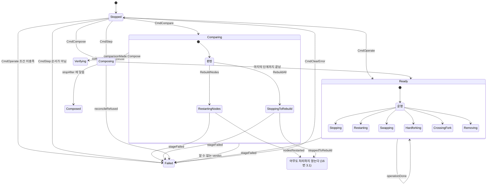
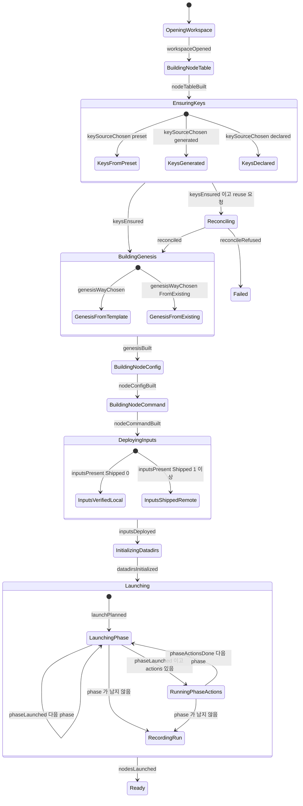
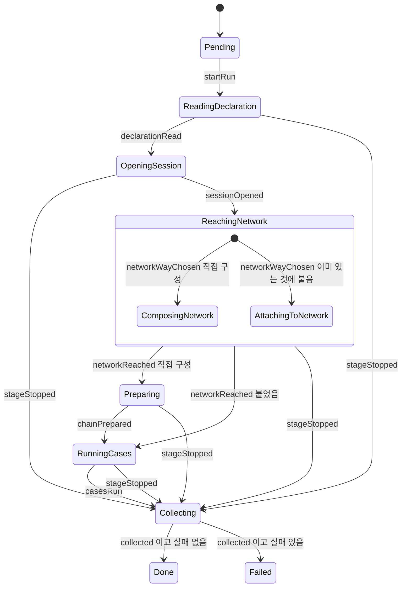

# 두 state machine 의 state diagram — composition · run — [측정]

> 2026-09-22 작성. 대상은 HEAD `33ecf83b` 다.
>
> 이 문서는 `internal/core/statemachine` 위에 올라간 두 machine 을 코드에서 그대로 뽑아 그린 것이다.
> state 이름, 메시지 이름, 전이 조건은 전부 소스에서 읽었고 각 줄에 파일과 줄 번호를 붙였다.
> 추측으로 채운 칸은 없다.
>
> `graph/lifecycle-transitions.mmd` 는 **이 문서가 대체하지 않는다.** 그 파일은 제거된 옛
> table-walking lifecycle 을 그린 것이라 state 이름 자체가 다르다(`ChainOpenWorkspace` 등).
> 현재 코드에 대응하는 그림은 이 문서가 처음이다.
>
> 기술 용어(state, leaf state, parent state, enter/exit/process, self message, transition, dispatch,
> drain, Cmd, Event)는 14번 문서 규약대로 원어로 쓴다.
>
> mermaid 는 이 기기에 렌더러가 없어 **문법을 기계로 검증하지 못했다.** 대신 그림에 나오는 state
> 이름이 전부 소스에 있고, 소스의 state 가 전부 그림에 있는지는 스크립트로 맞춰봤다(6장).

---

## 0. 두 machine 과 그 관계

machine 은 둘이다. 그리고 **서로 이어져 있지 않다.**

| machine | 만드는 곳 | 하는 일 | state 수 |
|---|---|---|---|
| `composition` | `internal/chainsetup/manager.go:126` | 네트워크를 구성하고 운영한다 | 36 |
| `run` | `internal/testengine/runmachine.go:86` | 선언을 읽고 네트워크를 얻어 케이스를 돌린다 | 12 |

둘 다 controller 없이 만들어진다. 14번 문서 4장은 `run` 을 parent, `composition` 을 child 로 두는
설계였지만 구현에 들어오지 않았다(16번 3.5). 그래서 `run` 은 `composition` 을 state machine 으로
부리지 않고, `verb.ChainUpComparing` 같은 보통 함수 호출로 쓴다
(`internal/testengine/attach_workspace.go:150`).

그림도 그래서 둘로 나뉜다. 사이를 잇는 화살표가 없다.

---

## 1. 그림을 읽기 전에 — 기제 네 가지

그림에 화살표로 안 나타나지만 모든 전이가 따르는 규칙이다. 이걸 모르면 그림이 틀려 보인다.

**Enter 가 일을 하고, 결과는 self message 로 돌아온다.** state 에 들어가면 `Enter` 가 그 단계의 일을
시작한다. `Enter` 안에서는 전이할 수 없으므로(`machine.go:197-198`), 무슨 일이 있었는지를 자기에게
메시지로 남긴다(`SendSelf`). 그 메시지를 parent 가 받아 다음 state 를 정한다. **그림의 화살표 하나는
언제나 "Enter 가 일을 했고, 그 결과 메시지를 누군가 받았다" 를 줄인 것이다.**

**메시지는 위로만 올라간다.** `dispatch` 는 current state 에서 parent 를 따라 올라가며 처음 받는 곳에서
멈춘다(`machine.go:322-333`). 형제 가지로는 가지 않는다. 2.5 장의 끊긴 자리가 이 규칙의 결과다.

**아무도 안 받은 메시지는 에러가 아니다.** 기록만 남고 `Send` 는 `nil` 을 돌려준다
(`machine.go:329-342`). 그래서 **그림에서 화살표가 없는 곳은 "거기서 멈춘다" 가 아니라 "거기서 멈추고
성공했다고 말한다" 이다.**

**error 는 두 종류다.** 도메인 실패는 `stageFailed` 메시지로 가고 그림에 화살표로 나온다. machine
오용이나 `Enter`/`Exit` 가 돌려준 error 는 `Send` 자체를 실패시키고 **그림에 안 나온다.** 5장에서 따로
적는다.

---

## 2. composition machine

### 2.1 state tree

`manager.go:160-192` 가 만들고 `manager_test.go:84-128` 의 golden test 가 지킨다.

```
Composition
  Stopped
  Comparing
    RestartingNodes
    StoppingToRebuild
  Composing
    OpeningWorkspace
    BuildingNodeTable
    EnsuringKeys
      KeysFromPreset
      KeysGenerated
      KeysDeclared
    Reconciling
    BuildingGenesis
      GenesisFromTemplate
      GenesisFromExisting
    BuildingNodeConfig
    BuildingNodeCommand
    DeployingInputs
      InputsVerifiedLocal
      InputsShippedRemote
    InitializingDatadirs
    Launching
      LaunchingPhase
      RunningPhaseActions
      RecordingRun
  Composed
  Verifying
  Ready
    Stopping
    Restarting
    Swapping
    Hardforking
    CrossingFork
    Removing
  Failed
```

### 2.2 메시지

**Cmd — 밖에서 내려보내는 것** (`internal/chainsetup/protocol.go:30-48`). 여섯이고, `CmdStop` 은
선언만 있고 쓰이지 않는다.

| Cmd | 받는 state | 뜻 |
|---|---|---|
| `CmdCompose` | `Stopped` | 요청대로 네트워크를 구성한다 |
| `CmdStep` | `Stopped` | 중간에 멈춘 구성에서 한 단계만 돌린다 |
| `CmdOperate` | `Stopped` | 구성된 네트워크에 무언가 시킨다 |
| `CmdCompare` | `Stopped` | 대상에 있는 것과 견줘 필요한 만큼만 구성한다 |
| `CmdClearError` | `Failed` | 실패를 읽었으니 떠난다. **`Failed` 에서 나가는 유일한 길** |
| `CmdStop` | — | 선언만 있고 보내는 곳도 받는 곳도 없다 (16번 3.5) |

**Event — machine 이 자기에게 남기는 것** (`protocol.go:62-116`). 스물둘이다. 아래 표는 어느 state 가
남기고 어느 state 가 받는지만 적는다.

| Event | 남기는 state | 받는 state |
|---|---|---|
| `workspaceOpened` | `OpeningWorkspace` | `Composing` |
| `nodeTableBuilt` | `BuildingNodeTable` | `Composing` |
| `keySourceChosen` | `EnsuringKeys` | `EnsuringKeys` 자신 |
| `keysEnsured` | keys leaf 셋 | `Composing` |
| `comparisonMade` | `Comparing` | `Comparing` 자신 |
| `nodesRestarted` | `RestartingNodes` | **아무도 안 받음** (2.5) |
| `stoppedToRebuild` | `StoppingToRebuild` | **아무도 안 받음** (2.5) |
| `reconciled` | `Reconciling` | `Composing` |
| `reconcileRefused` | `Reconciling` | `Composing` |
| `genesisWayChosen` | `BuildingGenesis` | `BuildingGenesis` 자신 |
| `genesisBuilt` | genesis leaf 둘 | `Composing` |
| `nodeConfigBuilt` | `BuildingNodeConfig` | `Composing` |
| `nodeCommandBuilt` | `BuildingNodeCommand` | `Composing` |
| `inputsPresent` | `DeployingInputs` | `DeployingInputs` 자신 |
| `inputsDeployed` | deploy leaf 둘 | `Composing` (조부모) |
| `datadirsInitialized` | `InitializingDatadirs` | `Composing` |
| `launchPlanned` | `Launching` | `Launching` 자신 |
| `phaseLaunched` | `LaunchingPhase` | `Launching` |
| `phaseActionsDone` | `RunningPhaseActions` | `Launching` |
| `nodesLaunched` | `RecordingRun` | `Composing` |
| `operationDone` | operation 여섯 | `Ready` |
| `stageFailed` | 어디서든 | `Composition` (루트) |

`workspaceOpened` 부터 `nodesLaunched` 까지 아홉은 `stageReport` 를 구현한다
(`protocol.go:294-396`). `Composing` 은 그 아홉을 타입 하나로 받는다(`manager_states.go:133`). 그래서
**stage 는 자기 다음이 누구인지 모른다.**

**위로 올리는 것** (`protocol.go:52-60`, `:120-124`). `CmdPostCompose`, `CmdOnQuit`, `EventNodeDied`
셋인데 controller 가 없어 보내는 곳도 받는 곳도 없다.

### 2.3 전체 골격

`Composing` 안쪽은 2.4 로 미뤘다.



근거는 이렇다. `Stopped` 의 네 갈래는 `manager_states.go:67-116`. `Comparing` 의 판정은
`stage_compare.go:69-82` 와 `nextFor`(`:90-103`). `Composing` 이 다음을 정하는 곳은
`manager_states.go:131-160` 과 `after`(`manager.go:495-512`). `Ready` 는 `manager_states.go:197-203`.
`Failed` 는 `manager_states.go:229-238`. 루트가 `stageFailed` 를 받는 곳은 `manager_states.go:41-51`.

**`Verifying`, `Composed` 에서 나가는 화살표가 없다.** 둘 다 `Process` 가 없는 쉬는 state 다
(`stage_compare.go:171-184`, `manager_states.go:165-180`). 거기서 walk 가 끝난다.

**`Ready` 로 들어가는 화살표가 `CmdOperate` 인 것이 헷갈릴 수 있다.** operation 여섯은 `Ready` 의
자식이라, operation 에 들어가면 parent 인 `Ready` 가 먼저 들어간다. 일이 끝나면 `operationDone` 을
`Ready` 가 받아 자기 자신으로 전이한다(`manager_states.go:201`). 자기 전이는 no-op 이 아니라 나갔다
들어오는 것이라(`machine.go:358-360`), operation state 가 그때 빠져나온다.

### 2.4 `Composing` 안쪽 — 아홉 단계



단계 순서는 `manager.go:148-158` 의 `mg.stages` 그대로다. 다음을 고르는 것은
`after`(`manager.go:495-512`)이고 규칙이 셋이다. 끝난 단계가 `stopAfter` 면 `Composed`,
`keys` 이고 reuse 요청이면 `Reconciling`, 그 밖이면 목록의 다음이며 마지막이면 `Ready` 다.

`Reconciling` 은 `mg.stages` 에 없다. tree 에는 keys 바로 뒤에 놓이고(`manager.go:180-182`),
들어가는 길은 `after(stepKeys)` 하나뿐이다.

`Launching` 이 phase 를 도는 방법이 이 machine 에서 유일하게 되돌아가는 자리다. `next()` 가 phase 가
남았으면 `LaunchingPhase` 를 다시 돌려주고(`stage_launch.go:112-117`), 같은 state 로 전이하면 코어가
나갔다 들여보내므로 그게 다음 phase 를 시작시킨다.

### 2.5 끊긴 자리

`Comparing` 의 두 leaf 가 성공했을 때 보내는 메시지를 받는 곳이 `composingState.Process` 인데
(`manager_states.go:143-148`), `Composing` 은 그 둘의 parent 가 아니라 **형제의 자식**이다.

메시지는 parent 를 따라서만 올라가므로 실제 경로는 `RestartingNodes → Comparing → Composition` 이고,
`Composing` 은 거기 없다. 그래서 아무도 안 받고, 안 받은 메시지는 에러가 아니므로 `Send` 가 성공을
돌려준다.

원래 가려던 자리는 이렇다. `nodesRestarted` 는 `Verifying` 으로, `stoppedToRebuild` 는 첫 단계인
`OpeningWorkspace` 로 가야 했다. 그림에서 `Dropped` 로 빠지는 두 화살표가 그 자리다.

`RebuildAll` 쪽이 더 나쁘다. `StoppingToRebuild` 의 `Enter` 가 네트워크를 **실제로 내린 뒤**
메시지를 보내므로(`stage_compare.go:120-132`), 네트워크는 멈추고 재구성은 안 되고 명령은 성공이라고
말한다.

자세한 것과 재현 테스트는 16번 3.1 과 17번 2.1 에 있다.

---

## 3. run machine

### 3.1 state tree

`runmachine.go:98-110` 이 만든다. golden test 는 없다(16번 3.6).

```
Run
  Pending
  ReadingDeclaration
  OpeningSession
  ReachingNetwork
    ComposingNetwork
    AttachingToNetwork
  Preparing
  RunningCases
  Collecting
  Done
  Failed
```

### 3.2 메시지

**Cmd** 는 하나뿐이다. `CmdRun`(`runprotocol.go:14`).

**Event** 는 여덟이다(`runprotocol.go:19-31`).

| Event | 남기는 state | 받는 state |
|---|---|---|
| `declarationRead` | `ReadingDeclaration` | 자신 |
| `sessionOpened` | `OpeningSession` | 자신 |
| `networkWayChosen` | `ReachingNetwork` | 자신 |
| `networkReached` | `ComposingNetwork`, `AttachingToNetwork` | `ReachingNetwork` (parent) |
| `chainPrepared` | `Preparing` | 자신 |
| `casesRun` | `RunningCases` | 자신 |
| `collected` | `Collecting` | 자신 |
| `stageStopped` | 어디서든 (`r.fail`) | `Run` (루트) |

`startRun` 은 `runprotocol.go` 의 상수 목록에 없는 내부 메시지다. `Run` 이 `CmdRun` 을 받아 그대로
넘기는 것이 아니라, `runner.Run` 이 `Start` 직후에 직접 보낸다(`runmachine.go:119`).

### 3.3 전이



근거는 `runmachine.go` 의 `TransitionTo` 열둘이다. 루트가 `stageStopped` 를 받는 곳이 `:188-192`,
`Pending` 이 `:206-210`, `ReadingDeclaration` 이 `:266-270`, `OpeningSession` 이 `:315-319`,
`ReachingNetwork` 이 `:360-380`, `Preparing` 이 `:458-462`, `RunningCases` 가 `:490-494`,
`Collecting` 이 `:532-541`.

**`stageStopped` 화살표 다섯이 이 machine 의 실패 경로 전부다.** 어느 단계에서 실패하든 곧장 끝으로
가지 않고 `Collecting` 을 거친다. 이유가 `runmachine.go:129-134` 에 적혀 있다. 네트워크를 세우다
실패해도 그 노드들 위에 왜 실패했는지가 남아 있으므로, 걷는 것이 먼저고 내리는 것이 나중이다.

**`ReachingNetwork` 의 두 leaf 가 `networkReached` 를 직접 처리하지 않는다.** 자기에게 남기고
(`runmachine.go:408`, `:433`) parent 가 받는다(`:369-377`). 그래서 "어느 길로 왔나" 와 "다음은
어디인가" 가 갈라져 있다. 계층을 제대로 쓴 자리다.

### 3.4 정리는 `Collecting` 이 한다

`Done` 과 `Failed` 는 `Enter`, `Exit`, `Process` 가 전부 없는 표시일 뿐이다(`runmachine.go:544-563`).
네트워크를 내리는 일은 `Collecting` 의 `Enter` 안에 있다(`:518`).

그래서 **`Collecting` 에 닿지 못하면 네트워크가 안 내려간다.** ctx 가 취소되면 `dispatch` 가 메시지를
버리므로(`machine.go:315-317`) `stageStopped` 도 `casesRun` 도 전달되지 않고, 거기 닿을 길이 없다.
16번 3.3 이 그 이야기다.

---

## 4. error 는 그림 어디에 있나

두 종류이고, 한 종류만 그림에 있다.

**도메인 실패는 화살표다.** stage 가 실패하면 `Enter` 는 `nil` 을 돌려주고 대신 메시지를 남긴다.
composition 은 `mg.fail`(`manager.go:461-465`)이 `stageFailed` 를, run 은 `r.fail`
(`runmachine.go:135-142`)이 `stageStopped` 를 남긴다. 루트가 받아 각각 `Failed` 와 `Collecting` 으로
보낸다. 2.3 과 3.3 의 화살표다.

**machine error 는 그림에 없다.** `Send` 자체를 실패시키고 전이를 만들지 않는다. 넷이다.

| 무엇 | 어디 | 결과 |
|---|---|---|
| `Enter` 나 `Exit` 가 error 를 돌려줌 | `machine.go:388`, `:395` | `Send` 실패. **machine 이 망가진 채 남는다** (16번 3.2) |
| `TransitionTo` 오용 (Enter/Exit 안에서, 두 번, 없는 state) | `machine.go:193-211` | `Send` 실패 |
| 한 `Send` 에 메시지 1000개 | `machine.go:294` | `Send` 실패. state 가 서로 답만 하고 있다는 뜻 |
| ctx 취소 | `machine.go:315-317` | `Send` 실패. **큐에 남은 메시지가 버려진다** (16번 3.3) |

지금 두 machine 의 `Enter` 33개는 전부 `nil` 을 돌려주므로 첫 줄에는 닿지 않는다. 다만 그것을
강제하는 장치가 없다.

**`Failed` 에서 나가는 길은 `CmdClearError` 하나다.** 다른 메시지를 보내면 `failedState.Process` 가
error 를 돌려주므로(`manager_states.go:237`) `Send` 가 실패한다. 실패한 구성 위에 다음 명령이 조용히
쌓이지 않게 하려는 것이다.

---

## 5. 두 그림을 나란히 놓고 보면

**모양이 같다.** 둘 다 "루트가 실패를 받아 한 곳으로 보낸다", "parent 가 stage 의 완료 보고를 받아
다음을 정한다", "leaf 는 자기 일만 하고 다음을 모른다" 는 세 가지로 돼 있다. 14번 문서가 그리려던
모양이 맞게 들어왔다.

**다른 것은 실패가 가는 곳이다.** composition 은 `Failed` 로 곧장 가고, run 은 `Collecting` 을 거쳐서
간다. run 쪽이 증거를 먼저 걷기 때문인데, 그 대신 정리가 메시지 한 번 더 가는 것에 매달리게 됐다.

**둘 다 `Exit` 가 없다.** 그림의 화살표 어디에도 "나가면서 무엇을 거둔다" 가 없다. 들어가면서 잡은
것을 되돌리는 자리가 비어 있다(16번 3.4).

---

## 6. 그림과 코드를 맞춰본 방법

렌더러가 없어 mermaid 문법은 기계로 확인하지 못했다. 대신 두 가지를 맞춰봤다.

소스의 state 이름을 전부 뽑아(`name[A-Z]... statemachine.StateName = "..."`) composition 36개,
run 12개를 얻었다. 선언은 48개지만 **고유한 문자열은 47개다.** `Failed` 를 두 machine 이 같은
이름으로 쓰기 때문이다(`chainsetup` 의 `nameFailed`, `testengine` 의 `nameRunFailed`). 이름은 한
machine 안에서만 고유하면 되므로(`state.go:5-9`) 문제가 아니지만, 두 machine 의 로그를 나란히 놓고
볼 때는 `Failed` 가 어느 쪽인지 헷갈릴 수 있다.

그 47개가 이 문서의 tree 와 그림에 전부 나오는지, 그리고 그림에 나오는 이름 중 소스에 없는 것이
있는지를 맞췄다. 결과는 7장에 적는다.

`Dropped`, `판정`, `운영` 셋은 소스의 state 가 아니라 그림을 읽기 위해 넣은 표시다. tree 에는 없다.

---

## 7. 맞춰본 결과

- composition 36개, run 12개, 고유한 이름 47개. **소스에 있는 state 는 전부 이 문서에 나온다.**
- 이 문서에만 있고 소스에 없는 이름은 `Dropped`, `판정`, `운영` 셋이며 전부 그림용 표시다.
- 전이 화살표는 `TransitionTo` 호출 지점 기준이다. composition 25곳, run 12곳을 전부 읽어 옮겼다.
- 확인은 `mermaid` 블록 3개를 파싱해 식별자를 뽑고 소스의 이름 집합과 맞추는 방식이었다.
  **문법이 아니라 이름만 맞춘 것이다.** 렌더링은 해보지 않았으므로, 처음 그리는 사람은 한 번
  렌더해 보고 깨지면 고쳐 쓰면 된다.
