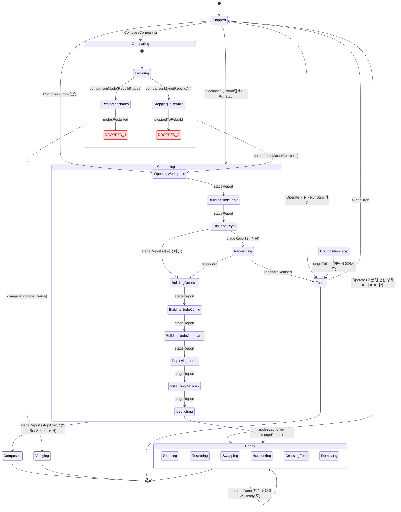
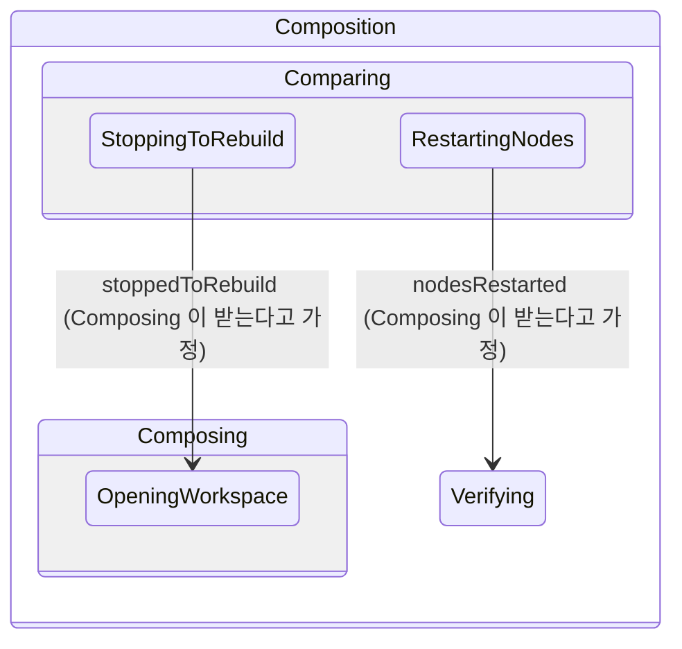
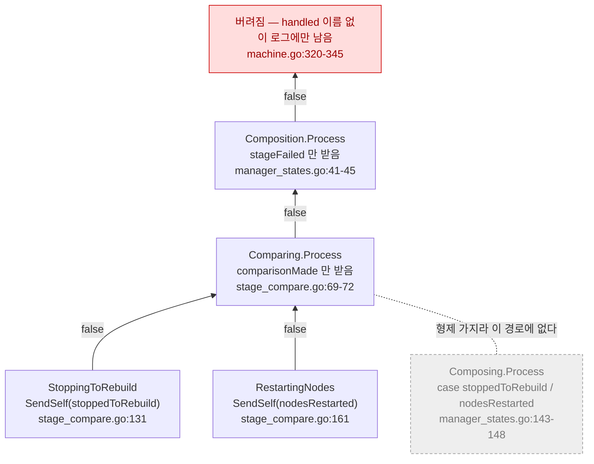
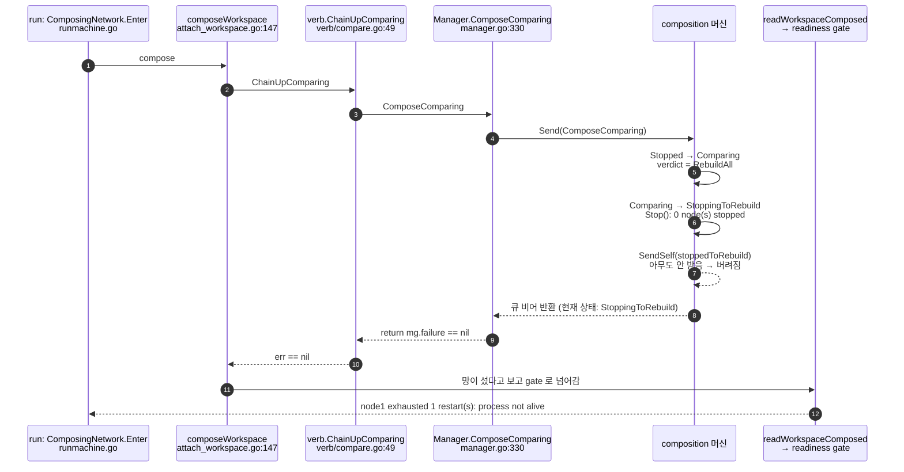
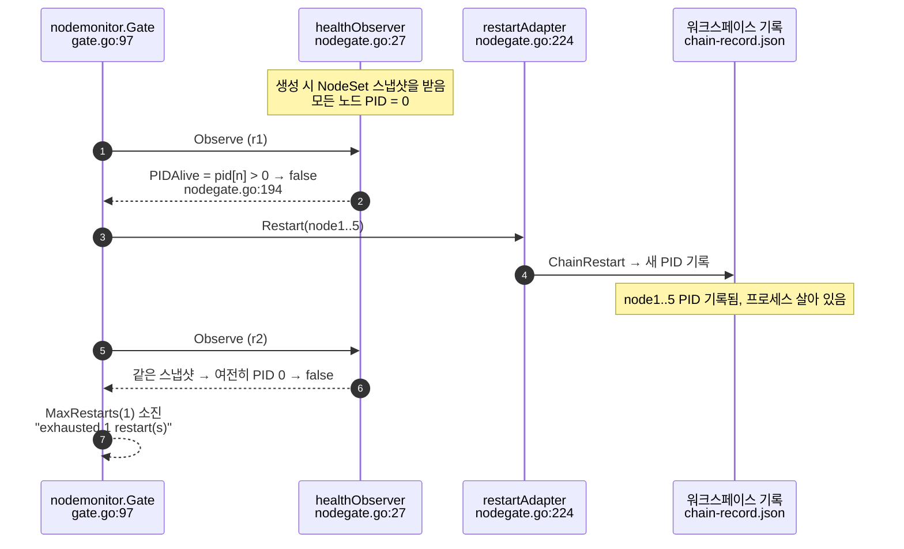
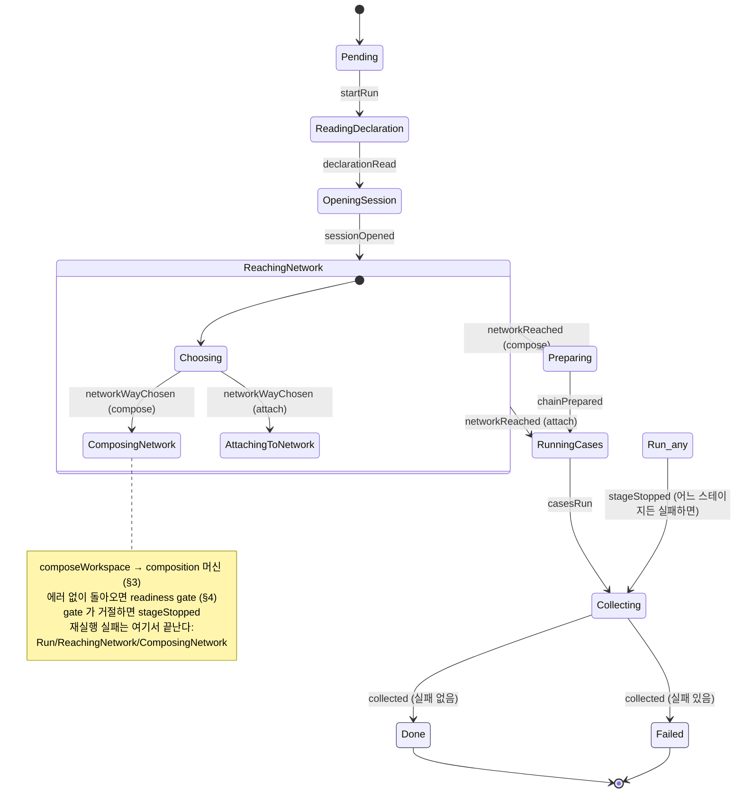

# 상태 머신의 빈 경로 — 코드에서 그린 상태 다이어그램

> **기록 문서다.** 여기 그림과 표의 상태 이름은 `cd9664b3` 시점의 옛 이름(진행형)이다. 이름은
> 2026-09-24 [state-machine-06](../../../dev/architecture/design-v3/state-machine-06-naming-and-contract.md)
> 대로 바뀌었고(§3 의 "지금" 열이 옛→새 대응표), 이 문서가 그린 결함은 같은 PR 에서 고쳐졌다.
> 옛 코드를 설명하는 기록이라 이름을 새로 바꿔 쓰지 않는다.

> 기준: main `cde3a08f` (PR #425 머지 직후) 위의 `386a78ee`. 2026-09-24.
> 대상: `internal/chainsetup` 의 composition 머신과 `internal/testengine` 의 run 머신.
> 목적: 재실행 실패에서 드러난 빈 경로를 코드 그대로 그려, 수정안을 다시 검토할 근거로 쓴다.

## 1. 왜 그렸나

같은 워크스페이스로 `chainbench run` 을 두 번 걸면 두 번째가 망을 세우지 못하고
`network not ready to test: node1 exhausted 1 restart(s): process not alive` 로 끝난다.
로그에는 `stop (rebuild-all): 0 node(s) stopped` 다음에 조립 단계가 하나도 없다. 이 문서는
그 사이에 무슨 일이 일어나는지를 상태와 메시지로 보인다.

그림의 모든 화살표는 코드의 `m.TransitionTo(...)` 하나에, 모든 라벨은 그 전이를 일으키는
메시지 타입 하나에 대응한다. 대응하는 파일과 줄은 각 그림 아래 표에 있다.

읽는 법:

- 화살표 라벨 `msg` 는 그 메시지를 **받은** 상태가 전이를 건다는 뜻이다. 보낸 상태가 아니다.
  이 머신에서는 받는 쪽이 보낸 쪽 자신이거나 그 조상이어야 한다 — 처리되지 않은 메시지는
  부모로, 또 그 부모로 올라가고, root 까지 아무도 받지 않으면 **버려진다**
  (`internal/core/statemachine/machine.go:314-350`, 에러 없음).
- 빨간 `DROPPED` 는 메시지가 버려져 머신이 그 자리에서 멈추는 곳이다.

---

## 2. composition 머신 전체

`internal/chainsetup/manager.go:148-201` 의 `Add` 호출이 트리다.

그림을 줄이려고 쓴 표시가 셋 있다. `Stopped --> Composing` 은 `From` 이나 `RunStep` 이 이름 댄
스테이지 하나로 바로 들어가는 것이고, `Stopped --> Ready` 는 `Operate` 가 이름 댄 연산 상태
(`Stopping` 등) 하나로 바로 들어가는 것이다 — 한 명령이 한 프로세스라 머신은 매번 `Stopped` 에서
시작한다(`manager.go:233-236`). `Composition_any` 는 root 아래 아무 상태다. `Deciding` 은
`Comparing` 자신이 판정을 내리는 순간이고 코드에 별도 상태는 없다.

| 전이 | 코드 |
|---|---|
| `Stopped` 의 네 갈래 | `manager_states.go:67-117` |
| `Comparing` 의 판정 → 네 곳 | `stage_compare.go:69-103` |
| `RestartingNodes` 가 `nodesRestarted` 를 보냄 | `stage_compare.go:161` |
| `StoppingToRebuild` 가 `stoppedToRebuild` 를 보냄 | `stage_compare.go:131` |
| 스테이지 → 다음 스테이지 (`after`) | `manager_states.go:133-142`, `manager.go:505-523` |
| `nodesRestarted` → `Verifying`, `stoppedToRebuild` → 첫 스테이지 **(도달 불가)** | `manager_states.go:143-148` |
| `reconciled` / `reconcileRefused` | `manager_states.go:149-160`, `stage_reconcile.go:37-61` |
| `stageFailed` → `Failed` | `manager_states.go:41-50` |
| `operationDone` → `Ready` | `manager_states.go:197-203` |
| `ClearError` → `Stopped` | `manager_states.go:229-236` |

---

## 3. 문제 1 — 판정 뒤의 두 메시지가 버려진다

### 코드가 의도한 경로

### 실제로 메시지가 올라가는 길

`Composing` 은 `Comparing` 의 형제다(`manager.go:161-163`). 메시지는 **자기와 조상**에게만
올라가므로 `Composing.Process` 의 두 case 는 어떤 경로로도 실행되지 않는다. 머신은
`StoppingToRebuild`(또는 `RestartingNodes`)에 서 있는 채로 큐가 비어 `Send` 가 돌아온다.

### 그다음 — 멈춘 것이 성공으로 보고된다

`ComposeComparing` 은 `mg.failure` 만 돌려주고 머신이 끝 상태(`Ready`·`Verifying`·
`Composed`·`Failed`)에 닿았는지 보지 않는다(`manager.go:330-339`). `Compose`
(`:211-230`), `Operate`(`:345-360`), run 머신의 `runner.Run`(`runmachine.go:115-126`)도
같은 모양이다. 그래서 문제 1 은 그 자리에서 실패하지 않고, 두 단계 뒤 readiness gate 에서
원인과 무관한 메시지로 나타난다.

---

## 4. 문제 2 — gate 가 재시작한 노드를 죽었다고 본다

run 머신 쪽이다. 문제 1 로 노드가 하나도 뜨지 않은 망이 gate 에 오면 gate 는 노드마다
재시작을 한 번 건다. 재시작은 실제로 성공한다 — 2026-09-24 재현에서 프로세스 다섯 개가
약 4초 살아 있었다. 그런데 gate 는 다음 라운드에서도 "process not alive" 라고 판정한다.

`healthObserver.nodes` 는 한 번 받은 값이고 다시 읽지 않는다(`nodegate.go:27-38, 131-134`).
그래서 gate 의 재시작은 **어떤 망에서도 성공으로 판정될 수 없다.** 평소에 드러나지 않은 것은
정상 조립에서는 gate 가 재시작을 걸 일이 드물기 때문이다.

---

## 5. run 머신 — 문제 1 이 어디서 드러나는가

`internal/testengine/runmachine.go:85-111` 이 트리다.

run 머신 안에서는 버려지는 메시지가 없다. 정적 점검에서 `RunningCases`·`Collecting` 이
`startRun` 을 보낸다고 나온 것은 이름이 같은 함수(`Run`)를 따라간 거짓 양성이다 —
`startRun` 을 보내는 곳은 `runner.Run`(`runmachine.go:119`) 한 곳뿐이다.

---

## 6. 정적 점검 방법과 한계

go/ast 로 두 패키지를 읽었다(타입 검사기 없이).

- **보내는 쪽**: 상태의 `Enter`·`Exit`·`Process` 와 거기서 부르는 helper 안에서
  `SendSelf`·`Post`·`Send` 에 넘긴 composite literal 의 타입.
- **받는 쪽**: `Process` 와 거기서 부르는 같은 receiver 의 메서드 안의 type switch case 와
  type assertion. interface 로 받는 것(`stageReport`)은 그 메서드를 가진 타입 전부로 펼쳤다.
- **트리**: 두 머신의 `Tree()` 출력. 이름은 각 타입의 `Name()` 또는 리터럴의 `name:` 필드로
  타입에 이었다.
- 결과: composition 머신에서 버려지는 메시지 2건(§3), run 머신 0건.

한계:

- 메시지가 **닿는지**만 본다. 닿은 뒤 **맞는 곳으로 가는지**(전이 목적지의 옳음), 조건
  분기가 빠진 경우가 없는지는 보지 않는다.
- helper 를 이름으로 따라가므로 거짓 양성이 섞인다(`Operate`·`startRun` 을 제외했다).
- `KeysFromPreset`·`KeysGenerated`·`KeysDeclared` 는 타입이 생략된 map 리터럴로 만들어져
  이름을 잇지 못했다. 코드를 읽어 확인했다 — 셋이 보내는 `keysEnsured` 는 `Composing` 이
  받는다(`stage_keys.go:137`).

## 7. 표로 본 결함

| 번호 | 심각도 | 무엇 | 그림 |
|---|---|---|---|
| A | [중요] | `stoppedToRebuild`·`nodesRestarted` 가 버려져 rebuild-all·rebuild-nodes 가 조립 없이 멈춘다 | §2 · §3 |
| B | [중요] | 진입점 네 곳이 끝 상태를 확인하지 않아 멈춘 머신이 성공으로 반환된다 | §3 마지막 그림 |
| C | [중요] | 프레임워크가 처리되지 않은 메시지를 에러 없이 버린다 | §3 가운데 그림 |
| D | [중요] | comparing 경로 테스트가 첫 이동까지만 본다(`manager_test.go:575-576`) | — |
| E | [중요] | gate 의 pid 스냅샷 때문에 재시작이 성공으로 판정될 수 없다 | §4 |
