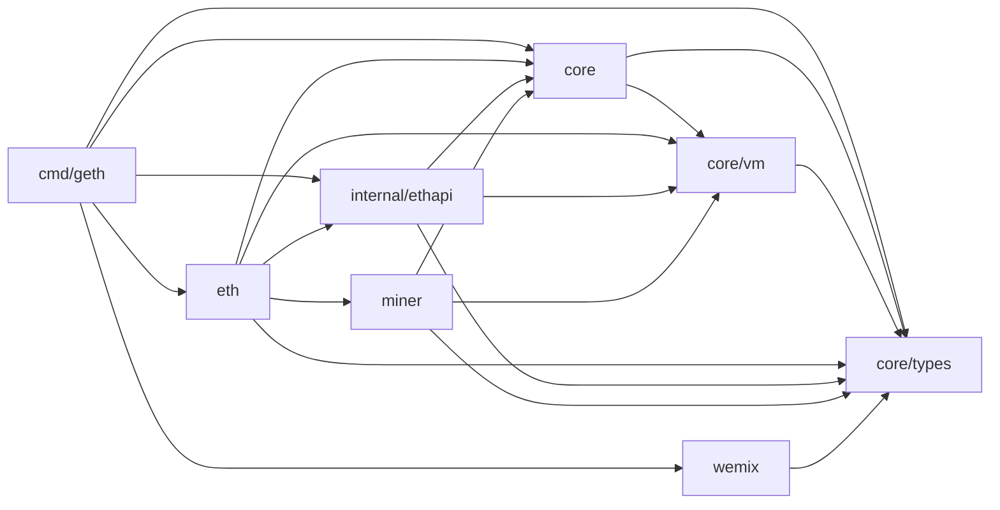
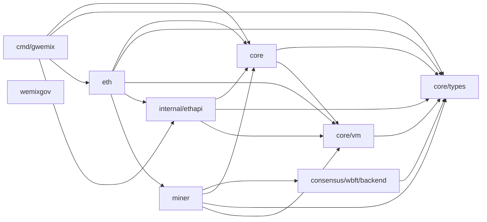
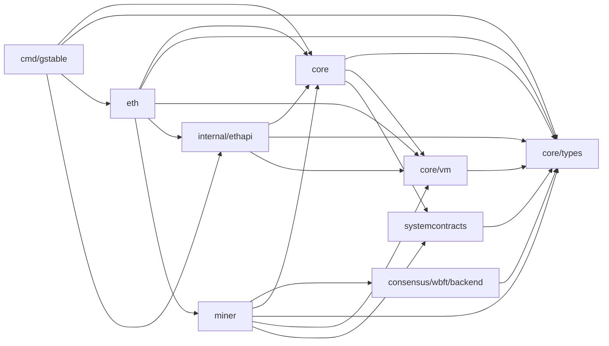

# 테스트가 관측하는 주요 빌드 모듈

아래는 darwin/arm64 실제 패키지 import 그래프의 일부다. 화살표는 함수 호출이 아니라 패키지 import다. 그림에 없는 모듈과 간선은 생략했으며 전체 자료는 graph 아래 JSON에 있다.

## go-wemix

이 그림은 공통 거래·RPC 관찰 경로가 core, types, vm에 모이고, 합의와 거버넌스 결합은 프로젝트별로 달라지는 부분을 보여 준다. 같은 패키지 이름이어도 구현 의미가 같다고 판정하지 않으며 세부 차이는 chain-differences.md에 있다.

## go-wbft

이 그림은 공통 거래·RPC 관찰 경로가 core, types, vm에 모이고, 합의와 거버넌스 결합은 프로젝트별로 달라지는 부분을 보여 준다. 같은 패키지 이름이어도 구현 의미가 같다고 판정하지 않으며 세부 차이는 chain-differences.md에 있다.

## go-stablenet

이 그림은 공통 거래·RPC 관찰 경로가 core, types, vm에 모이고, 합의와 거버넌스 결합은 프로젝트별로 달라지는 부분을 보여 준다. 같은 패키지 이름이어도 구현 의미가 같다고 판정하지 않으며 세부 차이는 chain-differences.md에 있다.
