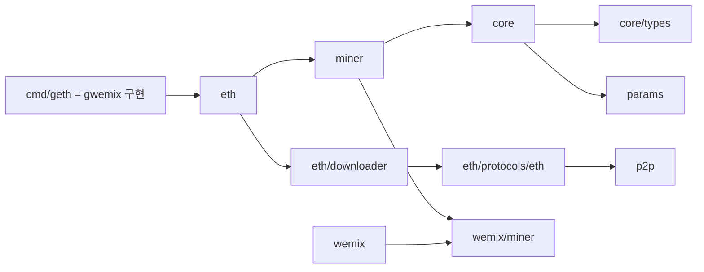
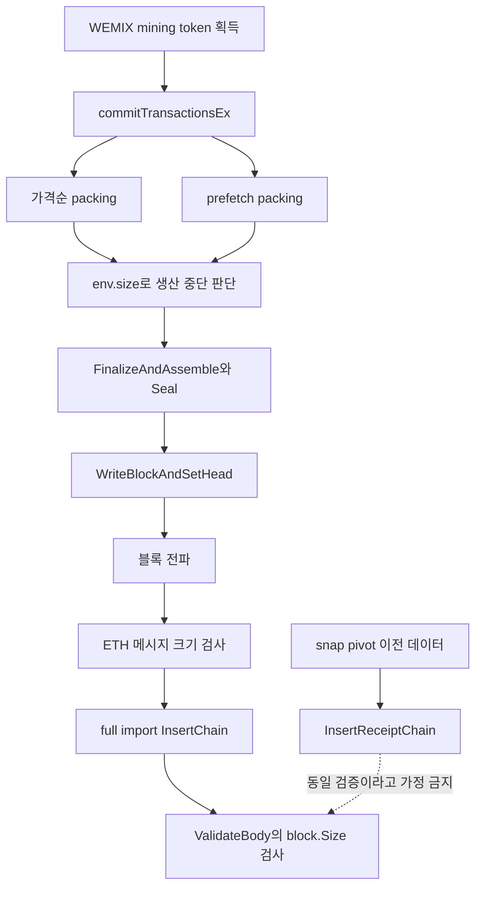
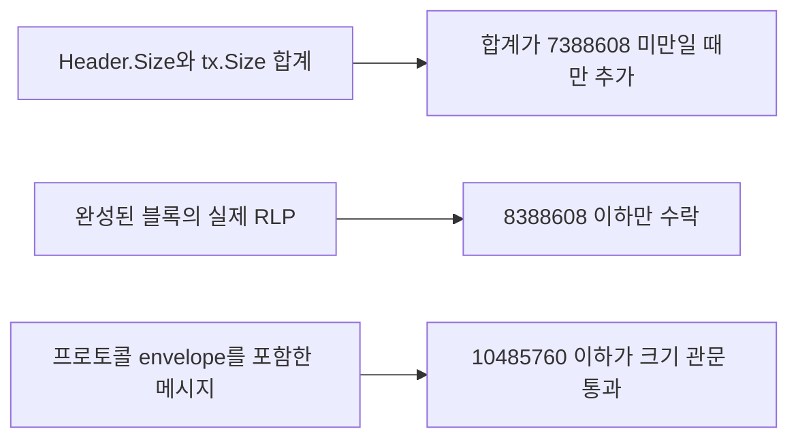

# 패치 영향 그래프

## AST에서 확인한 주요 import

**이 그림이 말하는 것:** 실선은 `exact-import-graph.json`에서 확인한 import다. 크기 제한은 채굴만의 변경이 아니라 core 검증과 네트워크 수신까지 이어진다. 이것은 모든 함수 호출을 해석한 그래프가 아니며, 아래에 실제 호출 경로를 별도로 표시했다.

## 실제 블록 처리 경로

**이 그림이 말하는 것:** 점선은 검증 차이를 나타내며 실제 함수 호출이 아니다. 생산 중 추정 크기, 최종 블록 RLP, 네트워크 메시지는 서로 다른 크기다. snap 전체에 검증이 없다는 뜻도 아니다. pivot 전후 경로를 구분해 검사해야 한다. 근거: `sources/pr-head/miner/worker.go:1669`, `sources/pr-head/miner/worker.go:1817`, `sources/pr-head/core/blockchain_insert.go:124`, `sources/pr-head/core/blockchain.go:917`, `sources/pr-head/eth/downloader/downloader.go:1736`.

## 비교해야 할 세 크기

**이 그림이 말하는 것:** 생산 여유 공간은 1,000,000바이트이며 1 MiB가 아니다. `env.size`는 실제 sealed block RLP와 같지 않다. 크기 관문을 통과해도 나머지 유효성 검사가 통과해야 한다. 근거: `sources/pr-head/miner/worker.go:143`, `sources/pr-head/core/block_validator.go:55`, `sources/pr-head/eth/protocols/eth/handler.go:254`.
